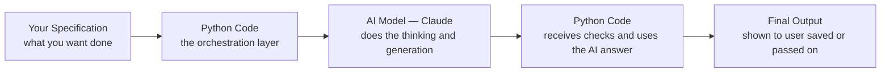

# Getting Started with Python

---

## Learning Objectives

By the end of this topic, you should be able to:

- Explain what Python is and why it is the language of choice for AI-native software development
- Describe the role Python plays as the orchestration layer connecting your specification to an AI system
- Identify the difference between writing a specification, writing code, and calling an AI model
- Create a Google Colab notebook and run your very first line of Python code
- Read a basic Python error message and understand what it is telling you

---

## Overview

You have spent the first part of this program thinking like an AI engineer — understanding how AI works, writing specifications, evaluating outputs, and making judgment calls about oversight. But so far, you have not written a single line of code. That changes now.

**Python** is a programming language — a way of writing instructions that a computer follows exactly, step by step. Think of it like this: you already know how to give instructions in English. Python is simply a more precise, more strict version of that — one where the computer actually executes every instruction you write, in order, without any guessing.

You will not use Python to build AI from scratch. You will use Python as the **orchestration layer** — the part of the system that decides when to call the AI, what to ask it, and what to do with the answer. Think of it like a restaurant. The **waiter** (Python) takes your order, passes it to the kitchen, collects the food, and brings it to your table. The **chef** (the AI) does the actual cooking. The waiter does not cook — but without the waiter, nothing reaches the customer.

By the end of this topic, you will have Google Colab open in your browser and your first line of Python code running successfully.

---

## What Is Python and What Is Code?

**Python** is a programming language — a set of written instructions, following strict rules, that tells a computer exactly what steps to perform.

A computer does not think. It follows instructions. **Code** (also called a program or a script) is the text you write containing those instructions. Python reads your code one line at a time, from top to bottom, and executes each instruction in order.

**Why Python specifically?**

| Reason | What it means for you |
|---|---|
| **Readable syntax** | Python code looks close to plain English. `if score > 50:` reads almost like a sentence — making it the easiest widely-used language for beginners |
| **Huge AI ecosystem** | Anthropic, OpenAI, Google, and almost every AI company provide official Python tools to call their models — you will use this directly in the coming weeks |
| **Widely used in industry** | Python is one of the most in-demand languages for data science, AI engineering, and backend development globally |

### Key Terms Every Beginner Must Know

| Term | Simple Meaning |
|---|---|
| **Code / Program / Script** | The written text of instructions you give the computer |
| **Line of code** | One single instruction, written on its own line — e.g. `score = 85` |
| **Run / Execute** | Telling the computer "now follow these instructions" |
| **Interpreter** | Think of it like a live translator. You write in Python, and the interpreter reads each line and immediately carries it out — translating your instructions into actions the computer can perform, one at a time |
| **Comment** | A line that starts with `#` — the computer completely ignores it. Comments exist only for humans reading the code, to explain what the code does and why |
| **Syntax** | The strict grammar rules of Python. Just like English grammar says a sentence needs a subject and a verb, Python has rules — forget a colon, miss a bracket, and Python will stop and show you an error |
| **Indentation** | The spaces at the start of a line. In Python, indentation is not just for readability — it is how Python understands the structure of your code. We will see this in action when we write if/else and for loops |

---

## Python's Role — The Orchestration Layer

Here is the key mental model for everything you will build in this program:



Notice that Python appears **twice** — before the AI call and after it:

- **Before:** Python prepares the exact question to send to the AI, based on your specification
- **After:** Python receives the AI's response and decides what to do — check the format, extract the relevant part, handle errors, save the result

The AI does not run on its own. Something has to call it, pass the right information, and handle what comes back. That something is Python.

> **Important:** You do not need Python to use an AI chatbot casually — typing into Claude.ai in your browser needs no code. You need Python when you want to **build a system** that uses AI as one component alongside other logic — validation, error handling, multiple steps, storing results. That is the difference between being an AI user and an AI-native engineer.

**Specification vs Code vs AI Call — what each one is:**

| Activity | What you are doing | Example |
|---|---|---|
| Writing a specification | Describing in plain English what the system should do | "Given a list of exam marks, calculate the average and flag any mark below 35 as a fail" |
| Writing Python code | Turning part of the specification into precise, deterministic instructions | `average = sum(marks) / len(marks)` |
| Calling an AI model | Asking the AI to generate something that has no single fixed answer | "Write an encouraging one-line message for a student who scored 32 out of 100" |

---

## Setting Up Google Colab

### Why Google Colab and Not Installing Python?

Normally, to write Python you would need to install Python on your computer plus a separate editor. This involves different steps for Windows vs Mac, version conflicts, and troubleshooting that can take hours. **Google Colab** eliminates all of this — it is a ready-to-use Python environment that runs entirely in your web browser. No installation. No setup. Free.

**What Colab actually is:**
Colab is a **notebook** — a document made of cells. Each cell can contain Python code or plain text notes. You write code in a cell, press Run, and the result appears directly below that cell. Everything happens in your browser — nothing is installed on your machine.

### Step-by-Step — Your First Colab Notebook

**Step 1** — Open your browser and go to **colab.research.google.com**

**Step 2** — Sign in with any Google account — the same one you use for Gmail or Google Drive

**Step 3** — Click **"New Notebook"** — usually a button at the bottom right of the welcome screen, or under File → New Notebook

**Step 4** — You will see a blank notebook with one empty code cell — a grey box with a play button (▶) on the left

**Step 5** — Click inside the code cell and type exactly this:

```python
print("Hello, AI-Native Engineer!")
```

**Step 6** — Press **Shift + Enter** (or click the ▶ play button)

**Step 7** — The output appears directly below the cell:

```
Hello, AI-Native Engineer!
```

You have just written and run your first line of Python.

### What You Just Wrote — Line by Line

```python
print("Hello, AI-Native Engineer!")
```

- `print` — a built-in Python function. A function is a ready-made instruction that already knows how to do one specific job. `print` knows how to display things on screen. You will learn about functions in depth later — for now, just know: `print()` shows things to you
- `(` and `)` — the round brackets tell Python "here is the information I am giving to the print function." Whatever is inside is called an **argument**
- `"Hello, AI-Native Engineer!"` — this is a **string** — a piece of text. In Python, text must always be wrapped in quotation marks so Python knows "this is text, not an instruction"
- No semicolon at the end — Python ends a line of code at the end of the line. You do not need to add anything

**Why it worked:** Python read your line, recognised `print` as a valid function, saw the string inside the brackets, and displayed it. The same code run again will always produce the exact same output — this is what we mean by **deterministic**.

### What If Something Goes Wrong?

Every beginner hits errors. This is completely normal — errors are not failures, they are Python telling you exactly what it could not understand.

**The most common beginner errors:**

**Forgetting a quotation mark:**
```python
print(Hello, AI-Native Engineer!")
```
```
SyntaxError: invalid syntax
```
Python cannot understand what `Hello` means without quotes — it thinks it is an instruction, not text.

**Forgetting a closing bracket:**
```python
print("Hello, AI-Native Engineer!"
```
```
SyntaxError: unexpected EOF while parsing
```
Python kept reading expecting a `)` and reached the end of the file without finding one.

**How to read an error message:**
- The word `SyntaxError` tells you the type of error — a syntax error means you broke a grammar rule
- Python points to the line where it got confused
- Do not panic — read the error, find the line it mentions, check for missing quotes, brackets, or colons

**If Colab is not loading:**
- Check your internet connection
- Refresh the page
- Make sure you are signed into a Google account
- Try a different browser if needed

### Colab Tips Every Beginner Needs to Know

**How to add a new cell:**
Click **+ Code** at the top left of the notebook (or below any existing cell). Each new cell is independent — you can write and run code in any cell, in any order.

**Cells share memory within a session:**
If you create a variable in cell 1 and run it, that variable is available in cell 2, cell 3, and every other cell — as long as you do not restart. This is called the **runtime**. Think of it like a shared whiteboard — everything written on it stays until someone erases it.

```python
# Cell 1
name = "Alex"

# Cell 2 — this works because name was defined in Cell 1
print("Hello,", name)
```

**What happens when you restart:**
If you go to Runtime → Restart Runtime (or close and reopen the tab), the whiteboard is wiped. All your variables are gone. Your code is still saved — but you need to run the cells again from the top to rebuild the state.

**Colab auto-saves your work:**
Colab automatically saves your notebook to your Google Drive under a folder called "Colab Notebooks." You will not lose your code if you close the tab — but you will lose the runtime state (all variables) and need to re-run your cells when you come back.

---

## Indentation — The Rule That Surprises Every Beginner

This is worth covering now, before you hit it unexpectedly in the next topic.

In most things you write — essays, messages, documents — indentation is just a style choice. In Python, **indentation is a grammar rule**. Python uses the spaces at the start of a line to understand the structure of your code.

Look at this example:

```python
score = 75
if score > 50:
    print("You passed!")
```

The `print` line has 4 spaces before it. This tells Python: "this line belongs to the if block." Remove those spaces, and Python throws an error.

You do not need to fully understand this yet — that comes in the if/else topic. But knowing it exists means you will not be surprised when Python complains about indentation. Always use 4 spaces (or press the Tab key once) when Python expects indented code.

---

## Worked Example — Personalised Welcome Message

**Specification:** Display a welcome message that includes a name.

**The code:**

```python
# This program displays a personalised welcome message
name = "Alex"
print("Welcome to AI-Native Engineering,", name, "!")
```

**Run it (Shift + Enter). Expected output:**

```
Welcome to AI-Native Engineering, Alex !
```

**Line-by-line explanation:**

- `# This program displays a personalised welcome message` — a comment. Python ignores this completely. It exists so anyone reading the code knows what it does
- `name = "Alex"` — this creates a **variable** called `name` and stores the text `"Alex"` inside it. A variable is a named box that holds a value. You will learn variables in full depth in the next topic
- `print("Welcome to AI-Native Engineering,", name, "!")` — the print function receives three arguments separated by commas. Python prints them all on one line with a space between each. The variable `name` gets replaced by its stored value — `"Alex"`

**Try it yourself:**
Change `"Alex"` to your own name and run the cell again. The output changes — but only the name part. Everything else stays the same. This is your first hands-on experience of how code separates fixed logic from variable data.

**Text vs numbers — Python treats them differently:**

Notice that `"Alex"` has quotation marks around it. That is because Alex is text — a **string**. Numbers do not need quotes:

```python
print("My score is", 85)
print("My name is", "Alex")
```

```
My score is 85
My name is Alex
```

Try removing the quotes from `"Alex"` and running it:

```python
print("My name is", Alex)
```

```
NameError: name 'Alex' is not defined
```

Without quotes, Python thinks `Alex` is a variable name — and since no variable called `Alex` exists, it throws an error. Quotes are how you tell Python: "this is literal text, not a variable name."

**Visible output vs silent execution:**

Run this cell:

```python
name = "Alex"
```

Nothing appears below the cell — no output at all. This surprises most beginners. But the cell did run successfully. It created the variable `name` and stored `"Alex"` inside it. It just had nothing to display.

Only `print()` produces visible output. Assigning a variable, doing a calculation, or defining something — these all happen silently. The variable exists and is ready to use — Python just does not show you a confirmation message unless you ask for one with `print()`.

```python
name = "Alex"
print(name)    # now you can see it
```

```
Alex
```

**What would happen if you tried to print `name` before defining it?**

```python
print("Welcome,", name, "!")
name = "Alex"
```

```
NameError: name 'name' is not defined
```

Python executes line by line, top to bottom. On line 1, it tries to use `name` — but `name` has not been created yet. This is why the order of your code matters.

---

## Key Takeaways

- **Python** is a programming language — precise written instructions a computer executes exactly, line by line, top to bottom
- Python is the dominant language for AI-native engineering because of its readable syntax and strong support from every major AI company
- Python's role in this program is the **orchestration layer** — like a waiter who takes the order to the chef (AI) and brings the result back to the customer
- A **comment** starting with `#` is ignored by Python and exists only for human readers
- **Google Colab** is a free, browser-based Python environment — no installation required — made of cells you run one at a time with Shift + Enter
- Add new cells with **+ Code** at the top of the notebook
- Cells **share memory within a session** — a variable created in cell 1 is available in cell 2. Restarting the runtime wipes all variables but keeps your code
- Colab **auto-saves** your notebook to Google Drive — your code is safe even if you close the tab
- `print()` displays whatever you give it — text must be in quotation marks, numbers do not need them
- **Assigning a variable produces no visible output** — only `print()` shows something on screen. Silence does not mean the cell failed
- **Indentation matters in Python** — spaces at the start of a line are grammar, not style
- Errors are normal — read the error type and the line number, find the mistake, fix it, run again
- Code execution is deterministic — the same code always produces the same output

> **Interview tip:** Be ready to explain in one sentence why Python and not the AI model itself handles validation, error checking, and orchestration in a real AI-powered application. "Python is the orchestration layer — it decides when to call the AI, what to send it, and what to do with the answer" is the answer.

---

## Reference Links

- 📎 [Python Official Documentation — The Python Tutorial](https://docs.python.org/3/tutorial/) — the authoritative official introduction to Python
- 📎 [Google Colab — Welcome Notebook](https://colab.research.google.com/) — the official Colab landing page with a built-in getting started guide
- 📎 [W3Schools — Python Introduction](https://www.w3schools.com/python/python_intro.asp) — beginner-friendly supplementary reading with interactive examples
- 📎 [Real Python — Python Basics](https://realpython.com/python-first-steps/) — highly recommended for absolute beginners, written in plain English with no assumed knowledge
