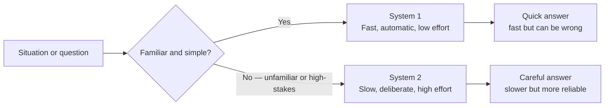

# How Humans Think

---

## Learning Objectives

By the end of this topic, you should be able to:

- Explain the difference between System 1 and System 2 thinking in the human brain
- Identify everyday situations where you are using System 1 versus System 2 thinking
- Describe why System 1 thinking makes humans fast but occasionally error-prone
- Differentiate between tasks that are safe to leave to instinct and tasks that demand deliberate, slow thinking
- Explain why understanding your own thinking process is the first step before you can responsibly oversee an AI system's output

---

## Overview

Before we can talk about how humans should oversee AI systems, we need to understand how the human brain itself makes decisions. This might feel like a strange place to start in a program about AI — but it is deliberate.

The single biggest risk in AI-native software is not the AI being wrong. It is a **human reviewer approving a wrong AI answer without noticing**, because their own brain took a shortcut.

Psychologist and Nobel Prize winner Daniel Kahneman showed that our brain runs on **two very different thinking systems** — one fast and automatic, one slow and effortful. Both are useful. Both are also, in different ways, unreliable if used in the wrong situation. As someone who will constantly review AI-generated code, reports, and decisions, knowing which mode your brain is in — and when to switch — is one of the most important skills in this program.

---

## System 1 Thinking — Fast, Instinctive, Automatic

**System 1** is the part of your thinking that works **automatically, quickly, and with very little effort**. It runs constantly in the background, without you consciously choosing to turn it on.

**Why it exists:**
Evolution favoured fast thinking because, for most of human history, slow thinking could get you killed. If you saw a shadow that looked like a snake, you jumped back immediately — you did not sit down and calculate the probability that it was actually a snake. System 1 is your brain's shortcut system, built for speed and survival, not for perfect accuracy.

**Everyday examples:**
- Recognising a friend's face in a crowd — you don't "process" their face feature by feature, you just know
- Reacting to a car horn while crossing the road — your body moves before your brain has consciously decided to
- Reading the word "STOP" on a sign — you don't sound out each letter, the meaning arrives instantly
- Spotting that a message looks suspicious before you've read it properly — something just "feels off"
- Answering "2 + 2 = ?" — you don't calculate this, you simply know it

**Key properties:**

| Property | System 1 |
|---|---|
| Speed | Near-instant |
| Effort | Very low — feels automatic |
| Awareness | Usually unconscious — you often don't notice it's "thinking" |
| Reliability | Good for familiar, repeated patterns — unreliable for new or complex situations |
| Risk | Takes shortcuts (called heuristics) that can lead to errors and biases |

---

## System 2 Thinking — Slow, Deliberate, Effortful

**System 2** is the part of your thinking that engages **deliberately, slowly, and with conscious effort**. You switch it on when a situation demands careful reasoning.

**Why it exists:**
Some problems cannot be solved by instinct. They require holding multiple pieces of information in mind at once, comparing options, and reasoning step by step. System 2 is slower and more tiring — but it is far more accurate for unfamiliar or high-stakes problems.

**Everyday examples:**
- Solving 47 × 36 in your head without a calculator
- Carefully reading a rental agreement before signing it
- Deciding which job offer to accept by comparing salary, growth, location, and culture
- Debugging code line by line to find why it produces the wrong output
- Verifying an AI-generated summary of a legal document against the original text

**Comparison — System 1 vs System 2:**

| Aspect | System 1 | System 2 |
|---|---|---|
| Speed | Instant | Slow |
| Mental effort | Very low | High |
| Awareness | Unconscious | Conscious and deliberate |
| Best suited for | Familiar, repeated, low-stakes decisions | Unfamiliar, complex, high-stakes decisions |
| Risk | Prone to shortcuts and biases | Mentally tiring — your brain avoids it unless forced |
| Example | Recognising a familiar app icon | Reviewing an AI-written contract clause by clause |

> **The hidden danger:** You cannot run on System 2 all day — it is mentally exhausting. So your brain naturally tries to solve as many things as possible using System 1, even when it should not. This tendency to default to System 1 is exactly what causes **automation bias** — trusting an AI's answer without questioning it — which you will study in the next topic.

**Decision fatigue — why the 51st review is more dangerous than the first:**

Every time you engage System 2, it uses mental energy. The more decisions you make in a row, the more depleted that energy becomes — and the more your brain defaults to System 1 to compensate. This is called **decision fatigue**.

Think about a developer reviewing AI-generated pull requests all afternoon. The first review of the day gets full System 2 attention — every line read carefully, logic traced, edge cases checked. By the fifteenth review, the brain is tired. System 1 takes over. The reviewer skims, sees familiar patterns, and approves — even if something is subtly wrong.

This is why professional code review processes limit the number of reviews per session, and why critical AI output checks should not be scheduled at the end of a long working day. For you as an AI engineer — be aware of when you are tired and treat that as a signal to slow down or take a break before approving anything high-stakes.

---

## Why This Matters for AI Oversight

Here is the connection that makes this topic essential for every AI engineer:

A well-written, confident-sounding AI response **feels** trustworthy to System 1. Your brain reads fluent text and instinctively assumes correctness. But as you already know from studying hallucination — a model's tone has absolutely no relationship to whether its facts are accurate. An AI can sound completely certain while being completely wrong.

This phenomenon has a name: the **fluency effect**. When something is easy to read and well-structured, our brain automatically rates it as more credible — regardless of whether the content is actually correct. A grammatically perfect, clearly written AI hallucination triggers the fluency effect strongly. Your System 1 reads it, finds it easy to process, and signals "this seems right" — before your System 2 has had a chance to verify a single fact.

This is the precise mechanism by which AI hallucinations slip through human review. The output is not hard to read — it is easy. And that ease of reading is exactly what makes it dangerous.

This means reviewing AI output with System 1 — reading it quickly and thinking "looks fine" — is exactly the wrong approach for anything that matters. Responsible AI oversight means **consciously engaging System 2** for outputs that touch money, health, legal facts, or safety.

The moment you catch yourself thinking "it looks good enough, I'll approve it" without actually verifying — that is System 1 taking over, and it is the moment you are most likely to miss an AI error.

---

## Best Practices

- Before accepting any AI-generated output as final, consciously ask: "Am I reviewing this with System 1 (skimming) or System 2 (actually verifying)?"
- Reserve System 2 review for high-stakes AI outputs — medical, financial, legal, or safety-related — even if it feels slower and more tiring
- Build habits that force System 2 engagement for important decisions — checklists, re-reading, a second reviewer — because your brain will not do it automatically
- **For code review specifically:** do not just read AI-generated code top to bottom and approve because it "looks right." Run it. Test edge cases. Trace the logic for at least one complete input-output path by hand. Reading code is System 1. Tracing execution is System 2
- **Be aware of decision fatigue:** if you have been reviewing AI outputs for a long stretch, take a break before approving anything high-stakes. Your System 2 capacity is not unlimited

## Common Beginner Mistakes

- **Assuming "I read the AI's answer" means "I checked it"** — reading is often System 1. Checking requires System 2 verification against a real source of truth
- **Believing System 1 is bad and System 2 is good** — both are necessary. The skill is knowing when to use which one
- **Underestimating how convincing a confident AI tone feels** — a fluent, well-structured AI answer triggers System 1 approval almost automatically. This is why hallucinations slip through human review so often

---

## Worked Example — AI Customer Support Reply

**Scenario:** You are reviewing an AI assistant's draft reply to a customer complaint on an e-commerce platform before it is sent.

**The AI drafted:**
*"We're sorry, your refund of $149 has been processed and will reflect in 3–5 business days."*

**System 1 review (fast, instinctive):**
"Sounds polite and complete. Looks fine. Send it."
*(Takes 3 seconds, no verification.)*

**System 2 review (slow, deliberate):**
1. Check the actual order record — was a refund of $149 actually approved, or did the AI assume this from the customer's complaint message?
2. Check the refund amount against the order total — is $149 the full amount or should it be partial?
3. Check whether "3–5 business days" matches this company's actual refund policy, or whether the AI generated a generic-sounding number

**What you discover:**
The actual approved refund was $129 — a partial refund because one item from the order was not returned. The AI had picked up the full order value from the customer's message and assumed the refund was for the full amount.

**The outcome:**
If you had relied on System 1, you would have sent a factually wrong message promising $20 more than the customer would actually receive — creating a real financial discrepancy and damaging customer trust.

This is exactly why AI-generated output that touches money, health, or legal facts must always be reviewed with System 2.

---

## Real Cases

These are verified, real-world incidents that directly demonstrate System 1 failure and automation bias in high-stakes situations:

**Medical diagnostic errors caused by fast thinking:**
A peer-reviewed study documented how System 1 shortcuts — pattern-matching too quickly without verification — are a leading cause of diagnostic errors in medicine. Doctors who relied on first impressions without engaging System 2 missed conditions that slower, deliberate review would have caught.
> 📎 [Cognitive interventions to reduce diagnostic error — BMJ Quality & Safety (2012)](https://pubmed.ncbi.nlm.nih.gov/22543420/)

**Air France Flight 447 — automation bias in aviation:**
In 2009, Air France Flight 447 crashed into the Atlantic Ocean. Investigation revealed that pilots had become so accustomed to trusting the aircraft's automated systems that when those systems failed, they could not engage System 2 fast enough to take manual control correctly. This is the most cited real-world case of what happens when automation bias combines with System 1 default thinking in a high-stakes situation.
> 📎 [Air France Flight 447 — BEA Final Report](https://www.bea.aero/en/investigation-reports/notified-events/detail/event/accident-af-447/)

---

## Key Takeaways

- **System 1** = fast, automatic, low-effort thinking. Great for familiar, low-stakes situations — prone to shortcuts and mistakes in new or complex ones
- **System 2** = slow, deliberate, effortful thinking. Needed for unfamiliar, complex, or high-stakes decisions
- Your brain defaults to System 1 whenever possible because System 2 is mentally tiring — this default is a major hidden risk when reviewing AI output
- A confident, fluent AI answer feels trustworthy to System 1 — but tone has no relationship to factual correctness
- Reviewing AI output responsibly means consciously choosing to engage System 2, especially for decisions involving money, health, legal facts, or safety
- Both systems are necessary — the skill is knowing which one a situation demands

> **Interview tip:** If asked "how do you ensure quality when reviewing AI-generated output?", referencing System 1 vs System 2 — Kahneman's dual-process theory — shows you understand the human side of AI oversight, not just the technical side. Most candidates only talk about technical checks. You now have a psychological framework to go alongside them.

---

## Reference Links

- 📎 [Daniel Kahneman — Thinking, Fast and Slow (book summary)](https://www.amazon.com/Thinking-Fast-Slow-Daniel-Kahneman/dp/0374533555) — the original, authoritative source for System 1 and System 2 theory
- 📎 [Google Machine Learning Crash Course — Fairness and Human Oversight](https://developers.google.com/machine-learning/crash-course) — how human review connects to responsible AI use
- 📎 [NIST AI Risk Management Framework](https://www.nist.gov/itl/ai-risk-management-framework) — Govern and Manage functions discussing the role of human oversight in AI systems
