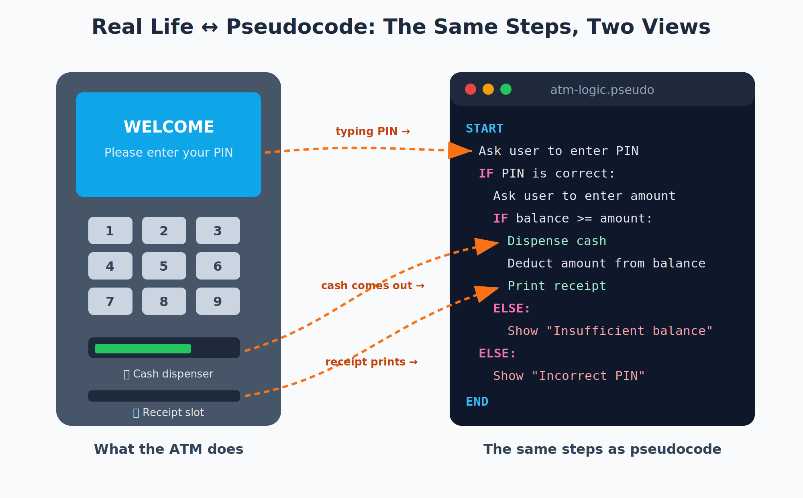
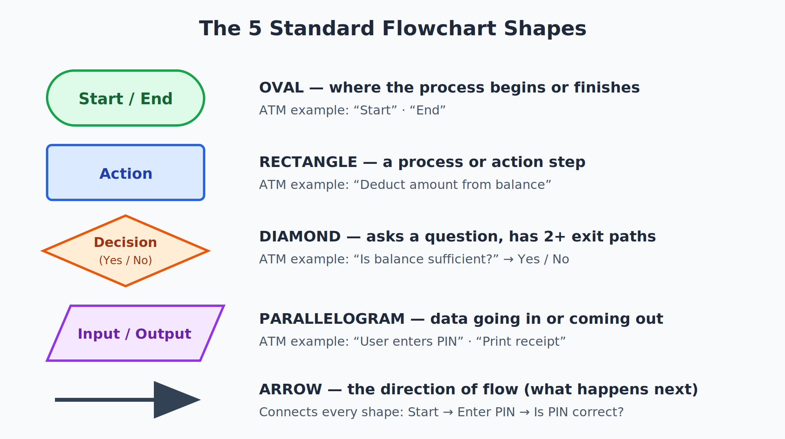
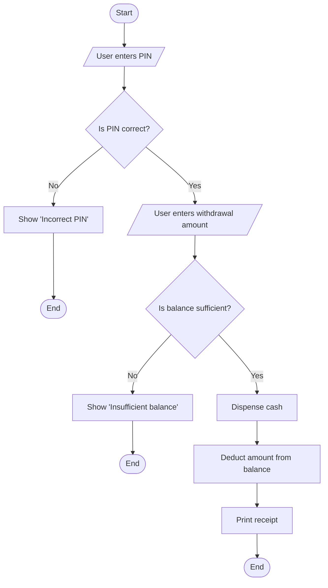
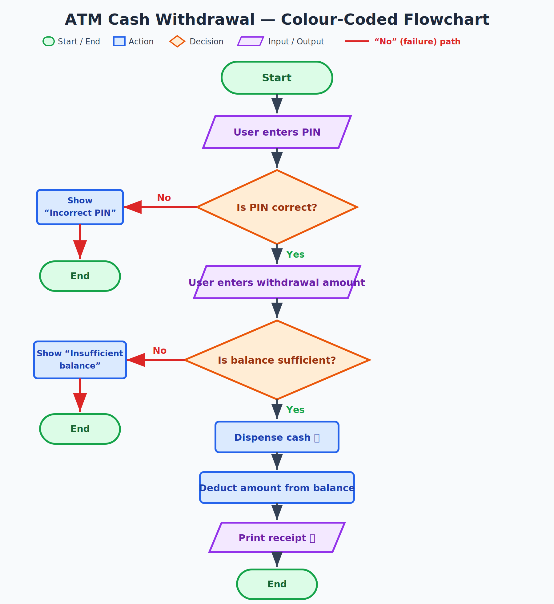
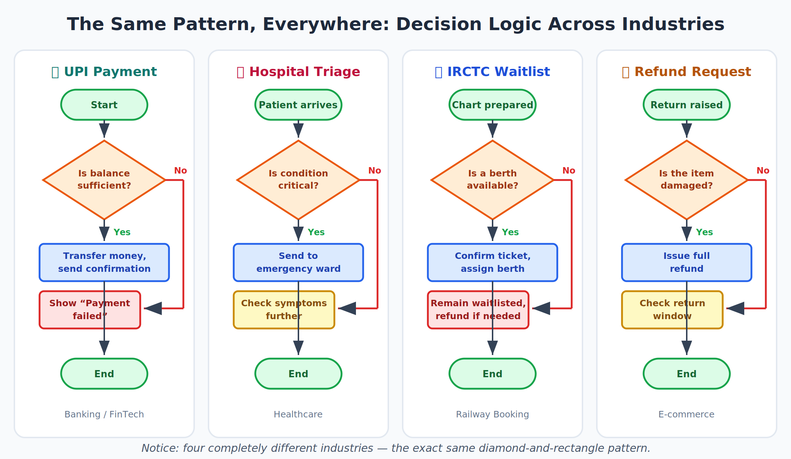
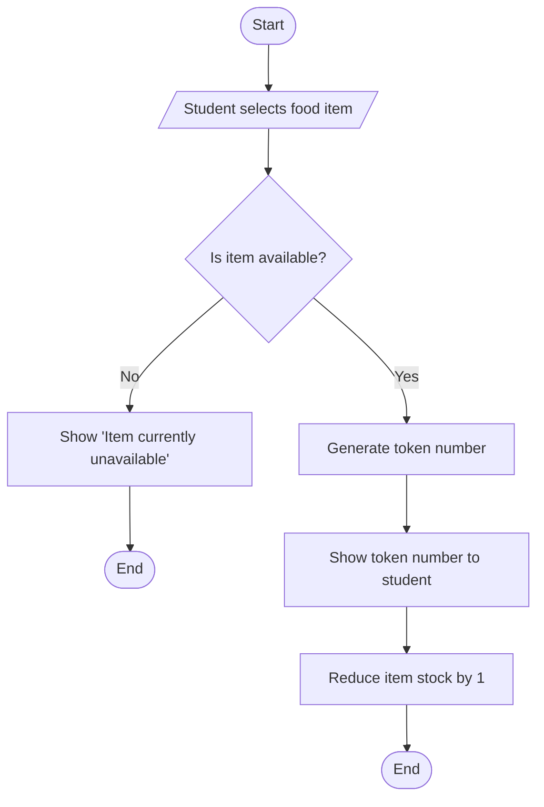
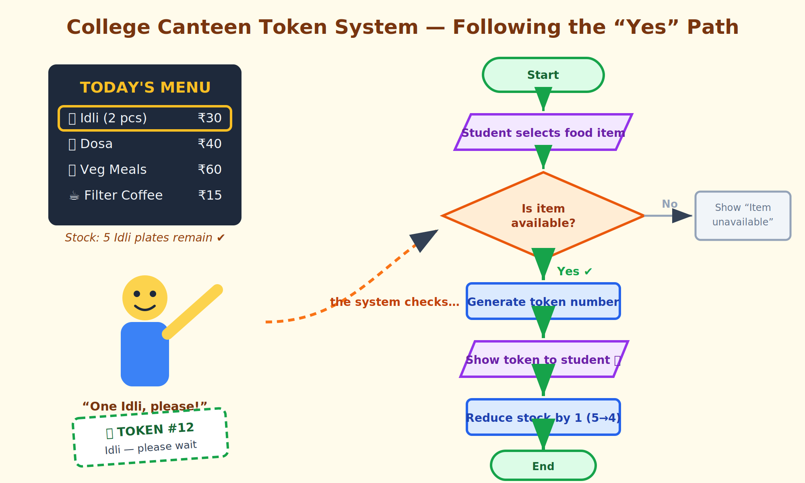

# How Machines Think

## Expressing Logic

## Learning Objectives

By the end of this topic, you will be able to:

- Explain what **pseudocode** is and why engineers write it before writing real code.
- Identify the **standard flowchart shapes** and what each one represents.
- Write simple pseudocode for an everyday decision-making process.
- Draw a basic flowchart to visualise the same logic.
- Differentiate between pseudocode and flowcharts, and decide when to use each.
- Spot common mistakes in pseudocode and flowcharts (missing paths, vague steps).

## Overview

In the previous topic, you learned to break a big problem into smaller pieces. But breaking a problem down is only half the job. The next step is to describe **exactly how each piece should work — step by step — before writing any actual code.**

There are two friendly tools for this: **pseudocode** (writing the logic in plain, structured English) and **flowcharts** (drawing the logic as a picture using boxes, diamonds, and arrows). Neither of them runs on a computer. They are **thinking tools** — used to plan and communicate logic so clearly that a teammate, a manager, or even an AI system can understand it perfectly.

This skill matters more than ever in the AI-Native world. When you give an AI system precise instructions (which you will do throughout this program), you are essentially writing pseudocode. Master this now, and everything later becomes easier.

## 1.7 Pseudocode — Writing Logic in Plain English Before Writing Code

### What Is Pseudocode?

Pseudocode is a way of describing the steps of a solution using **plain, structured language** that *looks* a bit like code, but does not follow the strict rules of any real programming language.

**Simple formula:** Clear thinking + Plain English + A little structure = Pseudocode

**Daily-life example:** Think of a recipe card for making Maggi. It says: "Boil 1 cup water. Add noodles. Add masala. Cook for 2 minutes. Serve." That recipe is not written in any "kitchen programming language" — it is just clear, ordered steps that anyone can follow. Pseudocode is exactly that: a recipe for logic.

**Beginner-friendly way to remember:** Pseudocode is *fake code with real thinking*. The computer never reads it — humans do. Its only job is to make your logic crystal clear before the real coding begins.

### Why Do Engineers Write Pseudocode First?

Real programming languages (like Python, which you will learn later) are strict — a single missing colon can break everything. But when you are still *thinking through* a problem, that strictness gets in the way.

- Pseudocode lets you focus purely on the **logic** — what should happen, and in what order.
- It is fast to write and fast to change — no syntax errors, ever.
- Anyone can read it — even a teammate who has never coded.
- It forces you to think through **every situation**, not just the happy path.

### The Building Blocks of Pseudocode

| Term | Simple Meaning |
| --- | --- |
| **Step** | One instruction or action (e.g., "Ask user to enter PIN"). |
| **Condition** | A yes/no check that decides which path to follow (e.g., "IF balance ≥ amount"). |
| **Loop** | A block of steps that repeats (e.g., "FOR each item in the cart, add its price to the total"). |
| **START / END** | Markers showing where the logic begins and finishes. |

### Example — Pseudocode for an ATM Cash Withdrawal

You have probably used an ATM (or watched someone use one). Think about what actually happens: the machine checks your PIN, then checks your balance, and only then gives you cash. Here is that exact logic as pseudocode:

```
START
  Ask user to enter PIN
  IF PIN is correct:
      Ask user to enter withdrawal amount
      IF account balance >= withdrawal amount:
          Dispense cash
          Deduct amount from balance
          Print receipt
      ELSE:
          Show message "Insufficient balance"
  ELSE:
      Show message "Incorrect PIN"
END
```



*Figure 1: Pseudocode is just "real life written as ordered steps" — every line maps to something the ATM actually does.*

Notice how it reads almost like English, but with structure: a clear START, clear IF...ELSE branches, and a clear END. A vague sentence like "handle the withdrawal properly" is not enough — pseudocode forces you to spell out what "properly" means in *every* situation.

### Rules for Writing Good Pseudocode

- Use simple, consistent keywords: `START`, `END`, `IF...ELSE`, `FOR EACH`, `WHILE`.
- Write **one clear action per line** — never cram multiple actions together.
- Cover **all realistic paths**, including failures (wrong PIN, low balance, user cancels).
- Keep the language simple enough that a non-programmer friend could follow it.

### Common Beginner Mistakes

- Writing steps so vague they don't specify anything (e.g., "check the balance and do the needful" — what *exactly* happens if the balance is low?).
- Forgetting edge cases (What if the ATM has no cash left? What if the user cancels midway?).
- Writing pseudocode in strict programming syntax — that defeats its whole purpose of being simple and language-independent.

## 1.8 Flowcharts — Visualising Logic with Standard Shapes and Arrows

### What Is a Flowchart?

A flowchart is a **diagram** that shows a process or logic visually, using standard shapes connected by arrows that show the order in which steps happen.

**Daily-life example:** Have you seen the emergency evacuation map in a cinema hall or hostel? It doesn't *describe* the exit route in paragraphs — it *shows* it with arrows. Flowcharts do the same thing for logic: they turn written steps into a visual map you can follow with your eyes.

**Why flowcharts exist:** Some people — and some situations, like presenting to a large team or a non-technical manager — understand a *picture* of logic far faster than written steps.

### The Standard Flowchart Shapes

| Shape | Meaning | Example |
| --- | --- | --- |
| **Oval (rounded)** | Start or End of the process | "Start", "End" |
| **Rectangle** | An action or process step | "Deduct amount from balance" |
| **Diamond** | A decision / condition — always has two or more exit paths (Yes/No) | "Is balance sufficient?" |
| **Parallelogram** | Input or Output | "User enters PIN", "Print receipt" |
| **Arrow** | Direction of flow — what happens next | → |



*Figure 2: The five standard flowchart shapes, each with a friendly ATM example.*

### Example — The Same ATM Logic as a Flowchart

Remember the ATM pseudocode from Section 1.7? Here is the **exact same logic**, drawn as a flowchart. Trace it with your finger: start at the top, and every diamond asks you a question that decides which arrow to follow.





*Figure 3: The complete ATM flowchart, colour-coded by shape. Notice both red "No" paths — failure paths must always be shown.*

### Pseudocode vs Flowchart — At a Glance

| Aspect | Pseudocode | Flowchart |
| --- | --- | --- |
| Format | Plain structured text | Visual diagram (shapes + arrows) |
| Best for | Detailed step-by-step logic with many conditions | Quickly showing the overall shape of a process |
| Easy to share with | Technical teammates, documentation | Non-technical stakeholders, presentations |
| Effort to update | Quick — just edit the text | Slower — may need redrawing |
| Use with AI systems | Mirrors how you describe expected behaviour to an AI | Great for reviewing overall logic at a glance |

**Beginner-friendly way to remember:** Pseudocode is the **story**; the flowchart is the **map**. Same journey, two different views — and great engineers use both together.

### Best Practices

- Every decision diamond must show **all** its outcomes — a Yes/No diamond with only one exit arrow is a mistake.
- Keep flowcharts readable — if you need more than 15–20 shapes, break the problem into smaller flowcharts (remember decomposition from Topic 2!).
- Use them together: sketch a flowchart for the big picture, then write pseudocode for each box that needs precise detail.

### Common Beginner Mistakes

- Missing the "No" path from a decision diamond (What happens when the answer is No? Always show it!).
- Making a flowchart so detailed it becomes as hard to read as code — the whole point is clarity.
- Using a rectangle where a diamond belongs — a decision must always be a question with multiple possible answers.

## Real World Applications

- **Banking / UPI:** Before developers build a UPI payment flow, they map every case as pseudocode/flowcharts — insufficient balance, wrong PIN, server timeout, daily limit exceeded.
- **Healthcare:** Hospitals define triage logic as flowcharts — "Is the condition critical? → Yes: emergency; No: check symptoms further" — before it is ever coded into software.
- **Railway Booking:** IRCTC's waitlist confirmation logic (berth availability, cancellations, quota rules) is planned as pseudocode and flowcharts long before coding begins.
- **E-commerce:** Return/refund policies are mapped as flowcharts first ("Is the item damaged? → Yes: full refund; No: check return window…") so support staff, developers, and AI chatbots all follow the same logic.
- **AI-Native Systems:** When you instruct an AI agent — "check the order status, and if delayed by more than 2 days, offer a discount coupon" — you are writing pseudocode-style instructions. Fluency in pseudocode makes you dramatically better at specifying precise behaviour for AI.



*Figure 4: Four completely different industries — the exact same decision-logic pattern.*

## Worked Example — College Canteen Token System

**Scenario:** Your college canteen wants a simple token system: a student selects a food item, and the system says whether it is available — and if yes, generates a token number.

**Step 1 — Write the pseudocode:**

```
START
  Student selects a food item
  IF item is available:
      Generate a token number
      Show token number to student
      Reduce item stock by 1
  ELSE:
      Show message "Item currently unavailable"
END
```

**Step 2 — Draw the flowchart for the same logic:**





*Figure 5: Tracing the "Yes" path — the student picks Idli, stock is available (5 plates), so a token is generated and stock drops to 4.*

**Step 3 — Verify both express identical logic:** Walk through both with the same test case ("student selects Idli, and 5 plates remain") and confirm the same outcome — token generated, shown, stock reduced by 1. This cross-checking habit is exactly the discipline you will later use to verify that AI-generated code matches your intended specification.

## Key Takeaway

Pseudocode and flowcharts are two views of the same thing: **your logic, made visible.** Pseudocode gives you precise step-by-step detail in plain English; flowcharts give you the big picture at a glance. Neither runs on a computer — they run in *human minds*, which is exactly why they are so powerful. Every decision must show all its paths, every failure case must be covered, and clarity always beats cleverness. Master these two tools now, and you have already learned the core skill of AI-Native Engineering: **expressing exactly what you want, so precisely that even a machine cannot misunderstand you.**

**Interview tip:** Interviewers often ask you to "walk through your logic" before coding. Being fluent in pseudocode lets you do this confidently — it is one of the most asked-about skills in fresher interviews.

## Quick Quiz — Check Your Understanding

1. Pseudocode is written in:
   a) Python syntax  b) Plain, structured English  c) Binary  d) HTML
2. In a flowchart, a **diamond** shape represents:
   a) Start/End  b) An action  c) A decision  d) Input/Output
3. A decision diamond in a flowchart must always have:
   a) Exactly one exit arrow  b) Two or more exit arrows  c) No arrows  d) A rectangle inside it
4. Which is generally better for quickly explaining a process to a non-technical manager?
   a) Pseudocode  b) Python code  c) A flowchart  d) A database
5. Which of these is a **mistake** in pseudocode?
   a) Using IF...ELSE  b) One action per line  c) Writing "do the needful" as a step  d) Covering failure cases

**Answers:** 1-b, 2-c, 3-b, 4-c, 5-c
