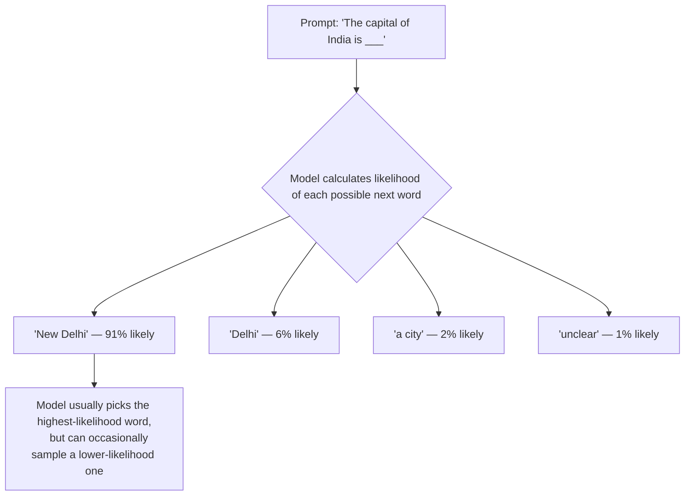

# How Machines Think

## Understanding Computation

## Learning Objectives

By the end of this topic, you will be able to:

- Define **computation** and explain how computers process information.
- Differentiate between **deterministic** and **probabilistic** systems.
- Identify real-world examples of both deterministic and probabilistic systems.
- Trace how computing evolved from fixed rules to probabilistic thinking to modern AI.
- Explain why **AI can generate different responses** to the same input.
- Understand the importance of these concepts as the foundation for learning AI.

## Overview

Computation is the process of **taking an input, processing it using instructions, and producing an output**. While all computer systems perform computation, they do not all behave the same way. Some are **deterministic**, giving the same output for the same input every time, while others are **probabilistic**, where the output can vary, as seen in AI systems. Understanding this difference is the first step toward learning how AI works and why AI can generate different responses to the same question.

## 1.1 What Is Computation?

Computation simply means **solving a problem by following steps**. A computer does not "think" like a human. It takes something given to it, follows instructions, and produces a result.

**Simple formula:** Given information + Steps to follow = Result

**Daily-life example:** Imagine making tea. You start with water, milk, tea powder, and sugar. You follow steps such as boiling, mixing, and filtering. The final result is a cup of tea. Computation works in a similar way: it starts with information, follows steps, and gives a result.

**Beginner-friendly way to remember:** Computation is not magic. It is a step-by-step process. In AI, the steps are more advanced because the system learns patterns from data, but the basic idea is still the same: information is processed to produce an answer.

- A calculator takes numbers and an operation as input, then produces an answer.
- A search engine takes keywords as input, then returns relevant results.
- An AI chatbot takes a question as input, then generates a response.

## 1.2 Deterministic Systems - Same Input Always Gives the Same Output

A deterministic system always gives the same output when it receives the same input. There is no randomness involved. The rules are fixed, so the result is predictable and repeatable.

- If you enter 2 + 2 in a calculator, the answer will always be 4.
- If a traffic signal is programmed to turn green after 60 seconds, it will follow that rule every time.
- If a login system checks whether a password matches, the result will be either access granted or access denied based on fixed rules.

## 1.3 Probabilistic Systems - Same Input Can Give Different Outputs

A probabilistic system can give different outputs for the same input because it works with likelihoods instead of fixed rules. It does not always choose one guaranteed answer; it chooses from possible answers based on probability.

- A weather forecast may say there is a 70% chance of rain, but the exact outcome is uncertain.
- A recommendation system may suggest different movies to users based on changing patterns and preferences.

## 1.4 Deterministic vs. Probabilistic Systems — At a Glance

| Feature               | Deterministic System                     | Probabilistic System                                        |
| --------------------- | ---------------------------------------- | ----------------------------------------------------------- |
| Output for same input | Always the same                          | Can vary each time                                          |
| Based on              | Fixed rules and logic                    | Probabilities and patterns                                  |
| Predictability        | Fully predictable and repeatable         | Uncertain; varies by context                                |
| Randomness            | None                                     | Present (intentional)                                       |
| Examples              | Calculator, traffic signal, login system | AI chatbot, weather forecast, recommendation system         |
| Used in               | Traditional software                     | Modern AI systems                                           |
| Advantage             | Reliable, consistent, easy to test       | Flexible, handles uncertainty, generates creative responses |

## 1.5 From Rules to AI — How Computing Evolved

We have now seen two types of system: deterministic (fixed rules) and probabilistic (likelihoods). But how did we go from rule-based computers to modern AI? This section traces that journey — and shows why it was not a sudden leap, but a natural progression driven by one simple problem: **rules alone are not enough for real-world complexity.**

### 1.5.1 The Problem with Pure Rules

Early computers were entirely deterministic. Every program was a fixed set of instructions — if this happens, do that. This worked brilliantly for calculators, ATMs, and booking systems: tasks with clear, bounded rules.

But some problems completely resisted rules:

- How do you write a rule for "recognise a cat in a photo"?
- How do you write a rule for "translate this sentence naturally"?
- How do you write a rule for "reply helpfully to any question a human might ask"?

Engineers tried. The result was brittle, limited, and exhausting to maintain. A spam filter based on rules, for example, would block any email containing the word "free" — even a legitimate email from a friend saying "feel free to call me."

**The key insight of modern AI:** Instead of writing the rules, show the system millions of examples and let it discover the patterns itself. This is called **machine learning** — and it is inherently probabilistic, because patterns extracted from data always come with uncertainty.

### 1.5.2 A Bridge Example — Autocorrect

Autocorrect is the perfect stepping stone between a simple rule-based system and a full AI, because every student already uses it daily.

**Early autocorrect (deterministic):** Had a fixed dictionary. "Teh" always became "The." No context, no variation. Pure rule: wrong spelling → correct spelling.

**Modern autocorrect (probabilistic):** Looks at the whole sentence context. "I'll meat you at the" — it suggests "meet" not "meat," because it has learned from millions of sentences that "meet you" is far more probable in this context. Type the same word in a recipe and it might not correct it at all.

Same input, different output depending on context. This is exactly what probabilistic systems do — and it is the same foundation that powers modern AI.

### 1.5.3 From Autocorrect to an LLM — The Same Idea, Scaled Up

A Large Language Model (LLM) like Claude is essentially autocorrect taken to an extreme:

- Autocorrect predicts the **next word** from a short phrase.
- An LLM predicts the **next token** from an entire conversation, document, or instruction set.
- Both are probabilistic — both sample from a distribution of likely continuations.
- The LLM simply does it across a vastly larger vocabulary, with a vastly richer understanding of context, billions of times per response.

This is the direct path from rule-based computing to modern AI: rules → statistical patterns → machine learning → deep learning → LLMs. Each step made the system more capable of handling uncertainty and complexity — and each step made it more probabilistic.

**This is exactly why AI gives different answers to the same question** — which Section 1.6 now explains in detail.

## 1.6 Why AI Gives Different Answers to the Same Question

Unlike a calculator, AI does not always produce one fixed answer. It looks at your question, understands the context, and predicts the most suitable response based on patterns it learned from a huge amount of data.

Because there can be many correct ways to answer the same question, AI may choose different words or examples each time.

**Daily-life analogy:** Imagine asking three different teachers: _"What is Machine Learning?"_

All three know the answer -- but each may explain it differently.

- One may use a definition.
- One may give an example.
- One may draw a diagram.

The answer changes, but the concept remains the same. AI behaves in a similar way.

**Example --** Question: _"Explain Artificial Intelligence."_

**Response 1:** Artificial Intelligence is a technology that enables machines to perform tasks that normally require human intelligence.

**Response 2:** Artificial Intelligence allows computers to learn from data and solve problems like humans.

Both answers are correct. They simply explain the same idea in different ways.

**Beginner-friendly way to remember:** AI is not broken when it gives a different answer -- it is working exactly as designed. It samples from many possible correct responses, just as a teacher might pick any one of several good explanations.

**How It Works -- A Simple Diagram:**

This is exactly why asking Claude the same question twice can give you two different (but both reasonable) answers — the model is sampling from probabilities, not looking up one fixed rule in a table. This behaviour is controlled by a setting called **temperature** (low temperature → more predictable, near-deterministic output; high temperature → more varied, creative output). We will study temperature and sampling in full mathematical detail in **Week 3 (What AI Is — and Isn't)** and **Week 7 (Probability, Statistics and AI Confidence)** — for now, simply understand: **an LLM's core behaviour is probabilistic by design, not by accident or flaw.**

## Key Takeaway

Traditional software is often deterministic: the same input gives the same output. Modern AI systems are often probabilistic: the same input can lead to different outputs because the system works with probabilities, patterns, and context. Understanding this difference helps students use AI more effectively and evaluate its answers more carefully.
