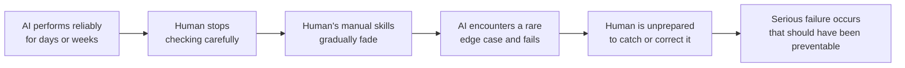

# Automation Complacency

---

## Learning Objectives

By the end of this topic, you should be able to:

- Define automation complacency and explain why it occurs
- Describe the "Paradox of Automation" and how it shifts human roles from active participants to passive monitors
- Analyze real-world examples across different domains (driving, aviation, software development) where high AI accuracy led to human oversight failures
- Implement strategies to combat complacency in AI workflows, such as forced engagement and periodic manual testing

---

## Overview

What happens when an AI system is actually very good? What happens when a model is 99% accurate?

Counter-intuitively, a 99% accurate AI can be more dangerous than a 70% accurate one.

When a system is 70% accurate, users know they have to double-check its work. They stay alert. When a system is 99% accurate, humans begin to trust it without thinking. They stop checking. And when that rare 1% failure occurs — the human is completely unprepared to catch it or correct it.

This is automation complacency — the gradual reduction in human vigilance that happens when an automated system performs reliably for a long time.

In this topic, we will explore why our brains are wired to become complacent, how this plays out across real industries, and what you — as an AI engineer — can do to keep humans actively engaged even when working alongside a highly capable AI system.

---

## The Paradox of Automation

To understand complacency, we must first understand the **Paradox of Automation**.

The paradox states: **The more reliable an automated system becomes, the less capable human operators become at stepping in when it fails.**

Here is how the cycle works:
 

When you introduce AI to automate a task, the human's job shifts from *doing* the task to *monitoring* the AI doing the task. However, humans are neurologically terrible at passive monitoring. 

Think back to System 1 and System 2 thinking. Passive monitoring requires sustained System 2 attention, which is exhausting. If an AI performs flawlessly for hours or days, your brain naturally downgrades the monitoring task to System 1. You start skimming. You start assuming the machine is right. You become complacent.

**The connection to the Judgment Framework:**
This is exactly what happens when Q2 ("Can I verify this without the AI?") and Q3 ("Who is accountable if this fails?") are never actively asked. When an AI has been right many times in a row, both questions quietly stop being asked — not because someone decided to stop asking them, but because complacency makes them feel unnecessary. Building systems that structurally require these questions to be answered — every time — is the engineering response to this psychological reality.

---

## Real-World Examples of Automation Complacency

Automation complacency is not a new problem unique to generative AI; it has been studied for decades in physical engineering. We can learn a lot from these older domains.

### Example 1: Self-Driving and Driver-Assist Systems

**The Situation:** Modern cars feature advanced driver-assistance systems (like lane-keeping and adaptive cruise control) that can handle 99% of highway driving perfectly.

**The Complacency Failure:** Because the system works flawlessly for hundreds of miles, drivers often take their hands off the wheel and their eyes off the road—despite warnings not to. When the system suddenly encounters a complex edge case (like a poorly marked construction zone or an overturned truck), it disengages and hands control back to the driver. But because the driver was complacent, they are not mentally present enough to take over in the 1.5 seconds required to avoid a crash.

**Think of it like this:** Imagine you are a passenger on a long bus journey. After hours of smooth highway, the driver says "take the wheel" — and you have been half-asleep. That is exactly the position driver-assist systems put humans in.

**The lesson:** High accuracy builds false security. The better the AI performs on average, the less prepared the human is for the moment the AI needs help.

### Example 2: Aviation and Autopilot

**The situation:** Commercial aircraft fly largely on autopilot, with human pilots monitoring the systems. This has made air travel extraordinarily safe overall.
 
**The complacency failure:** Aviation experts call this "skill fade." Because pilots spend so much time monitoring and so little time actively flying, their manual flying skills can degrade. In rare emergencies where multiple sensors fail and the autopilot disconnects — such as Air France Flight 447 in 2009 — pilots have struggled to read the aircraft's physical state because they had been out of the active-flying loop for so long.
 
**The lesson:** Passive monitoring degrades active skills. If a human is only ever asked to watch a machine work, they will gradually lose the ability to do the work themselves — and the ability to spot when the machine is doing it wrong.
 
> 📎 [Air France Flight 447 — BEA Final Report](https://www.bea.aero/en/investigation-reports/notified-events/detail/event/accident-af-447/) — the most cited real-world case of skill fade and automation over-reliance in aviation

### Example 3: AI Code Assistants (Software Development)

**The Situation:** A software engineer uses an AI coding assistant (like GitHub Copilot) to generate boilerplate code and complex functions. The AI is highly accurate and usually generates perfectly working code.

**The Complacency Failure:** After weeks of the AI generating flawless code, the developer stops reading it line-by-line. They start hitting "Tab" to accept the suggestion and immediately run the program. One day, the AI generates a subtle SQL injection vulnerability. Because the code compiles and the primary feature works, the developer doesn't notice the security flaw. The code is pushed to production.

**This is the golden rule failure playing out in real life.** The developer started following the rule at the beginning — reading every line. Complacency gradually eroded that discipline.
 
**The lesson:** In knowledge work, fluency triggers automation bias. If the AI's output looks structurally correct and usually is correct, humans stop verifying the underlying logic. This is exactly the risk the golden rule is designed to prevent — and it requires active, designed-in habits to maintain over time, not just intention.
 
---

## How to Combat Complacency

You cannot simply tell users to "pay more attention." Human psychology does not work that way — as the Paradox of Automation shows, the better the AI performs, the harder sustained vigilance becomes. Instead, you must design workflows that structurally fight complacency.
 
### Design for Active Engagement
 
Instead of asking a human to passively read a completed AI output and click "Approve," force them to engage with the content:
 
- Ask them to highlight the specific sentence in the source document that proves the AI's summary is correct
- Require them to write a one-sentence justification for why they are approving a high-stakes AI decision — not just click a button
- Design the interface to be interactive rather than a simple binary yes/no checklist
**Why this works:** Active engagement requires System 2 thinking. It is harder to be on autopilot when the task requires you to produce something, not just read something.
 
### Introduce Friction
 
If it is too easy to approve an AI action, people will do it without thinking. Introduce deliberate friction for high-stakes decisions.
 
**Example:** If an AI suggests permanently deleting a database, do not provide a single "Yes" button. Make the user type the exact name of the database to confirm. This single extra step breaks the approval-by-reflex habit and forces a moment of genuine attention.
 
**Why this works:** Friction creates a brief forced pause — enough for System 2 to engage before an irreversible action is taken.
 
### Rotate Tasks — Prevent Skill Fade
 
If your team uses AI to review legal contracts, do not let them use the AI for every single contract. Have them manually review one out of every ten contracts from scratch, without AI assistance.
 
This keeps their manual skills sharp and maintains their baseline understanding of what a "normal" contract looks like. When the AI makes a subtle error, they will recognise it — because they have not forgotten what correct looks like.
 
**Why this works:** Skill fade is reversed by practice. Regular manual work maintains the reference point that lets humans recognise when the AI has gone wrong.
 
### Red-Teaming and Injecting Errors
 
Some high-stakes organisations combat complacency by deliberately injecting known fake errors into the monitoring queue. If a reviewer catches the fake error, they are acknowledged for staying alert. If they miss it, it signals that complacency has set in.
 
Aviation does this with flight simulators — pilots regularly practise rare emergencies in simulation so their skills do not fade between real incidents. Nuclear power plant operators do this with controlled drills. The principle is the same: practise catching errors so you remain capable of catching them when they are real.
 
**Why this works:** If you only ever see correct outputs, your brain stops looking for errors. Injected errors keep the error-detection mode active.
 

---

## Key Takeaways

- **99% accuracy is dangerous:** It is accurate enough to build absolute trust, but not accurate enough to be left entirely alone.
- **Passive monitoring fails:** Humans are psychologically incapable of maintaining high vigilance when watching a machine perform flawlessly.
- **Skill fade is real:** If you rely on AI to do all the thinking, you will lose the ability to spot when the AI is thinking incorrectly.
- **Fight complacency with design:** Build workflows that introduce healthy friction, force active engagement, and occasionally require humans to do the work manually.

> **Interview tip:** If an interviewer asks how you handle a model that makes a mistake 1% of the time, don't just talk about retraining the model. Talk about how you design the UX to keep the human operator vigilant so they catch that 1%. Highlighting the "Paradox of Automation" demonstrates deep product maturity.

---

## Reference Links

- 📎 [The Ironies of Automation by Lisanne Bainbridge (1983)](https://ckrybus.com/static/papers/Bainbridge_1983_EA_C.pdf) — The foundational academic paper on why automating tasks makes the human operator's job harder, not easier.
- 📎 [NHTSA Report on Automation Complacency in Driving](https://www.nhtsa.gov/) — Insights into human factors and the dangers of partial automation in vehicles.
- 📎 [Automation Bias in Clinical Decision Support Systems](https://www.ncbi.nlm.nih.gov/pmc/articles/PMC7309265/) — Research on how healthcare professionals can become overly reliant on automated alerts.
