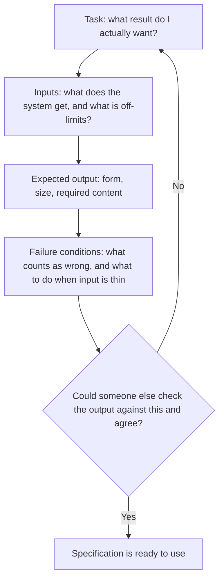

# Specifying for AI

## Specification

## Learning Objectives

By the end of this topic, you will be able to:

- Define a **specification** and explain why AI systems depend on one.
- Apply the four tests of a good spec: **testable, bounded, observable, actionable**.
- Rewrite a vague request into a precise one.
- Identify the **inputs**, **expected outputs**, and **failure conditions** of any task.
- Explain what an AI does with the parts of a task you leave unspecified.

## Overview

Till now you have learned that AI is probabilistic — it predicts a likely answer rather than looking up a fixed one. That has a direct consequence: **anything you do not specify, the model decides for you.** A specification is the description of what you want that is precise enough for someone — or something — else to produce it without guessing. Writing good specs is the core skill of working with AI.

## 2.1 What Makes a Good Specification — Testable, Bounded, Observable, Actionable

A specification is a statement of the **result you want**, not a description of your feelings about the current result. Four tests separate a real spec from a wish.

**Testable** — you can check whether the output meets it, and get a yes or no.

- Not testable: "make it engaging."
- Testable: "open with a question and use no sentence longer than 20 words."

**Bounded** — it states limits: length, format, scope, tone.

- Unbounded: "summarise this report."
- Bounded: "summarise this report in five bullets, under 100 words total."

**Observable** — it refers to something visible in the output, not an intention in your head.

- Not observable: "make it sound more professional."
- Observable: "remove contractions, remove exclamation marks, use full job titles on first mention."

**Actionable** — it tells the system what to *do*, not only what to avoid.

- Not actionable: "don't be vague."
- Actionable: "give one concrete example after each definition."

**Beginner-friendly way to remember:** If two careful people could read your spec and disagree about whether the output passed, it is not a spec yet.

## 2.2 Bad Spec vs Good Spec

Take the most common instruction given to an AI: **"Make it better."**

Nothing in it is usable. Better by which measure? For which reader? Shorter or longer? May the facts change? The model has to invent answers to all four questions, and it will invent different answers each time you ask.

Now the same request, specified:

> "Rewrite this paragraph at a Grade 8 reading level. Maximum 80 words. Keep all three statistics exactly as written. Use short, plain sentences."

Every clause is checkable. Anyone can hold the output against it and mark pass or fail — including you, including the model.

**Daily-life example:** Telling a tailor "make this shirt nicer" gets you a surprise. Telling them "shorten the sleeves by two inches and replace the buttons with black ones" gets you the shirt you pictured. Same skill, different medium.

| Feature              | Weak Specification      | Strong Specification              |
| -------------------- | ----------------------- | --------------------------------- |
| Success measure      | Implied, in your head   | Written down and checkable        |
| Length and format    | Unstated                | Stated exactly                    |
| Audience             | Assumed                 | Named                             |
| Scope of change      | Unlimited               | Fenced — what must stay untouched |
| Output across runs   | Varies widely           | Varies within your limits         |
| Reviewing the result | Argument about taste    | Yes or no against each clause     |

**Beginner-friendly way to remember:** A weak spec makes the model guess. A strong spec makes it work.

## 2.3 Identifying the Inputs, Expected Outputs, and Failure Conditions of a Task

Before specifying anything, answer three questions in order.

**1. Inputs — what is the system given?**
List exactly what it may use, and note anything it must *not* assume. An AI with no stated inputs will happily fill the gap from its own training data.

**2. Expected output — what should come back?**
Cover form (bullets, table, paragraph), size, and required content.

**3. Failure conditions — what does a wrong answer look like?**
This is the step beginners skip, and it does the most work. Name the specific ways the task can go wrong, and say what to do when the input is not enough.

**Worked example — summarising a customer complaint for a support team:**

- **Inputs:** the text of the complaint email, and nothing else. No customer history, no assumptions about the product.
- **Expected output:** three bullets — the problem, what the customer is asking for, the urgency. Under 50 words total.
- **Failure conditions:** inventing details not present in the email; missing the customer's actual request; exceeding 50 words; guessing urgency when the email does not indicate it — in that case, write "urgency not stated."

That last clause is the difference between a summary you can trust and one you have to re-check against the original.

**How It Works — A Simple Diagram:**

## Key Takeaway

A specification is a description of the result that is testable, bounded, observable, and actionable. "Make it better" fails all four tests; "rewrite at Grade 8 level, max 80 words, keep the statistics" passes all four. Every task can be specified by naming its inputs, its expected output, and its failure conditions — and whatever you leave out of that list, the AI will decide on your behalf.
