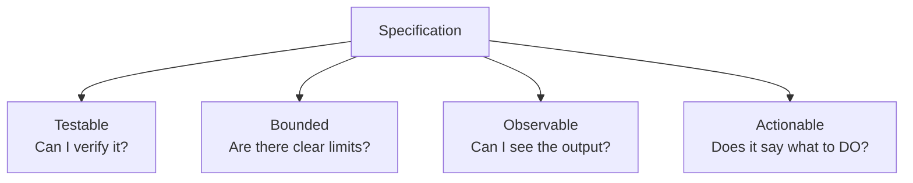
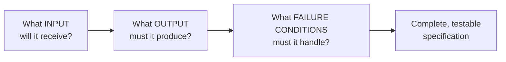
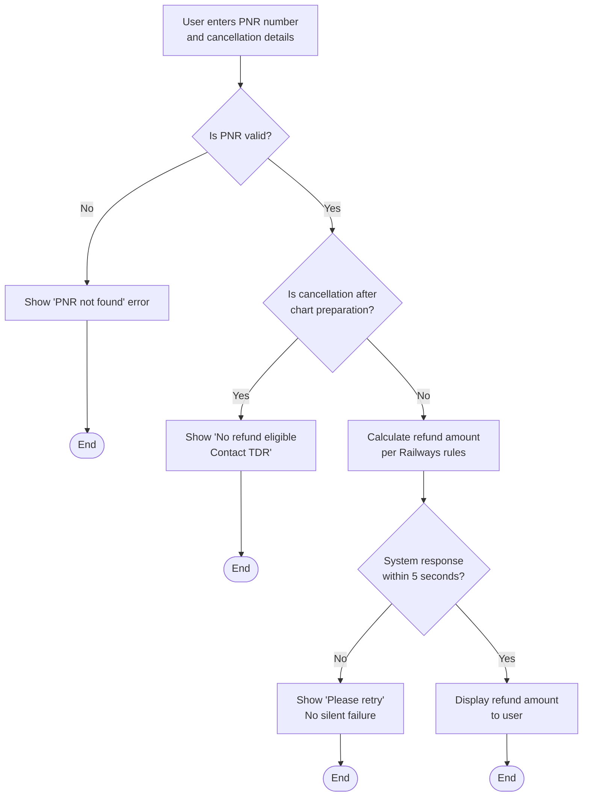

# What Makes a Good Specification

---

## Learning Objectives

By the end of this topic, you should be able to:

- Explain what a specification is and why it is the most important skill for anyone who directs AI to do work
- Identify the four properties of a good specification — Testable, Bounded, Observable, Actionable (T.B.O.A.)
- Tell the difference between a vague, weak specification and a precise, professional one
- Break any task down into its inputs, expected outputs, and failure conditions before asking AI to do it
- Write a well-formed specification for a simple real-world task
- Look at an existing specification and spot what is missing from it

---

## Overview

You already know that AI systems are probabilistic — they generate the most *likely* answer, not a guaranteed one. That single fact leads to the most important skill in this entire program: **if you don't tell an AI system precisely what you want, it will guess — and its guess may not match what you actually needed.**

Think about ordering food on Swiggy. If you just type "send me food," the app has no idea what to do. But the moment you say "1 Paneer Butter Masala, 2 Butter Naan, deliver to Hostel Block C, Room 204, by 8 PM" — it knows exactly what to do. That second instruction is a specification.

A **specification** (often called a "spec") is a clear, precise description of what you want a system to do, written *before* you ask the AI to build or do anything. The AI cannot write a good spec for you — only you know what "good" actually means for your problem. Every time an AI does the wrong thing, it almost always traces back to a spec that was incomplete, vague, or untestable.

---

## What Is a Specification?

A specification is a written description of a task that states exactly:
- what input the system will receive
- what output it must produce
- what should happen when something goes wrong

It must be precise enough that two different people — or two different AI systems — reading it would build the *same* thing.

Human language is naturally vague. If you tell a friend "get me something to eat," they might bring you biryani, a sandwich, or biscuits — all technically valid. That looseness is fine between friends, but it fails badly when you're directing a powerful, literal system that acts on your exact words. A specification removes the vagueness *before* the work begins, not after you're disappointed with the result.

---

## The Four Properties of a Good Specification (T.B.O.A.)

A specification is only useful if it has all four of these properties. Miss even one and you open the door to a result you didn't want. Memorise them as **T.B.O.A.**

**Testable** — you can check, with a clear yes or no, whether the output meets the requirement. Ask yourself: "Can I write a test that proves this was done correctly?"
- Not testable: "make it engaging."
- Testable: "open with a question and use no sentence longer than 20 words."

**Bounded** — the task has clear limits — a maximum length, a specific scope, a defined set of inputs it must handle. Ask yourself: "Does this say how big, how long, or how much?"
- Unbounded: "summarise this report."
- Bounded: "summarise this report in five bullets, under 100 words total."

**Observable** — you can actually see or measure the output to judge it. Ask yourself: "Can I look at the result and judge it against the spec?"
- Not observable: "make it sound more professional."
- Observable: "remove contractions, remove exclamation marks, use full job titles on first mention."

**Actionable** — the instruction tells the system what to *do*, not just what outcome you vaguely wish for. Ask yourself: "Does this tell the system a concrete action to take?"
- Not actionable: "don't be vague."
- Actionable: "give one concrete example after each definition."

**Real-life analogy:** Imagine giving directions to a Swiggy delivery partner. "Go somewhere near Koramangala" is not testable, bounded, observable, or actionable — the rider has no idea if they've succeeded. "Deliver to Flat 302, Sunrise Apartments, 80 Feet Road, Koramangala 4th Block, by 8:00 PM" gives them everything they need. That is a specification.

**Remember it as T.B.O.A.**

Think of it like a Zomato order:
- **Testable** — did the right dish arrive?
- **Bounded** — is it within the delivery area and time?
- **Observable** — you can see and taste it
- **Actionable** — "deliver Paneer Masala to Room 204" is a concrete action

---

## Bad Spec vs Good Spec

This is the most common beginner mistake — writing a wish instead of a specification.

**Bad specification:** *"Make it better."*

This fails all four properties:
- Not testable — "better" according to what measure?
- Not bounded — better by how much, in what way?
- Not observable — there's no way to check against a fixed standard
- Not actionable — it tells the AI nothing about what action to take

**Good specification:** *"Rewrite this paragraph at a Grade 8 reading level, using simple sentences, keeping the meaning unchanged, in no more than 80 words."*

This passes all four:
- Testable — you can run a readability check and count the words
- Bounded — hard limit of 80 words is given
- Observable — you can read the result and compare it against "Grade 8 level" and word count
- Actionable — "rewrite," "use simple sentences," and "keep the meaning unchanged" are concrete actions

**More real-world examples you'll actually relate to:**

**Bad specs ❌**
- "Make the order confirmation message nicer."
- "Warn students who are missing too much class."
- "Handle failed UPI payments well."

**Good specs ✅**
- "Rewrite the order confirmation SMS to be under 160 characters, include the order ID and expected delivery time, and use a friendly but professional tone."
- "Send an email alert to any student whose attendance falls below 75% in any subject, listing the subject name and current percentage, sent every Friday at 6 PM."
- "If a UPI payment fails, show the user the specific reason — insufficient balance, bank server down, or incorrect PIN — within 3 seconds, and offer a Retry button."

---

## Inputs, Expected Outputs, and Failure Conditions

Every good specification, no matter the domain, breaks into three parts. Ask these three questions before specifying any task:

- **Input** — what information does the system start with? For example: a student's marks, a scanned ID card, a customer's order details
- **Expected output** — what exact result must come out the other end? For example: a confirmation SMS, an approval or rejection decision, a formatted report
- **Failure conditions** — what could go wrong, and what should happen in each case? A specification that only describes the "happy path" — when everything goes right — is an incomplete specification. Real systems fail in real ways, and your spec must say what correct failure behaviour looks like too

**Worked breakdown — IRCTC ticket refund:**

- Input: ticket PNR number, cancellation date, ticket fare, class of travel
- Expected output: refund amount calculated per Indian Railways cancellation rules, displayed to the user within 5 seconds
- Failure conditions: invalid PNR → show "PNR not found" error; cancellation after chart preparation → show "no refund eligible, contact TDR"; system timeout → show "please retry" with no silent failure

### Rules for a Good Specification

- Always write the specification down in text — do not keep it in your head. A written spec can be reviewed, tested, and reused
- Write the failure conditions *before* you ask the AI to build anything — most real-world bugs come from unhandled failure cases, not the happy path
- Keep specifications as short as possible while still being complete — a bloated spec is as hard to verify as a vague one

### Common Beginner Mistakes

- Writing goals instead of specifications — "improve user experience" instead of a concrete, testable instruction
- Forgetting to define what "done" looks like — without an observable success criterion, you cannot verify the AI's output
- Specifying only the happy path and being surprised when edge cases produce bad results

> A specification is not the same as a wish. A wish describes a feeling — "users should feel the app is trustworthy." A specification describes an action and a measurable outcome — "display the total amount debited in bold, immediately after every UPI transaction." Your job is to translate wishes into specifications.

---

## Key Takeaways

- A specification is a precise, written description of a task — input, output, and failure conditions — given to an AI system before it starts working
- A good specification is **Testable, Bounded, Observable, and Actionable** — remember it as **T.B.O.A.**
- "Make it better" is a wish, not a specification. "Rewrite at Grade 8 level, max 80 words" is a specification
- Every task specification must cover three parts: **input → expected output → failure conditions**
- Specifying only the happy path and ignoring failure conditions is one of the most common and costly beginner mistakes
- Writing specifications is a 100% human responsibility — the AI cannot write its own requirements
- This skill directly connects to everything you build later in this program — a vague spec guarantees a useless AI output

> **Interview tip:** If asked "how do you ensure AI produces reliable output?", the strongest answer starts with "by writing a precise, testable specification before any AI call is made" — not with a technical fix after the fact.
