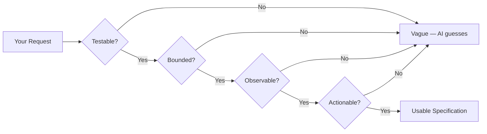
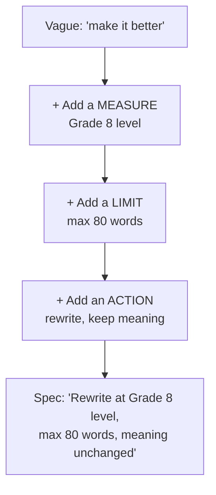

# Week 2 — Specifying for AI
## Topic 1: What Makes a Good Specification

*(Covers: 2.1 The four traits of a good specification — testable, bounded, observable, actionable · 2.2 Bad spec vs good spec — 'make it better' vs 'rewrite at Grade 8 level, max 80 words')*

---

## 1. Learning Objectives

By the end of this topic, you will be able to:

- Define a **specification** in one sentence.
- Name and apply the four traits: **Testable, Bounded, Observable, Actionable (TBOA)**.
- Explain why a vague instruction like *"make it better"* fails.
- Rewrite any vague request into a precise, checkable specification.

---

## 2. Overview

Last week you learned that AI is **probabilistic** — it predicts a likely answer, not a guaranteed one. So the quality of what you get out depends almost entirely on how precisely you describe what you want.

> **Definition:** A **specification** ("spec") is a written description of a task, precise enough that two different people reading it would produce the same result.

---

## 3. Description

### 3.1 The Four Traits of a Good Specification

Think of ordering food at a restaurant. *"Bring me something nice"* is not an order — it's a hope. *"One medium margherita pizza, thin crust, no olives, in 20 minutes"* is an order. The difference is exactly these four traits.

| Trait | Plain Meaning | Restaurant Version | The Question to Ask |
|---|---|---|---|
| **Testable** | You can check yes/no whether it was done right. | "Thin crust" — either it is or it isn't. | *Can I prove it was done correctly?* |
| **Bounded** | It has limits — size, time, scope. | "Medium," "20 minutes." | *Does it say how much, how long, how big?* |
| **Observable** | You can see or measure the result. | You can look at the pizza. | *Can I judge the result by looking at it?* |
| **Actionable** | It says what to **do**, not what you wish for. | "No olives" — a clear action. | *Does it tell them a concrete action?* |

**Remember it as TBOA.**

#### The TBOA Filter

Every request you write should pass through all four gates. Miss one, and you've left a gap the AI will fill with a guess.

**Second analogy — giving directions.**

- *"Drop me somewhere near the station"* → fails all four. The driver cannot know if they succeeded.
- *"Drop me at Gate 2, Dadar Station, west side, before 7:00 PM"* → testable (Gate 2), bounded (before 7 PM), observable (you can see the gate), actionable (drive there).

> **Quick check:** If nobody can tell whether the job was done correctly, you didn't write a specification — you wrote a wish.

### 3.2 Bad Spec vs Good Spec

The classic beginner spec is **"make it better."** Here it is next to its precise twin.

| | **Bad Spec** | **Good Spec** |
|---|---|---|
| **The instruction** | "Make it better." | "Rewrite this paragraph at a Grade 8 reading level, max 80 words, keep the meaning unchanged." |
| **Testable?** | ❌ "Better" by what measure? | ✅ Run a readability check; count the words. |
| **Bounded?** | ❌ No limit of any kind. | ✅ Hard cap of 80 words. |
| **Observable?** | ❌ Nothing to compare against. | ✅ Read it and check level + length. |
| **Actionable?** | ❌ Names no action. | ✅ "Rewrite," "keep meaning unchanged." |
| **Likely result** | Something random. You'll retry 5 times. | Close to right on the first attempt. |

#### More Before / After

| Vague Request | Rewritten as a Specification |
|---|---|
| "Shorten this essay." | "Cut this essay from 900 to 500 words, remove repeated points only, keep all headings." |
| "Write a nice caption." | "Write 3 Instagram captions, under 15 words each, friendly tone, one emoji maximum." |
| "Fix my resume." | "Rewrite each bullet in my resume to start with an action verb and include one number, max 2 lines per bullet." |
| "Explain this simply." | "Explain this in under 100 words for a 15-year-old, using one everyday analogy, no technical terms." |

#### The Repair Pattern

Turning a wish into a spec is a habit, not a talent. Add three things every time.

**Common beginner mistakes:**

- Writing a **goal** instead of an instruction ("improve engagement").
- Using words with no fixed meaning — *better, professional, clean, engaging* — without defining them.
- Forgetting to say what **"done"** looks like.

---

## 4. Real World Application

- **Food delivery apps:** "Make the confirmation message nicer" gets rewritten as "Order confirmation SMS under 160 characters, must include order ID and delivery time." Every one of thousands of daily messages then comes out consistent.
- **College attendance systems:** "Warn students missing too much class" becomes "Email any student below 75% attendance every Friday at 6 PM, listing subject name and current percentage." Now the rule is checkable by anyone.
- **Customer support chatbots:** Companies specify exact tone, maximum reply length, and topics the bot must refuse — otherwise the same question gets six different answers across six customers.
- **AI coding assistants:** Developers write the expected input, output, and failure behaviour *before* asking the AI to generate code, because reviewing a vague result takes longer than writing the spec did.
- **Content and marketing teams:** Instead of "write engaging copy," briefs now read "3 headlines, under 10 words each, no exclamation marks, mention the free trial." Same tool, far fewer rounds of revision.

---

## 5. Worked Example

**Scenario:** You want AI to rewrite your college club's notice so juniors actually read it.

**Step 1 — Start with the wish.**
> "Make our club notice better."

**Step 2 — Add a measure (Testable + Observable).**
Readable by a first-year student → *"at a Grade 8 reading level."*

**Step 3 — Add a limit (Bounded).**
It must fit on a WhatsApp status → *"maximum 60 words."*

**Step 4 — Add the action (Actionable).**
*"Rewrite,"* not *"improve"* → and state what must survive: the date, time and venue.

**Final specification:**

> "Rewrite this club notice at a Grade 8 reading level, maximum 60 words, in a friendly tone. Keep the event date, time and venue exactly as written. Do not add new information."

**Why it works:** you can count the words, run a readability check, and confirm the date and venue are unchanged. Every requirement is verifiable without asking anyone's opinion.

---

## 6. Key Takeaways

- A **specification** is a precise, written description of a task, written before the AI starts working.
- A good specification is **testable, bounded, observable, and actionable** — remember **TBOA**.
- *"Make it better"* is a wish. *"Rewrite at Grade 8 level, max 80 words"* is a specification.
- To repair a vague request, add a **measure**, a **limit**, and an **action**.
- Vague instructions don't make AI fail — they make AI **guess**. Removing the guesswork is your job, not the model's.
- **Interview tip:** asked "how do you get reliable output from AI?", the strongest answer begins with "by writing a precise, testable specification first" — not with a fix applied afterwards.

---

## 7. Reference Links

- [Anthropic — Be Clear, Direct, and Detailed](https://docs.claude.com/en/docs/build-with-claude/prompt-engineering/be-clear-and-direct) — official guidance on writing precise instructions for a model.
- [Anthropic — Prompt Engineering Overview](https://docs.claude.com/en/docs/build-with-claude/prompt-engineering/overview) — the full set of techniques, useful as you progress through this unit.
- [Google Machine Learning Crash Course — Framing an ML Problem](https://developers.google.com/machine-learning/crash-course/framing) — how professionals turn a fuzzy goal into a measurable problem statement.
- [OpenAI — Prompt Engineering Guide](https://platform.openai.com/docs/guides/prompt-engineering) — a second vendor's take; note how the same "be specific, set limits" advice appears independently.
- [GeeksforGeeks — Software Requirement Specification (SRS)](https://www.geeksforgeeks.org/software-engineering/software-requirement-specification-srs-format/) — background on the traditional engineering discipline that spec-writing comes from.
