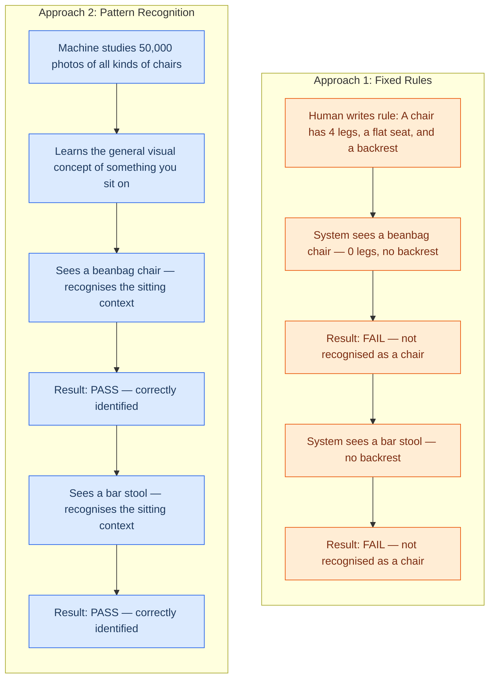

# How Machines Recognise Patterns

## Pattern Recognition 

## Learning Objectives

By the end of this topic, you will be able to:

- Explain what pattern recognition means in the context of AI.
- Understand how machines find hidden rules in data without being explicitly programmed.
- Identify everyday examples of pattern recognition in action.

## Overview

In the last topic, you learned to write precise specifications — telling a machine exactly what to do, step by step. But some of the most powerful AI systems today aren't told step-by-step rules at all. Instead, they are shown a huge number of examples and asked to find the **pattern** hiding inside them.
 
Think about how you learned to recognise a dog. Nobody gave you a checklist — "must have 4 legs, a tail, fur." Someone just pointed at different dogs over and over, and your brain figured out the pattern on its own. Machines learn in the exact same way.
 
## 2.1 What is Pattern Recognition?

**What Is It?**
**Pattern recognition** is the process by which a machine looks at many repeated examples and works out a general rule — without a human writing that rule down directly. Understanding this explains both where AI's abilities come from and where its limits are.

**Think of it like this:** Think about how Instagram Reels always seems to know 
exactly what kind of content to show you — without you ever telling it your preferences. 
It watched your behaviour across thousands of scrolls, found the pattern, and now 
predicts what you'll stop to watch next. Machines learn from data the exact same way — 
not from rules someone wrote, but from repeated examples they were shown.

**A Quick Example You Already Use:**
Open your email inbox. Notice how spam messages are automatically sorted into the junk folder? No human sits at a desk reading your emails. Instead, an AI has looked at millions of emails and learned the *patterns* that make an email spammy — certain phrases like "You have won!", suspicious sender addresses, too many links, ALL-CAPS subject lines. When a new email arrives, the AI checks it against those learned patterns and sorts it instantly. That is pattern recognition in action, running quietly in the background of your daily life.

## 2.2 How Machines Find the Rules

When engineers build AI, they do not manually type out the rules for every situation (because the real world is too messy for pure rules, as we saw in Week 1).

Instead, imagine you have been given a massive pile of 10,000 photographs. Half of them are labelled "cat" and the other half are labelled "not cat." Your job is to figure out what makes a photo a "cat photo" — but you cannot ask anyone. You can only look at the pictures and find the pattern yourself.

Here is what the machine does, step by step:

**Step 1 — Collect Labelled Examples (Training Data)**
Engineers gather a large dataset where each example already has the correct answer attached. For our cat example, each photo comes with a label: "cat" or "not cat." This labelled data is called **training data** — it is the textbook the machine will study from.

**Step 2 — Look for What the "Yes" Group Has in Common**
The machine examines every "cat" photo and starts noticing things that appear again and again: pointed ears, whiskers, a certain body shape, fur texture. It does not "see" these the way you do — it processes them as numbers (pixel values, edges, colour distributions) — but the idea is the same. It is looking for **features** that the "cat" photos share and the "not cat" photos lack.

**Step 3 — Build an Internal Rule (the Model)**
Based on those shared features, the machine builds a mathematical formula — its own internal rule — that says, roughly: *"If the image has these particular combinations of shapes and textures, call it a cat."* This formula is called a **model**. Nobody typed this rule by hand; the machine figured it out from the patterns in the data.

**Step 4 — Test on New Examples**
Now the machine sees a brand-new photo it has never encountered. It runs the photo through its internal rule and predicts: "cat" or "not cat." If it gets many new photos right, the pattern it found is a good one. If it gets too many wrong, engineers go back and give it more or better data.

**Why This Matters:**
The key insight is that nobody programmed the rule "cats have whiskers." The machine *discovered* that rule by itself, purely from examples. This is fundamentally different from traditional software, where a human writes every single rule by hand.

**Another Example — Spam Emails:**

- **Training Data:** 10,000 spam emails and 10,000 normal emails, each labelled.
- **Features Found:** The AI notices spam emails frequently use words like "FREE", "Winner", or contain suspicious links, ALL-CAPS subject lines, and urgent language. Normal emails use a conversational tone and natural greetings.
- **Model Built:** The AI creates its own internal scoring rule for "spamminess."
- **Result:** When a new email arrives, the AI scores it and sorts it — without a human having to write or maintain a list of banned words.

## 2.3 Everyday Examples of Pattern Recognition

You interact with machine pattern recognition constantly:

- **Face ID on your phone:** It recognises the pattern of your facial features.
- **Netflix Recommendations:** It finds a pattern in the types of movies you watch (e.g., "you always watch action movies on Friday nights") and recommends similar ones.
- **Medical Diagnosis:** AI scans hundreds of thousands of X-rays to find the tiny visual patterns that indicate a specific disease, often spotting things the human eye misses.

## 2.4 Why Patterns Beat Fixed Rules

To see the difference clearly, imagine the same task — **"identify whether a photo contains a chair"** — handled two different ways:

**The takeaway:** Fixed rules are fragile — they break the moment reality throws something unexpected at them. Pattern recognition is flexible — it learns the *concept* behind the examples, so it can handle variations it has never seen before.

If you write a rule that says a "chair" has four legs, the system will fail when it encounters a modern office chair with a single base, a beanbag, or a hanging swing chair. But if a machine uses **pattern recognition**, it understands the overall shape and visual context of what people sit on, allowing it to correctly identify chairs it has never seen before.

## 2.5 Why Data Quality Matters (Bad Data = Bad Patterns)

**What Is It?**
Because AI learns by finding patterns in the data you give it, the quality of that data is everything. If the data is flawed, the AI's "hidden rule" will be flawed too. This is often called **AI Bias**.

**Example:**
Imagine you want to train an AI to screen resumes and find the best engineers. You feed it 10 years of your company's past hiring data. 
However, for the past 10 years, your company mostly hired men from a specific university. 
- **The AI's Pattern:** It notices that the "successful" resumes belong to men from that university.
- **The Result:** The AI starts automatically rejecting brilliant women or people from other colleges, not because it is "evil," but because it found a biased pattern in the bad data you provided. 

**Rule of thumb:** An AI is only as smart (and as fair) as the data it learns from.

## 2.6 When Pattern Recognition Fails (Wrong Correlations)

**What Is It?**
Sometimes, machines find a pattern that is technically there, but completely meaningless in the real world. This happens when the AI confuses **correlation** (two things happening at the same time) with **causation** (one thing causing the other).

**Example:**
A famous real-world AI was trained to detect pictures of sheep. It did a great job! But engineers later realised it was not looking at the *sheep* at all. 
- In almost every training photo, the sheep were standing on **green grass**.
- The AI simply learned the pattern: *Lots of green pixels = Sheep*.
- When shown a picture of a sheep on a snowy mountain, it failed. It had found the wrong correlation.

When humans solve problems, we use common sense to know that grass does not *make* a sheep. AI does not have common sense — it only has patterns.

## Key Takeaway

- **Pattern recognition** is how machines learn from examples instead of fixed rules.
- Machines find **hidden rules in repeated data** by analysing thousands or millions of examples.
- This is the secret behind facial recognition, personalised recommendations, and self-driving cars.
- **Pattern recognition handles the messy real world** much better than strict, human-written rules.

**Interview tip:** If you are asked how AI differs from traditional software, explain that traditional software follows rules written by humans, while AI uses pattern recognition to find its own rules from data. This shows you understand the core mechanism of modern AI.

## References
- [IBM: What is Machine Learning?](https://www.ibm.com/topics/machine-learning)
- [IBM: What is AI bias?](https://www.ibm.com/topics/ai-bias)
