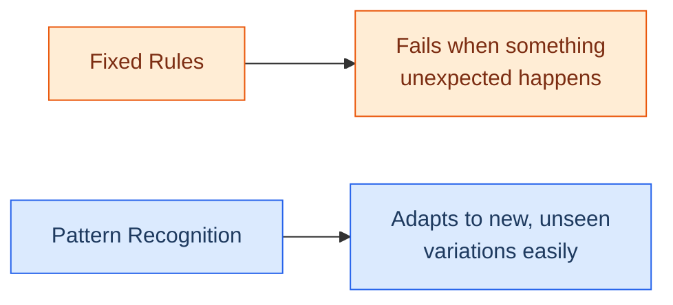

# How Machines Recognise Patterns

## Pattern Recognition 

## Learning Objectives

By the end of this topic, you will be able to:

- Explain what pattern recognition means in the context of AI.
- Understand how machines find hidden rules in data without being explicitly programmed.
- Identify everyday examples of pattern recognition in action.

## Overview

In the last topic, you learned to write precise specifications — telling a machine exactly what to do, step by step. But some of the most powerful AI systems today aren't told step-by-step rules at all. Instead, they are shown a huge number of examples and asked to find the **pattern** hiding inside them.
 
Think about how you learned to recognise a dog. Nobody gave you a checklist — "must have 4 legs, a tail, fur." Someone just pointed at different dogs over and over, and your brain figured out the pattern on its own. Machines learn in the exact same way.
 
**Pattern recognition** is the process by which a machine looks at many repeated examples and works out a general rule — without a human writing that rule down directly. Understanding this explains both where AI's abilities come from and where its limits are.

## 2.1 What is Pattern Recognition?

**What Is It?**
Pattern recognition is the process where a computer looks at raw data (like images, text, or numbers) and identifies repeated shapes, trends, or structures within it.

**Think of it like this:** Think about how Instagram Reels always seems to know 
exactly what kind of content to show you — without you ever telling it your preferences. 
It watched your behaviour across thousands of scrolls, found the pattern, and now 
predicts what you'll stop to watch next. Machines learn from data the exact same way — 
not from rules someone wrote, but from repeated examples they were shown.

## 2.2 How Machines Find the Rules

When engineers build AI, they do not manually type out the rules for every situation (because the real world is too messy for pure rules, as we saw in Week 1). 

Instead, the process looks like this:

1. **Provide Data:** Show the machine millions of examples (e.g., photos of cars and photos of bicycles).
2. **Find the Pattern:** The machine mathematically analyses the pixels. It notices that cars generally have a large rectangular shape and four circular shapes (wheels), while bicycles have a thin frame and two thin circular shapes.
3. **Create the Rule:** The machine builds its *own* internal rule based on these patterns.

**Example - Spam Emails**

- **Data:** You show the AI 10,000 spam emails and 10,000 normal emails.
- **Pattern:** The AI notices spam emails frequently use words like "FREE", "Winner", or contain suspicious links. It also notices normal emails use a conversational tone and natural greetings.
- **Result:** The AI learns the hidden rule of what makes an email "spammy" without a human having to write a list of banned words.

## 2.3 Everyday Examples of Pattern Recognition

You interact with machine pattern recognition constantly:

- **Face ID on your phone:** It recognises the pattern of your facial features.
- **Netflix Recommendations:** It finds a pattern in the types of movies you watch (e.g., "you always watch action movies on Friday nights") and recommends similar ones.
- **Medical Diagnosis:** AI scans hundreds of thousands of X-rays to find the tiny visual patterns that indicate a specific disease, often spotting things the human eye misses.

## 2.4 Why Patterns Beat Fixed Rules

If you write a rule that says a "chair" has four legs, the system will fail if it sees a modern office chair with one thick base. But if a machine uses **pattern recognition**, it understands the overall shape and visual context of a chair, allowing it to correctly identify a chair it has never seen before.

## 2.5 Why Data Quality Matters (Bad Data = Bad Patterns)

**What Is It?**
Because AI learns by finding patterns in the data you give it, the quality of that data is everything. If the data is flawed, the AI's "hidden rule" will be flawed too. This is often called **AI Bias**.

**Example:**
Imagine you want to train an AI to screen resumes and find the best engineers. You feed it 10 years of your company's past hiring data. 
However, for the past 10 years, your company mostly hired men from a specific university. 
- **The AI's Pattern:** It notices that the "successful" resumes belong to men from that university.
- **The Result:** The AI starts automatically rejecting brilliant women or people from other colleges, not because it is "evil," but because it found a biased pattern in the bad data you provided. 

**Rule of thumb:** An AI is only as smart (and as fair) as the data it learns from.

## 2.6 When Pattern Recognition Fails (Wrong Correlations)

**What Is It?**
Sometimes, machines find a pattern that is technically there, but completely meaningless in the real world. This happens when the AI confuses **correlation** (two things happening at the same time) with **causation** (one thing causing the other).

**Example:**
A famous real-world AI was trained to detect pictures of sheep. It did a great job! But engineers later realised it was not looking at the *sheep* at all. 
- In almost every training photo, the sheep were standing on **green grass**.
- The AI simply learned the pattern: *Lots of green pixels = Sheep*.
- When shown a picture of a sheep on a snowy mountain, it failed. It had found the wrong correlation.

When humans solve problems, we use common sense to know that grass does not *make* a sheep. AI does not have common sense — it only has patterns.

## Key Takeaway

- **Pattern recognition** is how machines learn from examples instead of fixed rules.
- Machines find **hidden rules in repeated data** by analysing thousands or millions of examples.
- This is the secret behind facial recognition, personalised recommendations, and self-driving cars.
- **Pattern recognition handles the messy real world** much better than strict, human-written rules.

**Interview tip:** If you are asked how AI differs from traditional software, explain that traditional software follows rules written by humans, while AI uses pattern recognition to find its own rules from data. This shows you understand the core mechanism of modern AI.
