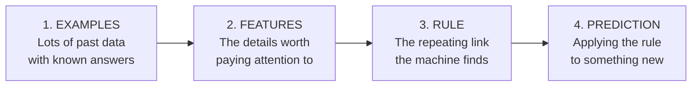
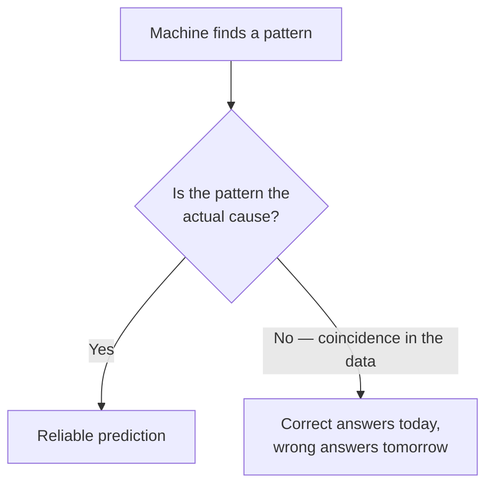

# Topic 2: How Machines Recognise Patterns

*(Covers: 2.4 Pattern recognition — how machines find rules in repeated data)*

---

## 1. Learning Objectives

By the end of this topic, you will be able to:

- Define a **pattern** and explain what makes data "repeated."
- Describe the four stages of **pattern recognition**: examples → features → rule → prediction.
- Explain the difference between a rule a **human writes** and a rule a **machine finds**.
- Identify two common ways pattern recognition goes wrong.

---

## 2. Overview

In Topic 1 you saw that computers follow steps to turn input into output. But where do the steps come from when nobody can write them down — like recognising a face, or a spam email?

The answer is **pattern recognition**: instead of being told the rule, the machine is shown many examples and works out the rule itself.

> **Definition:** **Pattern recognition** is the process of finding a repeating relationship in data and using it to make a decision about something new.

---

## 3. Description

### 3.1 What Is a Pattern?

A pattern is anything that **repeats in a predictable way**. You already recognise thousands of them without thinking.

- You know a family member's footsteps before you see them — because the sound repeats.
- You can tell a ripe banana from an unripe one — because colour and ripeness repeat together.
- You know a message is spam the moment you read *"Congratulations! You have won ₹10,00,000."* — because scam messages repeat the same style.

Nobody taught you a rule for any of these. You saw enough examples that the rule formed by itself. **A machine learns the same way.**

> **Key idea:** One example is a coincidence. Many examples is a pattern.

### 3.2 The Four Stages of Pattern Recognition

Every pattern-recognition system — from a spam filter to a face unlock to an LLM — moves through these four stages.

| Stage | What Happens | Ripe Mango Example |
|---|---|---|
| **Examples** | The machine is given many past cases where the answer is already known. | 5,000 photos of mangoes, each labelled *ripe* or *unripe*. |
| **Features** | It looks at specific measurable details. | Colour, size, presence of dark spots. |
| **Rule** | It notices which features go with which answer. | "Mostly yellow + a few dark spots → usually ripe." |
| **Prediction** | It applies that rule to a mango it has never seen. | New photo → "ripe, 88% confident." |

Notice stage 4 says *88% confident*, not *yes*. Pattern recognition produces a **likelihood**, which is exactly why AI systems are probabilistic rather than deterministic.

### 3.3 Finding the Rule in Repeated Data

Here is what "finding a rule in repeated data" actually looks like. Read the table and try to spot the rule yourself before reading on.

| Message | Contains "WINNER" | All CAPS | Unknown Sender | Verdict |
|---|---|---|---|---|
| 1 | Yes | Yes | Yes | Spam |
| 2 | No | No | No | Not spam |
| 3 | Yes | No | Yes | Spam |
| 4 | No | No | Yes | Not spam |
| 5 | Yes | Yes | Yes | Spam |

The rule that repeats: **"WINNER" + unknown sender → spam.** All caps appears sometimes, so it matters less.

You just did in five rows what a machine does across five million. It doesn't understand greed, scams, or money — it only counts which details keep appearing alongside which verdict.

### 3.4 Rules a Human Writes vs Rules a Machine Finds

| | **Human-Written Rule** | **Machine-Found Rule** |
|---|---|---|
| Comes from | A programmer's instruction | Examples in data |
| Example | "Block any email containing 'free'." | "These 40 features together suggest spam." |
| Handles new tricks | Poorly — needs a person to update it | Better — retrain on newer examples |
| Can be read and checked | Yes, easily | Often not, even by its builders |
| Fails when | The world changes | The examples were bad or biased |

> **Quick check:** A human-written rule is *told*. A machine-found rule is *learned*. Both can be wrong — but they go wrong for completely different reasons.

### 3.5 When Pattern Recognition Goes Wrong

Two failures cause the majority of real problems.

**1. The examples were unrepresentative.**
A system trained only on photos of mangoes indoors under yellow light may fail outdoors in sunlight. It didn't learn "ripe" — it learned "yellow-ish lighting."

**2. It found a pattern that isn't the real reason.**
A famous case: a system trained to tell huskies from wolves was actually detecting **snow in the background**, because most wolf photos happened to be snowy. It answered correctly on the test data for entirely the wrong reason.

> **Remember:** A machine cannot tell the difference between *"these things are related"* and *"these things happen to appear together in my examples."* Checking that difference is a human job.

---

## 4. Real World Application

- **UPI fraud detection:** Banks flag transactions matching patterns of past fraud — unusual hour, new device, unusual amount — rather than relying on a fixed list of rules a fraudster could learn to avoid.
- **Medical screening:** Systems trained on thousands of labelled X-rays flag possible abnormalities for a radiologist to confirm. The machine spots the pattern; the doctor makes the call.
- **UPI/QR and number plate scanning:** Toll booths read plates by recognising the repeated shapes of characters, not by storing every plate in the country.
- **Voice assistants:** "Hey Google" is recognised as a repeated sound pattern, which is why it sometimes triggers on a similar-sounding phrase.
- **Crop and pest detection:** Farming apps identify leaf diseases from photos, trained on labelled images of healthy and infected plants.
- **LLMs:** A model like Claude is pattern recognition at enormous scale — it learned which words tend to follow which, across a vast amount of text.

---

## 5. Worked Example

**Scenario:** Your college canteen wants to predict how many samosas to fry each morning.

**Stage 1 — Examples.** Sixty days of records: date, day of the week, weather, exam period yes/no, samosas sold.

**Stage 2 — Features.** Which details plausibly matter? Day of the week, rain, exam period. (Date itself is useless — it never repeats.)

**Stage 3 — Rule the system finds.**
- Mondays and Fridays sell roughly 30% more.
- Rainy days sell more.
- Exam weeks sell less, because students skip breaks.

**Stage 4 — Prediction.** A rainy Friday in a non-exam week → "expect about 240 samosas."

**Where it could go wrong:** if all sixty days fell in winter, the system never saw summer and never learned that sales drop in the heat. The rule is only as good as the examples behind it.

---

## 6. Key Takeaways

- **Pattern recognition** means finding a repeating relationship in data and using it to decide about something new.
- The four stages are **examples → features → rule → prediction**.
- A machine doesn't understand *why* — it counts which details keep appearing together.
- Machine-found rules handle change and complexity better than human-written rules, but are much harder to inspect.
- Predictions come with a **confidence level**, not a guarantee — this is the root of AI's probabilistic behaviour.
- The two big failure modes are **unrepresentative examples** and **coincidental patterns** (the snow, not the wolf).
- **Interview tip:** asked "why did the model get this wrong?", the strongest first question back is "what was it trained on?" — not "what's the bug?"

---

## 7. Reference Links

- [Google Machine Learning Crash Course — Introduction to ML](https://developers.google.com/machine-learning/crash-course/ml-intro) — clear beginner explanation of learning rules from data instead of writing them.
- [Teachable Machine](https://teachablemachine.withgoogle.com/) — train a working image or sound recogniser in your browser in five minutes, no coding required. Highly recommended as a hands-on activity for this topic.
- [Elements of AI — Chapter 4: Machine Learning](https://course.elementsofai.com/) — free non-technical course covering pattern recognition and its limits.
- ["Why Should I Trust You?" — Ribeiro, Singh & Guestrin (2016)](https://arxiv.org/abs/1602.04938) — the paper containing the husky-versus-wolf snow example; skim the figures only.
- [Google — Responsible AI Practices](https://ai.google/responsibility/responsible-ai-practices/) — practical guidance on unrepresentative training data and bias.
