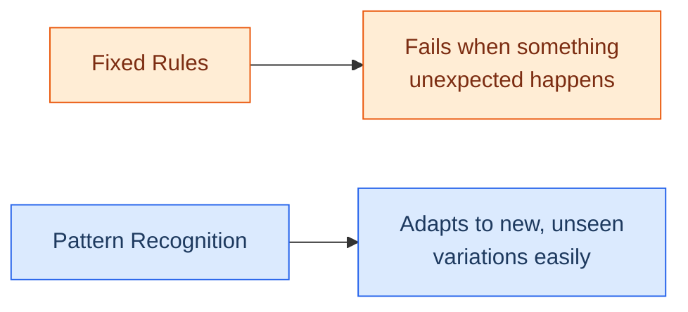

# How Machines Recognise Patterns

## Pattern Recognition 

## Learning Objectives

By the end of this topic, you will be able to:

- Explain what pattern recognition means in the context of AI.
- Understand how machines find hidden rules in data without being explicitly programmed.
- Identify everyday examples of pattern recognition in action.

## Overview

Instead of giving a machine exact rules to follow, modern AI learns by looking at thousands of examples and finding the hidden rules itself. This ability to spot recurring themes, shapes, or behaviours in data is called **pattern recognition**. It is the absolute foundation of how machines learn to "see", "hear", and "understand" the world around us.

## 2.1 What is Pattern Recognition?

**What Is It?**
Pattern recognition is the process where a computer looks at raw data (like images, text, or numbers) and identifies repeated shapes, trends, or structures within it.

**🍕 Think of it like this:** Imagine trying to teach a child what a "dog" is. You do not give them a measuring tape and a list of rules like "must have 4 legs, a tail, and fur". You just point to many different dogs. Eventually, the child's brain naturally figures out the "pattern" of a dog, even if they see a breed they have never encountered before. Machines do exactly the same thing.

## 2.2 How Machines Find the Rules

When engineers build AI, they do not manually type out the rules for every situation (because the real world is too messy for pure rules, as we saw in Week 1). 

Instead, the process looks like this:

1. **Provide Data:** Show the machine millions of examples (e.g., photos of cars and photos of bicycles).
2. **Find the Pattern:** The machine mathematically analyses the pixels. It notices that cars generally have a large rectangular shape and four circular shapes (wheels), while bicycles have a thin frame and two thin circular shapes.
3. **Create the Rule:** The machine builds its *own* internal rule based on these patterns.

**Example - Spam Emails**

- **Data:** You show the AI 10,000 spam emails and 10,000 normal emails.
- **Pattern:** The AI notices spam emails frequently use words like "FREE", "Winner", or contain suspicious links. It also notices normal emails use a conversational tone and natural greetings.
- **Result:** The AI learns the hidden rule of what makes an email "spammy" without a human having to write a list of banned words.

## 2.3 Everyday Examples of Pattern Recognition

You interact with machine pattern recognition constantly:

- **Face ID on your phone:** It recognises the pattern of your facial features.
- **Netflix Recommendations:** It finds a pattern in the types of movies you watch (e.g., "you always watch action movies on Friday nights") and recommends similar ones.
- **Medical Diagnosis:** AI scans hundreds of thousands of X-rays to find the tiny visual patterns that indicate a specific disease, often spotting things the human eye misses.

## 2.4 Why Patterns Beat Fixed Rules

If you write a rule that says a "chair" has four legs, the system will fail if it sees a modern office chair with one thick base. But if a machine uses **pattern recognition**, it understands the overall shape and visual context of a chair, allowing it to correctly identify a chair it has never seen before.

## Key Takeaway

- **Pattern recognition** is how machines learn from examples instead of fixed rules.
- Machines find **hidden rules in repeated data** by analysing thousands or millions of examples.
- This is the secret behind facial recognition, personalised recommendations, and self-driving cars.
- **Pattern recognition handles the messy real world** much better than strict, human-written rules.

**Interview tip:** If you are asked how AI differs from traditional software, explain that traditional software follows rules written by humans, while AI uses pattern recognition to find its own rules from data. This shows you understand the core mechanism of modern AI.
