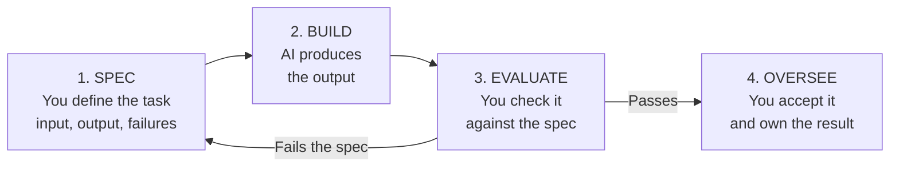
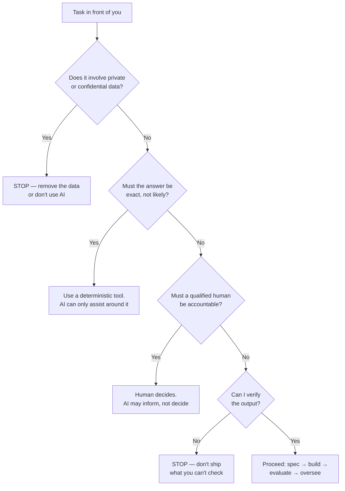

# Topic 3: The Professional Rules of AI Use

*(Covers: 2.5 The 70/30 rule — AI implements, you specify and verify · 2.6 When NOT to use AI — privacy, precision, legal accountability)*

---

## 1. Learning Objectives

By the end of this topic, you will be able to:

- Explain the **70/30 rule** and identify which parts of a task belong to you.
- Describe the four-step professional workflow: **spec → build → evaluate → oversee**.
- Verify AI output instead of accepting it because it sounds confident.
- Apply the three **stop tests** — privacy, precision, legal accountability — before using AI on a task.

---

## 2. Overview

You now know how to write a specification. This topic covers the other half of the job: **what you keep for yourself, and when you don't use AI at all.**

> **Definition:** The **70/30 rule** — AI does roughly 70% of the *doing*. You keep 30%: deciding what should be built, and checking that it was. That 30% carries 100% of the responsibility.

---

## 3. Description

### 3.1 The 70/30 Rule

Think of a head chef and a very fast kitchen assistant. The assistant can chop, fry and plate faster than anyone. But the chef decides the dish, and the chef tastes it before it leaves the kitchen. If the food is bad, nobody blames the assistant.

**That is your role with AI.**

| | **AI's 70% — Implementation** | **Your 30% — Direction & Judgement** |
|---|---|---|
| Does what | Drafts, writes code, summarises, generates options, reformats, repeats tedious work | Decides what's needed, writes the spec, checks the output, accepts or rejects it |
| Strength | Speed, volume, tirelessness | Context, standards, accountability |
| Can it be wrong? | Yes, confidently | Yes — but you'll be the one who has to answer for it |

> **Key idea:** The 30% is small in time and total in responsibility. It is also the part that cannot be automated away, which is exactly why it's the skill worth building.

### 3.2 The Professional Workflow

Notice the loop. When output fails, a beginner asks the AI to *"try again."* A professional goes back and **fixes the spec** — because a vague spec produces a vague result no matter how many times you retry.

### 3.3 What "Verify" Actually Means

Verification is not reading the output and feeling satisfied. It is four concrete checks.

| Check | Question | Example |
|---|---|---|
| **Against the spec** | Did it do every single thing I asked? | Word limit respected? Sorted correctly? |
| **Facts** | Are the names, numbers, dates and sources real? | Does that citation actually exist? |
| **Edge cases** | What happens with empty, extreme or odd input? | Zero pending assignments — what does it send? |
| **Ownership** | Am I willing to put my name on this? | If not, don't submit it. |

**The most common professional failure** is accepting output because it sounds fluent and assured. AI writes wrong answers in exactly the same confident tone as right ones — there is no wobble in its voice when it's guessing.

> **Golden rule:** If you cannot check it, you cannot use it.

### 3.4 When NOT to Use AI

Three stop tests. If any one applies, pause.

**1. Privacy — is this data yours to share?**
Never paste into a public AI tool: Aadhaar or PAN numbers, medical records, customer or student data, passwords and API keys, unreleased company information, or anything a person gave you in confidence. Under India's **Digital Personal Data Protection Act, 2023** — whose rules were notified in November 2025 and are commencing in phases — organisations carry legal duties over personal data they handle, and pasting it into an outside tool can breach those duties.

**2. Precision — is "probably right" the same as failure?**
AI is probabilistic. Some tasks demand a guaranteed answer:

- Financial totals, tax figures, interest calculations → use a calculator or spreadsheet formula.
- Medication doses, structural loads, safety limits → verified reference sources only.
- Legal citations, statute numbers, case law → check the primary source; AI can invent convincing fakes.

Use AI to *explain* or *draft around* these things. Don't use it as the source of the number.

**3. Legal accountability — must a qualified human own this decision?**
Some decisions carry legal or ethical weight that a machine cannot hold: medical diagnosis, legal advice, hiring and firing, academic work you submit as your own, contracts and signatures. AI has no licence, no liability and no conscience. **You cannot delegate accountability to a system that cannot be held accountable.**

> **Quick check:** The three stop tests in four words — **private, exact, accountable.** Add a fourth: **checkable.**

---

## 4. Real World Application

- **Hospitals:** AI drafts discharge summaries and flags possible findings in scans, but a doctor signs every diagnosis. The signature is the accountability.
- **Law firms:** AI summarises long contracts and speeds up research, but juniors are required to open and confirm every cited case — several lawyers worldwide have been sanctioned for filing AI-invented citations.
- **Banks:** AI drafts customer replies and detects fraud patterns; the actual balance and interest figures always come from the core banking system, never from a language model.
- **Software teams:** AI writes a large share of routine code, and human review before merging is mandatory. The reviewer, not the tool, is answerable for what ships.
- **Colleges:** Using AI to explain a concept or check your draft is learning. Submitting its output as your own work is misconduct — accountability for your submission is entirely yours.
- **HR:** AI can format job descriptions and organise applications; a human must make and be able to justify every hiring rejection, since automated decisions here carry legal exposure.

---

## 5. Worked Example

**Scenario:** Your internship supervisor asks you to produce a summary of feedback from 200 customers, with recommended actions.

**Applying the stop tests first:**

- *Private data?* Yes — the file has names and phone numbers. **Fix:** delete those columns; feed only the feedback text.
- *Exact answers needed?* Partly — the counts ("how many mentioned delivery delays") must be exact. **Fix:** count those in a spreadsheet, not by asking the AI.
- *Human accountability?* The recommendations go to management with your name on them, so yes — they stay yours.
- *Can I verify?* Yes, by spot-checking themes against the raw comments.

**Your 30% — the spec:**
> "From the attached anonymised feedback text, identify the top 5 recurring themes. For each theme, give a one-line description and quote 2 short supporting comments verbatim. Maximum 250 words. Do not invent themes not present in the text. If a theme appears fewer than 5 times, exclude it."

**AI's 70%:** produces the themed summary in seconds.

**Your 30% again — verification:** confirm each quote appears in the source file, check the counts against your spreadsheet, then write the recommendations yourself — because that's the part your supervisor is actually paying you for.

---

## 6. Key Takeaways

- The **70/30 rule**: AI implements; you specify and verify. Your 30% carries all the responsibility.
- The workflow is **spec → build → evaluate → oversee**, and failure sends you back to the *spec*, not to a retry button.
- **Verify** means checking against the spec, checking facts, testing edge cases, and being willing to put your name on it.
- Fluent and confident is not the same as correct — AI sounds identical whether it's right or guessing.
- Don't use AI when the data is **private**, the answer must be **exact**, a human must be **accountable**, or the output isn't **checkable**.
- AI cannot be held accountable, so accountability never transfers. It stays with you.
- **Interview tip:** asked "how do you use AI responsibly at work?", name the workflow and the stop tests. Answers like "I always double-check" sound like a habit; naming spec → build → evaluate → oversee sounds like a method.

---

## 7. Reference Links

- [Anthropic Usage Policy](https://www.anthropic.com/legal/aup) — the actual rules governing what you may and may not do with a commercial AI system.
- [The Digital Personal Data Protection Act, 2023 — official text (MeitY)](https://www.meity.gov.in/static/uploads/2024/06/2bf1f0e9f04e6fb4f8fef35e82c42aa5.pdf) — India's data protection law; skim the seven principles, especially purpose limitation and data minimisation.
- [MeitY — Digital Personal Data Protection Rules, 2025](https://www.meity.gov.in/static/uploads/2025/11/53450e6e5dc0bfa85ebd78686cadad39.pdf) — the rules that operationalise the Act, notified in November 2025.
- [NIST AI Risk Management Framework](https://www.nist.gov/itl/ai-risk-management-framework) — the international reference for deciding where human oversight is required.
- [EU AI Act Explorer](https://artificialintelligenceact.eu/) — see which uses are classified "high risk" and why they demand human accountability.
- [Anthropic — Reducing Hallucinations](https://docs.claude.com/en/docs/test-and-evaluate/strengthen-guardrails/reduce-hallucinations) — practical techniques for making output easier to verify.
