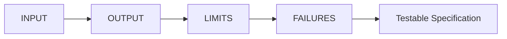
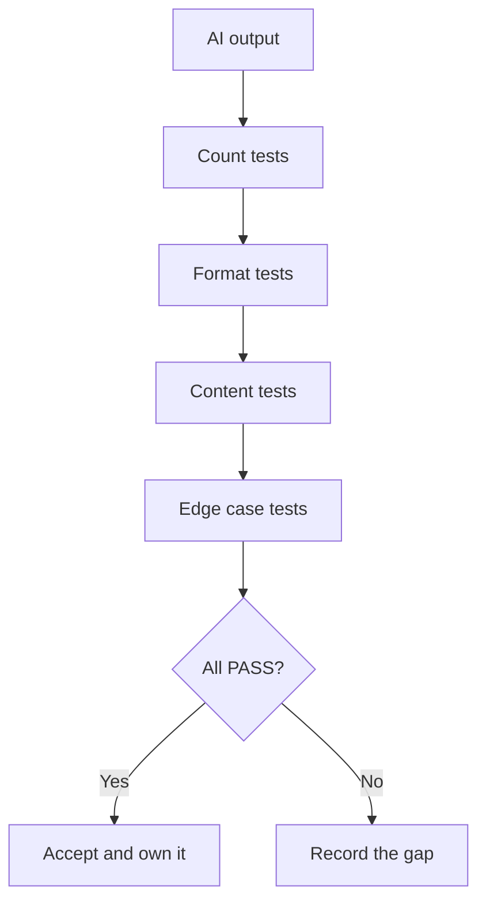
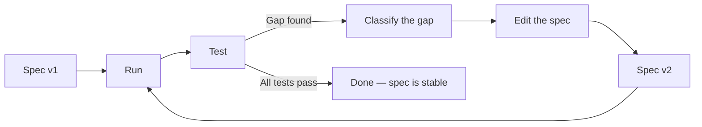

# Topic 4: Writing and Testing Specifications

*(Covers: 2.7 Writing specifications across five domains — health, transport, education, food, scheduling · 2.8 Testing a specification — how to verify the AI did exactly what you asked · 2.9 Iterating a specification based on output gaps)*

---

## 1. Learning Objectives

By the end of this topic, you will be able to:

- Write a complete specification for a task in **any** domain using a single reusable template.
- Convert a specification into a **test checklist** with one test per requirement.
- Judge AI output as **PASS or FAIL** against that checklist instead of by impression.
- Classify an **output gap** and fix the specification rather than retrying the prompt.

---

## 2. Overview

Topic 1 gave you the four traits. This topic is the practice: write specs, test them, repair them.

> **Definition:** A **spec cycle** is one full pass of *write → run → test → repair*. Professionals rarely get a spec right on attempt one; they get it right by attempt two or three, on purpose.

---

## 3. Description

### 3.1 One Template, Any Domain

Every specification, whatever the field, answers the same four questions.

| Slot | Question | Example fragment |
|---|---|---|
| **Input** | What does the system start with? | "A list of patient appointments" |
| **Output** | What exactly must come out? | "A plain-text reminder, under 40 words" |
| **Limits** | How long, how many, what scope? | "Max 40 words, English only" |
| **Failures** | What happens when something is wrong or missing? | "If phone number missing → skip and log it" |

#### Five Domains, Five Specifications

| Domain | Input | Expected Output | Failure Conditions |
|---|---|---|---|
| **Health** | Patient name, appointment date, time, doctor, phone number | SMS reminder under 40 words containing date, time and doctor's name, sent 24 hours before | Missing phone → skip and log; appointment already cancelled → send nothing; date in the past → do not send |
| **Transport** | Boarding stop, destination stop, current time | The next 3 buses with route number and departure time, soonest first | No bus in the next 90 minutes → say "no buses tonight, first bus at [time]"; unknown stop name → list the 3 closest matches |
| **Education** | Student's 500-word essay, plus a 4-point rubric | Exactly 3 improvement points, max 150 words total, each naming the rubric criterion it relates to | Essay under 100 words → return "too short to assess"; no rubric supplied → do not guess, request the rubric |
| **Food** | Ingredients available, number of people, cooking time limit | One recipe using only the listed ingredients, scaled to the number of people, within the time limit | Fewer than 3 ingredients → ask for more; no viable recipe → say so and name the one missing ingredient that would unlock it |
| **Scheduling** | 5 team members' free slots, meeting length, working hours | One slot where all 5 are free, inside working hours, stated with date and time | No common slot → propose the slot where the most can attend and name who cannot; multiple slots → pick the earliest |

Read down the "Failure Conditions" column. **That column is where beginners write nothing and professionals spend most of their thinking.**

> **Quick check:** A spec with a blank failure column is not a spec — it's a hope with formatting.

### 3.2 Testing a Specification

A specification you cannot turn into a checklist is not finished. **Rule: one requirement, one test.**

Take the education spec above and break it into tests:

| # | Requirement | Test | Result |
|---|---|---|---|
| 1 | Exactly 3 improvement points | Count them | ✅ PASS |
| 2 | Max 150 words | Word count = 138 | ✅ PASS |
| 3 | Each names a rubric criterion | Check all 3 | ❌ FAIL — point 2 names none |
| 4 | Short essay → "too short to assess" | Feed it 50 words | ✅ PASS |
| 5 | No rubric → requests the rubric | Run without rubric | ❌ FAIL — it invented a rubric |

**Four kinds of test, in the order that catches the most problems fastest:**

| Test type | What it checks | How |
|---|---|---|
| **Count** | Numbers and limits | Count words, items, sections |
| **Format** | Shape and structure | Is it plain text? Correct heading? Right order? |
| **Content** | Substance and truth | Are the facts, names and quotes real and from the source? |
| **Edge case** | Failure behaviour | Feed it empty, tiny, huge or invalid input |

Most people skip the edge cases because everything looked fine on the first, easy input. **Edge cases are where real systems break**, so test them before you accept anything.

### 3.3 Iterating on Output Gaps

An **output gap** is any difference between what the spec asked for and what came back. Every gap has a cause, and each cause has a different fix.

| Gap type | What you see | The real cause | The fix |
|---|---|---|---|
| **Missing requirement** | It did something you never mentioned, or omitted something you assumed | You never wrote it down | Add the rule explicitly |
| **Ambiguous wording** | Technically correct, but not what you meant | A word with more than one reading — *short*, *recent*, *simple*, *formal* | Replace with a number or a definition |
| **Unstated assumption** | It invented something (a rubric, a format, a fact) | You left a blank and it filled it | Say what to do when information is absent |
| **Conflicting instruction** | It obeyed one rule and broke another | Two requirements can't both hold | Remove one, or state which wins |

**The discipline:** when output fails, do not type *"try again"* or *"no, do it properly."* Find the gap type, then **edit the spec**. Retrying an ambiguous spec just buys you a different wrong answer.

#### Repairing the Education Spec

Two tests failed above. Here's the repair.

**v1:** *"Give 3 improvement points on this essay, max 150 words, based on the rubric."*

- Gap on test 3 — **missing requirement**: never said each point must *name* its criterion.
- Gap on test 5 — **unstated assumption**: never said what to do with no rubric, so it made one up.

**v2:** *"Give exactly 3 improvement points on this essay, 150 words maximum in total. Begin each point with the rubric criterion it relates to, in the format 'Criterion: [name] — [feedback]'. Use only the criteria in the supplied rubric. If no rubric is supplied, do not assess the essay; reply 'Rubric required.' If the essay is under 100 words, reply 'Too short to assess.'"*

Rerun all five tests. All pass. **The spec is now stable** — meaning it can be reused next week on a different essay and still work.

> **When do you stop iterating?** When every test passes on two different inputs, including one edge case. Not when the output merely looks good.

---

## 4. Real World Application

- **Hospital reminder systems:** a spec is tested against real edge cases — cancelled appointments, wrong numbers, patients with two bookings the same day — before a single message goes to a real patient.
- **Transport apps:** the "no buses tonight" case gets specified and tested precisely because it's the moment a user most needs a clear answer, not a blank screen.
- **Automated essay feedback:** rubric criteria are stated explicitly in the spec so that two hundred students get feedback of comparable structure and depth.
- **Food delivery:** substitution rules ("if the item is out of stock, offer the nearest match under the same price") are specified and tested, because the failure path happens hundreds of times a day.
- **Meeting schedulers:** the interesting spec work is entirely in the failure conditions — nobody free, someone on leave, clashing time zones.
- **Software teams generally:** engineers keep a small set of reusable test inputs and rerun them after every spec change, so a fix in one place doesn't quietly break another.

---

## 5. Worked Example

**Scenario:** Write a spec for an AI tool that proposes a weekly project meeting slot for your five-person team.

**Step 1 — Spec v1**
> "Look at the team's free times and suggest a good meeting slot."

**Step 2 — Run it.** Output: *"Tuesday evening looks good for most people."*

**Step 3 — Test it.**

| # | Requirement | Result |
|---|---|---|
| 1 | Names a specific date and time | ❌ FAIL — "Tuesday evening" |
| 2 | All 5 available | ❌ FAIL — "most people" |
| 3 | Inside working hours | ❌ FAIL — evening |
| 4 | Handles "no common slot" | ❌ Never specified |

**Step 4 — Classify the gaps.** *"Good"* and *"slot"* are **ambiguous**; the working-hours limit and the no-slot case are **missing requirements**; *"most people"* shows it filled a blank with an **unstated assumption**.

**Step 5 — Spec v2**
> "From the five availability lists provided, identify one 60-minute slot next week where all five members are free, between 9:00 AM and 6:00 PM, Monday to Friday. State the result as a single line: day, date, start time, end time. If more than one slot qualifies, choose the earliest. If no slot works for all five, state the slot with the highest attendance, the number attending, and the names of those who cannot attend. Do not suggest slots outside working hours."

**Step 6 — Retest.** Run it on the real availability data, then again on a deliberately impossible set where no slot works. All four tests pass on both. **Spec is stable — reuse it every week.**

Notice the total effort: two minutes of writing bought you a reusable tool. That is the return on the 30%.

---

## 6. Key Takeaways

- One template works in every domain: **input → output → limits → failures.**
- The **failure conditions** are the hard part and the valuable part. A blank failure column means an unfinished spec.
- **One requirement, one test.** If a requirement has no test, it isn't really a requirement.
- Test in this order: **count → format → content → edge case.** Skipping edge cases is how systems break in production.
- An **output gap** is a spec defect, not an AI defect. Classify it — missing, ambiguous, assumed, or conflicting — then edit the spec.
- Never answer a failed output with *"try again."* Retrying a vague spec produces a different wrong answer.
- A spec is **stable** when all tests pass on two different inputs including an edge case — that's when it becomes reusable.
- **Interview tip:** asked "how do you know the AI did what you wanted?", describe your checklist and your edge cases. "I read it and it looked right" is not verification.

---

## 7. Reference Links

- [Anthropic — Define Your Success Criteria](https://docs.claude.com/en/docs/test-and-evaluate/define-success) — how professionals turn "good output" into measurable criteria; the same discipline as this topic, one level up.
- [Anthropic — Build Evaluations and Test Cases](https://platform.claude.com/docs/en/test-and-evaluate/develop-tests) — building test sets, including the advice to always include edge cases.
- [Anthropic — Be Clear, Direct, and Detailed](https://docs.claude.com/en/docs/build-with-claude/prompt-engineering/be-clear-and-direct) — practical wording techniques for removing ambiguity from a spec.
- [Google — Testing Blog](https://testing.googleblog.com/) — how software teams think about test coverage and edge cases; browse for the accessible posts.
- [GeeksforGeeks — Boundary Value Analysis](https://www.geeksforgeeks.org/software-engineering/software-testing-boundary-value-analysis/) — the classic technique for choosing which edge cases to test.
