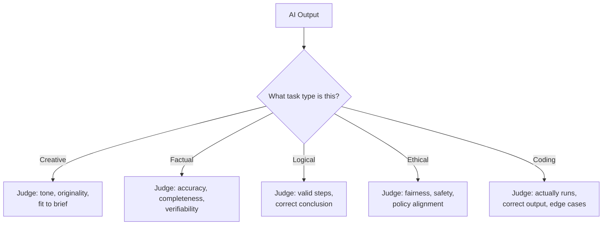
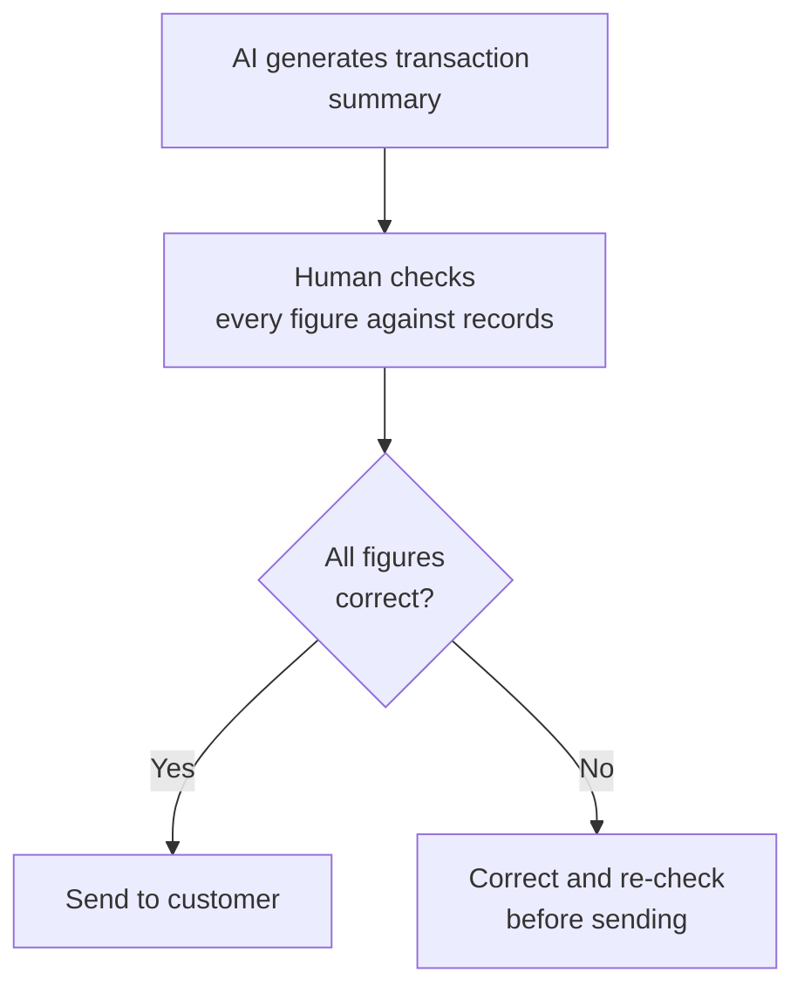
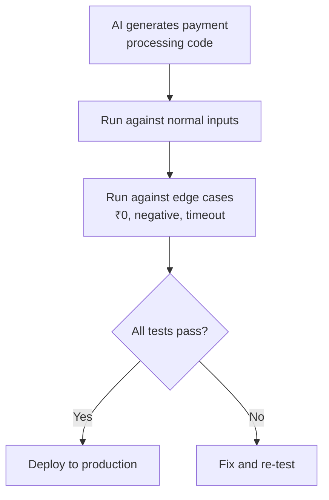
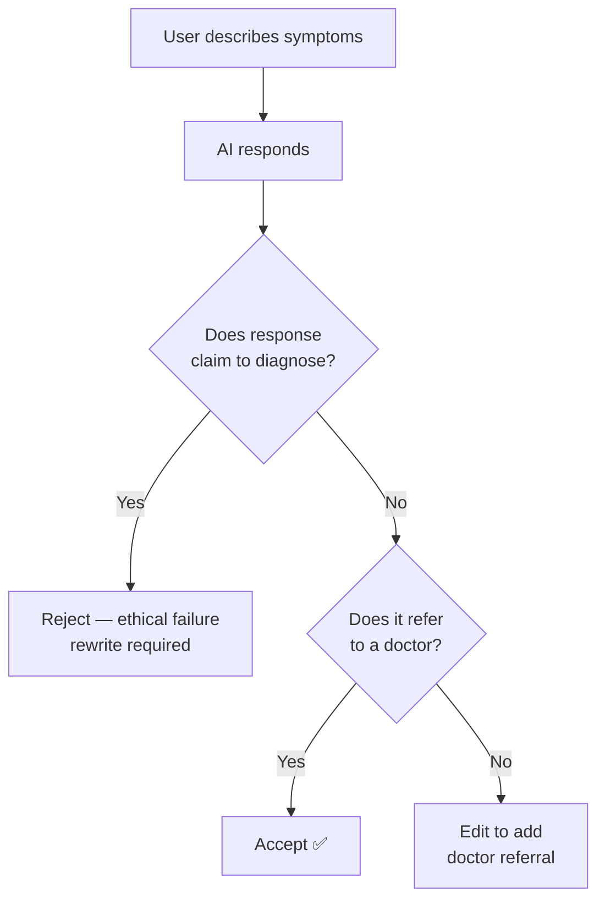

# Evaluating AI Output

*What AI Is — and Isn't — BTech Semester 1*

---

## Learning Objectives

By the end of this topic, you should be able to:

1. Identify which of the five task types a given AI request falls into — creative, factual, logical, ethical, coding
2. Describe the correct evaluation criteria for each task type
3. Tell the difference between "sounds good" and "is actually correct"
4. Apply a simple evaluation checklist to any AI output
5. Look at a sample AI response and identify specific strengths and weaknesses
6. Decide — with a reason — whether an AI output is acceptable to use, needs editing, or must be rejected

---

## Overview

You now know what AI is, how it works, and where its reliability is uneven. This topic gives you a **practical evaluation framework** — because "specify → build → verify" only works if you know *how* to verify.

Think about how you judge different things in college. You don't grade a creative writing assignment the same way you grade a maths problem. You don't evaluate a debate speech the same way you evaluate a coding assignment. Different tasks have different definitions of "correct." AI output works the same way.

A brilliantly written but factually wrong summary is a **failure** for a factual task — even though the same writing quality would be a success for a creative task. Matching the right evaluation lens to the right task type is a core everyday skill for anyone working with AI.

---

## The Five Task Types

AI tasks fall into five broad types. Each one has a completely different definition of "good."

| Task Type | Example | What "Good" Means |
|---|---|---|
| **Creative** | Write a Diwali sale tagline for Myntra | Engaging, fits the tone, original-feeling, matches the brief |
| **Factual** | What is the capital of Odisha? Summarise this document | Accurate, verifiable, nothing important added or missing |
| **Logical** | Explain step-by-step why this waitlist ticket will or won't confirm | Valid reasoning at every step, correct conclusion |
| **Ethical** | Write a response to an angry customer complaint | Fair, safe, avoids blame, follows company policy |
| **Coding** | Write a function to calculate a student's average marks | Actually runs, correct output, handles edge cases |

---

## Evaluating Each Task Type

### Creative Tasks

Because there is no single "correct" output, evaluation is about **fit to brief** — not right vs wrong.

Ask yourself:
- Does the tone match what was requested — formal, casual, festive, professional?
- Is it original, or does it feel like a generic cliché?
- Does it stay within any given constraints — word limit, target audience, brand voice?

**Real example:**
You ask Claude to write 3 subject lines for a college canteen's new app launch. All three are different — that's not a problem, that's the point. You pick the one that fits best. You don't reject them because they're "not identical."

**Global example:**
Coca-Cola uses AI to generate hundreds of marketing copy variations for A/B testing across different markets. The evaluation is purely "does this resonate with the target audience in this region?" — not "is this factually correct?"

---

### Factual Tasks

This is where **hallucination** (from the previous topic) is the biggest risk. Every specific claim, number, name, or date should, in principle, be independently checkable against a trusted source.

Ask yourself:
- Is every specific claim verifiable against an official or trusted source?
- Is anything important left out?
- Has anything been added that wasn't in the original source?

> A factual answer that "sounds confident" is not evidence it is correct. Confidence and correctness are completely unrelated in LLM output.

**Real example — what not to do:**
A student asks Claude "how many states and union territories does India have?" and pastes the answer directly into their assignment without checking. India's administrative divisions have changed multiple times — the model's training data may be outdated. Always verify.

**Global example:**
The US lawyer who submitted AI-invented court cases (from the previous topic) made one core mistake: he treated a factual AI output as "verified" without checking. He paid the price in court.

---

### Logical Tasks

Evaluation here means tracing the reasoning **step by step** — not just checking the final answer.

Ask yourself:
- Does each step logically follow from the last?
- Is the final conclusion actually correct — or just confidently stated?
- Could the AI have arrived at the right answer through flawed reasoning — a "lucky guess"?

Both a correct answer via flawed reasoning, and a wrong answer via mostly sound steps, are red flags. You want **both** a correct conclusion **and** valid reasoning — especially since you may need to reuse or adapt that reasoning later.

**Real example:**
You ask Claude to explain why a student's CGPA will drop if they score below their current average in the next semester. Trace each step — don't just accept the conclusion because it "sounds right." A logical error in step 2 can produce a correct-looking final answer by coincidence.

**Global example:**
Google DeepMind's AlphaProof solved International Mathematical Olympiad problems in 2024 — but researchers still verify each proof step by step, because an AI can produce a conclusion that looks valid but contains a subtle logical gap.

---

### Ethical Tasks

This requires judgment about fairness, harm, and appropriateness. There is no single "correct" answer — but there are clearly wrong ones.

Ask yourself:
- Does it treat people fairly and without bias?
- Does it avoid causing harm or manipulating anyone?
- Does it follow the relevant company policy, law, or ethical guideline?
- Does it disclose what it should, and not disclose what it shouldn't?

**Real example:**
You ask an AI to draft a response to an angry customer who says their Swiggy order arrived 2 hours late. A bad AI response might blame the customer ("your address was unclear") without evidence. A good response acknowledges the issue, apologises, and offers a resolution — without making promises the company can't keep.

**Global example:**
Amazon's AI-based hiring tool was found to downgrade resumes from women because it was trained on historical hiring data that was male-dominated. No one caught the ethical problem until the damage was done — because no one applied an ethical evaluation lens to the output.

---

### Coding Tasks

"The code looks right" is **not** evaluation. Code must actually be **run** and tested against expected inputs and outputs — including edge cases.

Ask yourself:
- Does it actually run without errors?
- Does it produce the correct output for normal inputs?
- Does it handle edge cases — empty list, negative number, zero, very large input?
- Is it readable and reasonably efficient?

> Edge cases are where most real-world bugs live. An AI can write perfect code for the "happy path" and completely fail on an empty input or a boundary value.

**Real example:**
You ask Claude to write a Python function to calculate a student's average marks from a list. It looks clean and correct. But what happens if the list is empty? Does it crash? Does it return 0? Does it return an error message? You must test this — don't assume.

**Global example:**
GitHub Copilot (Microsoft/GitHub) writes code used by millions of developers globally. GitHub's own research found that Copilot-generated code contains security vulnerabilities in roughly 40% of cases when not reviewed — reinforcing that code must always be tested and reviewed, never accepted blindly.

---

## Best Practices

- Always identify the task type **before** judging output — this single habit prevents most beginner evaluation mistakes
- For factual and coding tasks, verification against an external source or a test run is **mandatory** — "it sounds right" is never sufficient
- For creative and ethical tasks, involve a human judgment call — there is no single objectively correct answer to check against
- When in doubt, ask: "What would failure look like for this specific task type?" — then check for exactly that

## Common Beginner Mistakes

- Judging a factual answer purely on how fluent and confident it sounds, rather than checking the actual facts
- Accepting logically flawed reasoning because the final answer happened to be correct
- Treating a creative brief as if it needed one single "correct" answer and rejecting good, on-brief creative variety
- Skipping actually running generated code, assuming it works because it reads cleanly

---

## Real World Applications

**Factual — Banking / FinTech**
An AI-generated monthly statement summary must be checked line by line against actual transaction records before being shown to a customer. Used by banks like HDFC and ICICI who are building AI-assisted customer communication tools.

**Coding — Payment processing feature**
AI-generated code for a payment feature must be run against test cases including edge cases — ₹0 payment, negative amount, timeout — before being trusted in production. Used by teams at Razorpay, PayU, and globally at Stripe.

**Ethical — Healthcare chatbot**
An AI health assistant must be evaluated for whether it appropriately refuses to give a definitive diagnosis and instead safely refers the user to a doctor. Used by healthcare platforms like Practo and globally by Ada Health.

---

## Worked Example — EdTech App

**Scenario:** An AI assistant for an Indian edtech app is asked to do four different things. Evaluate each using the correct lens.

| Request | Task Type | Evaluation Focus | Verdict |
|---|---|---|---|
| "Write a motivational message for students before their board exams" | Creative | Tone, engagement, appropriateness for teenagers | Accept if tone fits — minor edits for local relevance are fine |
| "How many states and union territories does India currently have?" | Factual | Accuracy — verify against current official source | Must be checked against the current official count before publishing — do not trust from model memory alone |
| "Explain step by step why a student's average drops if they score below their current average in the next test" | Logical | Trace each reasoning step, confirm the arithmetic is correct | Verify the arithmetic explicitly — check no step skips a logical justification |
| "Write Python code to calculate a student's average from a list of marks" | Coding | Actually run it with sample marks including an empty list | Test with normal inputs AND edge cases like empty list before accepting |

**How to use this framework for any AI output:**
1. Name the task type first
2. Apply only that type's evaluation lens
3. Decide — accept, edit, or reject — with a specific reason, not a vague impression

---

## Key Takeaways

- AI tasks fall into five types — **creative, factual, logical, ethical, coding** — each needing a completely different evaluation lens
- **Creative** — judge fit to brief, tone, and originality. No single correct answer.
- **Factual** — verify every specific claim against a trusted source. Confidence is not evidence of correctness.
- **Logical** — check the reasoning steps, not just the final answer. A correct answer can hide flawed reasoning.
- **Ethical** — judge fairness, safety, and policy alignment. There are no single correct answers, but there are clearly wrong ones.
- **Coding** — always actually run the code against test inputs including edge cases. Never accept code because it "looks right."
- The single most important habit: **identify the task type before you start evaluating**

> **Interview tip:** Naming the task type explicitly before evaluating — "this is a factual task, so I need to verify every specific claim against a trusted source" — demonstrates structured, professional judgment. Most freshers just say "I'd check if it's correct." You now know what "correct" actually means for each task type.
