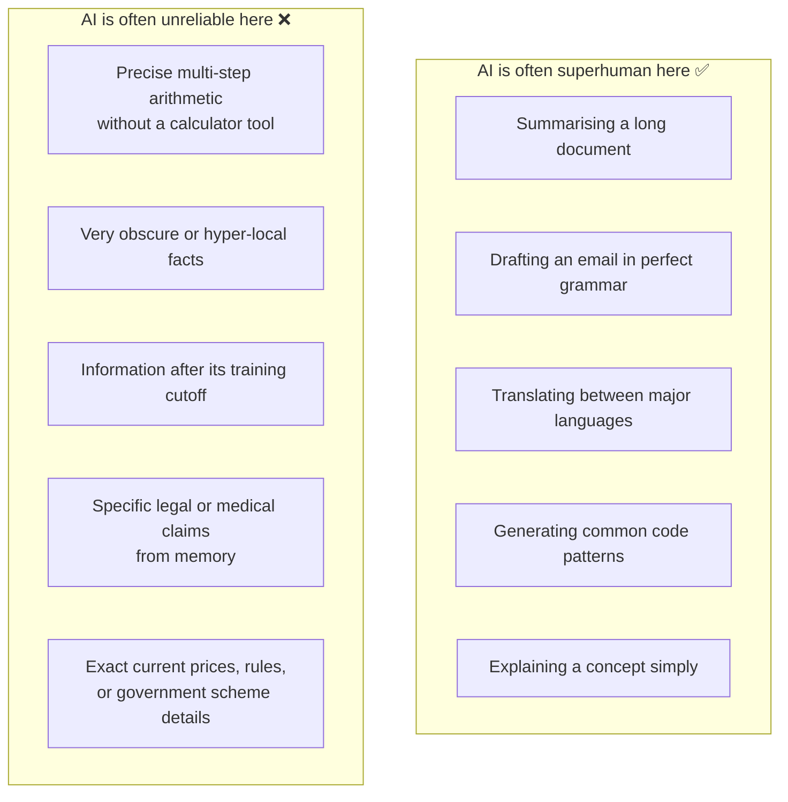
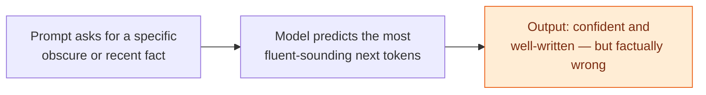
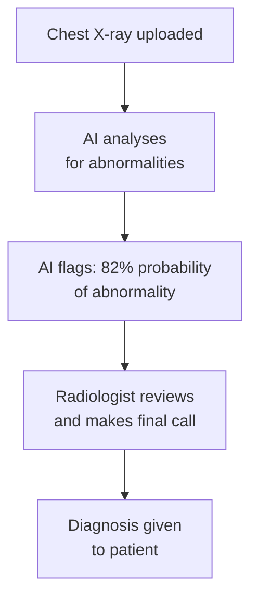
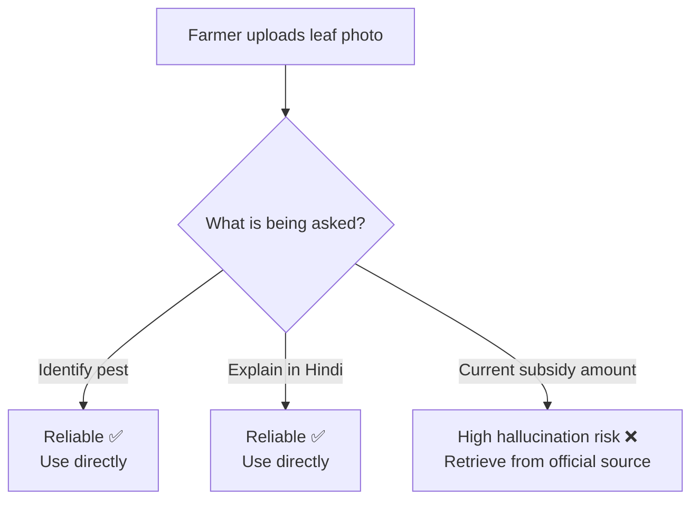
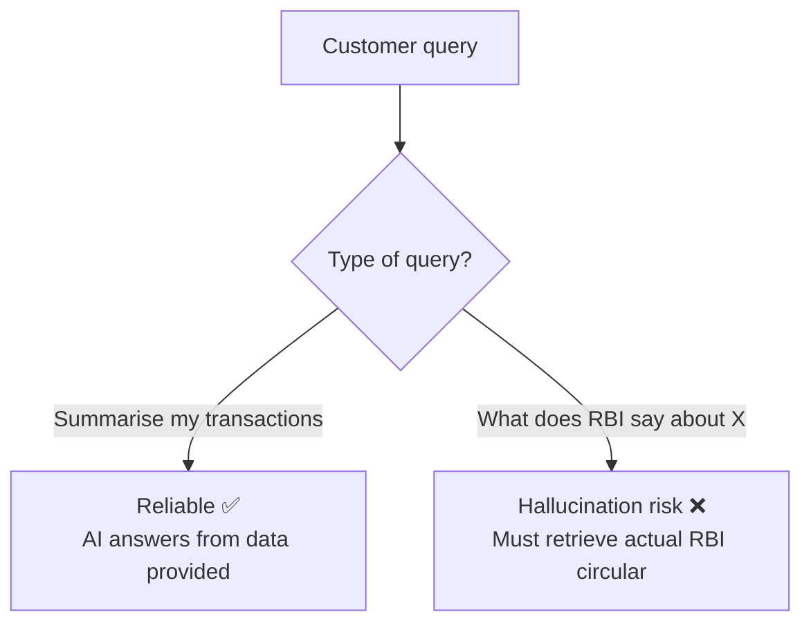

# AI in Context

*What AI Is — and Isn't — BTech Semester 1*

---

## Learning Objectives

By the end of this topic, you should be able to:

-Describe real examples of AI being used in Indian and global contexts — healthcare, agriculture, and language translation
-Explain the "jagged frontier" — why AI can be superhuman at some tasks and unreliable at others that seem equally hard
-Identify which tasks AI handles reliably vs which ones it struggles with
-Explain what hallucination is and why it happens
-Spot signs of hallucination in an AI output
-Decide what oversight steps are needed before trusting AI output in a high-stakes situation

---

## Overview

You now know what AI is historically and mechanically. This topic grounds that knowledge in **where AI actually stands today** — and introduces two ideas every AI engineer must internalise before writing a single line of specification:

- The **jagged frontier** — AI's uneven, unpredictable skill profile
- **Hallucination** — AI's tendency to confidently state wrong things

These two ideas are the practical heart of "AI implements, you specify and verify." If you assume AI is either "always right" or "always wrong," you will make poor engineering decisions. The real skill is knowing *where on the frontier* a given task sits — and knowing how to catch hallucinations before they cause real harm.

---

## AI in India and the World Today

AI is not just a Silicon Valley thing. It is already active in Indian fields, hospitals, farms, and government services. Here are three real areas where it's being used right now:

### Healthcare

AI tools are assisting doctors in reading X-rays, CT scans, and retinal images to flag possible signs of disease — tuberculosis, diabetic retinopathy, cancer — especially in areas with a shortage of specialist doctors.

These systems output a **probability** — "76% likelihood of an abnormality" — and are designed to support, not replace, a doctor's final decision.

**Global example:** Google's DeepMind developed an AI that detects over 50 eye diseases from retinal scans with accuracy matching world-leading specialists. It is now being tested in Indian hospitals to address the shortage of ophthalmologists in rural areas.

**Indian example:** Qure.ai (Mumbai-based) built an AI that reads chest X-rays to flag tuberculosis — deployed across government hospitals in India, detecting TB faster than manual review.

### Agriculture

Farmers photograph a crop leaf using a basic smartphone, and an AI image model identifies likely pest or disease patterns and suggests next steps. This would be impossible to encode as hand-written rules — the visual variation across real crop diseases is far too large.

**Indian example:** The Plantix app — used by over 10 million farmers globally, including millions in India — identifies crop diseases from a photo and gives advice in local languages including Hindi, Telugu, and Kannada.

**Global example:** Microsoft's FarmBeats project uses AI and sensors to help small farmers in the US, India, and Kenya optimise irrigation and detect crop stress before it becomes visible to the human eye.

### Vernacular Translation

India has 22 officially recognised languages and hundreds of dialects. LLM-based translation tools are dramatically improving access to information — translating government health advisories, scheme eligibility details, and educational material into regional languages in a way that captures meaning and tone, not just word-for-word substitution.

**Indian example:** AI4Bharat (IIT Madras) built open-source language models for Indian languages — helping translate government communications into Tamil, Bengali, Marathi, and more.

**Global example:** Google Translate now uses LLM-based translation for over 100 languages. The quality jump from the old word-substitution approach to the new LLM approach is dramatic — especially for complex sentences and idioms.

> In every one of these examples, the AI system is best understood as a fast, tireless **assistant that proposes** — while a qualified human remains responsible for the final decision.

---

## The Jagged Frontier

The **jagged frontier** describes the fact that AI capability is not evenly spread across all tasks. AI can be superhuman at some tasks while being surprisingly unreliable at others that seem, to a human, equally or even less difficult.

**Why this happens:**
An LLM's skill on any task depends on how much relevant pattern it saw during training, and how well the task fits the "predict likely next token" mechanism. Tasks with huge amounts of high-quality training examples tend to be handled extremely well. Tasks requiring precise exact calculation, very obscure local knowledge, or genuinely novel reasoning tend to be far less reliable — even though a human might find them equally easy or hard.

**Three things to know about the jagged frontier:**

- The frontier is **jagged, not smooth** — a task's apparent human difficulty is a poor predictor of AI reliability on it. Don't assume.
- The frontier **shifts over time** — a task unreliable in one model generation can become reliable in the next. Always test for the specific model version you're using.
- The frontier can be **shifted by setup** — giving an AI a calculator tool or retrieved documents can convert an "unreliable" task into a reliable one.

**Real example — the calculator problem:**

Ask Claude "what is 1,847 × 293?" and it might get it wrong — not because it's "bad" at maths, but because multi-step precise arithmetic is not well-suited to the next-token prediction mechanism. Give the same Claude a calculator tool, and it gets the right answer every time. Same model, very different reliability — just from changing the setup.

**Global example — GPT-4 bar exam:**
GPT-4 scored in the top 10% of human test-takers on the US Bar Exam (extremely complex legal reasoning). Yet the same model can fail at simple spatial puzzles a 5-year-old would solve easily. That is the jagged frontier in action.

### Common Beginner Mistakes

- Assuming that because AI is excellent at one task (writing fluent English), it must be excellent at a superficially similar task (stating exact legal clauses from memory)
- Treating "the AI got this one right" as proof of general reliability — one correct answer is not evidence of consistent reliability

---

## Hallucination — What It Is and Why It Happens

**Hallucination** is when an AI model produces information that sounds fluent, confident, and plausible — but is factually incorrect, fabricated, or not supported by any real source.

**Why it happens:**
An LLM generates text by predicting the statistically most likely next token — it does not have a built-in fact-checking mechanism or a live connection to "truth." If asked about something the model saw little or nothing about during training, it can still confidently generate fluent, plausible-sounding text — because **"sounding plausible" is exactly what it was trained to do well** — even when the underlying facts are wrong.

**Simple analogy:**
Imagine a very well-read, fluent student asked an exam question about a topic they never actually studied. Instead of saying "I don't know," they write a well-structured, confident-sounding answer using general patterns of what a "good answer" usually looks like — the writing sounds convincing, but the specific facts are invented. That is exactly what hallucination looks like in an LLM.

**When hallucination risk is highest:**
- Very specific facts, statistics, or numbers
- Citations and references — AI will confidently invent a paper title, author, and journal that don't exist
- Recent events after the model's training cutoff date
- Highly niche or local knowledge — obscure government scheme rules, local court judgements, regional agricultural data
- Exact prices, dates, and policy details that change frequently

**When hallucination risk is lower:**
- Explaining general concepts that are well-represented in training data
- Summarising a document you provide directly in the prompt
- Writing, editing, or reformatting text
- Generating code for common, well-documented patterns

**Real examples of hallucination:**

- **Global:** A US lawyer used ChatGPT to research case precedents. ChatGPT invented several court cases that never existed — complete with case names, judges, and rulings. The lawyer submitted them to court. He was fined and nearly disbarred.
- **Indian context:** An AI asked "What is the current PM Kisan instalment amount and eligibility?" from memory might give a confident answer — but the exact amounts and eligibility rules change with each government notification. This must be retrieved from the actual official source, not answered from model memory.

**How to reduce hallucination — RAG:**
RAG (Retrieval-Augmented Generation) reduces hallucination by grounding answers in real retrieved documents — the model answers from actual current documents instead of only from memory. You will study RAG in full detail later in this program.

### Best Practices

- Always verify AI-generated facts, statistics, names, dates, and citations against a trusted source before using them in any real decision
- Ask the AI to cite where information came from — and treat unverifiable claims with extra caution
- For any task requiring precise, current, or local facts — use RAG or tool-based retrieval, not model memory alone

### Common Beginner Mistakes

- Assuming a confident, well-written tone means the content is accurate — tone and accuracy are completely unrelated in LLM output
- Using AI-generated statistics or citations directly in a report without independently verifying them
- Assuming hallucination only happens with weak or outdated models — even the most advanced 2026-era models hallucinate, especially on obscure or recent information

---

## Real World Applications

**Healthcare — Qure.ai, India**
AI flags "82% probability of pulmonary abnormality" on a chest X-ray — reliable as a fast triage assistant. Final diagnosis must remain with a qualified radiologist. A hallucinated or overconfident wrong call in healthcare has serious consequences for a real patient.

**Agriculture — Kisan helpline app**
Identifying pest from a leaf photo is reliable. Explaining what the pest does in Hindi is reliable. But stating the exact current government subsidy amount for treating it? High hallucination risk — subsidy amounts change with every government notification and must be retrieved from the actual official source.

**Banking / FinTech**
AI summarising your last 10 UPI transactions in plain language is reliable. The same AI inventing a specific RBI regulation clause from memory — rather than retrieving the real clause — is a hallucination risk that could mislead customers or create compliance issues.

---

## Worked Example — Kisan Helpline App

**Scenario:** A student is building an AI-powered assistant for a government farmer helpline app. Classify each feature by reliability and hallucination risk:

| Feature | Frontier Position | Hallucination Risk | Recommended Approach |
|---|---|---|---|
| Identify likely pest from an uploaded leaf photo | Reliable — strong image pattern recognition | Low-moderate | Use directly, flag "AI-assisted — confirm with local expert if uncertain" |
| Explain in Hindi what the identified pest does to the crop | Reliable — strong language and translation capability | Low | Use directly |
| State the exact current government subsidy amount for treating this pest | Unreliable if answered from memory | High — amounts change frequently and are highly specific | Must use RAG from the actual current government notification — not model memory |

**How to classify any AI feature:**
1. Is this the kind of task with huge amounts of matching training data — language, common patterns, image recognition? → Likely reliable
2. Does it require a precise, frequently changing, or highly specific local fact? → High hallucination risk — needs grounding via retrieval or a verified database

---

## Key Takeaways

- AI is already active across Indian and global healthcare, agriculture, and vernacular translation — usually as a fast assistant, never as the final decision-maker
- The **jagged frontier** means AI reliability does not follow human intuitions about easy vs hard — always test reliability for the specific task and model version you are using
- Task setup matters — pairing AI with tools or retrieved data can shift an unreliable task toward reliability
- **Hallucination** is confident, fluent, but factually wrong output — a structural consequence of next-token prediction without a built-in fact-checker, not an occasional bug
- Hallucination risk is highest for precise facts, statistics, citations, recent events, and niche or local knowledge
- **RAG** reduces hallucination by grounding answers in real retrieved documents — you will study this in depth later in this program
- Always verify AI-generated facts, numbers, and citations independently before using them in any real decision

> **Interview tip:** Describing hallucination as "a natural consequence of next-token prediction without a built-in fact-checker" — rather than "a glitch" or "a bug" — signals genuine understanding of how LLMs work. This framing immediately sets you apart from candidates who just say "AI sometimes makes mistakes."
