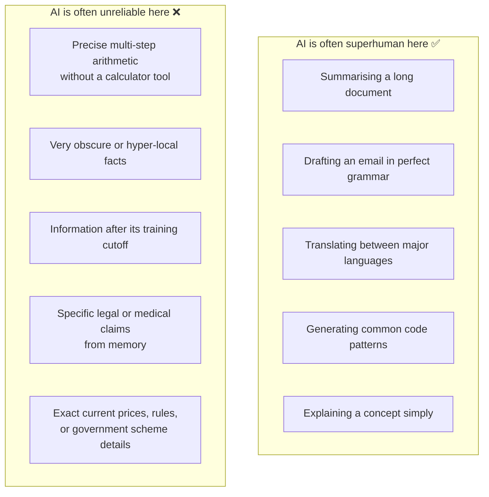
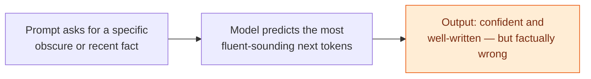

# AI in Context

*What AI Is*

---

## Learning Objectives

By the end of this topic, you should be able to:

- Describe real examples of AI being used in Indian and global contexts — healthcare, agriculture, and language translation
- Explain the "jagged frontier" — why AI can be superhuman at some tasks and unreliable at others that seem equally hard
- Identify which tasks AI handles reliably vs which ones it struggles with
- Explain what hallucination is and why it happens
- Spot signs of hallucination in an AI output
- Decide what oversight steps are needed before trusting AI output in a high-stakes situation

---

## Overview

You now know what AI is and how it works under the hood. This topic is about something even more important — **knowing when to trust AI and when not to.**
Two ideas will change how you work with AI forever:

- **The jagged frontier** — AI is not equally good at everything. It can be incredibly capable at some tasks and surprisingly bad at others that seem just as simple. The tricky part? It's hard to predict which is which just by looking at the task.
- **Hallucination** — AI can confidently give you a wrong answer. Not because it's broken, but because that's how it works. It doesn't know what it doesn't know — it just keeps generating text that sounds right.
  
Here's why this matters practically. If you assume AI is always right, you'll trust outputs you shouldn't. If you assume AI is always wrong, you'll throw away genuinely useful work. Neither extreme helps you. The real skill — the one that separates a good AI engineer from someone who just types into a chatbox — is knowing which tasks AI handles reliably and which ones need you to double-check the output carefully.

---

## AI Today

AI is not just a Silicon Valley thing.It is already active in hospitals, farms, factories, schools, and government services across the world — quietly running behind the features you use every single day. Here are three real areas where it's being used right now:

### Healthcare

AI tools are assisting doctors in reading X-rays, CT scans, and retinal images to flag possible signs of disease — tuberculosis, diabetic retinopathy, cancer — especially in areas with a shortage of specialist doctors.

These systems output a probability — "76% likelihood of an abnormality" — and are designed to support, not replace, a doctor's final decision.

**Real example:**
Google's DeepMind developed an AI that detects over 50 eye diseases from retinal scans with accuracy matching world-leading specialists — helping address the shortage of ophthalmologists in underserved areas globally.

### Agriculture

Farmers photograph a crop leaf using a basic smartphone, and an AI image model identifies likely pest or disease patterns and suggests next steps. This would be impossible to encode as hand-written rules — the visual variation across real crop diseases is far too large.

**Real example:**
The Plantix app identifies crop diseases from a single photo taken on a basic smartphone — used by over 10 million farmers globally, giving advice in local languages so farmers get actionable help instantly, without needing an expert on-site.

> In every one of these examples, the AI system is best understood as a fast, tireless **assistant that proposes** — while a qualified human remains responsible for the final decision.

---

## The Jagged Frontier

AI is not equally good at everything. It can be superhuman at some tasks and shockingly bad at others that seem just as simple — or even simpler.
This uneven, unpredictable skill profile is called the **jagged frontier**

Think of it like a classmate who scores 98 in English, 95 in History, but somehow fails Basic Maths. You wouldn't have predicted that from the outside. AI has the same kind of uneven ability — just in different areas.

**Why this happens:**
An LLM learns from patterns in its training data. If it has seen lots of similar examples, it usually performs well. If a task needs exact math, uncommon facts, or figuring out something completely new, it's more likely to make mistakes because it's predicting likely words, not thinking the way humans do.

**Three things to know about the jagged frontier:**

- **AI isn't reliable in a smooth way** A task that seems easy for a person might be hard for AI, while a difficult task might be easy. So don't assume—test it.
- **AI keeps improving** A task that one version of an AI struggles with may work well in a newer version. Always check the specific model you're using.
- **The right tools make a big difference** Giving AI tools like a calculator, internet search, or relevant documents can turn an unreliable task into a reliable one.

**Real example — the calculator problem:**

Ask Claude "what is 1,847 × 293?" and it might get it wrong — not because it's "bad" at maths, but because multi-step precise arithmetic is not well-suited to the next-token prediction mechanism. Give the same Claude a calculator tool, and it gets the right answer every time. Same model, very different reliability — just from changing the setup.

### Common Beginner Mistakes

- **Don't assume AI is good at similar tasks** Just because it writes excellent English doesn't mean it can accurately remember exact legal clauses or other precise facts.
- **One correct answer doesn't prove AI is reliable** If the AI gets a question right once, it doesn't mean it will always get similar questions right. Test it with multiple examples before trusting it.
---

## Hallucination — What It Is and Why It Happens

**Hallucination** happens when an AI gives an answer that sounds clear, confident, and believable—but the information is actually wrong, made up, or unsupported by real facts.

**Why it happens:**
An LLM works by predicting the most likely next word, not by checking whether something is true. It doesn't have a built-in fact-checker or always know the correct answer.

If you ask about something it hasn't seen much during training, it may still produce a fluent and convincing response because its job is to generate text that sounds likely—not to guarantee that it's accurate. As a result, it can sometimes invent facts while sounding very confident.

**Simple analogy:**
Imagine a very well-read, fluent student asked an exam question about a topic they never actually studied. Instead of saying "I don't know," they write a well-structured, confident-sounding answer using general patterns of what a "good answer" usually looks like — the writing sounds convincing, but the specific facts are invented. That is exactly what hallucination looks like in an LLM.

**When hallucination risk is highest:**
- Very specific facts, statistics, or numbers
- Citations and references — AI will confidently invent a paper title, author, and journal that don't exist
- Recent events after the model's training cutoff date
- Highly niche or local knowledge — obscure government scheme rules, local court judgements, regional agricultural data
- Exact prices, dates, and policy details that change frequently

**When hallucination risk is lower:**
- Explaining general concepts that are well-represented in training data
- Summarising a document you provide directly in the prompt
- Writing, editing, or reformatting text
- Generating code for common, well-documented patterns

**Real examples of hallucination:**

- * A US lawyer used ChatGPT to research case precedents. ChatGPT invented several court cases that never existed — complete with case names, judges, and rulings. The lawyer submitted them to court and was fined $5,000. [(Read the full story)](https://www.forbes.com/sites/mollybohannon/2023/06/08/lawyer-used-chatgpt-in-court-and-cited-fake-cases-a-judge-is-considering-sanctions/)

**How to reduce hallucination — RAG:**
RAG (Retrieval-Augmented Generation) reduces hallucination by grounding answers in real retrieved documents — the model answers from actual current documents instead of only from memory. You will study RAG in full detail later in this program.

### Best Practices

- Always verify AI-generated facts, statistics, names, dates, and citations against a trusted source before using them in any real decision
- Ask the AI to cite where information came from — and treat unverifiable claims with extra caution
- For any task requiring precise, current, or local facts — use RAG or tool-based retrieval, not model memory alone

### Common Beginner Mistakes

- Assuming a confident, well-written tone means the content is accurate — tone and accuracy are completely unrelated in LLM output
- Using AI-generated statistics or citations directly in a report without independently verifying them
- Assuming hallucination only happens with weak or outdated models — even the most advanced 2026-era models hallucinate, especially on obscure or recent information

---

## Real World Applications

**Customer support chatbot — any e-commerce platform**
Imagine an AI assistant for an online shopping app like Amazon, Flipkart, or Shopify. Three different things a customer might ask — three very different levels of reliability:

- **"Summarise my last 5 orders in plain language"** — Reliable. The AI is just reading and summarising data you've given it. Low hallucination risk. Use directly.
- **"What is your general return policy?"** — Mostly reliable — but verify the AI's answer matches the actual current policy before showing it to customers. Policies change.
- **"What is the exact refund amount I'll receive for this specific order under the current promotion?"** — High hallucination risk. Exact amounts, active promotions, and current rules change constantly. This must be retrieved from the actual live system — not answered from the AI's memory.

## Worked Example

**Scenario: You are building an AI assistant for an online food delivery app. Classify each feature:**

- Feature	Reliable?	Hallucination Risk	What to do
- Summarise a customer's order history in plain language	Yes	Low	Use directly
- Answer "what is your cancellation policy?"	Mostly	Medium — policies change	Retrieve from the actual current policy document
- State the exact discount amount for today's active promo code	No	High — changes daily	Must pull from live database — never from AI memory

**How to classify any AI feature — ask two questions:**

- Is this summarising, explaining, or writing based on information already provided? → Likely reliable
- Does this require a precise fact, current price, or rule that changes frequently? → High hallucination risk — retrieve from the actual source, don't trust AI memory

## Key Takeaways

- AI is already active across Indian and global healthcare, agriculture, and vernacular translation — usually as a fast assistant, never as the final decision-maker
- The **jagged frontier** means AI reliability does not follow human intuitions about easy vs hard — always test reliability for the specific task and model version you are using
- Task setup matters — pairing AI with tools or retrieved data can shift an unreliable task toward reliability
- **Hallucination** is confident, fluent, but factually wrong output — a structural consequence of next-token prediction without a built-in fact-checker, not an occasional bug
- Hallucination risk is highest for precise facts, statistics, citations, recent events, and niche or local knowledge
- **RAG** reduces hallucination by grounding answers in real retrieved documents — you will study this in depth later in this program
- Always verify AI-generated facts, numbers, and citations independently before using them in any real decision

> **Interview tip:** Describing hallucination as "a natural consequence of next-token prediction without a built-in fact-checker" — rather than "a glitch" or "a bug" — signals genuine understanding of how LLMs work. This framing immediately sets you apart from candidates who just say "AI sometimes makes mistakes."
