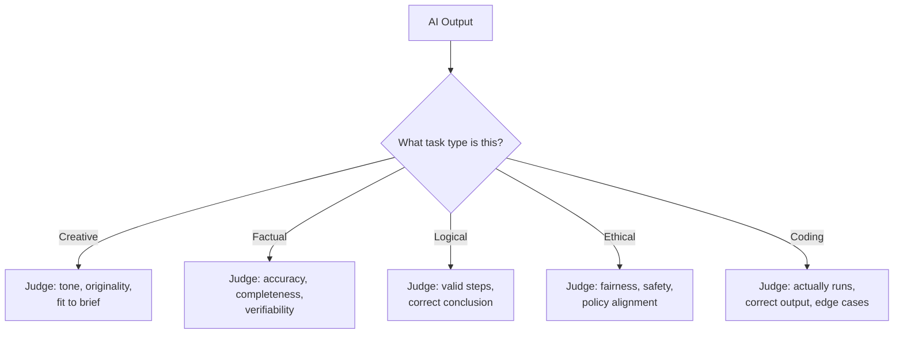
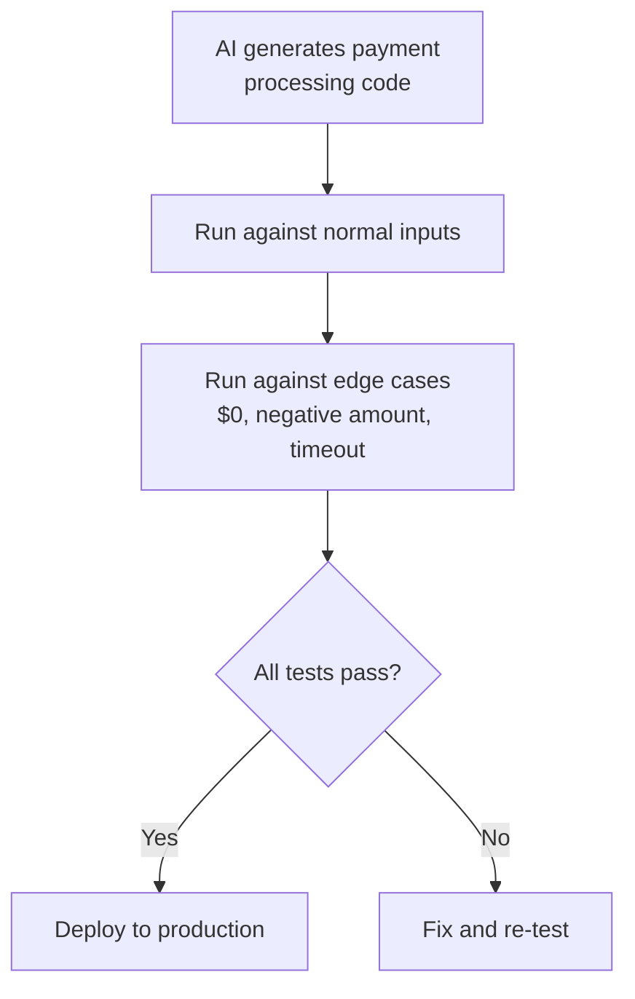

# Evaluating AI Output

*What AI Is*

---

## Learning Objectives

By the end of this topic, you should be able to:

- Identify which of the five task types a given AI request falls into — creative, factual, logical, ethical, coding
- Describe the correct evaluation criteria for each task type
- Tell the difference between "sounds good" and "is actually correct"
- Apply a simple evaluation checklist to any AI output
- Look at a sample AI response and identify specific strengths and weaknesses
- Decide — with a reason — whether an AI output is acceptable to use, needs editing, or must be rejected

---

## Overview

You now know what AI is, how it works, and where its reliability is uneven. This topic gives you a **practical evaluation framework** — because "specify → build → verify" only works if you know *how* to verify.

Think about how you judge different things in college. You don't grade a creative writing assignment the same way you grade a maths problem. You don't evaluate a debate speech the same way you evaluate a coding assignment. Different tasks have different definitions of "correct." AI output works the same way.

A brilliantly written but factually wrong summary is a **failure** for a factual task — even though the same writing quality would be a success for a creative task. Matching the right evaluation lens to the right task type is a core everyday skill for anyone working with AI.

---

## The Five Task Types

AI tasks fall into five broad types. Each one has a completely different definition of "good."

| Task Type | Example | What "Good" Means |
|---|---|---|
| **Creative** | Write a Black Friday sale tagline for Amazon | Engaging, fits the tone, original-feeling, matches the brief |
| **Factual** | What is the population of Brazil? Summarise this news article | Accurate, verifiable, nothing important added or missing |
| **Logical** | Explain step-by-step why this flight connection will or won't work given the layover time | Valid reasoning at every step, correct conclusion |
| **Ethical** | Write a response to an angry customer who received a damaged product | Fair, safe, avoids blame, follows company policy |
| **Coding** | Write a function to calculate the total price of items in a shopping cart | Actually runs, correct output, handles edge cases |

---

## Evaluating Each Task Type

### Creative Tasks

Because there is no single "correct" output, evaluation is about **fit to brief** — not right vs wrong.

Ask yourself:
- Does the tone match what was requested — formal, casual, festive, professional?
- Is it original, or does it feel like a generic cliché?
- Does it stay within any given constraints — word limit, target audience, brand voice?

**Example:**
You ask Claude to write 3 Black Friday sale taglines for Amazon. All three are different — that's not a problem, that's the point. You pick the one that resonates best with your target audience. You don't reject them because they're "not identical."

Coca-Cola uses AI to generate hundreds of marketing copy variations for A/B testing across different markets. The evaluation is purely "does this resonate with the target audience?" — not "is this factually correct?"

---

### Factual Tasks

This is where **hallucination** is the biggest risk. Every specific claim, number, name, or date should be independently checkable against a trusted source.

Ask yourself:
- Is every specific claim verifiable against an official or trusted source?
- Is anything important left out?
- Has anything been added that wasn't in the original source?

> A factual answer that "sounds confident" is not evidence it is correct. Confidence and correctness are completely unrelated in LLM output.

**Example:**
You ask Claude "what is the population of Brazil?" and paste the answer directly into your report without checking. Population figures change every year — the model's training data may be outdated. Always verify against an official current source like the World Bank or UN data.

The US lawyer who submitted AI-invented court cases made one core mistake: he treated a factual AI output as "verified" without checking. He paid the price in court.

---

### Logical Tasks

Evaluation here means tracing the reasoning **step by step** — not just checking the final answer.

Ask yourself:
- Does each step logically follow from the last?
- Is the final conclusion actually correct — or just confidently stated?
- Could the AI have arrived at the right answer through flawed reasoning — a "lucky guess"?

Both a correct answer via flawed reasoning, and a wrong answer via mostly sound steps, are red flags. You want **both** a correct conclusion **and** valid reasoning.

**Example:**
You ask Claude to explain step by step why a flight connection will or won't work given a 45-minute layover in a busy airport. Trace each step — don't just accept the conclusion because it "sounds right." A logical error in step 2 (ignoring terminal change time) can produce a wrong final answer that sounds perfectly reasonable.

Google DeepMind's AlphaProof solved International Mathematical Olympiad problems in 2024 — but researchers still verify each proof step by step, because an AI can produce a conclusion that looks valid but contains a subtle logical gap.

---

### Ethical Tasks

This requires judgment about fairness, harm, and appropriateness. There is no single "correct" answer — but there are clearly wrong ones.

Ask yourself:
- Does it treat people fairly and without bias?
- Does it avoid causing harm or manipulating anyone?
- Does it follow the relevant company policy, law, or ethical guideline?
- Does it disclose what it should, and not disclose what it shouldn't?

**Example:**
You ask an AI to draft a response to an angry customer who received a damaged product. A bad AI response might blame the customer ("the package was handled correctly on our end") without evidence. A good response acknowledges the issue, apologises, and offers a resolution — without making promises the company can't keep.

Amazon's AI-based hiring tool was found to downgrade resumes from women because it was trained on historical hiring data that was male-dominated. No one caught the ethical problem until the damage was done — because no one applied an ethical evaluation lens to the output.

---

### Coding Tasks

"The code looks right" is **not** evaluation. Code must actually be **run** and tested against expected inputs and outputs — including edge cases.

Ask yourself:
- Does it actually run without errors?
- Does it produce the correct output for normal inputs?
- Does it handle edge cases — empty list, negative number, zero, very large input?
- Is it readable and reasonably efficient?

> Edge cases are where most real-world bugs live. An AI can write perfect code for the "happy path" and completely fail on an empty input or a boundary value.

**Example:**
You ask Claude to write a function to calculate the total price of items in a shopping cart. It looks clean and correct. But what happens if the cart is empty? What if an item has a negative price due to a discount error? You must test these scenarios — don't assume.

GitHub Copilot writes code used by millions of developers globally. GitHub's own research found that Copilot-generated code contains security vulnerabilities in roughly 40% of cases when not reviewed — reinforcing that code must always be tested, never accepted blindly.

---

## Best Practices

- Always identify the task type **before** judging output — this single habit prevents most beginner evaluation mistakes
- For factual and coding tasks, verification against an external source or a test run is **mandatory** — "it sounds right" is never sufficient
- For creative and ethical tasks, involve a human judgment call — there is no single objectively correct answer to check against
- When in doubt, ask: "What would failure look like for this specific task type?" — then check for exactly that

## Common Beginner Mistakes

- Judging a factual answer purely on how fluent and confident it sounds, rather than checking the actual facts
- Accepting logically flawed reasoning because the final answer happened to be correct
- Treating a creative brief as if it needed one single "correct" answer and rejecting good, on-brief creative variety
- Skipping actually running generated code, assuming it works because it reads cleanly

---

## Real World Application

**Coding — Payment processing feature (Stripe, globally)**

AI-generated code for a payment feature must be run against test cases — including edge cases like a $0 payment, a negative amount, and a timeout — before being trusted in production.

Stripe — the global payments platform used by Amazon, Shopify, and millions of businesses — requires every piece of code, AI-generated or not, to pass a full test suite before deployment. An undetected bug in payment processing code can mean real money lost, real customers affected, and real compliance issues.

This is why "the code looks right" is never enough. You must run it. You must test the edge cases. You must verify the output.

---

## Worked Example

**Scenario:** An AI assistant for an e-commerce platform is asked to do four different things. Evaluate each using the correct lens.

| Request | Task Type | Evaluation Focus | Verdict |
|---|---|---|---|
| "Write a Black Friday sale tagline for our homepage banner" | Creative | Tone, engagement, fits the brief | Accept if tone fits — try a few variations and pick the best |
| "What is the population of Brazil?" | Factual | Accuracy — verify against current official source | Must be checked against a current official source before publishing |
| "Explain step by step why a flight connection works with a 45-minute layover" | Logical | Trace each reasoning step, confirm conclusion is correct | Verify each step explicitly — check no step skips a logical justification |
| "Write a function to calculate the total price of items in a shopping cart" | Coding | Actually run it with normal inputs and edge cases | Test with a normal cart AND edge cases like empty cart and negative price |

**How to use this framework for any AI output:**
1. Name the task type first
2. Apply only that type's evaluation lens
3. Decide — accept, edit, or reject — with a specific reason, not a vague impression

---

## Key Takeaways

- AI tasks fall into five types — **creative, factual, logical, ethical, coding** — each needing a completely different evaluation lens
- **Creative** — judge fit to brief, tone, and originality. No single correct answer
- **Factual** — verify every specific claim against a trusted source. Confidence is not evidence of correctness
- **Logical** — check the reasoning steps, not just the final answer. A correct answer can hide flawed reasoning
- **Ethical** — judge fairness, safety, and policy alignment. There are no single correct answers, but there are clearly wrong ones
- **Coding** — always actually run the code against test inputs including edge cases. Never accept code because it "looks right"
- The single most important habit: **identify the task type before you start evaluating**

> **Interview tip:** Naming the task type explicitly before evaluating — "this is a factual task, so I need to verify every specific claim against a trusted source" — demonstrates structured, professional judgment. Most freshers just say "I'd check if it's correct." You now know what "correct" actually means for each task type.
