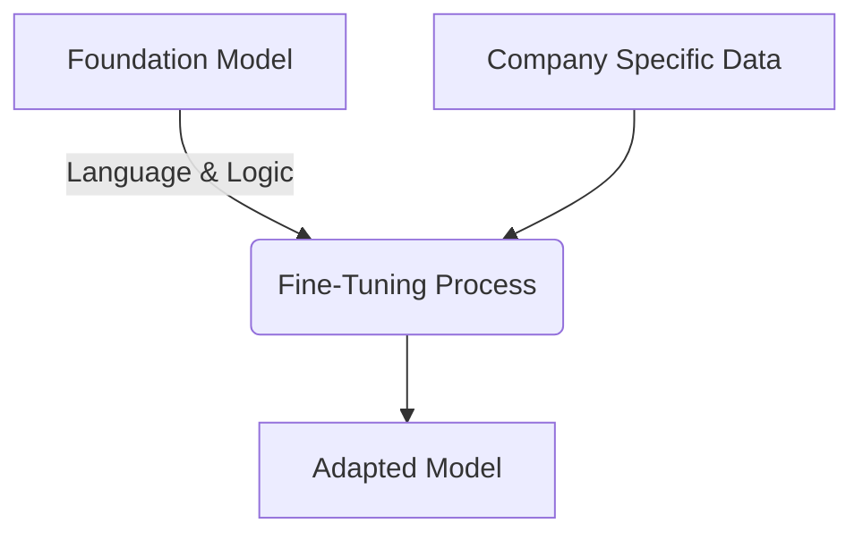

# Foundation Models and Adaptation

---

## Learning Objectives

By the end of this topic, you should be able to:

- Define what a Foundation Model is and explain why it is more practical than building a model from scratch.
- Describe the process of fine-tuning and when it is necessary.
- Tell the difference between pre-training (building a foundation) and fine-tuning (adapting the foundation).
- Understand the immense scale difference in cost, time, and data between pre-training and fine-tuning.

---

## Overview

Training a powerful AI model from scratch costs millions of dollars and requires 
massive amounts of data and computing power. Because of this, very few companies 
actually build AI models from the ground up.

Instead, the modern AI industry works on a "build once, adapt many times" approach. 
Large, general-purpose models called **Foundation Models** are built once — and then 
tweaked for specific jobs using a process called **Fine-tuning**.

Think of it like buying a house. Most people don't mix concrete, lay bricks, and build 
from scratch. They buy a pre-built house that already has walls, plumbing, and 
electricity — and then paint the walls, change the furniture, and make it their own.

- **Pre-training** = building the house from scratch — expensive, time-consuming, done 
  once by a few large organisations
- **Foundation Model** = the pre-built house — ready to move into, already has 
  everything you need to get started
- **Fine-tuning** = changing the house to suit your needs — faster, cheaper, and done 
  by anyone who wants a customised version
  
This is why the AI industry follows one simple idea: **build once, adapt many times.**

---

## Foundation Models — Trained Once at Scale

A **Foundation Model** is a large AI model that has been trained on a massive, broad dataset (like a huge chunk of the internet) so that it understands general language, reasoning, and world knowledge. It is designed to be highly versatile—meaning it can be used for many different tasks out of the box, even if it wasn't specifically trained for them.

The best way to picture it: imagine a fresh university graduate who studied a wide range of subjects for four years — literature, science, history, mathematics, coding. They didn't specialise in anything yet, but they can hold a conversation, write an essay, solve a problem, and pick up a new skill quickly. That is a Foundation Model — broadly educated, generally capable, ready to be trained further for a specific role.

**Key Characteristics:**
1. **The Pre-Training Phase:**  Before we use a Foundation Model, it goes through a process called **pre-training**.During pre-training, the model learns from a huge amount of data by repeatedly trying 
to predict what comes next. Do this billions of times across every topic imaginable and the model picks up patterns — not because anyone taught it these things directly, but 
because they naturally emerge from the sheer volume of text it processed.

    Over time, it learns:
- How language works — grammar, tone, structure
- How sentences are formed — in English, Hindi, code, and dozens of other languages
- How code is written — syntax, logic, common patterns across programming languages
- General knowledge and facts — history, science, current events, and more
  
2. **Zero-Shot Capabilities:** Because they have seen so much of the internet, they possess "zero-shot" abilities. This means they can successfully perform a task (like translating French to English) on their very first try, even if they were never explicitly programmed to be translation software.
3. **Examples:** GPT-4 (by OpenAI), Claude 3 (by Anthropic), Llama 3 (by Meta), and Gemini (by Google) are all foundation models.

**The Cost Barrier (Why we share models):**
Before foundation models, if a bank wanted an AI to detect fraudulent emails, they had to build and train an "email fraud model" from scratch. If they then wanted a chatbot for customer service, they had to build a second "customer service model" from scratch. 

Today, pre-training a cutting-edge foundation model requires clusters of tens of thousands of GPUs running for months, costing hundreds of millions of dollars, and consuming terabytes of raw data. Very few organizations can afford this. Instead, the industry shares a few massive Foundation Models and adapts them. 

---

## Fine-Tuning — Adapting to Your Domain

While a foundation model knows a little bit about everything, it might not know exactly how *your* specific business works. 

**For example**
- A foundation model knows what medicine is, but it doesn't know the specific internal billing codes your hospital uses.
- It knows how to write a polite email, but it doesn't know the exact tone your company's brand guidelines require.

To fix this, we use **Fine-Tuning**. 

Fine-tuning is the process of taking a pre-trained foundation model and giving it a smaller, highly specific set of examples (training data) to adapt its behavior for a particular domain or task. 

- **Pre-training** teaches the model *what the world is*.
- **Fine-tuning** teaches the model *how it should behave*.

### How it works:
Instead of teaching the model how to speak English (which it already knows from the foundation phase), you are just teaching it a specific skill by adjusting a small percentage of its parameters.

### Modern Fine-Tuning Techniques
To work with AI professionally, you should be familiar with two major breakthroughs in fine-tuning:
- **RLHF (Reinforcement Learning from Human Feedback):** A raw foundation model just wants to predict the next word; it doesn't care if the text is helpful or rude. RLHF is a fine-tuning step where humans rate the AI's answers, teaching the model to prefer helpful, safe, and polite responses. This is what turned raw LLMs into friendly chatbots like ChatGPT.
- **Parameter-Efficient Fine-Tuning (PEFT):** In the past, fine-tuning required adjusting all 100 billion parameters of a model, which was still very expensive. Modern techniques (like LoRA) allow engineers to "freeze" the main model and just plug in a tiny adapter of a few million parameters. This reduces the cost of fine-tuning from millions of dollars down to just a few dollars.

### How much does it cost compared to pre-training?
Think of it like this. Building a Foundation Model from scratch is like constructing 
an entire power plant — it costs hundreds of millions of dollars, takes months, and 
only a handful of organisations in the world can afford it. Fine-tuning is like 
plugging your appliance into that power plant's electricity — you get all the power 
you need, at a fraction of the cost, in a fraction of the time.

In real numbers:

- Pre-training GPT-3 cost an estimated **$4.6 million** in compute alone — and 
  today's frontier models cost far more
- Fine-tuning the same class of model can cost as little as **$10 to $100** on 
  platforms like OpenAI — and takes hours or days, not months

#### These figures come from two publicly available sources:
- **Lambda Labs** — a US-based cloud computing company that published a detailed 
  cost breakdown of training GPT-3
  
> 📎 [Lambda Labs — Cost of training GPT-3](https://lambdalabs.com/blog/demystifying-gpt-3)

- **OpenAI** — the company behind ChatGPT, which publicly lists its fine-tuning 
  prices on its official pricing page

> 📎 [OpenAI — Fine-tuning pricing](https://openai.com/pricing)

This is exactly why banks, hospitals, and FinTech companies don't build their own 
Foundation Models from scratch. Instead, they take an existing Foundation Model and 
fine-tune it on their own data — their transaction records, customer service logs, 
internal policies — to build an AI assistant that understands their specific business, 
at a cost they can actually afford.

This is "build once, adapt many times" in action — and it is how most real-world AI 
products are built today.

### What Fine-Tuning cannot do:
Fine-tuning is powerful — but it has limits students often assume it doesn't have:

- **It cannot update the model's knowledge cutoff** — if the Foundation Model was trained on data up to a certain date, fine-tuning cannot teach it about events after that date
- **It cannot give the model access to real-time information** — for that, you need retrieval tools (covered later in this program)
- **It cannot fix a fundamentally flawed Foundation Model** — fine-tuning improves behaviour, it does not rebuild the underlying model
### When to use Fine-Tuning vs Prompting

In previous modules, you learned about writing good specifications (prompts). So, if you want the AI to write in a certain way, should you just write a better spec, or should you fine-tune the model?

- **Use a good specification (Prompting):** When you only have a few rules or examples. If you want the AI to format an output as a bulleted list, just tell it to do that in the prompt. It is fast and free.
- **Use Retrieval-Augmented Generation (RAG):** (Covered in the next topic) When you need the AI to know new **facts**, like a company policy that was written yesterday.
- **Use Fine-tuning:** When you need to change the AI's **behavior, style, or structure**. For example, if you have 10,000 examples of perfect customer service emails and you want the model to permanently mimic that exact writing style without having to explain the rules in every single prompt.

**Summary:** 
You don't need to build the engine. You just need to know how to take the engine (Foundation Model) and tune it for your specific race (Fine-Tuning).

---

## Key Takeaways

- The AI industry follows a "build once, adapt many times" model because pre-training a model from scratch is too expensive and time-consuming for most organizations.
- Foundation Models are broadly capable models pre-trained on massive datasets to understand language and general knowledge.
- Fine-Tuning adapts an existing Foundation Model to a specific domain or task using a much smaller dataset, at a fraction of the cost of pre-training.
- Use Prompting for simple rules, RAG for factual knowledge updates, and Fine-Tuning for permanent behavior or style changes.
- Fine-Tuning cannot update a model's knowledge cutoff or grant real-time information access.

> **Interview tip:** When discussing model adaptation, emphasize that Fine-Tuning is for *behavior* and RAG is for *knowledge*. Many candidates confuse the two—knowing the difference shows you understand practical AI engineering.

---

## Further Reading & References

For more in-depth information on these topics, explore the following resources:

- [On the Opportunities and Risks of Foundation Models (Stanford CRFM)](https://crfm.stanford.edu/report.html) — The landmark paper that officially coined the term "Foundation Models".
- [RLHF: Reinforcement Learning from Human Feedback (Hugging Face)](https://huggingface.co/blog/rlhf) — An excellent technical breakdown of how RLHF is used to train polite and helpful AI.
- [PEFT and LoRA Explained (Hugging Face)](https://huggingface.co/blog/peft) — A clear guide on how Parameter-Efficient Fine-Tuning dramatically reduces the cost of adapting models.
