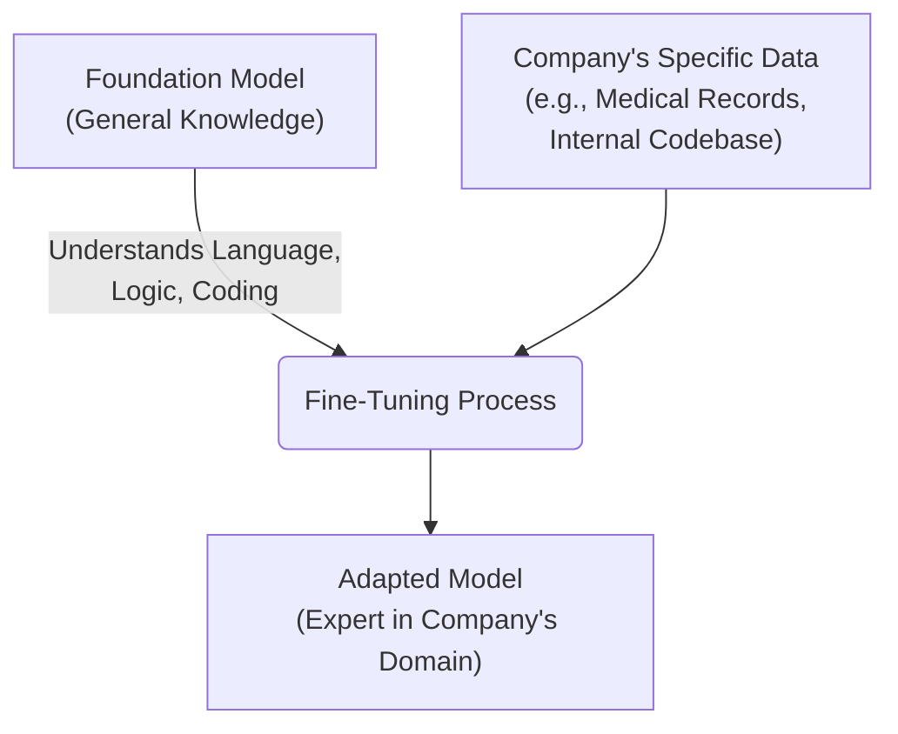

# 1. Foundation Models and Adaptation

---

## Learning Objectives

By the end of this topic, you should be able to:

- Define what a Foundation Model is and explain why it is more practical than building a model from scratch.
- Describe the process of fine-tuning and when it is necessary.
- Tell the difference between pre-training (building a foundation) and fine-tuning (adapting the foundation).

---

## Overview

In Week 3, you learned about training versus inference. You learned that training a powerful model costs millions of dollars and requires massive amounts of data and computing power. Because of this massive cost, very few companies actually build AI models from scratch. 

Instead, the modern AI industry relies on a "build once, adapt many times" approach. We create massive, general-purpose engines called **Foundation Models**, and then we tweak them for specific jobs using a process called **Fine-tuning**. 

Think of it like buying a house. Most people do not mix their own concrete, lay the bricks, and build a house from scratch (pre-training a model). Instead, they buy a pre-built house that already has walls, plumbing, and electricity (a Foundation Model). Then, they paint the walls, change the furniture, and adapt it to their specific taste (Fine-tuning).

---

## 4.1 Foundation Models — Trained Once at Scale

A **Foundation Model** is a large AI model that has been trained on a massive, broad dataset (like a huge chunk of the internet) so that it understands general language, reasoning, and world knowledge. It is designed to be highly versatile—meaning it can be used for many different tasks out of the box, even if it wasn't specifically trained for them.

**Key Characteristics:**
1. **Scale:** They are trained on enormous amounts of data using supercomputers (this is the expensive "Training" phase you learned about last week).
2. **Generality:** They are not built to do just one thing (like only playing chess or only detecting spam). They can translate, summarize, write code, and answer questions.
3. **Examples:** GPT-4 (by OpenAI), Claude 3 (by Anthropic), Llama 3 (by Meta), and Gemini (by Google) are all foundation models.

**Why they changed the industry:**
Before foundation models, if a bank wanted an AI to detect fraudulent emails, they had to build and train an "email fraud model" from scratch. If they then wanted a chatbot for customer service, they had to build a second "customer service model" from scratch. 
Today, the bank just takes a single Foundation Model and uses it for both tasks. 

---

## 4.2 Fine-Tuning — Adapting to Your Domain

While a foundation model knows a little bit about everything, it might not know exactly how *your* specific business works. 

For example, a foundation model knows what medicine is, but it doesn't know the specific internal billing codes your hospital uses. It knows how to write a polite email, but it doesn't know the exact tone your company's brand guidelines require.

To fix this, we use **Fine-Tuning**. 

Fine-tuning is the process of taking a pre-trained foundation model and giving it a smaller, highly specific set of examples (training data) to adapt its behavior for a particular domain or task.

### How it works:
Instead of teaching the model how to speak English (which it already knows from the foundation phase), you are just teaching it a specific skill. 

### When to use Fine-Tuning vs Prompting (Writing Specifications)

In Week 2, you learned about writing good specifications (prompts). So, if you want the AI to write in a certain way, should you just write a better spec, or should you fine-tune the model?

- **Use a good specification (Prompting):** When you only have a few rules or examples. If you want the AI to format an output as a bulleted list, just tell it to do that in the prompt. It is fast and free.
- **Use Fine-tuning:** When the style or knowledge you need is too complex to fit into a prompt, or when you have thousands of examples of "good" behavior that you want the model to learn permanently. 

**Summary:** 
You don't need to build the engine. You just need to know how to take the engine (Foundation Model) and tune it for your specific race (Fine-Tuning).
