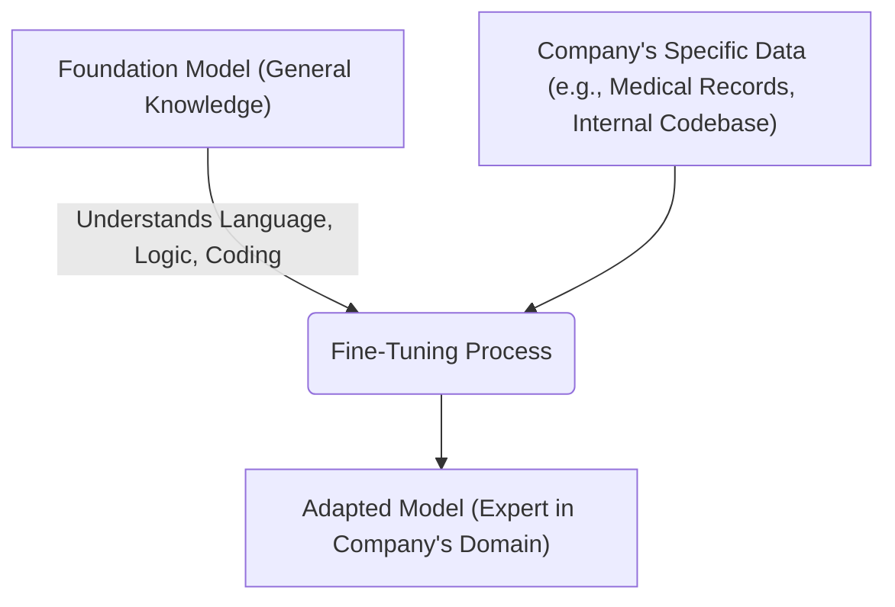

# 1. Foundation Models and Adaptation

---

## Learning Objectives

By the end of this topic, you should be able to:

- Define what a Foundation Model is and explain why it is more practical than building a model from scratch.
- Describe the process of fine-tuning and when it is necessary.
- Tell the difference between pre-training (building a foundation) and fine-tuning (adapting the foundation).
- Understand the immense scale difference in cost, time, and data between pre-training and fine-tuning.

---

## Overview

In Week 3, you learned about training versus inference. You learned that training a powerful model costs millions of dollars and requires massive amounts of data and computing power. Because of this massive cost, very few companies actually build AI models from scratch. 

Instead, the modern AI industry relies on a "build once, adapt many times" approach. We create massive, general-purpose engines called **Foundation Models**, and then we tweak them for specific jobs using a process called **Fine-tuning**. 

Think of it like buying a house. Most people do not mix their own concrete, lay the bricks, and build a house from scratch (pre-training a model). Instead, they buy a pre-built house that already has walls, plumbing, and electricity (a Foundation Model). Then, they paint the walls, change the furniture, and adapt it to their specific taste (Fine-tuning).

---

## 4.1 Foundation Models — Trained Once at Scale

A **Foundation Model** is a large AI model that has been trained on a massive, broad dataset (like a huge chunk of the internet) so that it understands general language, reasoning, and world knowledge. It is designed to be highly versatile—meaning it can be used for many different tasks out of the box, even if it wasn't specifically trained for them.

**Key Characteristics:**
1. **The Pre-Training Phase:** Foundation models gain their power through "pre-training." During this phase, they read trillions of words and learn by simply trying to predict the next word over and over. By doing this at a massive scale, they accidentally learn grammar, logic, coding syntax, and historical facts. 
2. **Zero-Shot Capabilities:** Because they have seen so much of the internet, they possess "zero-shot" abilities. This means they can successfully perform a task (like translating French to English) on their very first try, even if they were never explicitly programmed to be translation software.
3. **Examples:** GPT-4 (by OpenAI), Claude 3 (by Anthropic), Llama 3 (by Meta), and Gemini (by Google) are all foundation models.

**The Cost Barrier (Why we share models):**
Before foundation models, if a bank wanted an AI to detect fraudulent emails, they had to build and train an "email fraud model" from scratch. If they then wanted a chatbot for customer service, they had to build a second "customer service model" from scratch. 

Today, pre-training a cutting-edge foundation model requires clusters of tens of thousands of GPUs running for months, costing hundreds of millions of dollars, and consuming terabytes of raw data. Very few organizations can afford this. Instead, the industry shares a few massive Foundation Models and adapts them. 

---

## 4.2 Fine-Tuning — Adapting to Your Domain

While a foundation model knows a little bit about everything, it might not know exactly how *your* specific business works. 

For example, a foundation model knows what medicine is, but it doesn't know the specific internal billing codes your hospital uses. It knows how to write a polite email, but it doesn't know the exact tone your company's brand guidelines require.

To fix this, we use **Fine-Tuning**. 

Fine-tuning is the process of taking a pre-trained foundation model and giving it a smaller, highly specific set of examples (training data) to adapt its behavior for a particular domain or task. 

- **Pre-training** teaches the model *what the world is*.
- **Fine-tuning** teaches the model *how it should behave*.

### How it works:
Instead of teaching the model how to speak English (which it already knows from the foundation phase), you are just teaching it a specific skill by adjusting a small percentage of its parameters.

### Modern Fine-Tuning Techniques
To work with AI professionally, you should be familiar with two major breakthroughs in fine-tuning:
1. **RLHF (Reinforcement Learning from Human Feedback):** A raw foundation model just wants to predict the next word; it doesn't care if the text is helpful or rude. RLHF is a fine-tuning step where humans rate the AI's answers, teaching the model to prefer helpful, safe, and polite responses. This is what turned raw LLMs into friendly chatbots like ChatGPT.
2. **Parameter-Efficient Fine-Tuning (PEFT):** In the past, fine-tuning required adjusting all 100 billion parameters of a model, which was still very expensive. Modern techniques (like LoRA) allow engineers to "freeze" the main model and just plug in a tiny adapter of a few million parameters. This reduces the cost of fine-tuning from millions of dollars down to just a few dollars.

### When to use Fine-Tuning vs Prompting

In Week 2, you learned about writing good specifications (prompts). So, if you want the AI to write in a certain way, should you just write a better spec, or should you fine-tune the model?

- **Use a good specification (Prompting):** When you only have a few rules or examples. If you want the AI to format an output as a bulleted list, just tell it to do that in the prompt. It is fast and free.
- **Use Retrieval-Augmented Generation (RAG):** (Covered in the next topic) When you need the AI to know new **facts**, like a company policy that was written yesterday.
- **Use Fine-tuning:** When you need to change the AI's **behavior, style, or structure**. For example, if you have 10,000 examples of perfect customer service emails and you want the model to permanently mimic that exact writing style without having to explain the rules in every single prompt.

**Summary:** 
You don't need to build the engine. You just need to know how to take the engine (Foundation Model) and tune it for your specific race (Fine-Tuning).
