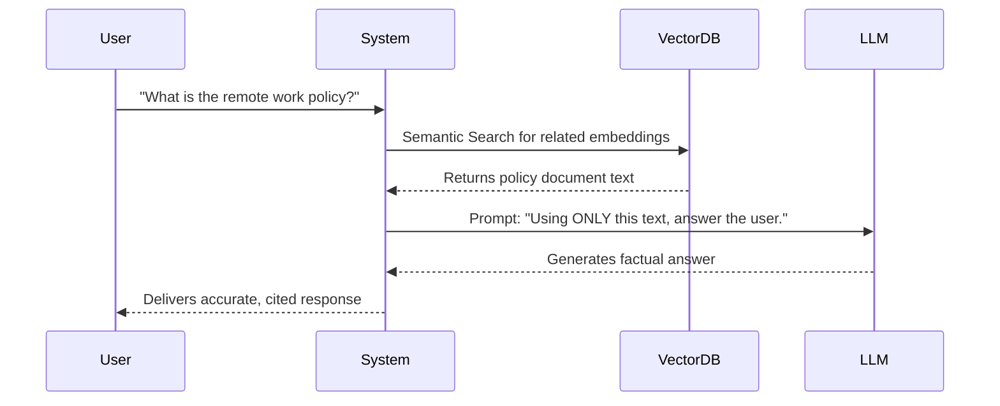

# 2. Retrieval, Agents, and Tools

---

## Learning Objectives

By the end of this topic, you should be able to:

- Explain how Retrieval-Augmented Generation (RAG) solves the problem of AI hallucinations using Vector Databases and Embeddings.
- Define what an AI Agent is, how it differs from a standard chatbot, and understand the "Reason and Act" (ReAct) loop.
- Describe the concept of Tool Use (Function Calling) and how AI generates structured data to interact with external software.

---

## Overview

A foundation model is powerful, but on its own, it has severe limitations: 
1. **It is frozen in time.** If a model was trained in 2023, it knows nothing about the events of 2024. 
2. **It cannot verify facts.** It predicts text based on patterns, which means it can confidently invent fake information (a "hallucination").
3. **It cannot take action.** A standard model can write code for a calculator, but it cannot actually *press the buttons* to do math.

To solve these problems, we don't just use the model by itself. We wrap it in a system. The modern AI stack uses **RAG**, **Tools**, and **Agents** to turn a static text-generator into a dynamic problem-solver.

---

## 4.3 Retrieval-Augmented Generation (RAG)

**Retrieval-Augmented Generation (RAG)** is a technique that gives the AI access to a private, external library of information at the exact moment you ask it a question.

If you ask an AI, "What is our company's policy on remote work for 2026?", the standard model will either guess or say "I don't know," because your company handbook wasn't on the public internet when the model was trained.

Here is how RAG solves this technically:
1. **Embeddings and Vector Databases:** Before you ever ask a question, your company's documents are chopped into small pieces and converted into arrays of numbers called **Embeddings**. These numbers represent the *meaning* of the text, and they are stored in a specialized **Vector Database**.
2. **Semantic Retrieval:** When you ask a question, your question is also turned into numbers. The system doesn't just look for exact keyword matches; it does a mathematical search to find the document pieces that share the closest *meaning* to your question.
3. **Augmentation:** Those relevant paragraphs are secretly pasted into the prompt alongside your question.
4. **Generation:** The AI reads those specific paragraphs and generates an accurate answer based *only* on the facts provided.

**Why RAG is crucial:** It grounds the AI in reality. Instead of relying on the AI's "memory" (its parameters), you force it to read a factual document like an open-book exam. This is currently the most reliable way to eliminate hallucinations in enterprise AI applications.

---

## 4.4 Agents — Adding Autonomy

Most people use AI as a simple chatbot: you type a prompt, it generates a reply, and it stops. 

An **Agent** is an AI system that is given a goal, and it can think, plan, and take multiple steps on its own to achieve that goal. 

An agent combines an LLM (the brain) with three critical components:
- **Memory:** Remembering what it has done so far (both short-term in the current session, and long-term across multiple days).
- **Tools:** The ability to execute actions (like searching the web or running a script).
- **A Planning Loop (ReAct):** The most common framework for agents is called **ReAct** (Reason and Act). The AI enters a cycle where it writes out a "Thought" (what it should do), takes an "Action" (using a tool), receives an "Observation" (the result of the tool), and repeats until the goal is met.

**Example of an Agent in action:**
*User Request:* "Research the top 3 competitors, summarize their pricing, and save a PDF."
*Agent Workflow:*
1. *Thought:* I need to find the top 3 competitors first. I will use the Web Search tool.
2. *Action:* Uses Web Search Tool for "top market competitors."
3. *Observation:* Reads the search results. Identifies Competitor A, B, and C.
4. *Thought:* Now I need to find their pricing. I will search Competitor A's pricing page.
5. *Action:* Uses Web Search Tool for "Competitor A pricing."
6. *(...Loop continues until all data is gathered...)*
7. *Final Action:* Uses Code Tool to generate a PDF document with the findings.
8. *Completion:* Hands the final PDF to the user.

Unlike a strict pipeline where step A always goes to step B, an agent is **autonomous**. If a search fails, it can decide on its own to rethink its plan and try a different search term.

---

## 4.5 Tool Use (Function Calling)

For an Agent to do anything other than talk, it needs **Tools**. 

Tool use (often called **Function Calling** in the industry) is when we give an AI the ability to trigger external software. 

**How it actually works under the hood:**
The LLM does not directly run code. Instead, the developer gives the LLM a list of "Tools" it is allowed to use, formatted as instructions. When the LLM decides it needs to use a tool, it generates a perfectly formatted JSON object containing the exact arguments needed for that tool. The developer's software intercepts that JSON, runs the actual code (like checking a real database), and feeds the text result back to the LLM.

**Common Tools for AI:**
- **Web Search:** To look up real-time information (solving the "frozen in time" problem).
- **Calculator/Python Runner:** LLMs are actually bad at math because they are text-predictors. If we give them a calculator tool, they can write the equation, send it to the tool, and read the perfect result back.
- **APIs:** We can give AI tools to send emails, query databases, or create calendar invites.

When you use a system that has Tools, the AI stops being just a writer and becomes a digital assistant that can actually *execute* work.
