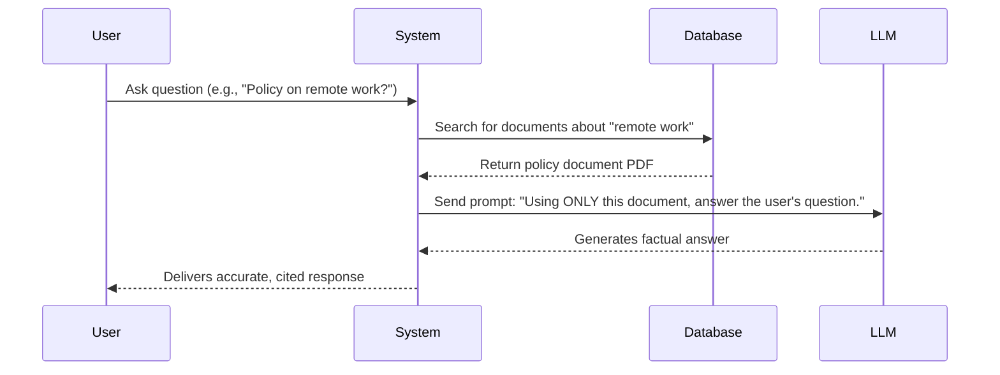

# 2. Retrieval, Agents, and Tools

---

## Learning Objectives

By the end of this topic, you should be able to:

- Explain how Retrieval-Augmented Generation (RAG) solves the problem of AI hallucinations and outdated knowledge.
- Define what an AI Agent is and how it differs from a standard chatbot.
- Describe the concept of Tool Use (Function Calling) and how it allows AI to interact with the real world.

---

## Overview

A foundation model is powerful, but on its own, it has severe limitations: 
1. **It is frozen in time.** If a model was trained in 2023, it knows nothing about the events of 2024. 
2. **It cannot verify facts.** It predicts text based on patterns, which means it can confidently invent fake information (a "hallucination").
3. **It cannot take action.** A standard model can write code for a calculator, but it cannot actually *press the buttons* to do math.

To solve these problems, we don't just use the model by itself. We wrap it in a system. The modern AI stack uses **RAG**, **Tools**, and **Agents** to turn a static text-generator into a dynamic problem-solver.

---

## 4.3 Retrieval-Augmented Generation (RAG)

**Retrieval-Augmented Generation (RAG)** is a technique that gives the AI access to a private, external library of information at the exact moment you ask it a question.

If you ask an AI, "What is our company's policy on remote work for 2026?", the standard model will either guess or say "I don't know," because your company handbook wasn't on the public internet when the model was trained.

Here is how RAG solves this:
1. **Retrieval:** Before the AI answers you, a search engine quickly scans your private documents to find the paragraphs relevant to your question.
2. **Augmentation:** Those relevant paragraphs are secretly pasted into the prompt alongside your question.
3. **Generation:** The AI reads those specific paragraphs and generates an accurate answer based *only* on the facts provided.

**Why RAG is crucial:** It grounds the AI in reality. Instead of relying on the AI's "memory" (its parameters), you force it to read a factual document like an open-book exam. 

---

## 4.4 Agents — Adding Autonomy

Most people use AI as a simple chatbot: you type a prompt, it generates a reply, and it stops. 

An **Agent** is an AI system that is given a goal, and it can think, plan, and take multiple steps on its own to achieve that goal. 

An agent combines an LLM (the brain) with three critical components:
- **Memory:** Remembering what it has done so far.
- **Tools:** The ability to execute actions (like searching the web or running a script).
- **A Planning Loop:** A cycle where the AI says, "Here is my goal -> Here is what I will do first -> Let me look at the result -> Now, what should I do next?"

**Example of an Agent in action:**
*User Request:* "Research the top 3 competitors in our market, summarize their pricing, and save the report as a PDF."
*Agent Workflow:*
1. *Plan:* I need to search the web, read websites, extract pricing, and create a file.
2. *Action 1:* Use Search Tool for Competitor A. (Reads result)
3. *Action 2:* Use Search Tool for Competitor B. (Reads result)
4. *Action 3:* Use Code Tool to generate a PDF document with the findings.
5. *Completion:* Hands the final PDF to the user.

---

## 4.5 Tool Use (Function Calling)

For an Agent to do anything other than talk, it needs **Tools**. 

Tool use (often called function calling) is when we give an AI the ability to trigger external software. We give the AI a list of instructions on how to use specific "tools", and the AI decides when it is appropriate to use them.

**Common Tools for AI:**
- **Web Search:** To look up real-time information (solving the "frozen in time" problem).
- **Calculator/Python Runner:** LLMs are actually bad at math because they are text-predictors. If we give them a calculator tool, they can write the equation, send it to the calculator, and read the perfect result back.
- **APIs:** We can give AI tools to send emails, query databases, or create calendar invites.

When you use a system that has Tools, the AI stops being just a writer and becomes a digital assistant that can actually *do* work.
