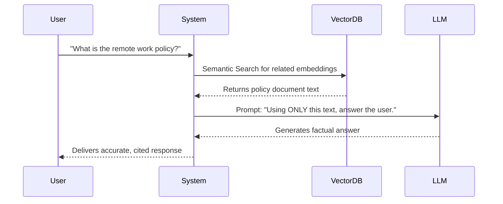
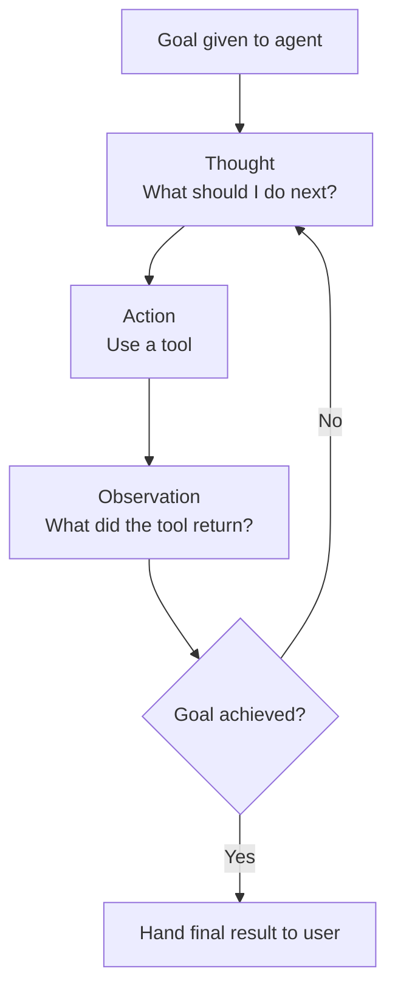

# Retrieval, Agents, and Tools

---

## Learning Objectives

By the end of this topic, you should be able to:

- Explain how Retrieval-Augmented Generation (RAG) solves the problem of AI hallucinations using Vector Databases and Embeddings.
- Define what an AI Agent is, how it differs from a standard chatbot, and understand the "Reason and Act" (ReAct) loop.
- Describe the concept of Tool Use (Function Calling) and how AI generates structured data to interact with external software.

---

## Overview

A foundation model is powerful, but on its own, it has severe limitations: 
- **It is frozen in time.** If a model was trained in 2023, it knows nothing about the events of 2024. 
- **It cannot verify facts.** It predicts text based on patterns, which means it can confidently invent fake information (a "hallucination").
- **It cannot take action.** A standard model can write code for a calculator, but it cannot actually *press the buttons* to do math.

To solve these problems, we don't just use the model by itself. We wrap it in a system. The modern AI stack uses **RAG**, **Tools**, and **Agents** to turn a static text-generator into a dynamic problem-solver.

---

## 4.3 Retrieval-Augmented Generation (RAG)

**Retrieval-Augmented Generation (RAG)** is a technique that gives the AI access to a private, external library of information at the exact moment you ask it a question.

If you ask an AI, "What is our company's policy on remote work for 2026?", the standard model will either guess or say "I don't know," because your company handbook wasn't on the public internet when the model was trained.

Here is how RAG solves this technically:
1. **Embeddings and Vector Databases:** Before you ever ask a question, your company's documents are chopped into small pieces and converted into arrays of numbers called **Embeddings**. These numbers represent the *meaning* of the text, and they are stored in a specialized **Vector Database**.
2. **Semantic Retrieval:** When you ask a question, your question is also turned into numbers. The system doesn't just look for exact keyword matches; it does a mathematical search to find the document pieces that share the closest *meaning* to your question.
3. **Augmentation:** Those relevant paragraphs are secretly pasted into the prompt alongside your question.
4. **Generation:** The AI reads those specific paragraphs and generates an accurate answer based *only* on the facts provided.

  
**Why RAG is crucial:** It grounds the AI in reality. Instead of relying on the AI's "memory" (its parameters), you force it to read a factual document like an open-book exam. This is currently the most reliable way to eliminate hallucinations in enterprise AI applications.

---

## 4.4 Agents — Adding Autonomy

Most people use AI like a vending machine — you press a button, it gives you one 
thing, and it stops. That is a plain chatbot. You type a prompt, it generates a reply, 
done.

An **Agent** is different. Think of it like a personal assistant you give a goal to — 
and they go figure out how to achieve it on their own, step by step, without you 
having to spell out every action.

**A simple everyday example:**

You tell your personal assistant: "Plan my weekend trip to Goa."

A plain chatbot gives you a generic list of things to do in Goa.

An agent actually goes and does it:
- Searches for flights on your preferred dates
- Checks hotel availability and prices
- Looks up the weather forecast
- Puts together a day-by-day itinerary
- Sends you the final plan as a document

Same goal. Completely different level of action.

---

**What makes an agent different from a plain LLM?**

An agent combines an LLM — the brain — with three critical components:

- **Memory** — it remembers what it has done so far, both within the current session 
  and across multiple days, so it doesn't repeat itself or lose context
- **Tools** — it can take real actions, like searching the web, running a script, 
  reading a file, or sending an email — not just generate text
- **A Planning Loop (ReAct)** — the most common framework for agents is called 
  **ReAct (Reason and Act)**. Instead of answering in one shot, the agent enters a 
  cycle:

---

**Why does this matter?**

A plain chatbot can tell you *how* to do something. An agent can actually *go and do 
it*. This is the difference between a GPS that reads out directions and a self-driving 
car that takes you there.

---

**But agents are not perfect — and need human oversight:**

- Agents can make wrong decisions mid-loop — and if nobody is watching, a wrong 
  step early on can lead to a completely wrong final result
- Agents with tool access can take real actions — sending emails, making purchases, 
  deleting files — so high-stakes actions should always have a human checkpoint 
  before they are executed
- Never give an agent permission to take an irreversible action without a human 
  reviewing and approving it first
---

## 4.5 Tool Use (Function Calling)

An LLM on its own can only do one thing — generate text. It cannot check today's 
flight prices, send an email, run a calculation, or look up your order status. It is 
like a brilliant person locked in a room with no phone, no computer, and no internet 
— they can think and talk, but they cannot actually *do* anything outside that room.

**Tools give the agent hands.**

Tool use — often called **Function Calling** in the industry — is when we give an AI 
the ability to trigger external software and get real results back.

**A simple analogy:**
Think of the LLM as a manager sitting at a desk. The manager is smart and knows what 
needs to be done — but they don't do everything themselves. They pick up the phone and 
call the right department. "Finance team — check the account balance." "IT team — run 
this script." The departments do the actual work and report back. The manager reads 
the result and decides what to do next.

The LLM never directly runs code itself — it just asks for things and reads the 
answers.

**Common tools given to AI agents:**

- **Web search** — looks up real-time information, solving the problem of the model 
  being "frozen in time" after its training cutoff. Example: "What is the current 
  petrol price in Mumbai?"
- **Calculator or Python runner** — LLMs are actually poor at precise arithmetic 
  because they are text predictors, not calculators. Give them a calculator tool and 
  they write the equation, send it to the tool, and read back the exact answer. 
  Example: "Calculate the EMI on a ₹50 lakh home loan at 8.5% for 20 years."
- **APIs** — connections to external services that let the agent send emails, book 
  calendar slots, query a database, check order status, or create a support ticket. 
  Example: "Send a confirmation email to the customer and update the order status in 
  the database."

**Why this matters:**

Without tools, an AI is just a writer — it can describe what should happen but cannot 
make anything actually happen. With tools, the same AI becomes a digital assistant 
that can execute real work — searching, calculating, sending, updating — on your 
behalf.

> **Real example:** When you ask Google's Gemini to "check my flight status," it is 
> not guessing from training data — it is using a tool to call a live flight API and 
> reading the real-time result back to you.
---

## Further Reading & References

For more in-depth information on these topics, explore the following resources:

- [Retrieval-Augmented Generation for Knowledge-Intensive NLP Tasks](https://arxiv.org/abs/2005.11401) — The original 2020 paper by Lewis et al. that introduced the RAG architecture.
- [ReAct: Synergizing Reasoning and Acting in Language Models](https://arxiv.org/abs/2210.03629) — The groundbreaking paper from Princeton and Google that defined the "Thought, Action, Observation" loop used by modern agents.
- [OpenAI Guide to Function Calling](https://platform.openai.com/docs/guides/function-calling) — A practical, developer-focused guide explaining how LLMs generate JSON to trigger external tools.
