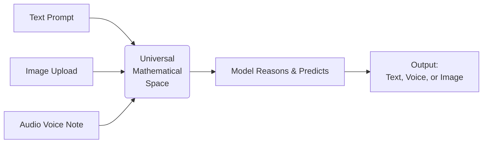

# 3. Multimodal AI

---

## Learning Objectives

By the end of this topic, you should be able to:

- Explain the concept of Multimodal AI.
- Understand how AI models process non-text inputs like images and audio.
- Identify real-world use cases where multimodal capabilities are necessary.

---

## Overview

In Week 3, we talked extensively about text. We discussed how text is broken down into "tokens" and how the AI predicts the next text token. For the first few years of the AI boom, systems were almost entirely text-based. You typed text in, and you got text out. 

However, the real world is not made only of text. Humans interact with the world using sight, sound, and speech. 

**Multimodal AI** refers to artificial intelligence systems that can understand, process, and generate multiple different forms of data (modes)—such as text, images, audio, and video—within a single, unified system.

---

## 4.6 Working with Text, Image, Audio, and Video

Early attempts at AI required separate models for everything. If you wanted to transcribe an audio file and then summarize it, you had to use one model to turn the audio into text, and a completely different model (an LLM) to summarize that text. 

Modern Multimodal systems (like GPT-4o or Gemini 1.5) process these different inputs natively. 

### How does the AI "see" or "hear"?

In Week 3, you learned that an AI doesn't read words; it converts tokens into numbers (mathematical vectors) that represent meaning. 

Multimodal AI works on the exact same principle, just expanded. 
When you upload an image, the AI uses a vision processor to break that image down into patches (think of them as visual tokens). It then converts those visual tokens into the exact same mathematical language it uses for text. 

Because text, audio, and images are all translated into the same universal mathematical space inside the model's parameters, the model can reason across all of them at once. 

### Why Multimodal AI Matters

The ability to process multiple data types unlocks entirely new categories of problem-solving.

1. **Contextual Understanding:** You can upload a photo of a broken machine part and ask, "Why is this leaking?" The AI combines its visual recognition of the part with its text-based knowledge of engineering to give you an answer. 
2. **Accessibility:** Multimodal AI can act as a seeing-eye guide for visually impaired users, looking through a smartphone camera and describing the environment in real-time audio.
3. **Complex Data Analysis:** In a business setting, you can upload a 50-page PDF that contains complex charts and graphs. A text-only model would ignore the charts. A multimodal model can "read" the visual charts and the text simultaneously to write a complete analysis.

**Summary:** 
By moving beyond just text, Multimodal AI allows machines to interact with the messy, visual, and noisy real world much closer to the way humans do.
