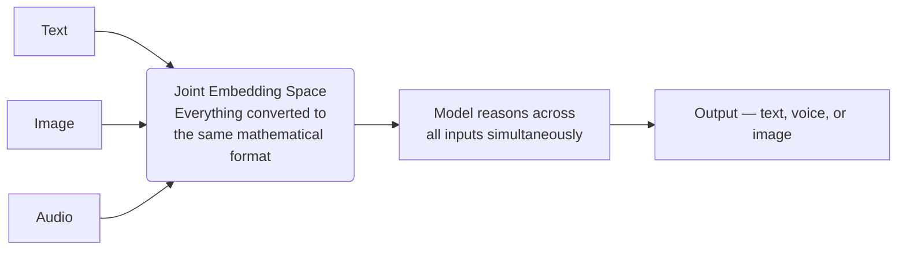

# Multimodal AI

---

## Learning Objectives

By the end of this topic, you should be able to:

- Explain what Multimodal AI is and why it matters
- Understand the difference between the old "piped" approach and modern "native" multimodality
- Describe what a Joint Embedding Space is in plain terms
- Identify real-world situations where multimodal AI is necessary

---

## Overview

You already use multimodal AI every day — you just don't call it that.

When you point your phone camera at a menu in another language and Google Lens 
translates it instantly — that's multimodal AI. When you send a WhatsApp voice note 
and it automatically generates a text transcript — that's multimodal AI. When 
Instagram automatically adds captions to a Reel — that's multimodal AI.

All of these combine different types of data — text, image, audio, video — inside a 
single AI system.

**Modality** refers to the type of data or the way in which information is expressed — for example, text, image, audio, or video.

**Multimodal AI** refers to AI systems that can understand, process, and generate 
multiple different forms of data within one unified system — not just text.

The real world is not made only of text. Humans interact using sight, sound, and 
speech. Multimodal AI brings machines closer to understanding the world the way 
humans do.

---

## 4.6 The Old Way vs The New Way

### The Old Way — Piped Multimodality

A few years ago, if you wanted an AI to listen to a customer's voice complaint and 
reply with spoken advice, you had to chain three separate models together:

**The problem:** The LLM in the middle only ever sees text. If the customer is crying, 
being sarcastic, or clearly frustrated, the speech-to-text model just types the words 
— and all that emotional context is lost forever. The AI has no idea how the person 
actually sounded.

This pipeline is also slow. Three models running one after another adds significant 
delay — something users notice immediately in a real conversation.

### The New Way — Native Multimodality

Modern multimodal systems like GPT-4o and Gemini are built from the ground up to 
handle text, audio, and images together — not one after another.

Instead of converting audio into text first, the model processes the raw audio 
directly. It hears the tone of voice, the background noise, and the pacing — not 
just the words.

**How does the AI actually "see" or "hear"?**

Think of it like a universal language. Text, images, and audio are all very different 
on the surface — but inside a native multimodal model, they are all converted into 
the same mathematical format. Once everything is speaking the same language, the 
model can reason across all of them at the same time.

This shared mathematical space is called a **Joint Embedding Space**.

**Simple analogy:**
Imagine three people — one who only speaks Hindi, one who only speaks Tamil, and one 
who only speaks English — trying to solve a problem together. They can't. But if you 
give all three a universal translator that converts everything into one shared 
language, they can collaborate instantly. The Joint Embedding Space is that universal 
translator inside the model.

---

## 4.7 How AI Processes Video

A single image is straightforward — it's just a grid of pixels. But a video is a 
sequence of images playing over time, usually with audio alongside it.

To understand video, the AI needs to track two things simultaneously:
- **What is happening in each frame** — recognising objects, people, actions
- **How things change from frame to frame** — understanding movement, sequence, 
  and story

Think of it like reading a comic book. Each panel is one frame. Understanding the 
story means understanding both what's in each panel and how the panels connect 
over time. A multimodal model does this for every second of video.

This is why modern AI can watch a one-hour lecture and instantly answer: "What was 
written on the board at the 45-minute mark?" — it tracked both the visuals and the 
timeline simultaneously.

---

## 4.8 Generating Multimodal Outputs

Multimodal AI doesn't just read different formats — it can generate them too.

- **Generating text** — the model predicts one token at a time, sequentially, as you 
  have already learned
- **Generating images** — tools like DALL-E and Midjourney work differently. Think of 
  it like developing a photograph in a darkroom. You start with a blurry, noisy image 
  and gradually sharpen it until a clear picture emerges that matches your description. 
  The AI refines the image step by step rather than drawing it pixel by pixel
- **Generating audio** — systems can synthesize realistic human speech (Text-to-Speech) or generate music and sound effects from text descriptions, matching requested tones, accents, and emotional delivery

---

## 4.9 Real World Application

**Google Lens — image to text in real time**

You point your phone camera at a restaurant menu written in Japanese. Within seconds, 
Google Lens overlays an English translation directly on your screen.

What is actually happening:
- The image of the menu is converted into visual tokens
- The text in the image is recognised and converted into text tokens
- Both go into the Joint Embedding Space together
- The model translates and outputs the result as text overlaid on the image

A text-only AI cannot do this — it has no way to read what is in a photo. Multimodal 
AI makes it trivial.

> 📎 [Google Lens — official page](https://lens.google/)

---

## 4.10 Why Multimodal AI Matters

Text-only AI is powerful — but it is blind, deaf, and limited to what can be written 
down. The real world is full of information that exists only as images, sounds, and 
video. Multimodal AI closes that gap.

- **It solves problems text cannot** — a photo of a broken machine part, a voice note 
  with emotional context, a chart in a PDF report — none of these can be handled by 
  text-only AI. Multimodal AI handles all of them
- **It reduces errors from translation loss** — the old piped approach lost meaning 
  every time data was converted from one format to another. Native multimodality 
  preserves context from the original source
- **It enables entirely new products** — accessibility tools for visually impaired 
  users, real-time medical image analysis, voice assistants that understand how you 
  sound and not just what you say — none of these exist without multimodal AI
- **It brings AI closer to how humans actually work** — humans don't process the world 
  in text only. We see, hear, read, and feel context all at once. Multimodal AI is the 
  first step toward machines that can do the same

---

## Key Takeaways

- Multimodal AI processes and generates multiple forms of data (text, image, audio, video) within a single unified system.
- The "old way" piped separate models together, which was slow and lost context (like emotional tone in audio).
- Native multimodality uses a Joint Embedding Space, converting all data types into a shared mathematical format so the model can reason across them simultaneously.
- Processing video requires the AI to track both what is happening in each frame and how things change over time.
- Multimodal systems solve problems text-only AI cannot, reduce translation loss, and enable new products that process the real world like humans do.

> **Interview tip:** The term "Joint Embedding Space" is a strong signal of deep understanding. If asked how multimodal AI works, explaining that it converts different media into the same mathematical format sets you apart from candidates who just say "it understands pictures."

---

## Further Reading

- 📎 [Hello GPT-4o — OpenAI](https://openai.com/index/hello-gpt-4o/) — OpenAI's 
  explanation of how moving from a piped 3-model approach to a single native 
  multimodal model reduced latency and preserved emotional context
- 📎 [Gemini 1.5 — Google DeepMind](https://deepmind.google/technologies/gemini/) — 
  how a natively multimodal model reasons across video, audio, and text simultaneously
- 📎 [CLIP — Connecting text and images (OpenAI)](https://openai.com/index/clip/) — 
  the foundational research that proved text and images can be mapped into a shared 
  Joint Embedding Space
