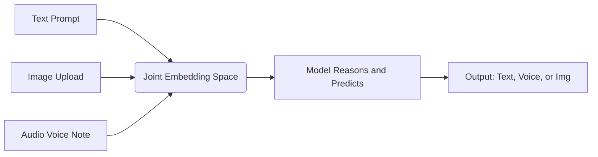

# Multimodal AI

---

## Learning Objectives

By the end of this topic, you should be able to:

- Explain the concept of Multimodal AI and the "Joint Embedding Space".
- Understand the technical difference between "piped" multimodality (old) and "native" multimodality (new).
- Identify real-world use cases where multimodal capabilities are necessary.

---

## Overview

In previous mudules , we talked extensively about text. We discussed how text is broken down into "tokens" and how the AI predicts the next text token. For the first few years of the AI boom, systems were almost entirely text-based. You typed text in, and you got text out. 

However, the real world is not made only of text. Humans interact with the world using sight, sound, and speech. 

**Multimodal AI** refers to artificial intelligence systems that can understand, process, and generate multiple different forms of data (modes)—such as text, images, audio, and video—within a single, unified system.

---

## 4.6 Working with Text, Image, Audio, and Video

### The Old Way: "Piped" Multimodality

A few years ago, if you wanted an AI to listen to a customer's voice complaint and reply with spoken advice, you had to build a "pipeline" of three separate models:
1. **ASR (Automatic Speech Recognition):** Turns the customer's audio into text.
2. **LLM (Large Language Model):** Reads the text and generates a text response.
3. **TTS (Text-to-Speech):** Reads the text response out loud.

**The Problem:** This pipeline is slow (high latency). More importantly, the LLM in the middle *only* sees text. If the customer is crying, being sarcastic, or yelling, the ASR just types out the words, and all the emotional context is completely lost.

### The New Way: "Native" Multimodality

Modern Multimodal systems (like GPT-4o or Gemini 1.5) are built from the ground up to be **natively multimodal**. 

Instead of converting audio into text first, the model processes the raw audio directly. It hears the tone of voice, the background noise, and the pacing. 

**How does the AI "see" or "hear" natively?**
In Week 3, you learned that an AI doesn't read words; it converts tokens into numbers (mathematical vectors) that represent meaning. 

Native Multimodal AI works on the exact same principle, but it uses a **Joint Embedding Space**. 
When you upload an image, a vision processor breaks the image down into patches (visual tokens) and converts them into the exact same mathematical language used for text. When you speak, the audio waveforms are converted into audio tokens in that same mathematical space.

Because text, audio, and images all speak the exact same mathematical language inside the model's parameters, the model can reason across all of them simultaneously without translation.

### How AI Processes Video (Time and Space)

Processing a single image is relatively straightforward for a vision model—it's just a grid of pixels. But a video is a sequence of images (frames) playing over time, usually accompanied by audio. 

To understand video natively, the AI has to map out two different dimensions:
- **Spatial Tokens:** What is happening inside each individual frame (e.g., recognizing a dog).
- **Temporal Tokens:** How the frames change from one to the next over time (e.g., recognizing that the dog is running, not just standing). 

By tracking both space (the image) and time (the movement) simultaneously in the Joint Embedding Space, modern AI can watch a 1-hour lecture video and instantly answer questions about a specific demonstration that happened at the 45-minute mark.

### Generating Multimodal Outputs

Multimodal AI doesn't just *read* different formats; it can also *generate* them. However, creating an image or a video requires a completely different mechanical process than predicting text.

- **Autoregressive Generation (Text/Code):** As you learned in Week 3, LLMs generate text one token at a time, strictly sequentially, predicting what comes next.
- **Diffusion Models (Images/Video):** When an AI generates an image (using tools like Midjourney or DALL-E), it doesn't draw it pixel by pixel from left to right. Instead, it starts with a completely random field of visual "noise" (like TV static). Using its understanding from the Joint Embedding Space, it gradually subtracts the noise over many steps until a clear image emerges that perfectly matches your text prompt.

### Why Multimodal AI Matters

The ability to process multiple data types unlocks entirely new categories of problem-solving.

1. **Contextual Understanding:** You can upload a photo of a broken machine part and ask, "Why is this leaking?" The AI combines its visual recognition of the part with its text-based knowledge of engineering to give you an answer. 
2. **Accessibility:** Multimodal AI can act as a seeing-eye guide for visually impaired users, looking through a smartphone camera and describing the environment in real-time audio.
3. **Complex Data Analysis:** In a business setting, you can upload a 50-page PDF that contains complex charts and graphs. A text-only model would ignore the charts. A multimodal model can "read" the visual charts and the text simultaneously to write a complete analysis.

**Summary:** 
By moving beyond just text, Multimodal AI allows machines to interact with the messy, visual, and noisy real world much closer to the way humans do.

---

## Further Reading & References

For more in-depth information on these topics, explore the following resources:

- [Gemini 1.5: Unlocking multimodal understanding across millions of tokens of context](https://deepmind.google/technologies/gemini/) — The technical report from Google DeepMind explaining how a natively multimodal model can reason across video, audio, and text simultaneously.
- [Hello GPT-4o (OpenAI)](https://openai.com/index/hello-gpt-4o/) — OpenAI's breakdown of how moving from a "piped" 3-model approach to a single native multimodal model reduced latency and preserved emotional intelligence.
- [CLIP: Connecting text and images (OpenAI)](https://openai.com/index/clip/) — The foundational 2021 research that proved we can map images and text into a shared "Joint Embedding Space".
