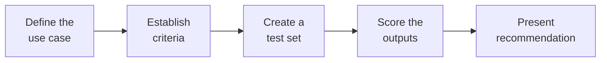

# Comparing and Evaluating AI Tools

---

## Learning Objectives

By the end of this topic, you should be able to:

- Design a measurable evaluation rubric to compare multiple AI tools
- Understand the difference between Public Benchmarks and Custom Evals
- Explain the concept of LLM-as-a-Judge for automated scoring
- Move from subjective opinions to objective evidence when assessing AI performance
- Present a findings-based recommendation for adopting an AI system

---

## Overview

Imagine you and your friends are trying to decide which food delivery app to use — 
Uber Eats or DoorDash. You wouldn't just say "Uber Eats feels better." You'd compare: 
delivery time, pricing, restaurant options in your area, and how often orders arrive 
cold. You'd use evidence to make a decision.

Choosing between AI tools works exactly the same way. In the modern AI landscape, 
there are dozens of foundation models, agent frameworks, and RAG systems available. 
As an AI engineer, a major part of your job will be answering: *"Which tool should 
our team actually use?"*

If you answer that with "I tried ChatGPT and it felt smarter than Claude," you are 
not engineering — you are guessing. To compare AI tools professionally, you must 
design a **measurable evaluation rubric** and present **evidence-based recommendations**.

---

## Public Benchmarks vs Custom Evals

When new AI models are released, companies publish scores on public tests like:
- **MMLU** (Massive Multitask Language Understanding) — tests general knowledge 
  across subjects like history, science, and law
- **HumanEval** — tests coding ability

These scores are useful for a rough general comparison — but they have a serious flaw.

**The data contamination problem:**
Because these tests are publicly available on the internet, AI models often 
accidentally see the answers during training. It's like a student memorising the 
answer key before an exam — they score perfectly, but they haven't actually learned 
the subject.

More importantly, scoring well on a general knowledge test doesn't prove the AI will 
be good at *your specific task*. Passing a biology exam doesn't mean the model will 
correctly summarise your company's legal contracts.

This is why professional AI engineers build **Custom Evals** — private, 
domain-specific test sets the model has never seen before, designed around the exact 
task you need it to do.

> 📎 [MMLU — Original Research Paper](https://arxiv.org/abs/2009.03300)

---

## Common and General Evaluations

While custom evals are essential for specific use cases, there are standard evaluation frameworks and metrics you should be familiar with. 

**Common Set of Evaluations (General Metrics):**
- **ROUGE & BLEU**: Traditional metrics used to measure text similarity, often for translation and summarisation tasks.
- **Exact Match (EM) & F1-Score**: Common in Question Answering tasks to check if the AI's answer perfectly matches the ground truth.
- **Perplexity**: Measures how well a probability model predicts a sample. Lower perplexity indicates the model is more confident in its generation.
- **Semantic Similarity**: Uses another model to check if the generated text means the same thing as the reference answer, even if the exact words are different.

**Specific Evaluations Related to a Particular Task or Sector:**
Depending on your industry, you will need to design evals specific to the tasks you perform:
- **Healthcare & Medicine**: Hallucination rate on medical guidelines, and medical reasoning accuracy (e.g., MedQA).
- **Software Engineering**: **Pass@k** (whether the generated code passes unit tests within *k* attempts) and syntax error rates.
- **E-commerce & Retail**: Product attribute extraction accuracy (did it correctly pull the size and colour from a review?) and sentiment classification accuracy.
- **Customer Support**: Tone adherence, resolution time, and compliance with company policies.

---

## Designing a Custom Evaluation Rubric

A custom eval rubric is a structured scoring system that tests different AI tools 
against the exact same set of criteria — so you can compare them fairly.

Because AI is probabilistic — it gives slightly different answers every time — you 
cannot test it with just one question. You need a suite of tests designed to measure 
specific attributes consistently.

**Step 1 — Define the use case:**
What exactly will the AI be doing? Be specific. Not "customer service" — but 
"drafting email replies to customer complaints, using our knowledge base, in under 
150 words, in a friendly but professional tone."

**Step 2 — Establish criteria:**
What does "good" look like for this task? Break it into measurable categories:

- **Accuracy** — does it hallucinate facts or invent information?
- **Tone** — does it match the required style?
- **Formatting** — does it follow the exact structure requested?
- **Speed (latency)** — how long does it take to respond?
- **Cost** — how much does it cost per 1,000 tokens?

**Step 3 — Create a test set:**
Write 20 to 50 specific prompts that represent the hardest real situations the AI 
will face. Don't just test the easy cases — test the edge cases where things are 
most likely to go wrong.

**Step 4 — Score the outputs:**
Run the same test set through Tool A and Tool B. In the past, humans had to read 
every output and score it manually — slow and expensive.

Today, engineers use **LLM-as-a-Judge**: take a highly capable model (like GPT-4), 
give it your scoring rubric, and ask it to blindly grade the outputs of the models 
being tested. Think of it like having a senior examiner mark answer papers instead 
of marking them yourself — faster, more consistent, and scalable.

> 📎 [LLM-as-a-Judge — Research Paper (2023)](https://arxiv.org/abs/2306.05685)

**Example rubric row:**

| Criterion | 1 Point — Poor | 3 Points — Acceptable | 5 Points — Excellent |
|---|---|---|---|
| **Tone** | Completely wrong tone — too formal or too casual | Mostly correct tone with minor inconsistencies | Perfectly matches the requested tone throughout |
| **Accuracy** | Hallucinates facts or invents information | Mostly accurate with one minor error | Fully accurate — every claim is verifiable |
| **Formatting** | Ignores the requested format entirely | Mostly follows format but misses minor constraints | Flawlessly follows all formatting requirements |

---

## Presenting a Findings-Based Recommendation

Once you have run your evaluation, you must present your findings to decision-makers. 
Recommendations must be based on **evidence, not opinion.**

**Bad recommendation — opinion based:**

> "We should use Model A. I used it for a few hours and the answers felt much better 
> than Model B. It just seems to understand what I want."

**Good recommendation — evidence based:**

> "I recommend we adopt Model A for the customer service pipeline. We tested both 
> models against 50 prompts representing our most complex customer queries. Model A 
> achieved 92% accuracy in following our formatting guidelines, compared to Model B's 
> 74%. Model A had zero hallucinations on pricing-related questions, while Model B 
> hallucinated pricing information on 3 out of 10 prompts. Model A is 10% more 
> expensive per token — but the reduction in manual correction time makes it the 
> stronger overall choice."

**Three rules for a strong recommendation:**

- **Lead with the data** — cite exact scores, percentages, and metrics. Not 
  impressions.
- **Show the failures** — decision-makers need to see exactly how and where each 
  system failed during testing. A recommendation that only shows strengths is not 
  trustworthy.
- **Acknowledge trade-offs** — the most accurate model is usually the most expensive 
  and the slowest. A good recommendation shows you understood the trade-offs and 
  made a reasoned choice, not just picked the "best" one blindly.

---

## Worked Example — Choosing an AI Tool for a College Doubt-Clearing App

**Scenario:** Your team is building an AI assistant for engineering students to ask subject 
doubts. You need to choose between two models — Model A and Model B.

**Step 1 — Use case:** Answer student doubts in simple language, accurately, in under 
100 words, without hallucinating textbook facts.

**Step 2 — Criteria:** Accuracy, simplicity of language, word count adherence, 
hallucination rate.

**Step 3 — Test set:** 30 prompts — 10 easy concept questions, 10 medium application 
questions, 10 tricky edge cases that commonly trip up students.

**Step 4 — Results after scoring:**

| Criterion | Model A | Model B |
|---|---|---|
| Accuracy | 94% | 81% |
| Simplicity of language | 88% | 90% |
| Word count adherence | 96% | 72% |
| Hallucination rate | 2% | 14% |
| Cost per 1,000 tokens | ₹0.80 | ₹0.50 |

**Step 5 — Recommendation:**

> "Model A is the stronger choice for this use case. It significantly outperforms 
> Model B on accuracy and hallucination rate — two critical factors for a 
> doubt-clearing tool where wrong answers directly harm students. The 60% higher 
> cost per token is acceptable given the higher reliability. Model B's lower cost 
> does not justify a hallucination rate 7x higher than Model A's."

---

## Key Takeaways

- Choosing an AI tool requires a measurable evaluation rubric and evidence-based recommendations, not just "vibes" or subjective feelings.
- Public benchmarks (like MMLU) are useful but suffer from data contamination and don't prove a model is good at your specific task.
- Custom Evals are private, domain-specific test sets designed around your exact use case.
- LLM-as-a-Judge scales evaluation by using a highly capable model to blindly grade outputs against a rubric, saving time and money.
- A strong recommendation leads with data, acknowledges failures and trade-offs, and proves why one model is superior for a specific task.

> **Interview tip:** When asked how you would choose an AI model for a project, always mention building a "Custom Eval." Relying entirely on public benchmarks is a common amateur mistake; showing you know how to build a robust, task-specific rubric demonstrates professional engineering maturity.

---

## Further Reading

- 📎 [LLM-as-a-Judge — MT-Bench and Chatbot Arena (2023)](https://arxiv.org/abs/2306.05685) — 
  the foundational research proving strong LLMs can reliably evaluate and score other 
  LLMs, matching human judgment
- 📎 [Evaluating AI Systems — Anthropic](https://www.anthropic.com/news/evaluating-ai-systems) — 
  Anthropic's approach to creating accurate, uncontaminated benchmarks for AI 
  capability and safety evaluation
- 📎 [MMLU — Original Research Paper](https://arxiv.org/abs/2009.03300) — the original 
  paper for the most widely used public benchmark in the AI industry
