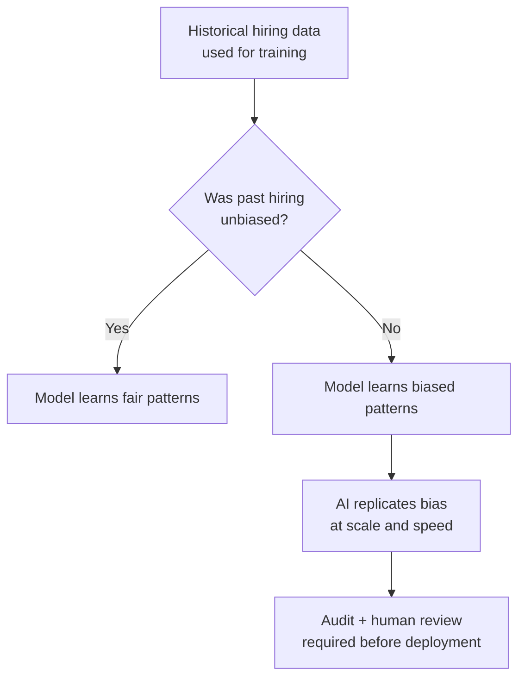

# AI Failures and Why They Happen

*AI Ethics, Safety and Governance*

---

## Learning Objectives

By the end of this topic, you should be able to:

- Describe at least three real categories of AI failure and the pattern of harm each one causes
- Explain why an AI model can state a wrong answer with complete confidence — hallucination
- Identify how bias enters an AI system through its training data
- Tell the difference between a hallucination failure and a bias failure
- Trace a given AI failure back to its root cause — bad data, bad design, or missing oversight
- Evaluate what safeguard could have prevented a specific AI failure case

---

## Overview

Every powerful technology has a failure history — bridges collapsed before engineers understood load limits, medicines were withdrawn before regulators understood drug safety. AI is no different, except its failures are happening **in public, at scale, and right now** — while you are training to build the next generation of these systems.

As someone who will specify, build, and oversee AI-powered software, you cannot treat "the AI might get it wrong" as a footnote. You must treat it as a **first-class engineering constraint** — the same way a civil engineer treats gravity. You don't hope the bridge doesn't fall. You design it so it can't.

This topic covers three recurring failure patterns — real-world failure cases, **hallucination** (AI confidently stating false information), and **data bias** (AI inheriting unfairness from the data it learned from). Understanding *why* these failures happen — not just that they happen — is what separates an engineer who can responsibly build AI systems from someone who is merely impressed by a demo.

---

## Real AI Failure Cases

An AI failure is any instance where an AI system's output causes harm, unfairness, or a wrong decision that a careful human process would likely have avoided.

Here are three well-documented failure categories — each with a real case you can look up:

### Healthcare — When Training Data Is Too Narrow

AI diagnostic tools trained mostly on data from one demographic group have shown reduced accuracy when used on patients outside that group.

**Real case:** A widely cited 2019 study published in Science found that a healthcare algorithm used across US hospitals to identify patients who needed extra medical care was systematically biased against Black patients — giving them lower risk scores than equally sick white patients, because it used healthcare costs as a proxy for health needs. Black patients historically had less money spent on their care, so the algorithm learned to underestimate their risk.

> 📎 [Read the study — Science, 2019](https://www.science.org/doi/10.1126/science.aax2342)

The failure wasn't that "the AI was bad at medicine." It was that the AI only ever saw a narrow, skewed slice of medicine during training — and confidently applied that narrow pattern to everyone.

### Hiring — Automating Yesterday's Bias

Several companies piloted AI résumé-screening tools that learned from years of past hiring decisions. If those past decisions favoured one gender or background — even unintentionally — the AI learned that pattern as "what a good candidate looks like" and repeated it at scale.

**Real case:** Amazon built an AI hiring tool to screen software engineering resumes. By 2018, they discovered it was systematically downgrading resumes from women — because it was trained on resumes submitted over a 10-year period, during which men dominated the tech industry. The model learned "male resume = successful hire" as a pattern. Amazon scrapped the tool.

> 📎 [Reuters report on Amazon's AI hiring tool](https://www.reuters.com/article/us-amazon-com-jobs-automation-insight-idUSKCN1MK08G)

### Deepfakes — Technology Without Safeguards

Generative AI can now create highly realistic fake images, audio, and video of real people saying or doing things they never did.

**Real case:** In 2024, a finance employee at a multinational company in Hong Kong was tricked into transferring $25 million after attending a video call where every other participant — including the company's CFO — turned out to be a deepfake. The employee only realised after checking with the real head office.

> 📎 [CNN report on the $25 million deepfake fraud](https://edition.cnn.com/2024/02/04/asia/deepfake-cfo-scam-hong-kong-intl-hnk/index.html)

The underlying technology is neutral — the harm came from the **absence of safeguards** around who can generate what and how recipients can verify authenticity.

> **The root lesson across all three:** An AI system reflects and amplifies the data and process it was built on. It does not have independent moral judgment. It cannot tell you "this is unfair" unless it was specifically designed and tested to catch that.

---

## Hallucination — Why AI States Falsehoods Confidently

**Hallucination** is when an AI model generates information that sounds fluent and confident — but is factually incorrect, fabricated, or not supported by any real source.

**Why does this happen?**

An LLM generates text by predicting the most statistically likely next word, based on patterns learned during training. It is not looking up facts in a verified database. If you ask it something obscure or outside its training data, it will still produce a fluent, confident-sounding answer — because **fluency is what it was trained to produce.** It has no built-in mechanism that says "I genuinely don't know this."

**Simple analogy:**
Imagine a student who has to answer an exam question out loud, instantly, with no notes — and has been trained their whole life to never leave a blank answer. Faced with a question they don't fully know, they'll construct the most plausible-sounding answer they can, using patterns from everything else they've studied — sounding completely confident while being wrong. That is hallucination in human terms.

**Real case — the lawyer who trusted AI:**
In 2023, a New York lawyer named Steven Schwartz used ChatGPT to research case precedents. ChatGPT invented several court cases that never existed — complete with case names, judges, and legal rulings. Schwartz submitted them to a federal court. When the opposing side couldn't find the cases, the judge investigated. Schwartz was sanctioned and nearly disbarred.

> 📎 [NY Times report on the lawyer case](https://www.nytimes.com/2023/05/27/nyregion/avianca-airline-lawsuit-chatgpt.html)

**Key terms:**

- **Hallucination** — a confident, fluent, but factually wrong AI output
- **Grounding** — connecting an AI's answer to a verifiable, real source of truth like a document or a database
- **Confabulation** — a psychology term for filling gaps in memory with plausible-sounding fabrication without intent to deceive. Hallucination is the AI equivalent.

> **Important:** Hallucination is not a rare bug that will disappear with the next model update. It is a structural consequence of how generative AI works today. The correct professional response is not "hope it doesn't happen" — it is designing your system to **catch it** before it reaches a real decision.

---

## Data Bias — How Biased Training Data Produces Biased Output

**Data bias** occurs when the data used to train an AI model over- or under-represents certain groups, situations, or outcomes — causing the model to learn a skewed version of "normal."

**Why does this exist?**

AI models learn entirely from examples. If 90% of the loan-approval examples an AI was trained on came from applicants in cities, it may perform poorly — or unfairly — when evaluating rural applicants. Not because it is "prejudiced," but because it never saw enough rural examples to learn accurate patterns for them.

**Three ways bias enters a system:**

- **Historical bias** — the real-world data reflects past human decisions that were already unfair. Example: historical hiring or lending records that favoured certain groups.
- **Sampling bias** — the data collected over-represents one group and under-represents another. Example: a voice-recognition system trained mostly on American English accents that fails on Indian or Nigerian accents.
- **Labelling bias** — the humans who labelled the training data carried their own unconscious assumptions into those labels.

**Real case — voice recognition and accents:**
A 2020 study by Stanford researchers found that speech recognition systems from major tech companies had significantly higher error rates for Black speakers than white speakers — in some cases, error rates were twice as high. The root cause was sampling bias — the training data over-represented certain accent groups.

> 📎 [Stanford study on speech recognition bias](https://www.pnas.org/doi/10.1073/pnas.1915768117)

### Hallucination vs Data Bias — Side by Side

| Aspect | Hallucination | Data Bias |
|---|---|---|
| What goes wrong | The model invents information that isn't true | The model learns a skewed or unfair pattern from real data |
| Root cause | Predicting plausible text without a grounding check | Training data that over or under-represents groups or outcomes |
| Typical symptom | A confident wrong fact — like a fake case citation | Consistently worse or unfair outcomes for a specific group |
| Primary fix | Grounding via RAG, verification, human review | Auditing training data, testing outcomes across groups, fairness metrics |

---

## Best Practices

- Always test an AI system's outputs across different user groups before deployment — don't assume uniform performance
- Never treat an AI's confident tone as evidence of correctness — confidence and correctness are not the same thing in generative AI
- Document what data your system was trained or fine-tuned on, so future bias audits are possible
- For any factual output — especially in healthcare, legal, or financial contexts — ground the AI in verified sources, not model memory alone

## Common Beginner Mistakes

- Assuming that because a model is "big" or "advanced," it cannot be biased or wrong
- Testing an AI system only with the type of user you personally represent, and missing failures for other groups
- Treating a single hallucinated wrong answer as a one-off "bug" instead of a pattern to be systematically tested for

---

## Real World Application

**AI in recruitment — a global pattern**

AI résumé screening tools are now used by companies globally to filter hundreds of thousands of applications. The efficiency gain is real — but so is the risk. If the historical hiring data used for training reflected past biases (by gender, university, or region), the AI will faithfully replicate those biases at scale — faster and more consistently than any human recruiter ever could.

The fix is not to avoid AI in recruitment. The fix is to:
- Audit what data the model was trained on
- Test the model's output across different candidate groups before deployment
- Require a human review of any AI rejection before it becomes final
- Monitor outcomes continuously after deployment — bias can emerge in new ways over time

---

## Key Takeaways

- AI failures generally fall into recognisable patterns — skewed training data, confident fabrication (hallucination), or missing human oversight
- **Hallucination** = confident, fluent, but factually wrong output — a structural feature of how generative models predict text, not a rare glitch
- **Data bias** = the model faithfully learns and repeats unfair patterns present in its training data
- Confidence in tone is not evidence of correctness — never confuse the two
- Bias can enter through historical data, sampling, or human labelling — audit all three
- The fix for hallucination is grounding and verification. The fix for bias is data auditing and outcome testing across groups
- Always test AI systems across diverse user groups before trusting them in production

> **Interview tip:** If asked to explain hallucination, mention *token-prediction without grounding* — this shows you understand the mechanism, not just the symptom. If asked about bias, name the three entry points — historical, sampling, and labelling bias. Most freshers can only say "the data was bad."

---

## Reference Links

- 📎 [NIST AI Risk Management Framework](https://www.nist.gov/itl/ai-risk-management-framework) — official US framework for understanding and managing AI failure modes including bias and reliability
- 📎 [Science — Healthcare Algorithm Bias Study (2019)](https://www.science.org/doi/10.1126/science.aax2342) — peer-reviewed research on racial bias in a widely used US healthcare algorithm
- 📎 [Reuters — Amazon AI Hiring Tool (2018)](https://www.reuters.com/article/us-amazon-com-jobs-automation-insight-idUSKCN1MK08G) — original reporting on Amazon scrapping its AI résumé screener due to gender bias
- 📎 [CNN — $25 Million Deepfake Fraud, Hong Kong (2024)](https://edition.cnn.com/2024/02/04/asia/deepfake-cfo-scam-hong-kong-intl-hnk/index.html) — real case of a deepfake video call used to authorise a fraudulent bank transfer
- 📎 [NY Times — Lawyer Sanctioned for AI-Invented Court Cases (2023)](https://www.nytimes.com/2023/05/27/nyregion/avianca-airline-lawsuit-chatgpt.html) — the case of fake legal citations submitted to a federal court
- 📎 [Stanford — Speech Recognition Bias Study (2020)](https://www.pnas.org/doi/10.1073/pnas.1915768117) — peer-reviewed research showing significantly higher error rates for Black speakers in major speech recognition systems
- 📎 [Google ML Crash Course — Fairness](https://developers.google.com/machine-learning/crash-course) — beginner-friendly introduction to fairness and bias in machine learning systems
