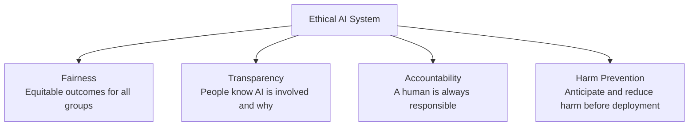

# Ethical Principles

---

## Learning Objectives

By the end of this topic, you should be able to:

- Explain each of the four ethical pillars of AI — fairness, transparency, accountability, and harm prevention
- Identify which pillar is being violated in a given AI failure scenario
- Explain why all four pillars are needed together and why any one alone is not enough
- Use the four pillars as a checklist when reviewing a proposed AI system design
- Look at a simple system design and recommend improvements using the four pillars

---

## Overview

In the previous topic, you saw *what* goes wrong when AI systems fail. This topic gives you the **principles** that guide you toward building systems that don't fail in those ways in the first place.

Think of it like building construction. Civil engineers don't just build a structure and hope it holds — they work from principles like load-bearing capacity, material safety factors, and fire resistance standards. These aren't abstract philosophy. They are practical checkpoints built into every design decision.

AI engineers work the same way. The four pillars — **fairness, transparency, accountability, and harm prevention** — are not just theory you read once and forget. They are practical checkpoints you will use when writing a specification, when evaluating AI output, and when designing human oversight into any system you build.

Every major AI governance framework in the world — the EU AI Act, the NIST AI Risk Management Framework, and India's MEITY guidelines — is built around some version of these same four ideas. Learn them now, and every governance topic you encounter later will make immediate sense.

---

## The Four Pillars

---

### Pillar 1 — Fairness

Fairness means the AI system treats all individuals and groups equitably — without producing systematically worse outcomes for some groups over others, for reasons unrelated to the task at hand.

**Simple analogy:**
Think of a college entrance exam. A fair exam tests everyone on the same syllabus under the same conditions. An unfair exam might ask questions that only students from expensive private schools would have studied — the result then reflects money and background, not actual ability. AI systems fail fairness the exact same way when they're trained on unrepresentative data.

**Real case:**
A 2019 study in *Science* found that a healthcare algorithm used across US hospitals assigned lower risk scores to Black patients than to equally sick white patients — because it used past healthcare costs as a proxy for health needs, and Black patients had historically received less expensive care. The algorithm was treating people unequally based on a factor that had nothing to do with their actual health.

> 📎 [Science — Healthcare Algorithm Bias Study (2019)](https://www.science.org/doi/10.1126/science.aax2342)

---

### Pillar 2 — Transparency

Transparency means people affected by an AI system's decision can understand, at an appropriate level, how and why that decision was made — and know that AI was involved at all.

**Simple analogy:**
If a bank rejects your loan application, transparency means you're told: "Your application was reviewed using an automated credit-scoring tool, and the main factors were your repayment history and current debt level." Not a silent rejection with no explanation, leaving you unable to even know an algorithm was involved — let alone challenge it.

**Real case:**
The EU AI Act (2024) now legally requires that individuals affected by high-risk AI decisions — including credit scoring, hiring, and benefits eligibility — must be informed that AI was used and must have access to a meaningful explanation of the decision.

> 📎 [EU AI Act — Official Text](https://eur-lex.europa.eu/legal-content/EN/TXT/?uri=CELEX%3A32024R1689)

---

### Pillar 3 — Accountability

Accountability means there is always a clearly identified human or organisation responsible for an AI system's decisions and outcomes. The AI itself is never "the one to blame."

**Simple analogy:**
If a self-checkout machine at a supermarket overcharges you, you don't argue with the machine — there is a manager, a company, and a policy that is accountable. The same principle applies to AI: "the algorithm did it" is never an acceptable final answer. Someone built it, someone deployed it, and someone is responsible for what it does.

**Real case:**
In 2023, a US federal judge sanctioned a lawyer who submitted AI-generated fake court cases, and also questioned the law firm's oversight process. The judge's point was clear — using AI does not remove human accountability for what gets filed in court. Someone is always responsible.

> 📎 [NY Times — Lawyer sanctioned for AI fake citations (2023)](https://www.nytimes.com/2023/05/27/nyregion/avianca-airline-lawsuit-chatgpt.html)

---

### Pillar 4 — Harm Prevention

Harm prevention means actively anticipating and reducing the potential for an AI system to cause physical, financial, psychological, or social harm — **before** deployment, not after.

**Simple analogy:**
A car is not released to the public without crash tests, seatbelts, and airbags — designed in from the start, not added after accidents happen. AI systems, especially in health, finance, and safety domains, need the same designed-in precaution. "We didn't mean for it to cause harm" is not a defence.

**Real case:**
In 2024, a finance employee was tricked into transferring $25 million after a deepfake video call where every other participant — including the company's CFO — turned out to be fake. A harm prevention lens would have required verification protocols for large transactions before any transfer was authorised — not just trust in what appeared on screen.

> 📎 [CNN — $25 million deepfake fraud, Hong Kong (2024)](https://edition.cnn.com/2024/02/04/asia/deepfake-cfo-scam-hong-kong-intl-hnk/index.html)

---

## Why All Four Together — Not Just One

Each pillar protects against a different failure. Remove any one and harm slips through the gap.

| If you only have... | What can still go wrong |
|---|---|
| Fairness, but no transparency | The system may treat groups equally, but no one can verify or challenge a wrong decision |
| Transparency, but no accountability | Everyone can see how a decision was made, but no one takes responsibility for fixing an unfair pattern |
| Accountability, but no harm prevention | Someone is responsible after the fact — but the harm has already happened |
| Harm prevention, but no fairness | The system avoids catastrophic harm, yet still quietly disadvantages certain groups |

---

## Best Practices

- Use the four pillars as a design review checklist **before** building — not only after something goes wrong
- Document, in plain language, which pillar each safeguard in your system addresses
- Revisit the four pillars whenever a system's scope or user base changes
- Never assume a system is ethical simply because it wasn't *designed* to cause harm — harm prevention requires active testing, not good intentions alone

## Common Beginner Mistakes

- Treating "fairness" as the only pillar that matters and forgetting accountability and transparency
- Believing ethics is "someone else's job" — like a legal team — rather than a core engineering responsibility
- Thinking good intentions are enough — harm prevention requires deliberate testing, not just careful design

---

## Worked Example — Hospital Priority Queue System

**Scenario:** You are asked to review an AI-powered system for a hospital's outpatient department that decides which patients get called in first, based on symptom severity described in a short questionnaire.

**Four-pillar review:**

| Pillar | Question to Ask | Finding | Recommendation |
|---|---|---|---|
| Fairness | Does the system perform equally well for patients who fill the form in different languages? | Only tested in English so far | Test and calibrate for all languages the hospital serves before launch |
| Transparency | Do patients know an AI is ranking their queue position? | No notice or explanation currently planned | Add a clear notice explaining automated triage assistance is used, with a human able to override |
| Accountability | Who is responsible if the system deprioritises a genuinely urgent patient? | No named owner yet | Assign a clinical lead accountable for the tool's outcomes and periodic review |
| Harm Prevention | What happens if the system is uncertain about a case? | System currently decides silently | Require the system to escalate uncertain or borderline cases directly to a human nurse — never silently deprioritise |

**Conclusion:** This system cannot ethically launch until all four gaps are addressed. This is the kind of structured review you will practice throughout this program — and in real engineering roles.

---

## Key Takeaways

- The four pillars of AI ethics are: **Fairness, Transparency, Accountability, Harm Prevention**
- **Fairness** = equitable treatment and outcomes across all groups
- **Transparency** = people know AI is involved and can understand why a decision was made
- **Accountability** = a human or organisation is always responsible — the AI itself is never "the one to blame"
- **Harm Prevention** = anticipate and reduce harm before deployment, not after
- No single pillar is sufficient alone — weaknesses in one let harm slip through even if the others are strong
- Use the four pillars as a practical design-review checklist, not just as theory to memorise
- Every major governance framework — EU AI Act, NIST AI RMF, MEITY — is built around these same four ideas

> **Interview tip:** When asked "what makes AI ethical?", structure your answer around these four named pillars — Fairness, Transparency, Accountability, Harm Prevention. It signals structured, professional thinking rather than a vague opinion like "AI should be used responsibly."

---

## Reference Links

- 📎 [NIST AI Risk Management Framework](https://www.nist.gov/itl/ai-risk-management-framework) — official US framework organising trustworthy AI around fairness, transparency, accountability, and safety
- 📎 [EU AI Act — Official Text (2024)](https://eur-lex.europa.eu/legal-content/EN/TXT/?uri=CELEX%3A32024R1689) — legally codifies transparency, accountability, and harm prevention for high-risk AI systems across Europe
- 📎 [MEITY — Advisories on Responsible AI](https://www.meity.gov.in/) — Indian government guidance on responsible AI development and deployment
- 📎 [Science — Healthcare Algorithm Bias Study (2019)](https://www.science.org/doi/10.1126/science.aax2342) — peer-reviewed research demonstrating a fairness failure in a widely used US healthcare algorithm
- 📎 [NY Times — Lawyer sanctioned for AI fake citations (2023)](https://www.nytimes.com/2023/05/27/nyregion/avianca-airline-lawsuit-chatgpt.html) — real case illustrating accountability failure when AI output was submitted without human verification
- 📎 [CNN — $25 million deepfake fraud, Hong Kong (2024)](https://edition.cnn.com/2024/02/04/asia/deepfake-cfo-scam-hong-kong-intl-hnk/index.html) — real case illustrating harm prevention failure in a financial context
- 📎 [Google ML Crash Course — Fairness](https://developers.google.com/machine-learning/crash-course) — beginner-friendly introduction to fairness concepts in machine learning
