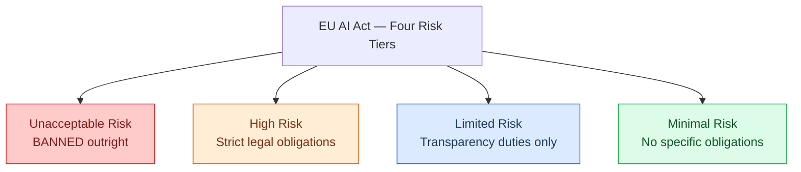
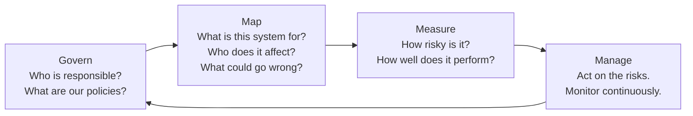
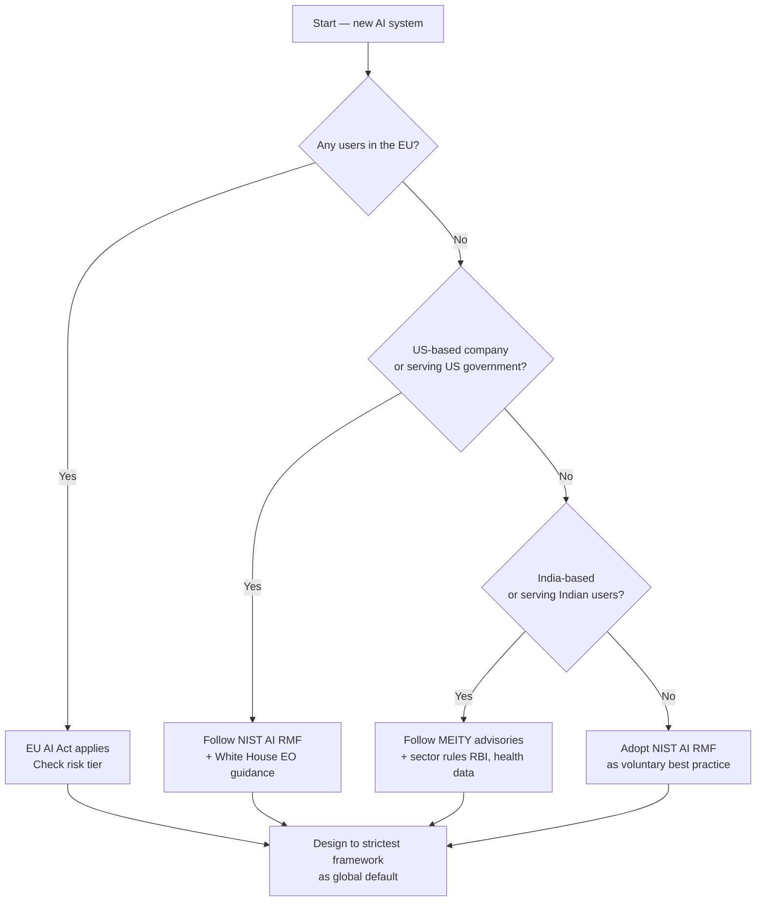
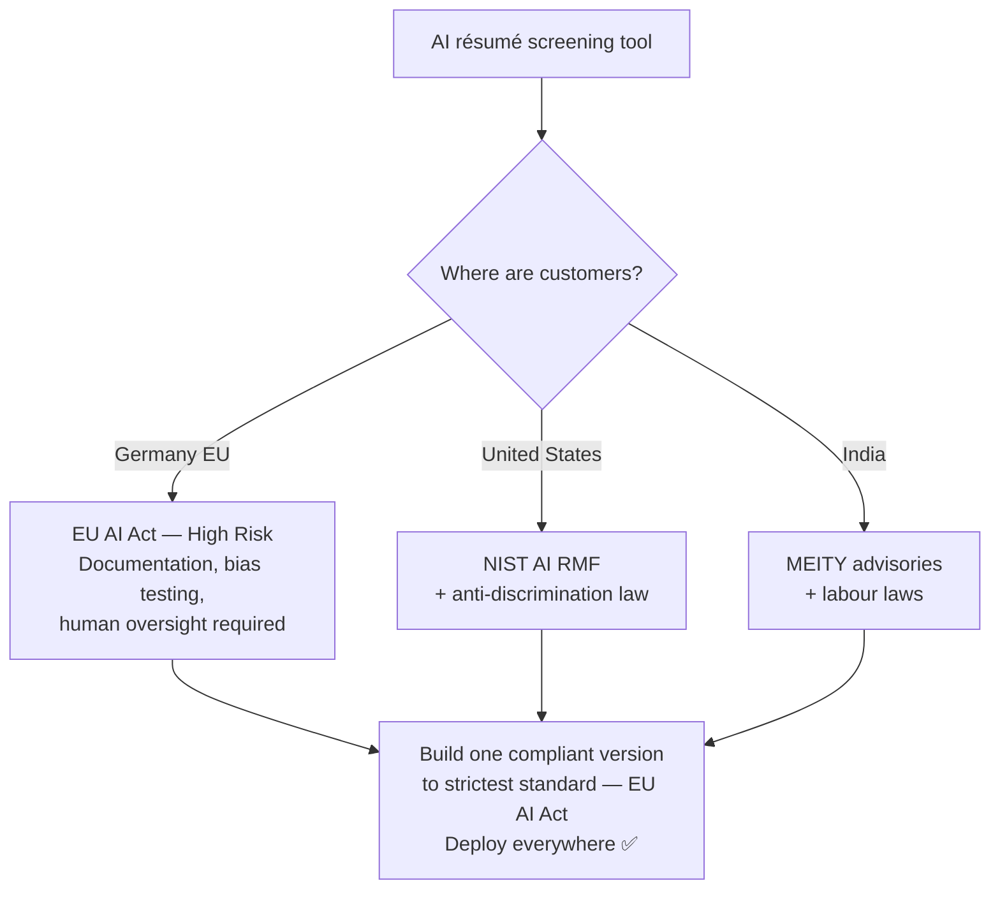

# Governance Frameworks
---

## Learning Objectives

By the end of this topic, you should be able to:

- Describe the EU AI Act's four risk tiers and give an example system for each
- Explain the obligations placed on "high-risk" AI systems under the EU AI Act
- Identify the categories of AI use explicitly prohibited under the EU AI Act
- Describe the four functions of the NIST AI Risk Management Framework — Govern, Map, Measure, Manage
- Summarise the key provisions of the 2023 White House Executive Order on AI
- Explain the current direction of India's AI governance approach via MEITY advisories
- Decide which governance framework applies to a given AI system based on its users, location, and risk level

---

## Overview

This topic covers more ground than most — because governance is genuinely a fast-moving, multi-country landscape in 2026, and an AI engineer must at least know *which map to reach for* before memorising every detail.

Think of it like knowing the traffic rules in different countries. If you're driving in Germany, UK rules don't apply — but if you're building software, your users might be in Germany, the US, and India all at once. You need to know which rules apply where, and how strict each one is.

The good news: you already have the conceptual foundation. The four ethical pillars from the previous topic — fairness, transparency, accountability, harm prevention — are the DNA of every framework in this topic. What differs between them is **how formally, and how strictly, each principle is enforced.**

You will study four frameworks:
- **EU AI Act** — the world's first comprehensive, legally binding AI law
- **NIST AI RMF** — a US-origin voluntary framework widely used as an industry best-practice reference
- **White House Executive Order on AI (2023)** — US federal policy direction
- **India's MEITY advisories** — India's current, evolving approach

---

## The EU AI Act — Risk Tiers

The EU AI Act is a binding law of the European Union — fully in force, with obligations phasing in through 2026–2027 — that regulates AI systems based on the **level of risk** they pose to health, safety, and fundamental rights.

Instead of regulating "AI" as one single thing, it sorts every AI system into one of **four risk tiers**. A spam filter and a medical-diagnosis AI carry wildly different real-world stakes — so the law scales the requirements to match the actual risk.

| Tier | Meaning | Real Example |
|---|---|---|
| **Unacceptable Risk** | Banned outright — harm too severe to permit under any safeguard | Real-time public biometric surveillance for mass monitoring, government social scoring |
| **High Risk** | Legal, but subject to strict obligations before and during use | AI used in hiring, credit scoring, medical devices, critical infrastructure |
| **Limited Risk** | Legal, with specific transparency duties | Chatbots must disclose the user is talking to an AI; deepfake generators must label content as AI-generated |
| **Minimal Risk** | Legal, no specific obligations | AI-powered spam filters, video game AI opponents |

> 📎 [EU AI Act — Official Text (2024)](https://eur-lex.europa.eu/legal-content/EN/TXT/?uri=CELEX%3A32024R1689)

---

## The EU AI Act — Obligations for High-Risk Systems

High-risk AI systems must satisfy a defined set of obligations **before** they can be used and **throughout** their operation:

- **Documentation** — detailed technical documentation describing how the system works, what data trained it, and its known limitations
- **Testing and risk management** — a continuous process of testing for accuracy, robustness, and safety — not a one-time check
- **Human oversight** — the system must be designed so a human can understand its output, intervene, and override or halt it when necessary
- **Data governance** — training data must be checked for quality and, where feasible, for bias
- **Transparency to users** — clear information on the system's capabilities and limitations for whoever deploys or is affected by it
- **Record-keeping** — maintaining logs of the system's operation for traceability in case of investigation after an incident

**Simple analogy:**
Think of this like the requirements for a new medicine before it can be sold — clinical trial documentation, quality checks on raw materials, clear usage instructions on the packaging, and a way for doctors to report side effects. High-risk AI is regulated with the same rigorous mindset.

---

## The EU AI Act — Prohibited Uses

The "unacceptable risk" tier bans specific AI uses **outright** within the EU — regardless of any safeguard applied:

- **Social scoring by public authorities** — ranking or judging people based on behaviour or characteristics in a way that leads to unjustified treatment
- **Real-time remote biometric identification** in public spaces for law enforcement (with very narrow, tightly defined exceptions)
- **Manipulative AI** that distorts a person's behaviour in a way that causes significant harm by exploiting vulnerabilities like age or disability
- **Untargeted scraping** of facial images from the internet or CCTV footage to build facial recognition databases

> These prohibitions draw the hard boundary — no amount of good documentation or human oversight makes these use cases legal in the EU. This is a useful mental model even outside the EU: **some AI applications should not exist at all**, not just be "used carefully."

---

## NIST AI Risk Management Framework (AI RMF)

The NIST AI Risk Management Framework is a **voluntary** US-origin framework (published by the National Institute of Standards and Technology) that provides a structured process for managing AI risks throughout a system's lifecycle.

It is not a law — you cannot be fined for ignoring it. But it is widely adopted as a best-practice reference by companies worldwide precisely because it gives a practical, repeatable process rather than a legal checklist.

It organises AI risk management into **four core functions** — think of them as four questions you answer in order:

| Function | What It Means in Plain Language |
|---|---|
| **Govern** | Establish who is responsible for AI decisions in your organisation, and what policies guide those decisions |
| **Map** | Understand the context — what is this system for, who does it affect, and what could go wrong? |
| **Measure** | Use tests and metrics to assess the system's risks, performance, and trustworthiness |
| **Manage** | Prioritise and act on the risks identified — allocate effort to the highest-risk issues, and keep monitoring |

> 📎 [NIST AI Risk Management Framework — Official Documentation](https://www.nist.gov/itl/ai-risk-management-framework)

---

## White House Executive Order on AI (2023)

In October 2023, the White House issued an Executive Order on "Safe, Secure, and Trustworthy Development and Use of Artificial Intelligence" — a US federal policy directive shaping how US government agencies approach AI oversight.

**Key provisions:**
- Requiring developers of the most powerful "frontier" AI models to share safety test results with the government before public release
- Directing the development of standards for AI safety and security testing, building on frameworks like the NIST AI RMF
- Addressing AI-related risks in critical areas — biosecurity, cybersecurity, and critical infrastructure
- Promoting AI innovation while directing agencies to guard against AI-enabled fraud and discrimination in housing, healthcare, and hiring
- Directing federal agencies to develop guidance for their own responsible use of AI in government services

> **Important:** US AI policy has moved through executive orders and agency guidance rather than one comprehensive law — meaning it can shift with each administration. Always verify the current federal guidance rather than relying on a fixed rule.

> 📎 [White House Executive Order on AI — Official Text (2023)](https://www.whitehouse.gov/briefing-room/presidential-actions/2023/10/30/executive-order-on-the-safe-secure-and-trustworthy-development-and-use-of-artificial-intelligence/)

---

## India AI Governance — MEITY Advisory Guidelines

In India, AI governance is currently guided primarily through **advisories issued by the Ministry of Electronics and Information Technology (MEITY)** — a principles-based, evolving approach rather than a single comprehensive binding law like the EU AI Act.

**Key themes in India's approach:**
- Encouraging **responsible AI development** — flagging concerns like deepfakes, misinformation, and bias to platforms and developers
- Emphasis on **user disclosure** for AI-generated content — labelling synthetic or deepfake media, echoing the EU's transparency duties
- A stated intent to **balance innovation with safety** — India's IT sector and startup ecosystem is a major economic priority, so guidance has generally aimed to avoid over-restrictive rules while addressing clear harms
- Sector-specific rules in finance, health data, and data protection **continue to apply alongside** general AI advisories — AI does not exempt you from existing regulations like RBI rules for FinTech

> **Important:** India's AI governance approach is actively evolving. Treat this section as a snapshot of the approach and direction, not a final fixed rulebook — always check the latest MEITY guidance before making compliance decisions on a real project.

> 📎 [MEITY — Ministry of Electronics and Information Technology](https://www.meity.gov.in/)

---

## Which Governance Framework Applies to Your System?

This is the practical skill — given a real system, figuring out which framework(s) actually apply to you.

**A simple decision checklist:**

1. **Where are your users located?** If any users are in the EU, the EU AI Act may apply to you regardless of where your company is based — it has extraterritorial reach for high-risk systems affecting EU residents
2. **Where is your company based and who are you serving?** US-based deployments may fall under federal guidance from the Executive Order; India-based deployments should follow current MEITY advisories plus sector rules
3. **What risk tier would your system fall into, even if you're not in the EU?** This is a useful thought exercise everywhere — hiring, credit, and healthcare AI are "high-risk" categories under most frameworks' spirit, even where no single binding law says so yet
4. **Is there a voluntary best-practice framework you should adopt anyway?** Even without a legal requirement, adopting NIST's Govern–Map–Measure–Manage cycle is increasingly expected by enterprise clients and investors

### Governance Frameworks at a Glance

| Framework | Jurisdiction | Binding? | Core Approach |
|---|---|---|---|
| **EU AI Act** | European Union — extraterritorial for high-risk systems affecting EU residents | Yes — legally binding | Risk-tiered: unacceptable / high / limited / minimal — with specific obligations per tier |
| **NIST AI RMF** | US-origin, widely adopted globally | No — voluntary | Process-based: Govern, Map, Measure, Manage |
| **White House Executive Order (2023)** | United States — federal agencies and contractors | Directive for federal agencies — influences industry norms | Safety testing requirements, agency guidance, critical-risk focus |
| **India — MEITY Advisories** | India | Advisory guidance, evolving — sector laws remain binding | Principles-based, balancing innovation with safety, focus on disclosure and misuse |

### Best Practices

- Never assume "no specific AI law in my country" means "no obligations at all" — sector regulation in banking, health, and data protection usually still applies
- When building for a global audience, design to the **strictest** applicable framework — usually the EU AI Act — as a safe default
- Keep a short "governance note" in your project documentation stating which framework(s) you considered

---

## Real World Application

**A startup building an AI résumé-screening tool — sold globally**

A startup builds an AI-powered résumé screening tool and plans to sell it to companies in India, the US, and Germany.

- **Germany (EU customers):** Hiring AI is explicitly listed as **high-risk** under the EU AI Act — the startup must provide documentation, human oversight design, bias testing, and transparency to candidates for any EU deployment
- **US customers:** No single federal AI law yet, but the startup should align with the NIST AI RMF as an industry-standard risk process, and stay aware of US anti-discrimination employment law
- **India customers:** Follow current MEITY advisories on responsible AI and transparency, and comply with India's existing labour and data protection laws

**Overall engineering decision:** Since the EU AI Act's obligations are the strictest of the three, the startup builds **one single compliant version** of the product — with full documentation, bias testing, and human-oversight controls — and deploys it everywhere. Simpler to maintain, and safest by default.

---

## Key Takeaways

- The **EU AI Act** is the world's first comprehensive binding AI law — four risk tiers: unacceptable (banned), high (strict obligations), limited (transparency duties), minimal (no specific rules)
- High-risk EU AI Act obligations include documentation, testing, human oversight, data governance, transparency, and logging
- Prohibited EU AI uses include social scoring and real-time public biometric surveillance
- The **NIST AI RMF** is voluntary but widely used — organised around **Govern, Map, Measure, Manage**
- The **2023 White House Executive Order** directs US federal AI safety testing and agency guidance — can shift with administrations
- **India's MEITY advisories** take a principles-based, evolving approach — emphasising disclosure and responsible AI while relying on existing sector laws for enforcement
- To find which framework applies: check your users' location, your own jurisdiction, your system's risk level, and whether adopting a voluntary framework is good practice anyway
- When in doubt, design to the strictest applicable framework as your default

> **Interview tip:** If asked to compare governance frameworks, lead with two axes — **"binding vs voluntary"** and **"risk-tiered vs process-based."** These two dimensions explain most of the differences cleanly. EU AI Act = binding + risk-tiered. NIST AI RMF = voluntary + process-based. Most freshers just list framework names without explaining how they differ.

---

## Reference Links

- 📎 [EU AI Act — Official Text (EUR-Lex, 2024)](https://eur-lex.europa.eu/legal-content/EN/TXT/?uri=CELEX%3A32024R1689) — the authoritative legal text of the regulation
- 📎 [NIST AI Risk Management Framework](https://www.nist.gov/itl/ai-risk-management-framework) — official framework documentation and resources
- 📎 [White House — Executive Order on Safe, Secure, and Trustworthy AI (2023)](https://www.whitehouse.gov/briefing-room/presidential-actions/2023/10/30/executive-order-on-the-safe-secure-and-trustworthy-development-and-use-of-artificial-intelligence/) — official archived text of the order
- 📎 [MEITY — Ministry of Electronics and Information Technology, India](https://www.meity.gov.in/) — official source for current Indian AI advisories and policy
- 📎 [EU AI Act Summary — European Parliament](https://www.europarl.europa.eu/topics/en/article/20230601STO93804/eu-ai-act-first-regulation-on-artificial-intelligence) — accessible plain-language summary of the EU AI Act for non-lawyers
- 📎 [NIST AI RMF Playbook](https://airc.nist.gov/Docs/1) — practical guidance on implementing the NIST framework in real projects
