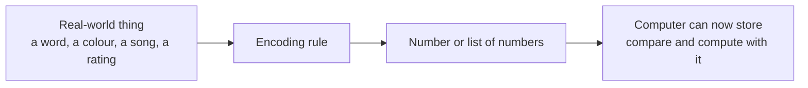

# Why Numbers Matter in AI

---

## Learning Objectives

By the end of this topic, you should be able to:

1. Explain why every AI system, no matter how intelligent it looks, is ultimately doing arithmetic on numbers
2. Describe how non-numeric things — words, images, sounds, preferences — are converted into numbers before an AI system can process them
3. Identify the numeric representation hiding behind an everyday AI feature — a recommendation, a translation, a search result
4. Tell the difference between the human way of understanding meaning and the machine's way of representing meaning as numbers
5. Explain why understanding "it's all numbers underneath" matters when you are specifying or verifying an AI system

---

## Overview

Think about the last time you used Google Maps. You typed in a destination, and the app instantly showed you the fastest route, estimated your arrival time, and warned you about traffic. None of that involved "understanding" in any human sense. Underneath every single step — your location, the map, the traffic data, the estimated time — there are only numbers. Numbers being compared, added, and processed billions of times per second.

This is the fundamental truth of every computer system ever built, including the most advanced AI models of 2026: **computers only understand numbers. Nothing else.** A computer chip does not understand the word "mango," the sound of a violin, or the feeling of happiness. It only ever operates on numbers.

As an AI engineer, you will rarely write the mathematics yourself — libraries and pretrained models handle that. But you must understand that everything — a customer review, a product photo, a spoken sentence, a resume — gets converted into numbers before any AI model can work with it. This understanding is what lets you reason clearly about why an AI system behaves the way it does, why it makes mistakes, and how to build and verify it responsibly.

---

## 6.1 What Is Numeric Representation?

**Numeric representation** is the process of converting any piece of real-world information — a word, an image, a sound, a preference — into a number or a set of numbers so that a computer can store, compare, and compute with it.

Computers are built from electronic circuits that can only reliably do one thing at the lowest level — represent whether a tiny switch is "on" or "off," written as 1 or 0. Every single thing a computer ever does — showing you a picture, playing a song, running a UPI transaction, generating a chatbot reply — is built from combinations of these 1s and 0s, arranged into numbers. There was never an alternative: if you want a machine to do anything at all, you must first find a way to express that "thing" as numbers.

### Key Terms

| Term | Simple Meaning |
|---|---|
| **Numeric representation** | Turning any real-world thing into a number or list of numbers |
| **Encoding** | The specific rule used to turn something into numbers — e.g., turning a letter into a number |
| **Feature** | One measurable property of something, expressed as a number — e.g., spiciness level rated 1 to 5 |
| **Data point** | One complete numeric description of a single real-world thing — e.g., all features describing one customer |

---

## 6.2 How Everyday Things Become Numbers

Let's see this with examples you already know — no AI involved yet:

- **Text → numbers:** Every character you type is stored as a number. The letter "A" is stored as the number 65 using a standard code called ASCII. Your phone doesn't "see" letters — it sees numbers, and only *displays* them to you as letters on screen.

- **Colour → numbers:** Every colour on a screen is represented as three numbers — how much Red, how much Green, how much Blue (each from 0 to 255). Pure white is `(255, 255, 255)`. Pure black is `(0, 0, 0)`. A mid-range orange is `(255, 140, 0)`.

- **Sound → numbers:** A song is stored as thousands of numbers per second, each representing the loudness of the sound wave at that exact instant.

- **Rating → numbers:** When you rate a Swiggy order 4 out of 5 stars, that "4" is already a number — no conversion needed.

---

## 6.3 Why This Matters for AI

Modern AI systems take this idea to an extraordinary scale. A single word like "mango" isn't represented by just one number — it's represented by a long list of numbers (often hundreds of them), where each number captures a tiny fragment of the *meaning* of the word. Is it a fruit? Is it sweet? Is it commonly used in cooking? Is it associated with summer? This special kind of numeric representation for meaning is called an **embedding** — you will study it in full depth in Topic 6.3 (Similarity and Meaning).

For now, the key idea to lock in is this: **before an AI model can "understand" or generate anything, that thing must first exist as numbers.**

This is not a limitation — it is the very foundation that makes computation possible at all.

---

## Worked Example — Representing a Customer Profile

**Scenario:** A food-delivery app wants to numerically represent a customer profile so an AI system can recommend restaurants.

Suppose we describe a customer using three simple numeric features:

| Feature | Meaning | Example Value |
|---|---|---|
| Average order value (₹) | How much the customer typically spends | 350 |
| Orders per month | How often the customer orders | 12 |
| Spice preference (1–5) | How spicy the customer likes food | 4 |

This customer can now be represented as a single row of numbers: **(350, 12, 4)**.

A real human being, with complex tastes and habits, has been reduced to three numbers. This is a simplification — we've deliberately left out cuisine preference, delivery time preference, and much more. But it is a *useful* simplification, because now the recommendation engine can mathematically compare this customer's numbers to thousands of other customers' numbers, find people with a similar profile, and suggest restaurants they enjoyed.

**Three questions to ask for any AI system you build:**
1. What real-world information does the system need?
2. What numeric features capture that information?
3. What might be lost in that simplification — and does it matter for this use case?

---

## Key Takeaways

- Every AI system — no matter how advanced — ultimately operates on numbers, because that is the only thing a computer's electronic circuits can represent
- Text, images, sound, and preferences are all converted into numbers through a process called **encoding** before any computation can happen
- A **feature** is one measurable numeric property of something. A **data point** is the complete numeric description of one real-world thing
- LLMs represent the meaning of words using a rich numeric representation called an **embedding** — covered fully in Topic 6.3
- "It's all numbers underneath" is not a weakness of AI — it is the foundation that makes computation possible at all
- Always ask what might be lost when real-world information is simplified into numbers — this is a core AI-oversight skill

> **Interview tip:** If asked "how does an AI model process text or images?", the strongest answer starts with "everything is first converted into a numeric representation" — before mentioning embeddings or neural networks. This shows you understand the foundation, not just the buzzwords.

---

## Reference Links

- 📎 [Google Machine Learning Crash Course — Introduction to ML](https://developers.google.com/machine-learning/crash-course) — beginner-friendly grounding in numeric feature representation
- 📎 [TensorFlow Embedding Projector](https://projector.tensorflow.org/) — visual tool for exploring how words are represented as numbers in real models
