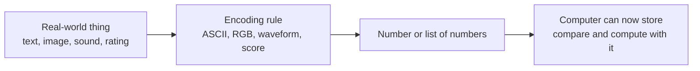

# Why Numbers Matter in AI

---

## Learning Objectives

By the end of this topic, you should be able to:

- Explain why every AI system, no matter how intelligent it looks, is ultimately doing arithmetic on numbers
- Describe how non-numeric things — words, images, sounds, preferences — are converted into numbers before an AI system can process them
- Tell the difference between structured data (already numeric) and unstructured data (requires encoding)
- Explain what normalisation is and why it matters for AI quality
- Identify the numeric representation hiding behind an everyday AI feature — a recommendation, a translation, a search result
- Explain why understanding "it's all numbers underneath" matters when you are specifying or verifying an AI system

---

## Overview

Think about the last time Spotify or YouTube recommended a song or video that felt like it was made exactly for you. You didn't ask for it. You didn't describe what you wanted. The app just knew. How?

It didn't "understand" your taste the way a friend would. It converted everything — every song you played, how long you listened, what you skipped, what you replayed — into numbers. Then it compared those numbers against millions of other users' numbers and found patterns. That's it. No magic. Just numbers, compared at scale.

This is the fundamental truth of every computer system ever built, including the most advanced AI models of 2026: **computers only understand numbers. Nothing else.** A computer chip does not understand the word "mango," the sound of a violin, or the feeling of happiness. It only ever operates on numbers.

As an AI engineer, you will rarely write the mathematics yourself — libraries and pretrained models handle that. But you must understand that everything — a customer review, a product photo, a spoken sentence, a resume — gets converted into numbers before any AI model can work with it. This understanding is what lets you reason clearly about why an AI system behaves the way it does, why it makes mistakes, and how to build and verify it responsibly.

---

## 6.1 What Is Numeric Representation?

**Numeric representation** is the process of converting any piece of real-world information — a word, an image, a sound, a preference — into a number or a set of numbers so that a computer can store, compare, and compute with it.

To understand why this is necessary, think of a light switch. A light switch has exactly two states — on or off. A computer chip is built from billions of tiny electronic switches, each of which is either on (1) or off (0). That's it. The entire computing world — every photo you've ever seen on a screen, every song you've ever streamed, every AI response you've ever received — is built from combinations of these 1s and 0s, arranged into numbers.

You might wonder: how do 1s and 0s become the number 65? Each position in a sequence of 1s and 0s represents a power of 2. For example:

```
01000001₂ = (0×128) + (1×64) + (0×32) + (0×16) + (0×8) + (0×4) + (0×2) + (1×1) = 65 → "A"
```

You don't need to know how to do this calculation — computers handle it automatically. But seeing it once makes the connection real: **every letter, every pixel, every sound is ultimately a pattern of on/off switches translated into a number.**

There was never an alternative. If you want a machine to do anything at all, you must first find a way to express that "thing" as numbers. The question is always: **how do we turn this real-world thing into numbers the machine can work with?**

### Key Terms

| Term | Simple Meaning |
|---|---|
| **Numeric representation** | Turning any real-world thing into a number or list of numbers |
| **Encoding** | The specific rule used to turn something into numbers — e.g., turning a letter into a number |
| **Feature** | One measurable property of something, expressed as a number — e.g., spiciness level rated 1 to 5 |
| **Data point** | One complete numeric description of a single real-world thing — e.g., all features describing one customer |

---

## 6.2 How Everyday Things Become Numbers

Here are the most common types of real-world data — and exactly how each one becomes numbers:

### Text → Numbers

Every character you type is stored as a number. The letter "A" is stored as the number 65 using a standard code called ASCII. "B" is 66. "a" (lowercase) is 97. Your phone doesn't "see" letters — it sees numbers, and only *displays* them to you as letters on screen.

When you send a WhatsApp message, what actually travels across the internet is a sequence of numbers — not letters. The receiving phone converts those numbers back into letters for you to read.

### Images → Numbers

A photo is not stored as a picture. It is stored as a grid of tiny dots called **pixels**. Each pixel is represented as exactly three numbers — how much Red, how much Green, and how much Blue it contains (each from 0 to 255). This is called the **RGB** system.

- Pure white = `(255, 255, 255)` — maximum of all three colours
- Pure black = `(0, 0, 0)` — none of any colour
- A warm orange = `(255, 140, 0)` — full red, some green, no blue

A standard smartphone photo is roughly 4000 × 3000 pixels. That means it is stored as **4000 × 3000 × 3 = 36 million numbers**. When an AI reads a medical X-ray or recognises your face with Face ID, it is processing tens of millions of numbers — not "looking at a picture" the way you do.

### Sound → Numbers

A song is stored as thousands of numbers per second, each representing the loudness of the sound wave at that exact instant. A standard audio file captures 44,100 measurements per second. A 3-minute song is roughly 3 × 60 × 44,100 = **7.9 million numbers**.

When Spotify's AI analyses your music taste, it is working with these numbers — comparing the patterns of your songs to patterns in millions of other songs.

### Ratings and Preferences → Numbers

When you rate a Netflix show 4 out of 5 stars, or give a thumbs up on YouTube, that is already a number — no conversion needed. Every click, every watch-time, every skip, every replay is recorded as a number. Netflix's recommendation engine is built entirely on these numbers, compared across hundreds of millions of users.



---

## 6.3 Structured vs Unstructured Data

Not all data starts out in the same state when it arrives at an AI system. This distinction matters — it affects how much work needs to be done before the AI can use it.

**Structured data** is already in a clean, numeric format — organised in rows and columns like a spreadsheet. Age, price, star rating, transaction amount — these are numbers already. An AI can use them directly with minimal preprocessing.

**Unstructured data** has no pre-defined numeric format. Text, images, audio, and video are all unstructured. They require complex encoding — converting to numbers using the methods in section 6.2 — before any AI can process them.

| Type | Examples | Ready for AI? |
|---|---|---|
| **Structured** | Age, price, rating, transaction amount | Yes — already numbers |
| **Unstructured** | Emails, photos, voice recordings, videos | No — must be encoded first |

Most of the world's data is unstructured — and most of the interesting AI applications (image recognition, language understanding, speech processing) deal with unstructured data. This is why encoding and representation are such foundational skills.

---

## 6.4 Normalisation — Making Numbers Play Fair

Here is a problem that surprises most beginners.

Suppose you are building an AI to recommend job candidates, and you represent each candidate with two features:

```
candidate = [annual_salary_expectation, years_of_experience]
```

For one candidate: `[800000, 3]` — salary expectation of ₹8 lakhs, 3 years of experience.

The salary number (800,000) is hundreds of thousands of times larger than the experience number (3). If you feed these raw numbers into an AI model, the model will naturally pay far more attention to salary — not because salary is more important, but simply because its numbers are bigger. The experience feature gets drowned out by the scale difference.

This is called a **scale problem** — and it silently breaks many AI systems.

**Normalisation** is the process of rescaling all features to a comparable range — typically 0 to 1 — so that no single feature dominates just because of the size of its numbers.

After normalisation:
```
salary:     800,000  →  0.65  (relative to min and max in dataset)
experience:       3  →  0.30  (relative to min and max in dataset)
```

Now both features are on the same scale. The AI can compare them fairly.

**Why this matters for AI quality:** An AI model trained on unnormalised data often produces poor or biased results — not because the algorithm is wrong, but because the numbers going in were unfair to begin with. Normalisation is one of the most important preprocessing steps in real AI engineering, and it is applied to almost every dataset before training.

---

## 6.5 Why This Matters for AI — Embeddings

The examples above are all straightforward conversions — one rule, one number or set of numbers. But modern AI systems go one step further.

A single word like "mango" isn't represented by just one number. It's represented by a **long list of numbers** — often hundreds of them — where each number captures a tiny fragment of the *meaning* of the word.

Here's what a real (simplified) embedding for "mango" might look like as a concept:

```
mango = [0.82, 0.91, 0.14, 0.73, 0.05, ...]
         ^      ^      ^      ^      ^
      fruit?  sweet? spicy? summer? vehicle?
```

Each number in that list represents how strongly "mango" relates to a particular concept — is it a fruit? (very yes — 0.82). Is it sweet? (very yes — 0.91). Is it a vehicle? (definitely no — 0.05).

The AI model learns these numbers automatically during training — by studying billions of sentences and noticing which words tend to appear in similar contexts. Words that appear in similar contexts end up with similar lists of numbers. "Mango" and "banana" end up with similar numbers. "Mango" and "car" end up with very different numbers.

This special kind of numeric representation for meaning is called an **embedding** — and it is the core concept that powers search engines, recommendation systems, translation tools, and RAG systems. You will work through the full mathematics of embeddings and how to measure similarity between them in the next topics of this unit.

For now, the key idea: **before an AI model can "understand" or generate anything, that thing must first exist as numbers.**

---

## 6.6 When Simplification Goes Wrong

Converting real-world things into numbers always involves simplification — and simplification always involves a choice about what to keep and what to leave out. That choice matters enormously.

**Example — credit scoring:**

A bank wants an AI to decide whether to approve a loan. It represents each applicant as a set of numbers:

```
applicant = [monthly_income, credit_score, years_employed]
```

This is useful — but what gets left out? Job stability beyond raw years. Family responsibilities. Regional economic conditions. Whether someone is self-employed vs salaried. The reason for a past credit issue.

An AI trained on these three numbers will make decisions based only on what it can see. If the training data historically approved fewer loans for people in certain regions — not because they were riskier, but because of past discriminatory lending — the AI will learn and repeat that pattern.

This is not a technology problem. It is a **representation problem** — the numbers chosen to represent the applicant did not fully or fairly capture the relevant reality.

**The question to always ask:** What real-world information gets lost when we convert this to numbers — and could that lost information matter for this use case?

---

## Worked Example — Netflix Recommendation System

**Scenario:** Netflix wants to numerically represent a user's viewing profile so its AI can recommend the next show.

Suppose Netflix describes each user using five simple numeric features:

| Feature | Meaning | Example Value |
|---|---|---|
| Average watch time per session (minutes) | How long they typically watch in one sitting | 85 |
| % of shows watched to completion | How often they finish what they start | 0.72 |
| Drama preference (1–10) | How much they like drama | 8 |
| Comedy preference (1–10) | How much they like comedy | 4 |
| Thriller preference (1–10) | How much they like thrillers | 7 |

This user can now be represented as a single row of numbers: **(85, 0.72, 8, 4, 7)**.

Netflix can now mathematically compare this user's numbers to millions of other users' numbers. Users with similar numbers tend to enjoy similar shows. If users who match this profile all loved a particular new thriller series, Netflix recommends it to this user too — purely based on the math of number similarity.

**What got left out?** Mood (the user might want comedy on Friday nights but thrillers on weekdays). Language preferences. Whether they're watching alone or with family. The AI only knows what the numbers tell it.

**Three questions to ask for any AI system you build:**
1. What real-world information does the system need?
2. What numeric features capture that information?
3. What might be lost in that simplification — and does it matter for this use case?

---

## Key Takeaways

- Every AI system — no matter how advanced — ultimately operates on numbers, because computers are built from electronic switches that only understand on (1) and off (0)
- Text, images, sound, and preferences are all converted into numbers through a process called **encoding** before any computation can happen
- Images are grids of pixels — each pixel is three RGB numbers. A single smartphone photo contains roughly 36 million numbers
- **Structured data** (age, price, rating) is already numeric. **Unstructured data** (text, images, audio) must be encoded into numbers first — most interesting AI deals with unstructured data
- **Normalisation** rescales features to a comparable range so no single feature dominates just because its raw numbers are bigger — a critical step in real AI engineering
- A **feature** is one measurable numeric property of something. A **data point** is the complete numeric description of one real-world thing
- LLMs represent the meaning of words using a rich numeric representation called an **embedding** — a long list of numbers where each number captures a fragment of meaning
- Converting real-world things into numbers always involves simplification — and what gets left out matters. Bad simplification leads to biased, unfair, or unreliable AI
- "It's all numbers underneath" is not a weakness of AI — it is the foundation that makes computation possible at all

> **Interview tip:** If asked "how does an AI model process text or images?", the strongest answer starts with "everything is first converted into a numeric representation" — before mentioning embeddings or neural networks. This shows you understand the foundation, not just the buzzwords.

---

## Reference Links

- 📎 [Google Machine Learning Crash Course — Introduction to ML](https://developers.google.com/machine-learning/crash-course) — beginner-friendly grounding in numeric feature representation
- 📎 [TensorFlow Embedding Projector](https://projector.tensorflow.org/) — visual tool for exploring how words are represented as numbers in real models
- 📎 [How computers represent colour — RGB explained](https://www.w3schools.com/colors/colors_rgb.asp) — simple interactive explanation of RGB number representation
- 📎 [Google ML Crash Course — Normalisation](https://developers.google.com/machine-learning/data-prep/transform/normalization) — official explanation of why and how normalisation is applied before training
