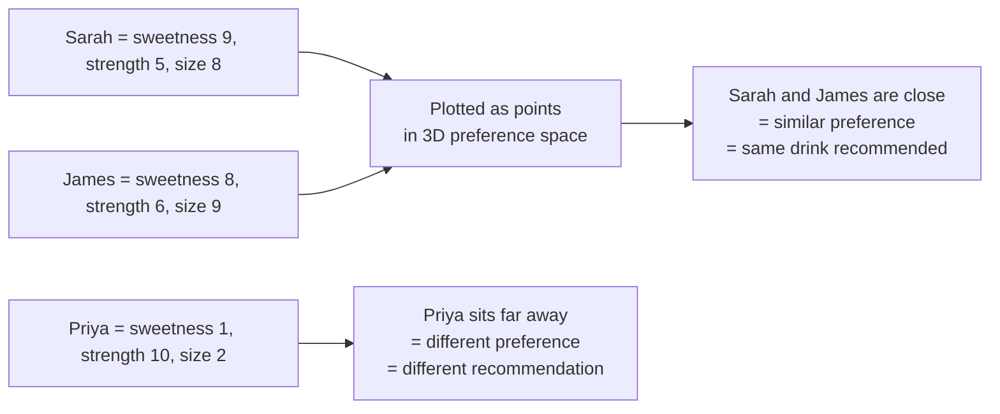

# Scalars, Vectors and Matrices


---

## Learning Objectives

By the end of this topic, you should be able to:

- Explain the difference between a scalar, a vector, and a matrix using simple everyday examples
- Describe how a vector can represent multiple properties of one thing at the same time
- Identify whether a piece of data is best represented as a scalar, a vector, or a matrix
- Construct a simple 2D or 3D vector by hand and perform basic operations — addition and scaling
- Explain why the order of components in a vector must stay consistent and what goes wrong if it doesn't
- Describe what high-dimensional vectors look like in real AI systems and why more dimensions capture more nuance
- Explain how a vector can be visualised as a point in space and why closeness means similarity

---

## Overview

You now know that AI systems represent everything as numbers. But numbers alone are not enough — we also need precise vocabulary for *how many* numbers, and *how they are organised*, because this organisation is the backbone of almost all AI mathematics you will encounter in this program.

Think of it like containers in a kitchen. A single cup holds one thing. A tray holds multiple cups arranged in a row. A shelf holds multiple trays stacked together. Scalars, vectors, and matrices follow the same idea — they are just different ways of organising numbers depending on how complex the information is.

There are three building blocks to know: the **scalar** (a single number), the **vector** (a list of numbers describing multiple properties of one thing), and the **matrix** (a grid of numbers — essentially many vectors stacked together). These are not just abstract maths terms. They are the actual data structures that sit underneath every AI feature you will build or oversee — from a simple recommendation system to a full large language model.

---

## Scalars — A Single Number Representing One Property

A **scalar** is just a single number that represents one property of something, with no other numbers attached to it.

**Everyday examples:**
- Today's temperature: `32°C`
- Your exam score: `78 marks`
- The price of a cup of coffee: `$3.50`

A scalar answers exactly one question: "how much of this one thing?" Nothing more.

---

## Vectors — A List of Numbers Representing Multiple Properties at Once

A **vector** is an ordered list of numbers that together describe multiple properties of the *same* thing at the *same* time.

**Why this exists:** Real-world things are rarely described by just one number. A student isn't just "one mark" — they have marks in Maths, Science, and English. A vector bundles all of these related numbers into a single, organised unit so we can treat "this student's performance" as *one* mathematical object instead of three separate, disconnected numbers.

**Notation explained:**

```
v = [78, 85, 92]
```

- `v` is just the name we give this vector — it could be called anything
- The **square brackets `[ ]`** signal "this is a single vector, a bundled group of numbers"
- Each number inside is called a **component** or **dimension** of the vector
- The **order matters** — `[78, 85, 92]` (Maths, Science, English) is a completely different vector from `[92, 85, 78]` (English, Science, Maths) even though it contains the same three numbers, because each *position* has an agreed meaning
- The **number of components** is called the vector's **dimensionality** — this vector is 3-dimensional because it has 3 components

### Student Marks Vector — Worked Example

Ravi scored 78 in Maths, 85 in Science, and 92 in English:

```
Ravi = [78, 85, 92]     (a 3-dimensional vector)
```

Priya scored 90 in Maths, 60 in Science, and 70 in English:

```
Priya = [90, 60, 70]    (also a 3-dimensional vector)
```

Both are now represented as 3D vectors using the same three positions — which means we can now meaningfully compare them mathematically using tools like the **dot product and cosine similarity**, which you will work through in the next topic of this unit.

### Basic Vector Operations — Adding and Scaling

You don't need to do complex maths to work with vectors. The two most basic operations are simple and intuitive:

**Adding two vectors — combine two profiles into one**

Adding vectors means adding each matching component together. Imagine Ravi and Priya collaborate on a group project and you want to combine their marks profiles:

```
Ravi  = [78, 85, 92]
Priya = [90, 60, 70]

Ravi + Priya = [78+90, 85+60, 92+70]
             = [168, 145, 162]
```

Each position adds to its matching position. Maths adds to Maths, Science to Science, English to English. You never mix positions.

In AI, vector addition is used to combine information — for example, combining a user's past preferences with their current session behaviour to create an updated profile.

**Scaling a vector — amplify or reduce everything equally**

Multiplying a vector by a single number (a scalar) scales every component by that amount:

```
Ravi = [78, 85, 92]

2 × Ravi = [2×78, 2×85, 2×92]
         = [156, 170, 184]
```

Every number doubled — but the *shape* of the profile stays the same. Ravi is still strongest in English, weakest in Maths — just at double the scale.

Think of it like turning up the volume on a speaker. The song doesn't change — it just gets louder. Scaling a vector changes its size, not its direction.

### Why Order Matters — What Goes Wrong If You Mix It Up

This is easy to say but important to see. Suppose you store two students' marks but accidentally swap the column order for one of them:

```
Ravi  = [78, 85, 92]   — correct: [Maths, Science, English]
Priya = [70, 60, 90]   — accidentally stored as: [English, Science, Maths]
```

Now when you compare them, the system thinks:
- Ravi's Maths (78) vs Priya's English (70) — wrong comparison
- Ravi's English (92) vs Priya's Maths (90) — wrong comparison

The AI confidently processes these numbers — but it is comparing the wrong things. The result looks perfectly valid but is completely meaningless. No error message. No warning. Just silently wrong output.

This is one of the most common real-world data bugs in AI systems — and it is entirely a human error, not a model error.

### High-Dimensional Vectors — What Real AI Embeddings Look Like

So far all our examples have used 2D or 3D vectors — small enough to picture. But real AI embeddings are much larger.

When an LLM like Claude or GPT converts the word "mango" into a vector, that vector might have **1,536 dimensions** — meaning 1,536 numbers, each capturing a tiny fragment of meaning:

```
mango = [0.82, 0.14, 0.73, 0.05, 0.91, 0.33, ... 1,536 numbers total]
```

Each number answers a question like: is this a food? is it sweet? is it tropical? does it appear in recipes? does it appear in summer contexts? — and so on, for 1,536 different learned dimensions.

You cannot draw or visualise 1,536 dimensions — but the mathematics works exactly the same way as a 2D or 3D vector. Close vectors = similar meaning. Far apart = different meaning. The only difference is scale.

**Why so many dimensions?** Human language is incredibly nuanced. A 3-dimensional vector can capture three rough properties of a word. A 1,536-dimensional vector can capture extremely subtle shades of meaning — the difference between "happy" and "content," or between "house" and "home." More dimensions = more nuance = better understanding.

### Dimension Arithmetic — Why All Vectors in an Operation Must Match
 
This is a rule that every fresher hits as a real error the first time they use embeddings in code — so it is worth understanding before you get there.
 
**The rule is simple: you can only perform operations between vectors that have the same number of dimensions.**
 
Think of it like adding two lists of exam scores. If Ravi's scores are recorded as three subjects (Maths, Science, English) and Priya's scores are recorded as two subjects (Maths, Science), you cannot add them together — there is no English position in Priya's vector to match against Ravi's English score. The lists are fundamentally incompatible.
 
```
Ravi  = [78, 85, 92]    ← 3 dimensions
Priya = [90, 60]        ← 2 dimensions
 
Ravi + Priya = ???      ← impossible — the dimensions do not match
```
 
**In real AI systems, this matters enormously:**
 
Every embedding model outputs vectors of a fixed, consistent dimension. OpenAI's `text-embedding-3-small` always outputs 1,536 dimensions. Google's `text-embedding-gecko` always outputs 768 dimensions. If you try to calculate cosine similarity between a 1,536-dimension vector and a 768-dimension vector — for example, by mixing embeddings from two different models — the operation is mathematically impossible and your code will throw an error.
 
**The practical rule:**
- All vectors you compare, add, or compute similarity between must come from the **same embedding model**
- Never mix embeddings from different models in the same operation — even if both models seem to do the same job
- When you switch to a new embedding model, you must re-embed everything in your database using the new model before you can search or compare
**Why fixed dimensions matter for AI product design:**
If you build a search feature using OpenAI embeddings today, and next year you switch to a cheaper model that outputs 768 dimensions, you cannot simply run new queries against the old stored embeddings. You must re-embed your entire document database at the new dimension size. This is a real engineering migration cost that many teams discover too late — understanding dimension arithmetic now means you will plan for it in advance.

---

## Matrices — Grids of Numbers

A **matrix** (plural: matrices) is a rectangular grid of numbers arranged in rows and columns. Think of a matrix as many vectors stacked on top of each other.
 
```
        Maths  Science  English
Ravi  [  78,     85,      92   ]
Priya [  90,     60,      70   ]
Aisha [  55,     95,      80   ]
```
 
- Each **row** is one student's full vector of marks
- Each **column** represents one subject across all students
- The size of this matrix is **3 × 3** — 3 students, 3 subjects
  
**Why AI uses matrices:** AI models need to process not just one data point at a time, but thousands or millions at once. Instead of handling each vector one by one, matrices let a computer store and process all of them together using extremely fast, optimised calculations. Specialised computer chips called GPUs are exceptionally good at matrix mathematics — this is one of the biggest reasons modern deep learning became practical.
 
> You do not need to perform matrix calculations by hand to work as an AI engineer — libraries handle that. But you must recognise a matrix when you see one — a spreadsheet of customer data, a table of product features — and understand it is simply "many vectors, stacked."
 
**One thing to watch for — scale differences across columns:**
 
Look at a real customer matrix:
 
```
        AvgOrderValue   OrdersThisYear
Alex  [     120,              8      ]
Maria [      30,             45      ]
James [     250,              3      ]
```
 
Order value (30–250) and order count (3–45) are on completely different scales. An AI working with these raw numbers will naturally pay far more attention to order value — not because it matters more, but simply because its numbers are bigger. This is exactly why **normalisation** (rescaling all columns to a comparable range) is applied before training — so every feature gets a fair say, regardless of the size of its raw numbers.
 
---

## A Vector as a Point in Space — Coffee Order Profile Example

Here is one of the most powerful ideas in this topic: **a vector is not just a list of numbers — it can be visualised as a single point in space.**

Suppose a café app describes each customer's coffee preference using three scores, each from 0 (low) to 10 (high):

```
preference = [sweetness, strength, size]
```

Meet Sarah — she likes her coffee very sweet, moderately strong, and large:

```
Sarah = [9, 5, 8]
```

We can plot Sarah as a single point in 3-dimensional space, where X = sweetness, Y = strength, Z = size.

Now meet James:

```
James = [8, 6, 9]
```

Because Sarah's point and James's point are *close together* in this 3D coffee-preference space, we can say their preferences are *similar* — and the app would confidently recommend the same new seasonal drink to both of them.

Now meet Priya — she likes strong, unsweetened, small espresso shots:

```
Priya = [1, 10, 2]
```

Priya's point sits far away from both Sarah and James in this space — the app would recommend her something completely different.



This exact idea — **vectors that are close together in space represent similar things** — is the single most important concept underlying embeddings, search, and recommendation systems. The mathematical tool for measuring this closeness precisely is called **cosine similarity**, which you will work through step by step in the next topic.

---

## Scalar vs Vector vs Matrix — Side by Side

| Aspect | Scalar | Vector | Matrix |
|---|---|---|---|
| What it is | A single number | An ordered list of numbers | A grid of numbers (rows × columns) |
| Describes | One property of one thing | Multiple properties of one thing | Multiple properties of many things |
| Everyday example | Temperature (32°C) | A student's marks in 3 subjects | A whole class's marks in 3 subjects |
| Can be visualised as | A point on a number line | A point or arrow in space | A table or stacked set of vectors |
| Typical AI use | A single setting (e.g., temperature = 0.7) | One embedding or one data point | A dataset or a batch of embeddings |

---

## Best Practices

- Before you build or specify any AI feature, ask: "is this piece of data one number (scalar), multiple properties of one thing (vector), or multiple things at once (matrix)?" — getting this right shapes how you describe requirements to a developer or an AI tool
- Keep the *order and position* of a vector's components consistent across all your data points — comparing `[Maths, Science, English]` to `[English, Science, Maths]` would silently produce meaningless results

## Common Beginner Mistakes

- Confusing a vector's *dimensionality* (number of components) with physical 3D space — vectors can have hundreds or thousands of dimensions, as real AI embeddings do, even though we can only comfortably draw up to 3 dimensions
- Thinking a matrix is a completely different concept from a vector — a matrix is just several vectors stacked together
- Forgetting that the order of components in a vector must mean the same thing across every data point being compared

---


## Key Takeaways

- A **scalar** is a single number describing one property — e.g., today's temperature
- A **vector** is an ordered list of numbers describing multiple properties of the same thing at once — e.g., a student's marks in 3 subjects
- The **dimensionality** of a vector is simply how many numbers it contains
- **Vector addition** combines two vectors by adding matching components — used in AI to combine or update profiles
- **Scalar multiplication** scales every component by the same number — changes the size of the vector but not its direction
- The **order of components** in a vector must be consistent across every data point — mixing up the order produces silently wrong results with no error message
- Real AI embeddings have **hundreds or thousands of dimensions** — more dimensions capture more nuance in meaning, but the maths works exactly the same as a 2D or 3D vector
- A **matrix** is a grid of numbers — many vectors stacked into rows and columns — used to represent many things at once
- A vector can be visualised as a **point in space** — vectors that are close together represent things that are similar to each other
- This closeness = similarity idea, measured mathematically using **cosine similarity**, is the foundation for embeddings, recommendation systems, and search

> **Interview tip:** Be ready to explain the difference between a scalar, a vector, and a matrix in one sentence each, with a real-world example for each. This is a very common conceptual check in AI and data roles.

---

## Reference Links

- 📎 [Google Machine Learning Crash Course — Embeddings](https://developers.google.com/machine-learning/crash-course) — foundational reading on vectors in ML
- 📎 [TensorFlow Embedding Projector](https://projector.tensorflow.org/) — visual tool for exploring high-dimensional vectors
- 📎 [3Blue1Brown — Vectors, what even are they?](https://www.youtube.com/watch?v=fNk_zzaMoSs) — excellent visual intuition for vectors as points in space, no prior maths required
