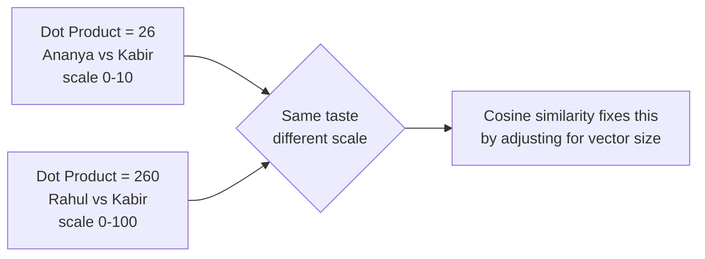
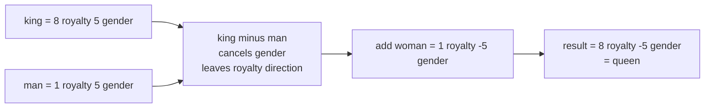
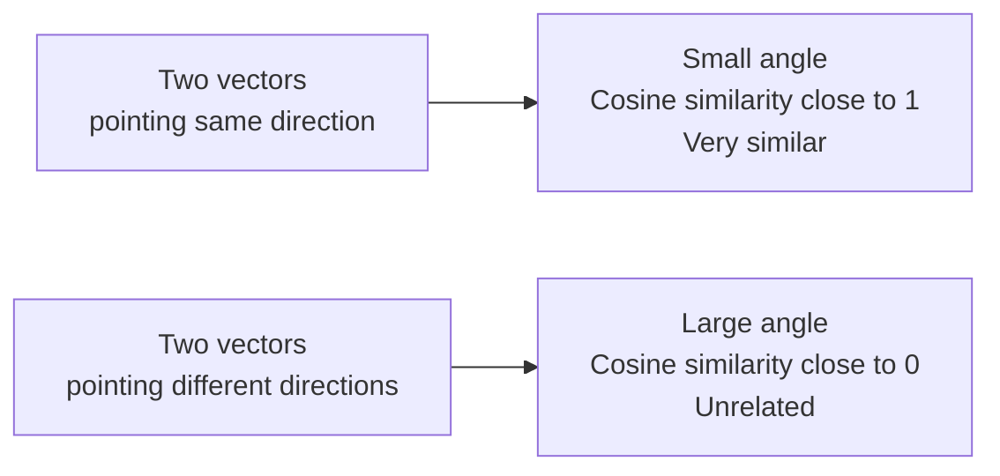

# Similarity and Meaning

## Learning Objectives

By the end of this topic, you should be able to:

- Explain what an embedding is and why AI systems use them to represent meaning
- Calculate the dot product of two simple vectors by hand
- Explain why the dot product alone is not enough to measure similarity fairly
- Calculate the cosine similarity between two vectors by hand and interpret what the result means
- Describe why vector arithmetic on embeddings like "king − man + woman ≈ queen" works
- Tell the difference between the dot product and cosine similarity and when to use each

---

## Overview

You already know that a vector is a list of numbers, and that vectors close together in space represent similar things. Now the question is: **how do you actually measure how close two vectors are?**

Think about how Spotify recommends your next song. It doesn't just look at genre. Every song in Spotify's library has a numeric fingerprint — a vector capturing its tempo, energy, mood, and more. When you finish a song, Spotify finds the songs whose fingerprints are most similar to what you just played. The closer the fingerprints, the more likely you'll enjoy it.

This topic gives you the two mathematical tools that make this possible:

- **The dot product** — a quick way to get a similarity score between two vectors
- **Cosine similarity** — a more precise version that works fairly regardless of vector size

And it introduces **embeddings** — the special kind of vector that AI models use to represent the meaning of words, sentences, and images, not just simple properties like tempo or mood.

You will calculate both by hand, with small numbers. Not because you'll do this manually in real work — but because seeing the maths once makes everything else click. When you later use search, RAG, or recommendation systems, you'll know exactly what is happening under the hood.

---

## 6.12 The Dot Product — A Quick Similarity Score

The dot product is the simplest way to get a single number that tells you how similar two vectors are.

**The rule in plain English: multiply each matching pair of numbers together, then add everything up.**

That's it. Multiply and add.

**Example — two students' music taste:**

Suppose we rate two students on how much they like pop music and rock music, each scored from 0 to 10:

```
Ananya = [4, 3]   — pop score: 4, rock score: 3
Kabir  = [5, 2]   — pop score: 5, rock score: 2
```

Step 1 — multiply each matching pair:
- Pop scores: 4 × 5 = 20
- Rock scores: 3 × 2 = 6

Step 2 — add the results:
- 20 + 6 = **26**

The dot product of Ananya and Kabir is **26**.

### Why the Dot Product Alone Is Not Enough

Here is the problem with the dot product on its own — it is affected by the size of the numbers, not just the similarity of the pattern.

Imagine a third person, Rahul, who has the exact same music taste as Ananya — but he used a 0 to 100 scale instead of 0 to 10:

```
Ananya = [4,  3]   — 0 to 10 scale
Rahul  = [40, 30]  — same taste, 0 to 100 scale
```

Dot product of Ananya and Kabir: **26** (calculated above)

Dot product of Rahul and Kabir:
- 40 × 5 = 200
- 30 × 2 = 60
- 200 + 60 = **260**

Rahul gets a score of 260 — ten times bigger than Ananya's 26 — even though their taste is identical. The only difference is the scale.

This means the dot product can mislead you. Two people can have identical taste but very different dot product scores just because one used a bigger rating scale.

**The fix:** cosine similarity — which adjusts for the size of the vectors and gives a fair comparison regardless of scale. That is exactly what the next section covers.



---

## 6.13 Embeddings — How AI Represents Meaning as Numbers

A computer cannot compare the meaning of two words like "mango" and "banana" directly — it can only compare numbers. An **embedding** solves this by converting every word into a vector, placed at a specific point in a numeric space, such that words with similar meaning end up close together.

**How does the model decide where to place each word?**

During training, the model reads billions of sentences and notices which words tend to appear in similar contexts. "Mango" and "banana" both appear in sentences like:

- "I had a ___ for breakfast"
- "___ smoothie is delicious"
- "She bought a ___ from the market"

Because they appear in similar contexts, the model gradually moves their vectors close together. "Car" appears in completely different contexts — so it ends up far away.

Nobody manually decides where mango goes. The model discovers the positions automatically by studying patterns across billions of sentences.

**A simplified example — for intuition only:**

Real embeddings have hundreds of dimensions. Imagine a simplified 2-dimensional space:

```
mango  = [9, 0]   — very much a fruit, not a vehicle
banana = [9, 1]   — very similar to mango
car    = [0, 9]   — not a fruit at all, very much a vehicle
```

Even in this toy example, "mango" and "banana" sit close together while "car" sits far away — exactly the pattern real embeddings produce, just with far more nuanced, machine-learned dimensions.

---

## 6.14 Why "King − Man + Woman ≈ Queen" Works

This famous example shows something remarkable: you can do **arithmetic on meaning itself** using embeddings.

**The intuition first — before the maths:**

Think of it like directions on a map. The relationship between "king" and "queen" is the same as the relationship between "man" and "woman" — they differ only in gender, not in role or status. If you know the direction from "man" to "woman" (the gender direction), you can apply that same direction to "king" and arrive at "queen."

Vector arithmetic lets you do exactly this.

**Simplified toy embedding (2 dimensions: royalty score, gender score):**

```
king  = [8,  5]   — high royalty, male
man   = [1,  5]   — low royalty, male
woman = [1, -5]   — low royalty, female
queen = [8, -5]   — high royalty, female
```

**Step 1 — king − man (subtract matching components):**
```
king − man = [8−1,  5−5] = [7, 0]
```

Result `[7, 0]` = pure royalty, gender cancelled out. Both king and man had the same gender score (5), so subtracting removed the gender completely. What's left is just the "royalty" direction.

**Step 2 — add woman:**
```
[7, 0] + [1, −5] = [8, −5]
```

**Result = [8, −5]** — which matches queen exactly.

In a real embedding space with hundreds of dimensions learned from billions of words, the result doesn't land exactly on "queen" — but it lands very close to it, closer than almost any other word. This is why it is written as an approximation: `king − man + woman ≈ queen`.



---

## 6.15 Cosine Similarity — A Fair Similarity Score That Ignores Size

Cosine similarity fixes the dot product's scale problem by measuring the **angle** between two vectors — not their length.

**The intuition:**

Imagine two arrows drawn from the same starting point. If they point in almost the same direction, the angle between them is small — the things they represent are similar. If they point in completely different directions, the angle is large — the things they represent are unrelated.

Cosine similarity converts this angle into a score between −1 and 1:

- **1** = pointing in exactly the same direction — maximally similar
- **0** = at a right angle — completely unrelated
- **−1** = pointing in exactly opposite directions



**How it is calculated:**

```
cosine_similarity(A, B) = (A · B) / (|A| × |B|)
```

- `A · B` — the dot product (multiply matching pairs, add up)
- `|A|` — the **magnitude** of A — simply the length of the vector, calculated as `√(a1² + a2²)`
- Dividing by both magnitudes cancels out the size effect — leaving only the direction

**What is magnitude?** Think of a vector as an arrow. The magnitude is just the length of that arrow. A short arrow and a long arrow can point in the same direction — cosine similarity treats them as identical because only the direction matters, not the length.

### Full Worked Calculation

```
A = [3, 4]
B = [6, 8]
```

Step 1 — Dot product:
```
A · B = (3 × 6) + (4 × 8) = 18 + 32 = 50
```

Step 2 — Magnitude of A:
```
|A| = √(3² + 4²) = √(9 + 16) = √25 = 5
```

Step 3 — Magnitude of B:
```
|B| = √(6² + 8²) = √(36 + 64) = √100 = 10
```

Step 4 — Cosine similarity:
```
cosine_similarity(A, B) = 50 / (5 × 10) = 50 / 50 = 1
```

**Interpretation:** A cosine similarity of **1** means A and B point in exactly the same direction. Notice that B = 2 × A — B is longer, but they point the same way. Cosine similarity correctly identifies them as identical in direction despite the size difference — exactly the problem the dot product failed at.

**The four steps — quick reference for revision and interviews:**
1. Calculate the dot product — multiply matching pairs and add
2. Calculate the magnitude of A — square each component, add, take the square root
3. Calculate the magnitude of B — same process
4. Divide the dot product by (magnitude of A × magnitude of B)

### Second Example — Unrelated Vectors

```
A = [3, 4]
C = [4, -3]
```

```
A · C = (3 × 4) + (4 × −3) = 12 − 12 = 0
cosine_similarity(A, C) = 0 / (5 × 5) = 0
```

**Interpretation:** A cosine similarity of **0** means completely unrelated — in a real embedding space, the two words or sentences share no meaningful connection.

### Dot Product vs Cosine Similarity — Side by Side

| Aspect | Dot Product | Cosine Similarity |
|---|---|---|
| Affected by vector size? | Yes — bigger numbers, bigger score | No — size cancelled out by dividing |
| Range of values | Any number — unbounded | Always between −1 and 1 |
| What it measures | Direction and size combined | Pure direction — angle only |
| When to use | Quick calculation, building block | Comparing embeddings fairly |

---

## 6.16 How a Real AI System Uses Cosine Similarity

When you type a search query into Google, ask a question to a RAG chatbot, or get a recommendation on Netflix — here is what actually happens:

1. Your query is converted into an embedding vector
2. Every item in the database (every document, every product, every song) also has an embedding vector — calculated in advance
3. The system calculates the cosine similarity between your query vector and every item vector
4. It ranks the items from highest similarity to lowest
5. It returns the top results — the ones most similar in meaning to your query

**Worked Example — RAG assistant finding the right product:**

A customer types: "I want something sweet to drink in the morning"

```
Query vector            Q = [3, 4]   — sweet, morning
Product A: mango juice  A = [6, 8]   — very sweet, very morning
Product B: black coffee B = [4, -3]  — not sweet, opposite vibe
```

Cosine similarity (Q, A):
```
Q · A = (3×6) + (4×8) = 18 + 32 = 50
|Q| = √(3² + 4²) = √(9 + 16) = √25 = 5
|A| = √(6² + 8²) = √(36 + 64) = √100 = 10
cosine_similarity = 50 / (5 × 10) = 1.0
```

Cosine similarity (Q, B):
```
Q · B = (3×4) + (4×−3) = 12 − 12 = 0
|Q| = 5
|B| = √(4² + 3²) = √(16 + 9) = √25 = 5
cosine_similarity = 0 / (5 × 5) = 0
```

Product A scores 1.0 — perfect match. Product B scores 0 — completely unrelated. The system returns mango juice. In a real system this same calculation runs across thousands of products in milliseconds. Notice that all square roots give clean whole numbers — no decimals needed.

---

## Key Takeaways

- The **dot product** multiplies matching components and adds the results — quick but affected by vector size, so it can mislead when vectors use different scales
- An **embedding** is a vector that represents meaning — learned automatically by studying billions of sentences, placing similar words close together in numeric space
- Vector arithmetic on embeddings (`king − man + woman ≈ queen`) works because embeddings capture relationships as consistent directions in space
- **Magnitude** is simply the length of a vector — calculated as the square root of the sum of squared components
- **Cosine similarity** divides the dot product by both magnitudes — giving a fair similarity score between −1 and 1 that is not affected by vector size
- Cosine similarity of 1 = same direction (maximally similar). 0 = unrelated. −1 = opposite
- This exact maths — embeddings + cosine similarity — powers every search engine, recommendation system, and RAG application you will build in this program

> **Interview tip:** Be ready to compute a dot product and a cosine similarity by hand for two small 2D vectors. Practice the four steps: dot product → magnitude of A → magnitude of B → divide. Also be ready to explain *why* cosine similarity is preferred over the raw dot product — the scale problem with Rahul vs Ananya is the perfect example to use.

---

## Reference Links

- 📎 [Google ML Crash Course — Embeddings](https://developers.google.com/machine-learning/crash-course) — official beginner-friendly coverage of embeddings and similarity
- 📎 [TensorFlow Embedding Projector](https://projector.tensorflow.org/) — visually explore real word embeddings and their similarity clusters
- 📎 [3Blue1Brown — Dot products and duality](https://www.youtube.com/watch?v=LyGKycYT2v0) — visual intuition for the dot product with no prior maths required
