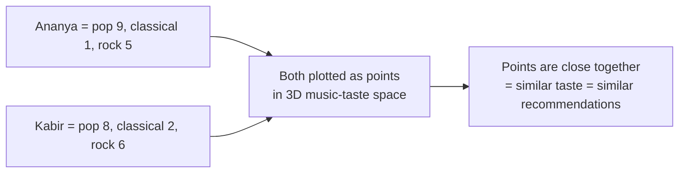

# Scalars, Vectors and Matrices

*Numbers, Vectors and Meaning — BTech Semester 1*

---

## Learning Objectives

By the end of this topic, you should be able to:

1. Explain the difference between a scalar, a vector, and a matrix using simple everyday examples
2. Describe how a vector can represent multiple properties of one thing at the same time
3. Identify whether a piece of data is best represented as a scalar, a vector, or a matrix
4. Construct a simple 2D or 3D vector by hand for a real-world scenario
5. Explain how a vector can be visualised as a point in space

---

## Overview

In Topic 6.1, you learned that AI systems represent everything as numbers. Now we need precise vocabulary for *how many* numbers, and *how they are organised* — because this organisation is the backbone of almost all AI mathematics you will encounter in this program.

Think of it like containers in a kitchen. A single cup holds one thing. A tray holds multiple cups arranged in a row. A shelf holds multiple trays stacked together. Scalars, vectors, and matrices follow the same idea — they are just different ways of organising numbers depending on how complex the information is.

There are three building blocks to know: the **scalar** (a single number), the **vector** (a list of numbers describing multiple properties of one thing), and the **matrix** (a grid of numbers — essentially many vectors stacked together). These are not just abstract maths terms. They are the actual data structures that sit underneath every AI feature you will build or oversee.

---

## 6.1 Scalars — A Single Number Representing One Property

A **scalar** is just a single number that represents one property of something, with no other numbers attached to it.

**Everyday examples:**
- Today's temperature: `32°C`
- Your exam score: `78 marks`
- The price of a cup of chai: `₹20`

A scalar answers exactly one question: "how much of this one thing?" Nothing more.

---

## 6.2 Vectors — A List of Numbers Representing Multiple Properties at Once

A **vector** is an ordered list of numbers that together describe multiple properties of the *same* thing at the *same* time.

**Why this exists:** Real-world things are rarely described by just one number. A student isn't just "one mark" — they have marks in Maths, Science, and English. A vector bundles all of these related numbers into a single, organised unit so we can treat "this student's performance" as *one* mathematical object instead of three separate, disconnected numbers.

**Notation explained:**

```
v = [78, 85, 92]
```

- `v` is just the name we give this vector — it could be called anything
- The square brackets `[ ]` signal "this is a single vector, a bundled group of numbers"
- Each number inside is called a **component** or **dimension** of the vector
- The **order matters** — `[78, 85, 92]` (Maths, Science, English) is a completely different vector from `[92, 85, 78]` even though it contains the same three numbers
- The **number of components** is the vector's **dimensionality** — this vector is 3-dimensional because it has 3 components

### Student Marks Vector — Worked Example

Ravi scored 78 in Maths, 85 in Science, and 92 in English:

```
Ravi = [78, 85, 92]     (a 3-dimensional vector)
```

Priya scored 90 in Maths, 60 in Science, and 70 in English:

```
Priya = [90, 60, 70]    (also a 3-dimensional vector)
```

Both are now represented as 3D vectors using the same three positions — which means we can now meaningfully compare them mathematically. You will learn exactly how in Topic 6.3.

---

## 6.3 Matrices — Grids of Numbers

A **matrix** (plural: matrices) is a rectangular grid of numbers arranged in rows and columns. Think of a matrix as many vectors stacked on top of each other.

```
        Maths  Science  English
Ravi  [  78,     85,      92   ]
Priya [  90,     60,      70   ]
Aisha [  55,     95,      80   ]
```

- Each **row** is one student's full vector of marks
- Each **column** represents one subject across all students
- The size of this matrix is **3 × 3** — 3 students, 3 subjects

**Why AI uses matrices:** AI models need to process not just one data point at a time, but thousands or millions at once. Instead of handling each vector one by one, matrices let a computer store and process all of them together using extremely fast, optimised calculations. Specialised computer chips (GPUs) are exceptionally good at matrix mathematics — this is one of the biggest reasons modern deep learning became practical.

> You do not need to perform matrix calculations by hand to work as an AI engineer — libraries handle that. But you must recognise a matrix when you see one — a spreadsheet of customer data, a table of product features — and understand that it is simply "many vectors, stacked."

---

## 6.4 A Vector as a Point in Space — Music Taste Example

Here is one of the most powerful ideas in this topic: **a vector is not just a list of numbers — it can be visualised as a single point in space.**

Suppose we rate someone's music taste on three scales, each from 0 (dislike) to 10 (love):

```
taste = [pop_score, classical_score, rock_score]
```

Meet Ananya — she loves pop, dislikes classical, and somewhat likes rock:

```
Ananya = [9, 1, 5]
```

We can plot Ananya as a single point in 3-dimensional space, where X = pop score, Y = classical score, Z = rock score.

Now meet Kabir:

```
Kabir = [8, 2, 6]
```

Because Ananya's point and Kabir's point are *close together* in this 3D music-taste space, we can say their taste is *similar* — and a music streaming app could suggest Kabir's favourite playlists to Ananya. This exact idea — vectors that are close together in space represent similar things — is the single most important concept underlying embeddings, search, and recommendation systems. You will formalise the maths behind "closeness" in Topic 6.3.



### Scalar vs Vector vs Matrix — Side by Side

| Aspect | Scalar | Vector | Matrix |
|---|---|---|---|
| What it is | A single number | An ordered list of numbers | A grid of numbers (rows × columns) |
| Describes | One property of one thing | Multiple properties of one thing | Multiple properties of many things |
| Everyday example | Temperature (32°C) | A student's marks in 3 subjects | A whole class's marks in 3 subjects |
| Can be visualised as | A point on a number line | A point or arrow in space | A table or stacked set of vectors |
| Typical AI use | A single setting (e.g., temperature = 0.7) | One embedding or one data point | A dataset or a batch of embeddings |

---

## Worked Example — E-Commerce Customer Vectors

**Scenario:** Represent three customers as vectors of two features — average order value (₹) and number of orders this year — then organise them into a matrix.

| Customer | Avg Order Value (₹) | Orders This Year |
|---|---|---|
| Rahul | 1200 | 8 |
| Sneha | 300 | 45 |
| Vikram | 2500 | 3 |

Individual vectors:
```
Rahul  = [1200, 8]
Sneha  = [300, 45]
Vikram = [2500, 3]
```

Combined as a matrix (3 customers × 2 features = a 3×2 matrix):
```
         AvgOrderValue   OrdersThisYear
Rahul  [    1200,              8      ]
Sneha  [     300,             45      ]
Vikram [    2500,              3      ]
```

**What this tells us:** Rahul and Vikram both spend a lot per order but order rarely — occasional big spenders. Sneha orders frequently but spends less each time — a frequent small spender. Plotting these as points on a 2D graph, Rahul and Vikram would appear close together while Sneha sits far apart — the numbers already tell the story.

---

## Key Takeaways

- A **scalar** is a single number describing one property — e.g., today's temperature
- A **vector** is an ordered list of numbers describing multiple properties of the same thing at once — e.g., a student's marks in 3 subjects
- The **dimensionality** of a vector is simply how many numbers it contains
- The **order of components** in a vector must be consistent across every data point being compared — mixing up the order produces meaningless results
- A **matrix** is a grid of numbers — many vectors stacked into rows and columns — used to represent many things at once
- A vector can be visualised as a **point in space** — vectors that are close together represent things that are similar to each other
- This "closeness = similarity" idea is the foundation for embeddings, recommendation systems, and search — covered in Topic 6.3

> **Interview tip:** Be ready to explain the difference between a scalar, a vector, and a matrix in one sentence each, with a real-world example for each. This is a very common conceptual check in AI and data roles.

---

## Reference Links

- 📎 [Google Machine Learning Crash Course — Embeddings](https://developers.google.com/machine-learning/crash-course) — foundational reading on vectors in ML
- 📎 [TensorFlow Embedding Projector](https://projector.tensorflow.org/) — visual tool for exploring high-dimensional vectors
