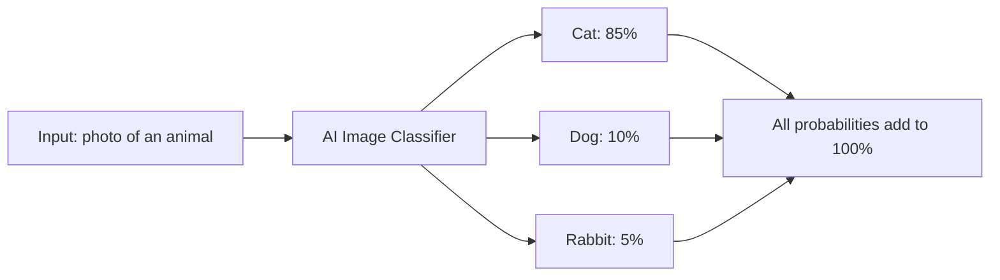
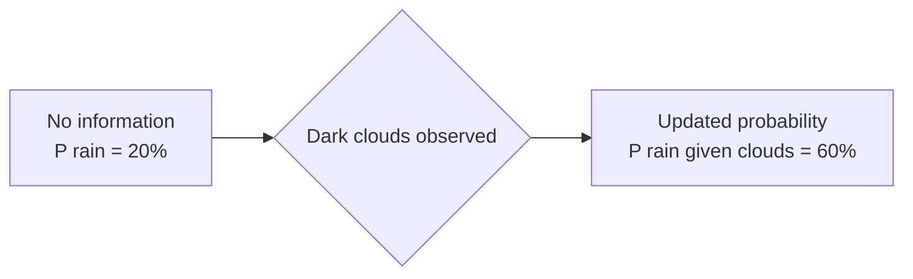
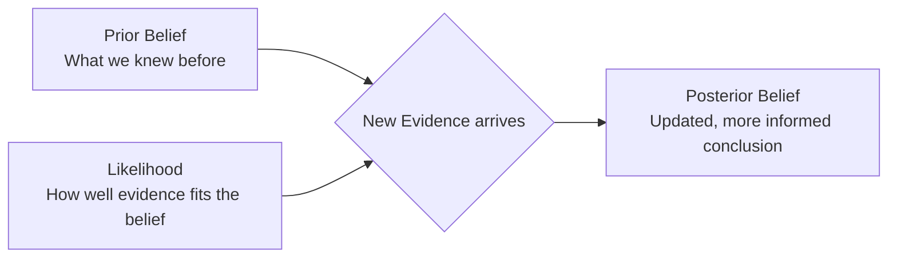

# Probability Foundations

---

## Learning Objectives

By the end of this topic, you should be able to:

- Define the basic concepts of probability including likelihood, events, and outcomes
- Calculate the probability of a simple event using the basic probability formula
- Explain conditional probability and calculate the likelihood of an event given that another event has occurred
- Understand the intuition behind Bayes' theorem and how it updates beliefs with new evidence
- Apply the Bayes' theorem formula to a simple numeric example
- Relate these foundational probability concepts to how AI systems manage uncertainty and make predictions

---

## Overview

Imagine waking up and deciding whether to carry an umbrella. You glance outside, maybe notice the sky, and make a call — all without any certainty about whether it will actually rain. That small daily decision captures something important: absolute certainty is rare in the real world, and AI systems face the exact same fundamental challenge. They must make decisions based on incomplete, noisy, and uncertain information.

Probability is the mathematical language of uncertainty. It is how we quantify likelihoods and make rational decisions when we don't have all the facts — whether an AI is predicting the next word in a sentence, diagnosing a disease from a medical image, or recommending a product, or you're simply deciding whether to grab an umbrella.

This topic uses that one everyday decision — *should I carry an umbrella today?* — to walk through the foundational ideas of probability step by step: how to put a number on "likely," how new information (like clouds gathering in the sky) changes that number, and how Bayes' theorem gives us the exact math for updating our beliefs.

---

## Probability Basics — Likelihood, Events, Outcomes

Back to the umbrella question: before you even step outside, you can put a number on how likely rain is. That number — a value between 0 and 1 representing how likely something is to happen — is what we call **probability**. A probability of 0 means the event is impossible. A probability of 1 means it is absolutely certain. Everything else falls somewhere in between. To see exactly how that number gets calculated, it helps to start with something simpler than the weather: rolling a die.

### Key Terms

| Term | Simple Meaning | Example — Rolling a 6-sided die |
|---|---|---|
| **Experiment / Trial** | An action where the result is uncertain | Rolling the die |
| **Outcome** | A single possible result | Rolling a "4" |
| **Event** | A set of outcomes we are interested in | Rolling an even number — 2, 4, or 6 |
| **Probability** | The chance that an event will occur | 3 out of 6 = 0.5 = 50% |

**The basic formula — when all outcomes are equally likely:**

```
Probability = Number of favourable outcomes / Total number of possible outcomes
```

**Example:** What is the probability of rolling a 3 on a fair die?
```
P(rolling a 3) = 1 / 6 ≈ 0.167 = 16.7%
```

Only one face shows a 3. There are six faces total. So the probability is 1 in 6.

**Example:** What is the probability of rolling an even number?
```
P(even number) = 3 / 6 = 0.5 = 50%
```

Three faces are even (2, 4, 6). Six faces total. So the probability is 3 in 6.

The same formula works just as well outside a game of dice. Say you don't have a weather app handy, but you've noticed that it rained on 6 of the last 30 days:

```
P(rain today) = Number of rainy days observed / Total days observed
             = 6 / 30
             = 0.20 = 20%
```

With no other information — you haven't looked outside yet, no forecast, nothing — your best estimate is a 20% chance of rain today. It's a rough number, but it's a starting point.

## How this connects to AI:
Think about how an app like Google Photos automatically sorts and labels your pictures. Say you upload a close-up photo of a fluffy pet — the lighting is a bit dim and its face is partly turned away from the camera, so even a person might have to squint at it. The app's image classifier doesn't just declare "that's definitely a cat." It calculates a confidence score for every animal it knows how to recognise, and shows you the most likely one.

For that photo, the classifier might output:

- Cat — 85% confident
- Dog — 10% confident
- Rabbit — 5% confident

Notice that 85 + 10 + 5 = 100%. The model always spreads its confidence across all possibilities so the total adds up to 100%. It is not saying "this is definitely a cat." It is saying "if I had to bet, I'd put 85% of my money on cat."

The higher the probability, the more confident the model is. But it always keeps its options open — which is exactly what makes AI systems honest about uncertainty rather than blindly certain.


---

---

## Conditional Probability — P(A given B)

Remember that 20% chance of rain we worked out a moment ago? It assumed you had no extra information — you hadn't even looked outside. Now step outside and look up: there are dark storm clouds gathering. Does it still make sense to expect only a 20% chance of rain? Of course not — it should jump. In the real world, events don't happen in isolation; the likelihood of one event often depends on whether another has already occurred. This is called **conditional probability**, written **P(A | B)** — "the probability of event A, given that event B has occurred."

### Rain and Clouds Example

- Event A = It rains today
- Event B = There are dark clouds in the sky this morning

```
P(A) = 20%          — base probability of rain today, with no other information
P(A | B) = 60%      — probability of rain given dark clouds this morning
```

Seeing dark clouds changes everything. The new information roughly triples the likelihood of rain — from a background 20% to a much more alarming 60%. We'll see exactly where that 60% comes from in the Bayes' theorem section below.



### How Conditional Probability Powers AI

- **Language models:** What is the probability the next word is "learning," given the previous word was "machine"? This is `P("learning" | "machine")`. The model calculates this for every possible next word and picks the most likely one.
- **Recommendation systems:** What is the probability a user buys a phone case, given they just bought a new phone? This is `P(buy case | buy phone)`. Amazon and Flipkart use this constantly.
- **Medical AI:** What is the probability a patient has diabetes, given their blood sugar reading is above 200? This is `P(diabetes | blood sugar > 200)`.

---

## Bayes' Theorem — Updating Belief with New Evidence

We left the umbrella question hanging: how exactly does seeing dark clouds turn a 20% chance of rain into 60%? The answer is **Bayes' theorem**, one of the most important concepts in all of AI and statistics. It provides a precise mathematical rule for updating our beliefs when we receive new evidence.

### The Intuition First

Before you even glance outside, you have an initial belief about rain — called the **prior** (20%, in our case). When you observe new evidence — dark clouds — you update that belief to form a new, more informed conclusion, called the **posterior**.



Bayes' theorem tells us precisely how much that new evidence should shift the 20% prior, and we'll do the exact calculation shortly. First, here's a different case that shows just how much the prior alone can matter, even when the evidence looks convincing.

**The coughing example:**

Imagine you hear someone coughing. You want to know the probability they have a rare lung disease.

- **Prior:** The disease affects only 1 in 10,000 people — it is extremely rare
- **New evidence:** The person is coughing
- **Likelihood:** Yes, the disease causes coughing — but so does a common cold, allergies, dust, and dozens of other things
- **Posterior:** Even though coughing is a symptom of the disease, the disease is so rare that it is still overwhelmingly more likely the person just has a cold

Bayes' theorem prevents us from jumping to conclusions. It forces us to factor in the **prior probability** (how rare the disease is) alongside the new evidence (the cough). Without this, AI systems would make wildly overconfident predictions.

### The Formula

```
P(A | B) = [ P(B | A) × P(A) ] / P(B)
```

In plain English:

- `P(A | B)` — the **posterior**: probability of A being true, given that B has happened
- `P(B | A)` — the **likelihood**: probability of observing B if A is true
- `P(A)` — the **prior**: our initial belief about A before seeing any evidence
- `P(B)` — the **normaliser**: total probability of B occurring under all circumstances

### Worked Example — Will It Rain?

Let's actually calculate the 60% mentioned earlier, instead of just asserting it.

**Known values:**
- `P(Rain)` = 0.20 — the 20% base rate from earlier (prior)
- `P(Dark Clouds | Rain)` = 0.90 — on 90% of days it rains, there were dark clouds that morning (likelihood)
- `P(Dark Clouds | No Rain)` = 0.15 — on 15% of dry days, there are still dark clouds that clear up without any rain

**Step 1 — Calculate P(Dark Clouds):** the total probability of seeing dark clouds on any given morning
```
P(Dark Clouds) = P(Dark Clouds | Rain) × P(Rain) + P(Dark Clouds | No Rain) × P(No Rain)
               = (0.90 × 0.20) + (0.15 × 0.80)
               = 0.18 + 0.12
               = 0.30
```

**Step 2 — Apply Bayes' theorem:**
```
P(Rain | Dark Clouds) = [ P(Dark Clouds | Rain) × P(Rain) ] / P(Dark Clouds)
                       = [ 0.90 × 0.20 ] / 0.30
                       = 0.18 / 0.30
                       = 0.60 = 60%
```

**Result:** Seeing dark clouds pushes your belief in rain from a 20% prior up to a 60% posterior — a real calculation, not a guess. Time to grab the umbrella.

The same formula works for far more than weather. Here's an AI spam filter making the identical kind of calculation: is this email spam, given that it contains the word "Lottery"?

### Worked Example — Spam Filter

**Known values:**
- `P(Spam)` = 0.20 — 20% of all emails are spam (prior)
- `P("Lottery" | Spam)` = 0.80 — 80% of spam emails contain the word "Lottery"
- `P("Lottery" | Not Spam)` = 0.02 — only 2% of legitimate emails contain "Lottery"

**Step 1 — Calculate P("Lottery"):** total probability that any email contains "Lottery"
```
P("Lottery") = P("Lottery" | Spam) × P(Spam) + P("Lottery" | Not Spam) × P(Not Spam)
             = (0.80 × 0.20) + (0.02 × 0.80)
             = 0.16 + 0.016
             = 0.176
```

**Step 2 — Apply Bayes' theorem:**
```
P(Spam | "Lottery") = [ P("Lottery" | Spam) × P(Spam) ] / P("Lottery")
                    = [ 0.80 × 0.20 ] / 0.176
                    = 0.16 / 0.176
                    ≈ 0.909
```

**Result:** There is approximately a **91% probability** this email is spam.

The email started with only a 20% chance of being spam (the prior). After seeing the word "Lottery," Bayes' theorem updated that belief to 91%. This is exactly how real spam filters work.

### How AI Uses Bayesian Thinking

- **Weather forecasting apps:** The rain percentage you see on your phone is calculated the same way — starting from historical base rates (prior) and updating with fresh satellite and radar data (evidence) to produce the percentage you see (posterior)
- **Medical diagnosis:** Starting with how rare a disease is (prior), then updating based on test results and symptoms (evidence) to arrive at a diagnosis probability (posterior)
- **Self-driving cars:** Starting with a belief about where other cars are, then continuously updating that belief as new sensor data arrives
- **Language models:** Every next-word prediction is a form of conditional probability — what is the most likely next word given everything said so far?

---

## Key Takeaways

- Think back to the umbrella question: a plain historical count gave a 20% chance of rain, dark clouds pushed that estimate up, and Bayes' theorem turned it into a precise 60% — that's the whole journey from a guess to a calculated decision, in miniature
- **Probability** is the mathematical foundation for handling uncertainty — expressed as a number between 0 (impossible) and 1 (certain)
- The basic formula is: `P(event) = favourable outcomes / total outcomes`
- **Conditional probability P(A|B)** measures the likelihood of A given that B has already happened — most AI predictions are fundamentally conditional probability calculations
- **Bayes' theorem** provides the mathematical rule for updating beliefs: `P(A|B) = [P(B|A) × P(A)] / P(B)`
- The three key components are: **prior** (what we believed before), **likelihood** (how well the evidence fits), and **posterior** (updated belief after seeing evidence)
- Bayes' theorem prevents overconfident predictions by forcing the model to consider how rare or common something is before updating based on new evidence
- In AI, balancing priors with new evidence is crucial — diagnosing a rare disease just because of a cough, without considering how rare it is, would be a classic Bayesian error

> **Interview tip:** If asked to explain Bayes' theorem, don't just recite the formula. Explain the intuition using "Prior + Evidence = Updated Belief" and then walk through a concrete example with real numbers — the rain-and-umbrella example or the spam filter both work well. Interviewers look for your ability to apply Bayesian thinking to real problems — not raw memorisation of the formula.

---

## Reference Links

- 📎 [Seeing Theory — Basic Probability](https://seeing-theory.brown.edu/basic-probability/index.html) — beautiful interactive visualisations of probability concepts
- 📎 [3Blue1Brown — Bayes theorem](https://www.youtube.com/watch?v=HZGCoVF3YvM) — excellent visual intuition of Bayes' theorem and updating probabilities
- 📎 [Khan Academy — Basic probability](https://www.khanacademy.org/math/statistics-probability/probability-library) — step-by-step beginner-friendly probability exercises
