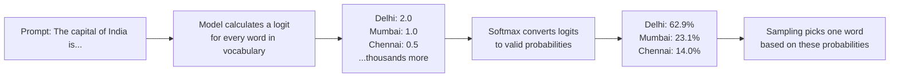

# How LLMs Use Probability

---

## Learning Objectives

By the end of this topic, you should be able to:

- Explain why an LLM produces a probability distribution over possible next words instead of one fixed answer
- Describe what a logit is and why raw logit scores need to be converted before they become usable probabilities
- Calculate by hand how the softmax-with-temperature formula reshapes a probability distribution
- Differentiate between low-temperature and high-temperature output using a worked numeric example
- Evaluate which temperature setting is appropriate for a given real-world AI task

---

## Overview

Despite their fluent and seemingly thoughtful responses, LLMs are not "thinking" in the human sense. At their core, they are highly sophisticated probability engines. When you give an LLM a prompt, it does not retrieve a pre-written answer from a database. Instead, it calculates the probability of every possible next word based on all the words that came before it — and repeats this process one word at a time until the response is complete.

Understanding this matters because a setting called **temperature** — which controls how confident or creative a model's output is — is something you will directly configure every time you call an LLM's API. Get temperature wrong and you will either get a chatbot that repeats the same robotic phrasing every time, or one that starts generating unreliable and overly random answers. This topic gives you the mathematical intuition to make that decision correctly, rather than by guesswork.

---

## Why LLMs Output a Probability Distribution, Not a Single Fixed Answer

At each step of generating text, an LLM does not "know" one correct next word. Instead, it calculates a **probability distribution** — a full list of every possible next word (technically a "token") in its vocabulary, each paired with a probability of how likely it is to come next, with all these probabilities adding up to exactly 1 (100%).

**Why this exists:** Language is inherently ambiguous. For the sentence "The weather today is...", many next words — "sunny," "hot," "pleasant," "cloudy" — are all reasonable. There is no single correct answer the way there is for `2 + 2`. So instead of forcing one fixed rule, the model estimates *how likely* each possible continuation is, based on patterns learned from enormous amounts of text.

**Think about how Google Photos recognises animals.** When you upload a photo, the app doesn't just say "that is definitely your pet." It calculates a confidence score for every possibility:

- Cat — 85% confident
- Dog — 10% confident
- Rabbit — 5% confident

Notice that 85 + 10 + 5 = 100%. The model always spreads its confidence across all possibilities so the total adds up to 100%. It is not saying "this is definitely a cat." It is saying "if I had to bet, I would put 85% of my money on cat." LLMs work the exact same way — for every word they might generate next.


**A simplified illustration** — logits (raw scores) the model calculated for the next word after "The capital of India is":

```
Delhi   : logit = 2.0
Mumbai  : logit = 1.0
Chennai : logit = 0.5
```

These raw logits are not yet probabilities. "Delhi" having a logit of 2.0 does not mean 200%. They need to be converted using **softmax** — which we work through fully in the next section.



---

## Temperature — Controlling How Confident or Creative the Output Is

**Temperature** is a number (usually between 0 and 2) that controls how sharp or flat the model's probability distribution becomes before a token is sampled.

- **Low temperature** makes the model strongly favour its top-choice token — more predictable, more repeatable
- **High temperature** flattens the distribution, giving lower-ranked tokens a bigger chance of being picked — more varied and creative, but also more prone to unexpected or lower-quality output

### The Softmax with Temperature Formula

```
P(token_i) = exp(logit_i / T) / [ sum of exp(logit_j / T) for every token j ]
```

Explaining every part:
- logit_i — the raw score for the word you are calculating the probability for. Think of it as that word's points before grading.
- T — the temperature you set. T = 1 means no change. Below 1 makes the winner pull further ahead. Above 1 brings everyone closer together.
- exp(x) — a standard maths operation available on any calculator using the eˣ button. You do not need to know why it works — just know it converts any score into a positive number, which is needed before we can turn scores into percentages.
- The division at the bottom — makes sure all the final percentages add up to exactly 100%. Think of it like converting raw exam marks into a percentage — you divide each student's marks by the total marks available so everything sits on the same scale.

### Worked Calculation — Three Candidate Tokens


### Low vs High Temperature — Side by Side

| Aspect | Low Temperature (0.2–0.5) | High Temperature (1.2–2.0) |
|---|---|---|
| Distribution shape | Sharp and peaked | Flat and spread out |
| Behaviour | Predictable, near-deterministic | Varied, creative, sometimes surprising |
| Best for | Factual Q&A, code generation, data extraction | Creative writing, brainstorming, marketing copy |
| Risk | Can feel repetitive or robotic | Can produce inconsistent or off-topic output |

### Real-World Product Examples

- **GitHub Copilot** — runs at very low temperature. A single most-likely, syntactically correct code suggestion is far more useful than a "creative" but broken one
- **ChatGPT creative writing mode** — runs at higher temperature to generate varied, imaginative story ideas
- **Customer support chatbots** — low-to-moderate temperature so answers stay consistent and on-brand across thousands of customers asking the same question
- **Marketing copy generators (Jasper, Copy.ai)** — higher temperature to generate multiple varied taglines for a brand to choose from
- **Translation tools (DeepL, Google Translate)** — very low temperature since a translation should be accurate and stable, not "creative"

### Best Practices

- For tasks needing consistency — extracting structured data, writing code, answering factual questions — set a **low temperature** (often 0 to 0.3)
- For creative or brainstorming tasks — generating multiple ad-copy ideas, story writing — a **higher temperature** (0.7 to 1.0) is appropriate
- Always test your chosen temperature by running the same prompt multiple times and checking whether the variation is acceptable for your use case

### Common Beginner Mistakes

- Assuming temperature = 0 makes an LLM perfectly deterministic like a calculator — in practice it makes output highly consistent, but some implementations may still show tiny variations
- Setting temperature very high for tasks that need factual precision — this significantly increases the risk of the model producing incorrect information
- Confusing "temperature" with "the model's confidence in truth" — temperature only controls how the model samples from its own distribution. It does not make wrong information more or less true. A model that does not know the right answer will still get it wrong at temperature 0

---

## Worked Example — Choosing Temperature for a Payment Confirmation App

**Scenario:** You are building an AI feature that auto-generates a short SMS message confirming a successful online payment. You must decide the temperature setting.

**Step 1 — Identify what matters:**
- The task requires **factual accuracy** — the correct amount and recipient must always appear. These should come from your database, not be "guessed" by the model
- Some **natural language variation** is acceptable — "Payment successful!" vs "Your payment has gone through" — so messages don't feel robotically identical every time

**Step 2 — Choose the temperature:**
- A **low-to-moderate temperature** (around 0.3–0.5) is right here
- Low enough that the model reliably inserts correct phrasing around the factual data
- With just enough variation in the wrapping sentence for a natural, human-sounding tone

**Step 3 — The key insight:**
Critical facts (amount, recipient, transaction ID) should **never** come from the LLM's probability distribution — they should be injected from your database into the prompt as fixed values. The LLM's job is only to wrap those facts in natural language. This separation of "facts from database, language from LLM" is one of the most important architectural principles in real AI engineering.

---

## Key Takeaways

- An LLM calculates a **logit** (raw score) for every possible next token, then converts these into a valid **probability distribution** using the **softmax** function
- **Softmax formula:** `P(token_i) = exp(logit_i / T) / sum(exp(logit_j / T))` — every logit is divided by temperature T before being exponentiated and normalised
- **Low temperature (T < 1)** sharpens the distribution — the top token becomes even more dominant, producing predictable output
- **High temperature (T > 1)** flattens the distribution — lower-ranked tokens get a real chance of being picked, producing varied and creative output
- Choose low temperature for factual, structured, or code-related tasks — choose higher temperature for creative or brainstorming tasks
- Temperature never changes what is true — it only changes how the model samples from its own existing probability estimates
- Critical facts should always come from a deterministic source (a database) — never rely on an LLM to "remember" or "guess" specific numbers or names

> **Interview tip:** Be ready to explain softmax-with-temperature with actual numbers — not just "low = same answer, high = random answer." Walk through the Delhi/Mumbai/Chennai example showing how T=0.5 pushes Delhi from 62.9% to 84.4%. Interviewers at AI companies value this quantitative intuition over vague descriptions.

---

## Reference Links

- 📎 [Anthropic Documentation — Messages API temperature parameter](https://docs.anthropic.com/en/api/messages) — official documentation on configuring temperature for real API calls
- 📎 [Google ML Crash Course — Softmax](https://developers.google.com/machine-learning/crash-course) — beginner explanation of softmax in classification and generation contexts
- 📎 [Cohere — What is Temperature in NLP?](https://docs.cohere.com/docs/temperature) — clear technical explanation of temperature with examples
