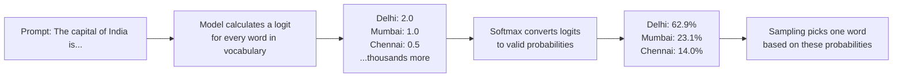

# How LLMs Use Probability

---

## Learning Objectives

By the end of this topic, you should be able to:

- Explain why an LLM produces a probability distribution over possible next words instead of one fixed answer
- Describe what a logit is and why raw logit scores need to be converted before they become usable probabilities
- Calculate by hand how the softmax-with-temperature formula reshapes a probability distribution
- Differentiate between low-temperature and high-temperature output using a worked numeric example
- Evaluate which temperature setting is appropriate for a given real-world AI task

---

## Overview

Think about the last time you were texting someone and your phone's keyboard tried to finish your sentence for you. You type "I'll pick you up at the..." and a few little suggestions pop up above the keyboard: *airport*, *mall*, *station* — ranked by how likely your phone thinks each one is, based on everything you typed before it. Nobody programmed your phone with a rule that says "after 'pick you up at the', always suggest airport." It learned which words tend to follow which, and it's making a bet.

That is, in essence, exactly what a large language model (LLM) does — just at a vastly bigger and deeper scale, for every single word in a full response, not just a quick text shortcut. Despite their fluent, seemingly thoughtful responses, LLMs are not "thinking" in the human sense. At their core, they are highly sophisticated probability engines. When you give an LLM a prompt, it does not retrieve a pre-written answer from a database. Instead, it calculates the probability of every possible next word based on all the words that came before it — and repeats this process one word at a time until the response is complete.

Let's make this concrete with a real headache. A developer is building **TastyBot**, an AI chat assistant for a food-delivery startup. The first version was painfully boring — ask it "what should I order tonight?" three times and it replied "We recommend our Butter Chicken." all three times, like a bored waiter reciting the same line. So the developer cranked a setting up to make it feel livelier. The next customer who asked for a "mild vegetarian dinner" was confidently offered a **"Volcano Prawn Biryani wrapped in a spicy burrito, served flambéed."** Neither version is good, and the setting causing the trouble is called **temperature** — a dial that controls how safe or how adventurous an LLM's word choices are. It's something you will directly configure every time you call an LLM's API, and this topic gives you the mathematical intuition to set it correctly, instead of by trial, error, and the occasional flaming burrito.

---

## Why LLMs Output a Probability Distribution, Not a Single Fixed Answer

Go back to that keyboard suggestion bar: *airport, mall, station*. Even a simple predictive keyboard doesn't quietly decide on one "correct" next word and show you only that — behind the scenes it's scoring many candidates and surfacing the top few, something like:

- airport — 55%
- mall — 30%
- station — 15%

An LLM does the exact same thing, just far more thoroughly, across its entire vocabulary. At each step of generating text, it does not "know" one correct next word. Instead, it calculates a **probability distribution** — a full list of every possible next word (technically a "token"), each paired with a probability of how likely it is to come next, with all these probabilities adding up to exactly 1 (100%).

**Why this exists:** Language is inherently ambiguous. For the sentence "Tonight's chef special is...", many next words — "paneer," "chicken," "mushroom," "prawn" — are all reasonable. There is no single correct answer the way there is for `2 + 2`. So instead of forcing one fixed rule, the model estimates *how likely* each possible continuation is, based on patterns learned from enormous amounts of text.

This is exactly the problem inside TastyBot. When a customer types "recommend something spicy," the model doesn't secretly "know" the one right dish — it scores every dish it's ever seen described as spicy and spreads its confidence across all of them:

- Chicken 65 — 45% confident
- Paneer Tikka — 30% confident
- Chilli Garlic Noodles — 25% confident

Notice that 45 + 30 + 25 = 100%. The model always spreads its confidence across all possibilities so the total adds up to 100%. It isn't saying "this is definitely Chicken 65." It's saying "if I had to bet, I'd put 45% of my money on Chicken 65." Which dish TastyBot actually recommends out loud depends on how it samples from that list — which is where temperature comes back in.

Let's go one level deeper than the menu and look at what actually happens inside the model. Here's a simplified illustration — the raw scores, called **logits**, that a model calculated for the next word after "The capital of India is":

```
Delhi   : logit = 2.0
Mumbai  : logit = 1.0
Chennai : logit = 0.5
```

These raw logits are not yet probabilities. "Delhi" having a logit of 2.0 does not mean 200%. They need to be converted using **softmax** — which we work through fully in the next section.



---

## Temperature — Controlling How Confident or Creative the Output Is

Fittingly for a food app, the setting that was ruining TastyBot's replies works a lot like a spice-level dial. Set it to "mild," and the kitchen always plays it safe with the same reliable dish. Crank it to "extra hot," and you might get something genuinely exciting — or something inedible. In an LLM, that dial is called **temperature**: a number (usually between 0 and 2) that controls how sharp or flat the model's probability distribution becomes before a token is sampled — in other words, whether it confidently picks Chicken 65 (its 45% front-runner) every time, or occasionally takes a chance on the 25% underdog to keep things interesting.

- **Low temperature** makes the model strongly favour its top-choice token — more predictable, more repeatable
- **High temperature** flattens the distribution, giving lower-ranked tokens a bigger chance of being picked — more varied and creative, but also more prone to unexpected or lower-quality output

### The Softmax with Temperature Formula

```
P(token_i) = exp(logit_i / T) / [ sum of exp(logit_j / T) for every token j ]
```

Explaining every part:
- logit_i — the raw score for the word you are calculating the probability for. Think of it as that word's points before grading.
- T — the temperature you set. T = 1 means no change. Below 1 makes the winner pull further ahead. Above 1 brings everyone closer together.
- exp(x) — a standard maths operation available on any calculator using the eˣ button. You do not need to know why it works — just know it converts any score into a positive number, which is needed before we can turn scores into percentages.
- The division at the bottom — makes sure all the final percentages add up to exactly 100%. Think of it like converting raw exam marks into a percentage — you divide each student's marks by the total marks available so everything sits on the same scale.

### Worked Calculation — Three Candidate Tokens

This is the exact napkin math running behind the scenes every time TastyBot has to decide between Chicken 65, Paneer Tikka, and Chilli Garlic Noodles.


### Low vs High Temperature — Side by Side

| Aspect | Low Temperature (0.2–0.5) | High Temperature (1.2–2.0) |
|---|---|---|
| Distribution shape | Sharp and peaked | Flat and spread out |
| Behaviour | Predictable, near-deterministic | Varied, creative, sometimes surprising |
| Best for | Factual Q&A, code generation, data extraction | Creative writing, brainstorming, marketing copy |
| Risk | Can feel repetitive or robotic | Can produce inconsistent or off-topic output |

### 🎯 Quick Check — Guess the Temperature

Two runs of TastyBot answering the same customer message, "What should I order tonight?":

**Run A:**
> "We recommend our Butter Chicken."
> "We recommend our Butter Chicken."
> "We recommend our Butter Chicken."

**Run B:**
> "Might we tempt you with a Volcano Prawn Biryani, paired with a mango lassi thunderstorm?"
> "How about a Deconstructed Samosa Symphony, served with a side of existential dal?"
> "Try our Butter Chicken... wrapped in a burrito... served on a pizza?"

Which run is low temperature, and which is high? Think it through before revealing the answer.

<details>
<summary><b>Reveal answer</b></summary>

**Run A is low temperature.** The distribution is so sharp that the top token (or dish) wins almost every single time — great for consistency, but repetitive if the customer asks more than once.

**Run B is high temperature.** The distribution has been flattened so much that low-probability, borderline-nonsensical tokens ("existential dal," a burrito-pizza-butter-chicken hybrid) get a real chance of being picked. Entertaining once. Not something you'd want on a live menu.

</details>

### Real-World Product Examples

- **Predictive keyboards (Gboard, iPhone)** — effectively run at very low temperature. A keyboard that occasionally suggests a wildly unexpected word would be far more annoying than helpful
- **GitHub Copilot** — runs at very low temperature. A single most-likely, syntactically correct code suggestion is far more useful than a "creative" but broken one
- **ChatGPT creative writing mode** — runs at higher temperature to generate varied, imaginative story ideas
- **Customer support chatbots** — low-to-moderate temperature so answers stay consistent and on-brand across thousands of customers asking the same question
- **Marketing copy generators (Jasper, Copy.ai)** — higher temperature to generate multiple varied taglines for a brand to choose from
- **Translation tools (DeepL, Google Translate)** — very low temperature since a translation should be accurate and stable, not "creative"

### Best Practices

- For tasks needing consistency — extracting structured data, writing code, answering factual questions — set a **low temperature** (often 0 to 0.3)
- For creative or brainstorming tasks — generating multiple ad-copy ideas, story writing — a **higher temperature** (0.7 to 1.0) is appropriate
- Always test your chosen temperature by running the same prompt multiple times and checking whether the variation is acceptable for your use case

### Common Beginner Mistakes

- Assuming temperature = 0 makes an LLM perfectly deterministic like a calculator — in practice it makes output highly consistent, but some implementations may still show tiny variations
- Setting temperature very high for tasks that need factual precision — this significantly increases the risk of the model producing incorrect information
- Confusing "temperature" with "the model's confidence in truth" — temperature only controls how the model samples from its own distribution. It does not make wrong information more or less true. A model that does not know the right answer will still get it wrong at temperature 0

---

## Worked Example — Finally Fixing TastyBot's Order Confirmations

**Scenario:** Now that the developer understands temperature, they turn to the app's most important message: the SMS confirming a customer's order and payment. They must pick a temperature that avoids both failure modes already seen — the robotic Butter-Chicken-every-time voice, and the flambéed-burrito chaos.

**Step 1 — Identify what matters:**
- The task requires **factual accuracy** — the correct amount, dish, and delivery time must always appear. These should come from the database, not be "guessed" by the model
- Some **natural language variation** is acceptable — "Your order is confirmed!" vs "Order placed — food's on the way" — so messages don't feel robotically identical every time

**Step 2 — Choose the temperature:**
- A **low-to-moderate temperature** (around 0.3–0.5) is right here
- Low enough that the model reliably inserts correct phrasing around the factual data
- With just enough variation in the wrapping sentence for a natural, human-sounding tone — but nowhere near hot enough for a surprise "existential dal" to sneak into a receipt

**Step 3 — The key insight:**
Critical facts (amount, dish name, delivery time) should **never** come from the LLM's probability distribution — they should be injected from the database into the prompt as fixed values. The LLM's job is only to wrap those facts in natural language. This separation of "facts from database, language from LLM" is one of the most important architectural principles in real AI engineering — and it's the one rule that would have saved TastyBot's first version a lot of confused customers.

---

## Key Takeaways

- The TastyBot problem, solved: boring "Butter Chicken every time" was low temperature with no variation built in on purpose; the flambéed-burrito chaos was temperature cranked too high. The fix was choosing a moderate temperature for natural-sounding text, while keeping every hard fact (price, dish, delivery time) fed in from the database — never left to chance
- Every predictive-text suggestion you've ever seen on your phone is a tiny, low-stakes preview of exactly what an LLM does at a much larger scale: score every possible next word, turn those scores into a probability distribution, then decide — via temperature — how safely or adventurously to pick from it
- An LLM calculates a **logit** (raw score) for every possible next token, then converts these into a valid **probability distribution** using the **softmax** function
- **Softmax formula:** `P(token_i) = exp(logit_i / T) / sum(exp(logit_j / T))` — every logit is divided by temperature T before being exponentiated and normalised
- **Low temperature (T < 1)** sharpens the distribution — the top token becomes even more dominant, producing predictable output
- **High temperature (T > 1)** flattens the distribution — lower-ranked tokens get a real chance of being picked, producing varied and creative output
- Choose low temperature for factual, structured, or code-related tasks — choose higher temperature for creative or brainstorming tasks
- Temperature never changes what is true — it only changes how the model samples from its own existing probability estimates
- Critical facts should always come from a deterministic source (a database) — never rely on an LLM to "remember" or "guess" specific numbers or names

> **Interview tip:** Be ready to explain softmax-with-temperature with actual numbers — not just "low = same answer, high = random answer." Walk through the Delhi/Mumbai/Chennai example showing how T=0.5 pushes Delhi from 62.9% to 84.4%. Interviewers at AI companies value this quantitative intuition over vague descriptions.

---

## Reference Links

- 📎 [Anthropic Documentation — Messages API temperature parameter](https://docs.anthropic.com/en/api/messages) — official documentation on configuring temperature for real API calls
- 📎 [Google ML Crash Course — Softmax](https://developers.google.com/machine-learning/crash-course) — beginner explanation of softmax in classification and generation contexts
- 📎 [Cohere — What is Temperature in NLP?](https://docs.cohere.com/docs/temperature) — clear technical explanation of temperature with examples
