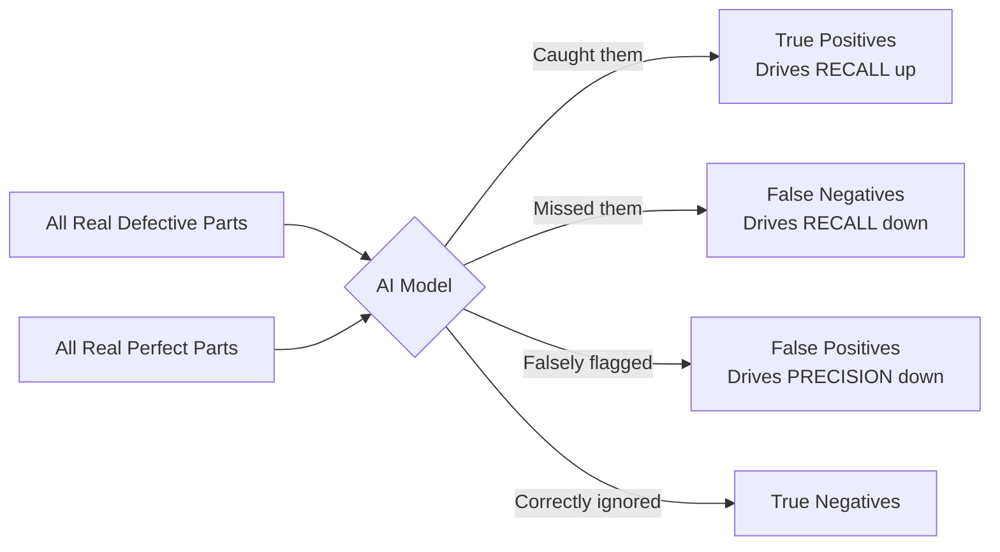

# Measuring AI Performance

---

## Learning Objectives

By the end of this topic, you should be able to:

1. Explain how basic statistics (mean, median, mode) measure AI consistency across multiple runs
2. Define the components of a Confusion Matrix (True/False Positives and Negatives)
3. Differentiate between Accuracy, Precision, and Recall
4. Explain why high accuracy can be dangerously misleading in unbalanced datasets
5. Interpret variation in an AI's output to assess its true reliability

---

## Overview

You've built an AI system—perhaps a spam filter, a medical diagnostic tool, or a defect detector on an assembly line. It works "most of the time." But how do you quantify that? Is "most of the time" good enough? 

Measuring AI performance isn't just about a single success rate. When the stakes are high, relying purely on a metric like "95% accuracy" can lead to catastrophic failures in production. In this topic, we will look at how to properly evaluate an AI model's performance, why basic accuracy is often a trap, and how to measure consistency and reliability using precision, recall, and basic statistics.

---

## 7.6 Consistency Across AI Runs (Mean, Median, Mode)

Because many modern AI systems (especially generative models like LLMs) are probabilistic, they won't give you the exact same result every time. If you run a prompt 10 times, you might get 10 slightly different outputs. To measure things like response length, latency, or confidence scores across multiple runs, you need basic statistics.

- **Mean (Average):** Gives you the general center of the AI's behavior. If an AI takes an average of 2.5 seconds to generate an image, that's your mean.
- **Median (Middle value):** Often far more useful than the mean because it isn't heavily skewed by extreme outliers. If 9 out of 10 images generate in 2 seconds, but one randomly takes 30 seconds due to a server hiccup, the mean gets ruined, but the median stays at 2 seconds.
- **Mode (Most frequent):** Useful for evaluating categorical outputs. If you run a classification prompt 100 times, the mode tells you the most common category the AI settled on, indicating its default assumption.

---

## 7.7 The Confusion Matrix — Moving Beyond Accuracy

When an AI model makes a binary decision (e.g., "Is this email spam or not spam?"), there are exactly four possible outcomes. We map these outcomes in a grid called a **Confusion Matrix**.

| | AI Predicted: SPAM (Positive) | AI Predicted: NOT SPAM (Negative) |
|---|---|---|
| **Actually SPAM** | **True Positive (TP)** AI caught the spam. | **False Negative (FN)** AI missed the spam. (It went to inbox) |
| **Actually NOT SPAM** | **False Positive (FP)** AI flagged a real email as spam. | **True Negative (TN)** AI correctly ignored the real email. |

### The "95% Accuracy" Trap
**Accuracy** simply measures what proportion of total predictions were correct: 
`Accuracy = (TP + TN) / Total`

**Why accuracy can fail:** Imagine a factory where only 1 in 100 parts is defective. If you build a completely "dumb" AI that just outputs "NOT DEFECTIVE" every single time without even looking at the parts, it will be right 99 times out of 100. It technically has **99% accuracy**, but it is entirely useless because it missed the 1 defective part (a False Negative). 

---

## 7.8 Precision vs. Recall

To get a true sense of an AI's performance, especially on unbalanced datasets, we look at Precision and Recall. These metrics force us to look directly at the errors (False Positives and False Negatives).

### Precision: "Of the things the AI flagged, how many were actually correct?"
`Precision = TP / (TP + FP)`
- **Focus:** Minimizing False Positives (False Alarms).
- **Example:** If the AI flags 10 emails as spam, but only 7 were actually spam, the precision is 70%.
- **When it matters most:** When a False Positive is highly damaging. For example, an AI flagging an important email from a client as spam, or an AI falsely accusing a user of credit card fraud and locking their account.

### Recall: "Of all the things that were *actually* correct, how many did the AI find?"
`Recall = TP / (TP + FN)`
- **Focus:** Minimizing False Negatives (Misses).
- **Example:** If there were 10 actual spam emails, and the AI only caught 6 (letting 4 through to the inbox), the recall is 60%.
- **When it matters most:** When a False Negative is highly damaging. For example, an AI screening for cancer—you would much rather have a False Positive (and do a follow-up test) than a False Negative (and miss the cancer entirely).

---

## 7.9 Interpreting AI Output Variation and Reliability

If you run an AI system 100 times, variation in the output tells you a lot about the system's underlying reliability.
- **High Consistency (Low Variation):** If the precision and recall scores remain steady across different days, different users, and different subsets of data, the model is highly robust.
- **High Variation:** If the model gets 98% accuracy on Monday's data but 60% on Tuesday's data, the model is brittle. It hasn't learned the fundamental pattern; it likely just memorized specific, superficial traits of Monday's data.

In generative AI (like ChatGPT), variation can be tested by slightly altering the wording of a prompt. If a tiny change in phrasing causes the AI's output to flip drastically, the AI's "understanding" is brittle and its reliability for production use is low.

---

## Key Takeaways

- **Mean, Median, and Mode** help you evaluate the consistency of probabilistic AI systems across multiple runs, with median often being the best defense against extreme outliers
- A **Confusion Matrix** breaks down AI performance into True Positives, True Negatives, False Positives, and False Negatives
- **Accuracy** is dangerously misleading if the dataset is unbalanced (e.g., rare diseases, rare defects)
- **Precision** measures quality: out of everything the AI flagged, what percentage was actually correct? Optimize for precision when false alarms are costly
- **Recall** measures completeness: out of everything the AI *should* have flagged, what percentage did it actually catch? Optimize for recall when missing a target is costly
- Output variation across different data subsets or prompt phrasing is a key indicator of an AI system's true reliability

> **Interview tip:** If an interviewer asks you how to evaluate a model, never stop at "accuracy." Immediately ask about the use case. If the cost of a false positive is high (like filtering legitimate user accounts), explicitly state you would optimize for **Precision**. If the cost of a false negative is high (like detecting a fatal disease), state you would optimize for **Recall**. This demonstrates deep product thinking.

---

## Reference Links

- 📎 [Google Machine Learning Crash Course: Classification](https://developers.google.com/machine-learning/crash-course/classification/precision-and-recall) — in-depth guide on precision, recall, and accuracy
- 📎 [Towards Data Science: Understanding the Confusion Matrix](https://towardsdatascience.com/understanding-confusion-matrix-a9ad42dcfd62) — visual breakdowns of performance metrics
