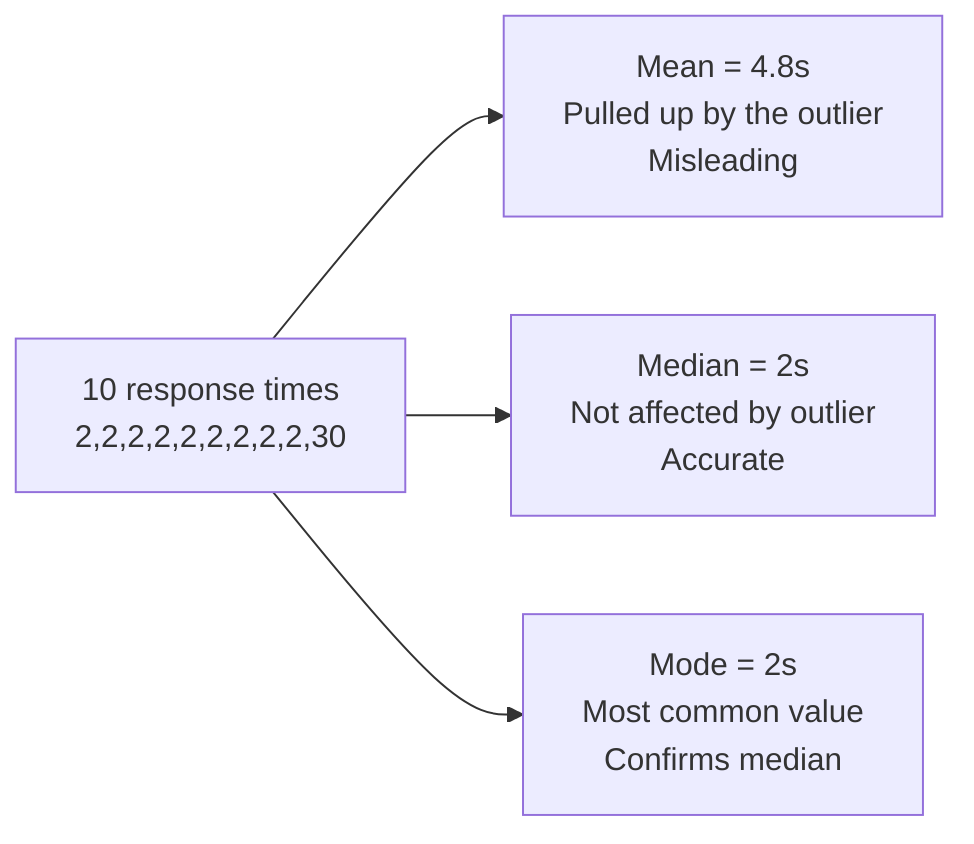
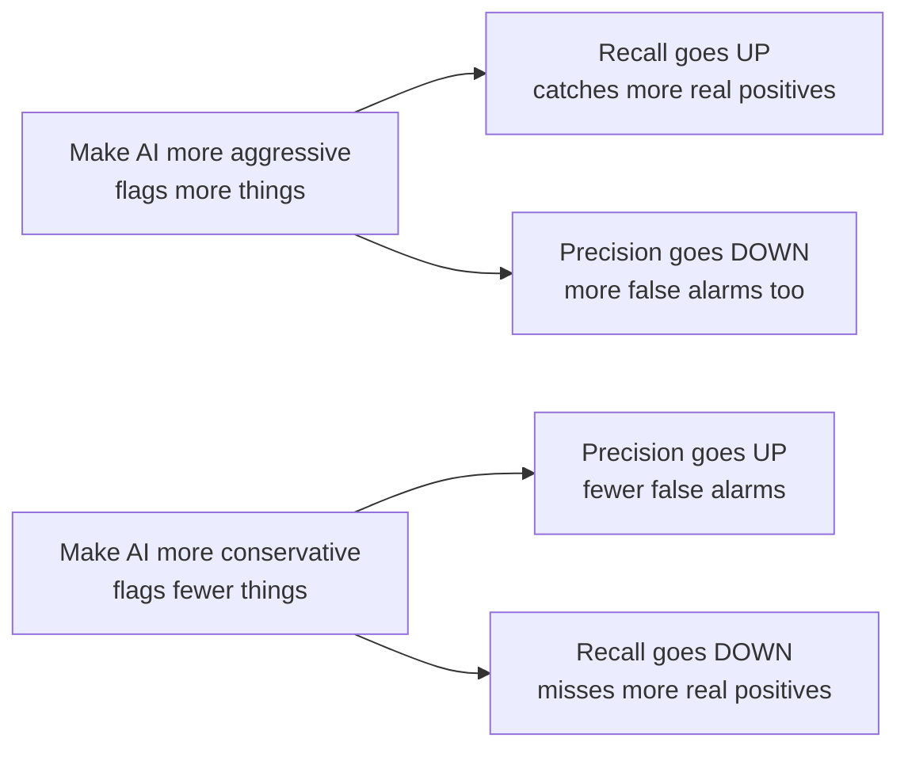

# Measuring AI Performance

---

## Learning Objectives

By the end of this topic, you should be able to:

- Explain how basic statistics (mean, median, mode) measure AI consistency across multiple runs
- Define the four components of a Confusion Matrix — True/False Positives and Negatives
- Calculate accuracy, precision, recall, and F1 score by hand from a confusion matrix
- Explain why high accuracy can be dangerously misleading in unbalanced datasets
- Interpret variation in an AI output to assess its true reliability

---

## Overview

You've built an AI system—perhaps a spam filter, a medical diagnostic tool, or a defect detector on an assembly line. It works "most of the time." But how do you quantify that? Is "most of the time" good enough? 

Measuring AI performance isn't just about a single success rate. When the stakes are high, relying purely on a metric like "95% accuracy" can lead to catastrophic failures in production. In this topic, we will look at how to properly evaluate an AI model's performance, why basic accuracy is often a trap, and how to measure consistency and reliability using precision, recall, and basic statistics.

---

## Consistency Across AI Runs (Mean, Median, Mode)


Because modern AI systems are probabilistic, they do not give you the exact same result every time. If you run the same prompt 10 times, you might get 10 slightly different response times, confidence scores, or output lengths. To measure consistency across multiple runs, you need basic statistics.
 
**Simple analogy:** Think about how long it takes your food delivery app to confirm an order. Sometimes it is instant. Sometimes it takes 8 seconds. If you want to know the "typical" experience, you need more than one data point.
 
Suppose you measure the response time (in seconds) of an AI system across 10 runs:
 
```
2, 2, 2, 2, 2, 2, 2, 2, 2, 30
```
 
Nine responses came back in 2 seconds. One took 30 seconds due to a server issue.
 
**Mean (Average):**
```
Mean = (2+2+2+2+2+2+2+2+2+30) / 10 = 48 / 10 = 4.8 seconds
```
The mean says the typical response is 4.8 seconds — but that is not the real experience for 90% of users. One outlier ruined the average.
 
**Median (Middle value):**
```
Sorted: 2, 2, 2, 2, 2, 2, 2, 2, 2, 30
Middle value = 2 seconds
```
The median stays at 2 seconds — accurately reflecting what 9 out of 10 users actually experienced. The outlier has no power over the median.
 
**Mode (Most frequent value):**
```
Mode = 2 seconds (appears 9 times)
```
The mode confirms that 2 seconds is the dominant pattern.
 

 
**Key insight:** For AI performance measurement, **median is almost always more useful than mean** — because AI systems occasionally have extreme outlier responses (server timeouts, unusually long inputs) that can make the mean look far worse than the real typical experience.
 
**What each statistic is useful for in AI:**
- **Mean** — useful when you need the total cost or total time (e.g., total compute cost across all runs)
- **Median** — useful for typical user experience (e.g., typical response time, typical confidence score)
- **Mode** — useful for categorical outputs (e.g., if you run a classification prompt 100 times, the mode tells you the AI's default assumption)
---


## The Confusion Matrix — Moving Beyond Accuracy


When an AI model makes a binary decision — spam or not spam, defective or not defective, disease or no disease — there are exactly four possible outcomes. We map these into a grid called a **Confusion Matrix**.
 
| | AI Predicted: POSITIVE | AI Predicted: NEGATIVE |
|---|---|---|
| **Actually POSITIVE** | **True Positive (TP)** — AI correctly detected it | **False Negative (FN)** — AI missed it |
| **Actually NEGATIVE** | **False Positive (FP)** — AI raised a false alarm | **True Negative (TN)** — AI correctly ignored it |
 
**Simple way to remember:**
- **True** = the AI got it right
- **False** = the AI got it wrong
- **Positive** = the AI said "yes, this is the thing"
- **Negative** = the AI said "no, this is not the thing"
### The "99% Accuracy" Trap
 
Accuracy simply measures what proportion of total predictions were correct:
 
```
Accuracy = (TP + TN) / Total
```
 
**Why accuracy alone fails:**
 
Imagine a factory where only 1 in 100 parts is defective. If you build a completely "dumb" AI that outputs "NOT DEFECTIVE" every single time without even looking at the parts, it will be right 99 times out of 100.
 
```
TP = 0   (never catches a defect)
TN = 99  (correctly says "fine" for the 99 good parts)
FP = 0
FN = 1   (misses the 1 actual defect)
 
Accuracy = (0 + 99) / 100 = 99%
```
**99% accuracy — but the AI is completely useless.** It caught zero defects. This is why accuracy alone is a dangerous metric whenever the dataset is unbalanced — which is almost always the case in real AI applications like fraud detection, disease screening, and defect detection.

---

## Precision, Recall, and F1 Score
 
To get a true picture of AI performance on unbalanced datasets, you need three metrics that look directly at the types of errors the model is making.
 
### Precision — "Of everything the AI flagged, how many were actually correct?"
 
```
Precision = TP / (TP + FP)
```
 
Precision answers: when the AI raises an alarm, how often is it right?
 
**Example:** An AI spam filter flags 10 emails as spam. Only 7 were actually spam. 3 were legitimate emails wrongly blocked.
```
Precision = 7 / (7 + 3) = 7 / 10 = 0.70 = 70%
```
 
**When precision matters most:** When a false alarm (False Positive) is costly. For example:
- An AI locking a user's bank account for suspected fraud — when it is wrong, a real customer cannot access their money
- An AI flagging a legitimate client email as spam — an important business email goes unread
### Recall — "Of everything that was actually positive, how many did the AI catch?"
 
```
Recall = TP / (TP + FN)
```
 
Recall answers: of all the real positives that existed, how many did the AI find?
 
**Example:** There are 10 actual spam emails in the inbox. The AI only caught 6. It let 4 spam emails through.
```
Recall = 6 / (6 + 4) = 6 / 10 = 0.60 = 60%
```
 
**When recall matters most:** When missing something (False Negative) is costly. For example:
- An AI screening for cancer — missing a real cancer case is far more dangerous than triggering an extra follow-up test
- An AI fraud detector — missing a real fraudulent transaction causes direct financial loss
### The Precision-Recall Trade-off
 
Precision and recall pull in opposite directions. If you make the AI more aggressive (flags more things as positive), recall goes up but precision goes down — more true positives but also more false alarms. If you make it more conservative (flags fewer things), precision goes up but recall goes down — fewer false alarms but more misses.
 

 
### F1 Score — Balancing Precision and Recall
 
When you need a single number that balances both precision and recall, use the **F1 score**:
 
```
F1 = 2 × (Precision × Recall) / (Precision + Recall)
```
 
The F1 score is the **harmonic mean** of precision and recall. It gives a high score only when both precision and recall are high. If either one is very low, the F1 score will be pulled down — which is exactly what you want from a balanced metric.
 
**Example:** Using the spam filter numbers from above:
```
Precision = 0.70
Recall    = 0.60
 
F1 = 2 × (0.70 × 0.60) / (0.70 + 0.60)
   = 2 × 0.42 / 1.30
   = 0.84 / 1.30
   ≈ 0.646 = 64.6%
```
 
An F1 score of 64.6% tells you the model has moderate but imperfect performance — better than the recall (60%) alone would suggest, but pulled down by the imperfect precision.
 
**When to use which metric:**
 
| Metric | Use when... | Example |
|---|---|---|
| **Accuracy** | Dataset is balanced — roughly equal positives and negatives | Digit recognition where all 10 digits appear equally |
| **Precision** | False alarms are costly | Fraud detection, spam filtering |
| **Recall** | Missing a positive is costly | Cancer screening, defect detection |
| **F1 Score** | You need a balance of both and the dataset is unbalanced | Most real-world AI classification tasks |
 
---
 
## Interpreting AI Output Variation and Reliability
 
If you run an AI system 100 times on different data, variation in the output tells you a great deal about the system's underlying reliability.
 
**High consistency (low variation):** If precision and recall scores remain steady across different days, different users, and different data subsets, the model has learned a genuine pattern and is robust.
 
**High variation (brittle model):** If the model scores 98% on one dataset but 60% on another, it has not learned the real pattern. It likely memorised specific surface-level traits of the training data rather than the underlying concept.
 
**A concrete example:**
 
Suppose you test a fraud detection AI on two weeks of transaction data:
 
```
Week 1: Precision = 91%, Recall = 88%
Week 2: Precision = 61%, Recall = 54%
```
 
This is a serious red flag. The model performed well on Week 1's data but collapsed on Week 2's. Likely causes:
- Fraudsters changed their behaviour between the two weeks
- Week 1 and Week 2 had different transaction volumes or customer demographics
- The model memorised Week 1 patterns instead of learning general fraud signals
**For generative AI (like Claude or ChatGPT):** Variation can be tested by slightly changing the wording of a prompt. If a tiny phrasing change causes the output to flip drastically — from one answer to a completely different one — the model's behaviour on that task is brittle and unreliable for production use.
 
---
 
## Key Takeaways
 
- **Mean, Median, and Mode** help evaluate the consistency of probabilistic AI systems across multiple runs — median is almost always more reliable than mean because it is not affected by extreme outliers
- A **Confusion Matrix** breaks down AI performance into four types: True Positives, True Negatives, False Positives, and False Negatives
- **Accuracy** is dangerously misleading when the dataset is unbalanced — a model can score 99% accuracy while catching zero actual positives
- **Precision** = TP / (TP + FP) — optimise for precision when false alarms are costly
- **Recall** = TP / (TP + FN) — optimise for recall when missing a positive is costly
- **F1 Score** = 2 × (Precision × Recall) / (Precision + Recall) — use when you need a single balanced metric across both
- High variation in performance across different data subsets is a sign the model is brittle — it memorised patterns rather than learning them
> **Interview tip:** If an interviewer asks how you would evaluate a model, never stop at accuracy. Ask about the use case first. If false positives are costly (fraud alerts, spam filtering), say you would optimise for precision. If false negatives are costly (cancer screening, defect detection), say you would optimise for recall. Then mention F1 score as the metric you would track when you need to balance both. This demonstrates genuine product thinking — not just maths knowledge.
 
---
 
## Reference Links
 
- 📎 [Google Machine Learning Crash Course — Classification](https://developers.google.com/machine-learning/crash-course/classification/precision-and-recall) — in-depth guide on precision, recall, and accuracy
- 📎 [Towards Data Science — Understanding the Confusion Matrix](https://towardsdatascience.com/understanding-confusion-matrix-a9ad42dcfd62) — visual breakdowns of performance metrics
- 📎 [Seeing Theory — Basic Statistics](https://seeing-theory.brown.edu/basic-probability/index.html) — interactive visualisation of mean, median, and variation
