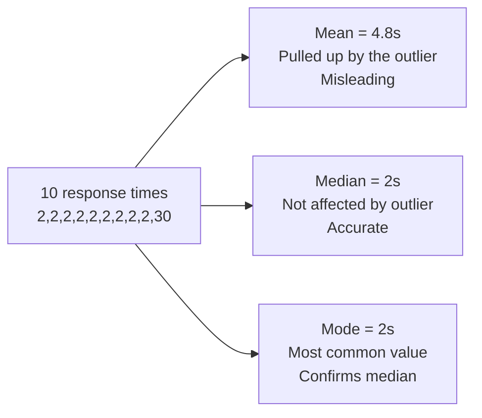
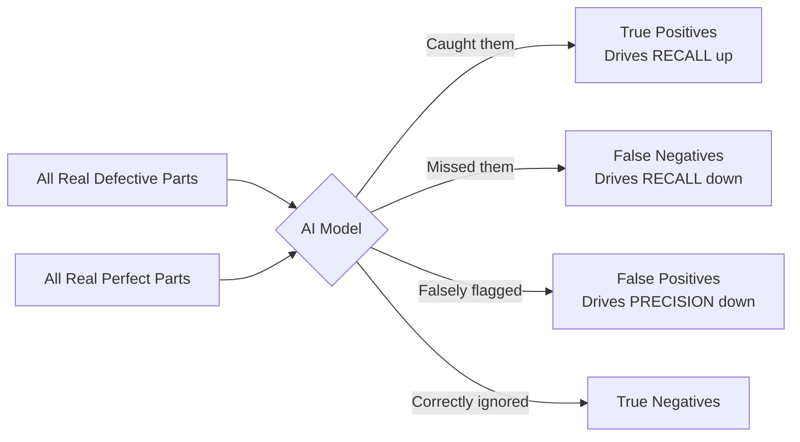

# Measuring AI Performance

---

## Learning Objectives

By the end of this topic, you should be able to:

- Explain how basic statistics (mean, median, mode) measure AI consistency across multiple runs
- Define the four components of a Confusion Matrix — True/False Positives and Negatives
- Calculate accuracy, precision, recall, and F1 score by hand from a confusion matrix
- Explain why high accuracy can be dangerously misleading in unbalanced datasets
- Interpret variation in an AI output to assess its true reliability

---

## Overview

You've built an AI system—perhaps a spam filter, a medical diagnostic tool, or a defect detector on an assembly line. It works "most of the time." But how do you quantify that? Is "most of the time" good enough? 

Measuring AI performance isn't just about a single success rate. When the stakes are high, relying purely on a metric like "95% accuracy" can lead to catastrophic failures in production. In this topic, we will look at how to properly evaluate an AI model's performance, why basic accuracy is often a trap, and how to measure consistency and reliability using precision, recall, and basic statistics.

---

## Consistency Across AI Runs (Mean, Median, Mode)


Because modern AI systems are probabilistic, they do not give you the exact same result every time. If you run the same prompt 10 times, you might get 10 slightly different response times, confidence scores, or output lengths. To measure consistency across multiple runs, you need basic statistics.
 
**Simple analogy:** Think about how long it takes your food delivery app to confirm an order. Sometimes it is instant. Sometimes it takes 8 seconds. If you want to know the "typical" experience, you need more than one data point.
 
Suppose you measure the response time (in seconds) of an AI system across 10 runs:
 
```
2, 2, 2, 2, 2, 2, 2, 2, 2, 30
```
 
Nine responses came back in 2 seconds. One took 30 seconds due to a server issue.
 
**Mean (Average):**
```
Mean = (2+2+2+2+2+2+2+2+2+30) / 10 = 48 / 10 = 4.8 seconds
```
The mean says the typical response is 4.8 seconds — but that is not the real experience for 90% of users. One outlier ruined the average.
 
**Median (Middle value):**
```
Sorted: 2, 2, 2, 2, 2, 2, 2, 2, 2, 30
Middle value = 2 seconds
```
The median stays at 2 seconds — accurately reflecting what 9 out of 10 users actually experienced. The outlier has no power over the median.
 
**Mode (Most frequent value):**
```
Mode = 2 seconds (appears 9 times)
```
The mode confirms that 2 seconds is the dominant pattern.
 

 
**Key insight:** For AI performance measurement, **median is almost always more useful than mean** — because AI systems occasionally have extreme outlier responses (server timeouts, unusually long inputs) that can make the mean look far worse than the real typical experience.
 
**What each statistic is useful for in AI:**
- **Mean** — useful when you need the total cost or total time (e.g., total compute cost across all runs)
- **Median** — useful for typical user experience (e.g., typical response time, typical confidence score)
- **Mode** — useful for categorical outputs (e.g., if you run a classification prompt 100 times, the mode tells you the AI's default assumption)
---


## The Confusion Matrix — Moving Beyond Accuracy


When an AI model makes a binary decision — spam or not spam, defective or not defective, disease or no disease — there are exactly four possible outcomes. We map these into a grid called a **Confusion Matrix**.
 
| | AI Predicted: POSITIVE | AI Predicted: NEGATIVE |
|---|---|---|
| **Actually POSITIVE** | **True Positive (TP)** — AI correctly detected it | **False Negative (FN)** — AI missed it |
| **Actually NEGATIVE** | **False Positive (FP)** — AI raised a false alarm | **True Negative (TN)** — AI correctly ignored it |
 
**Simple way to remember:**
- **True** = the AI got it right
- **False** = the AI got it wrong
- **Positive** = the AI said "yes, this is the thing"
- **Negative** = the AI said "no, this is not the thing"
### The "99% Accuracy" Trap
 
Accuracy simply measures what proportion of total predictions were correct:
 
```
Accuracy = (TP + TN) / Total
```
 
**Why accuracy alone fails:**
 
Imagine a factory where only 1 in 100 parts is defective. If you build a completely "dumb" AI that outputs "NOT DEFECTIVE" every single time without even looking at the parts, it will be right 99 times out of 100.
 
```
TP = 0   (never catches a defect)
TN = 99  (correctly says "fine" for the 99 good parts)
FP = 0
FN = 1   (misses the 1 actual defect)
 
Accuracy = (0 + 99) / 100 = 99%
```
**99% accuracy — but the AI is completely useless.** It caught zero defects. This is why accuracy alone is a dangerous metric whenever the dataset is unbalanced — which is almost always the case in real AI applications like fraud detection, disease screening, and defect detection.

---

## Precision vs. Recall

To get a true sense of an AI's performance, especially on unbalanced datasets, we look at Precision and Recall. These metrics force us to look directly at the errors (False Positives and False Negatives).

### Precision: "Of the things the AI flagged, how many were actually correct?"
`Precision = TP / (TP + FP)`
- **Focus:** Minimizing False Positives (False Alarms).
- **Example:** If the AI flags 10 emails as spam, but only 7 were actually spam, the precision is 70%.
- **When it matters most:** When a False Positive is highly damaging. For example, an AI flagging an important email from a client as spam, or an AI falsely accusing a user of credit card fraud and locking their account.

### Recall: "Of all the things that were *actually* correct, how many did the AI find?"
`Recall = TP / (TP + FN)`
- **Focus:** Minimizing False Negatives (Misses).
- **Example:** If there were 10 actual spam emails, and the AI only caught 6 (letting 4 through to the inbox), the recall is 60%.
- **When it matters most:** When a False Negative is highly damaging. For example, an AI screening for cancer—you would much rather have a False Positive (and do a follow-up test) than a False Negative (and miss the cancer entirely).



---

## Interpreting AI Output Variation and Reliability

If you run an AI system 100 times, variation in the output tells you a lot about the system's underlying reliability.
- **High Consistency (Low Variation):** If the precision and recall scores remain steady across different days, different users, and different subsets of data, the model is highly robust.
- **High Variation:** If the model gets 98% accuracy on Monday's data but 60% on Tuesday's data, the model is brittle. It hasn't learned the fundamental pattern; it likely just memorized specific, superficial traits of Monday's data.

In generative AI (like ChatGPT), variation can be tested by slightly altering the wording of a prompt. If a tiny change in phrasing causes the AI's output to flip drastically, the AI's "understanding" is brittle and its reliability for production use is low.

---

## Key Takeaways

- **Mean, Median, and Mode** help you evaluate the consistency of probabilistic AI systems across multiple runs, with median often being the best defense against extreme outliers
- A **Confusion Matrix** breaks down AI performance into True Positives, True Negatives, False Positives, and False Negatives
- **Accuracy** is dangerously misleading if the dataset is unbalanced (e.g., rare diseases, rare defects)
- **Precision** measures quality: out of everything the AI flagged, what percentage was actually correct? Optimize for precision when false alarms are costly
- **Recall** measures completeness: out of everything the AI *should* have flagged, what percentage did it actually catch? Optimize for recall when missing a target is costly
- Output variation across different data subsets or prompt phrasing is a key indicator of an AI system's true reliability

> **Interview tip:** If an interviewer asks you how to evaluate a model, never stop at "accuracy." Immediately ask about the use case. If the cost of a false positive is high (like filtering legitimate user accounts), explicitly state you would optimize for **Precision**. If the cost of a false negative is high (like detecting a fatal disease), state you would optimize for **Recall**. This demonstrates deep product thinking.

---

## Reference Links

- 📎 [Google Machine Learning Crash Course: Classification](https://developers.google.com/machine-learning/crash-course/classification/precision-and-recall) — in-depth guide on precision, recall, and accuracy
- 📎 [Towards Data Science: Understanding the Confusion Matrix](https://towardsdatascience.com/understanding-confusion-matrix-a9ad42dcfd62) — visual breakdowns of performance metrics
