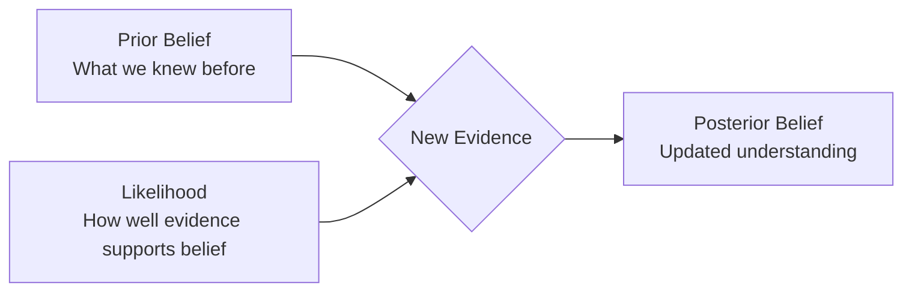

# Probability Foundations

---

## Learning Objectives

By the end of this topic, you should be able to:

1. Define the basic concepts of probability, including likelihood, events, and outcomes
2. Explain conditional probability and calculate the likelihood of an event given that another event has occurred
3. Understand the intuition behind Bayes' theorem and how it is used to update beliefs with new evidence
4. Relate these foundational probability concepts to how AI systems manage uncertainty and make predictions

---

## Overview

In the real world, absolute certainty is rare. When you look outside and see grey clouds, you don't *know* it will rain, but you know it's *likely*. AI systems face the same fundamental challenge: they must make decisions based on incomplete, noisy, and uncertain information. 

Probability is the mathematical language of uncertainty. It is how we quantify likelihoods and make rational decisions when we don't have all the facts. Whether an AI is predicting the next word in a sentence, diagnosing a disease from a medical image, or recommending a product, it relies on probability. This topic covers the foundational ideas of probability, moving from basic events to updating our beliefs mathematically using Bayes' theorem.

---

## Probability Basics — Likelihood, Events, Outcomes

At its core, **probability** is simply a number between 0 and 1 that represents how likely something is to happen. A probability of 0 means the event is impossible, and 1 means it is absolutely certain.

### Key Terms

| Term | Simple Meaning | Example (Rolling a 6-sided die) |
|---|---|---|
| **Experiment / Trial** | An action where the result is uncertain | Rolling the die |
| **Outcome** | A single possible result of an experiment | Rolling a "4" |
| **Event** | A set of outcomes we are interested in | Rolling an even number (2, 4, or 6) |
| **Probability / Likelihood** | The chance that an event will occur | 3 out of 6 (or 0.5, or 50%) chance of rolling an even number |

When all outcomes are equally likely, the probability of an event is calculated as:
**Probability = (Number of favorable outcomes) / (Total number of possible outcomes)**

In AI, we rarely deal with simple dice rolls. Instead, probabilities represent a model's confidence. If an image classifier outputs a 0.85 probability for "cat", it means the model is 85% confident that the image contains a cat based on the visual patterns it has learned.

---

## Conditional Probability — P(A given B)

In the real world, events don't happen in isolation. The likelihood of one event often depends on whether another event has already happened. This is called **conditional probability**.

We write this as **P(A | B)**, which is read as "the probability of event A, given that event B has occurred."

### Example: Rain and Clouds
- Let event A = It rains today.
- Let event B = There are dark clouds in the sky this morning.

The base probability of rain on any given day, P(A), might be 10%. But if we wake up and see dark clouds, we have new information. The *conditional probability* of rain given dark clouds, P(A | B), might be much higher, perhaps 70%.

In AI, conditional probability is everywhere:
- **Language Models:** What is the probability of the next word being "learning", given that the previous words are "machine"? This is P("learning" | "machine").
- **Recommendation Systems:** What is the probability a user buys a phone case, given they just bought a new phone? This is P(Buy Case | Buy Phone).

---

## Bayes' Theorem Intuition — Updating Belief with New Evidence

Bayes' theorem is one of the most important concepts in AI and statistics. At its heart, it provides a mathematical rule for **updating our beliefs when we receive new evidence**.

Before we see any evidence, we have an initial belief (the **prior**). When we observe new evidence, we update our belief to form a new, more informed conclusion (the **posterior**).

### The Intuition

Imagine you hear someone coughing. You want to know the probability they have a rare lung disease.

1. **Prior Belief:** Before hearing the cough, you know the disease is extremely rare (say, 1 in 10,000 people have it).
2. **New Evidence:** You hear the person coughing.
3. **Likelihood:** Does having the disease cause coughing? Yes, almost certainly.
4. **Alternative Explanations:** Do common colds or allergies cause coughing? Yes, very often.
5. **Posterior Belief (Updated):** Because the disease is so rare (the prior) and a common cold is so common, even though coughing is a symptom of the rare disease, it's still far more likely they just have a cold. 

Bayes' theorem prevents us from jumping to conclusions based only on new evidence, reminding us to factor in our initial base rates (priors). 

AI systems, particularly in medical diagnosis, spam filtering, and self-driving cars, constantly use Bayesian thinking:
- **Spam Filter Prior:** 20% of all emails are spam.
- **Evidence:** The email contains the word "Lottery".
- **Updated Belief:** The probability this email is spam is now 95%.

---

## Key Takeaways

- **Probability** is the mathematical foundation for handling uncertainty, expressing confidence as a number between 0 and 1
- **Conditional Probability (P(A\|B))** is how we measure the likelihood of an event when we already know something else has happened
- Most AI predictions (like generating the next word) are fundamentally conditional probability calculations based on prior context
- **Bayes' Theorem** is a logical framework for updating our beliefs. It combines what we knew beforehand (prior) with what we are observing now (evidence)
- In AI, balancing priors with new evidence is crucial to avoid making overly confident but incorrect predictions (like diagnosing a rare disease just because of a cough)

> **Interview tip:** If asked to explain Bayes' theorem, don't just recite the formula. Explain the *intuition* using the "Prior + Evidence = Updated Belief" framework. Interviewers look for your ability to apply Bayesian thinking to real-world problems over raw memorization.

---

## Reference Links

- 📎 [Seeing Theory: Basic Probability](https://seeing-theory.brown.edu/basic-probability/index.html) — beautiful interactive visualizations of probability concepts
- 📎 [3Blue1Brown: Bayes theorem](https://www.youtube.com/watch?v=HZGCoVF3YvM) — excellent visual intuition of Bayes' theorem and updating probabilities
