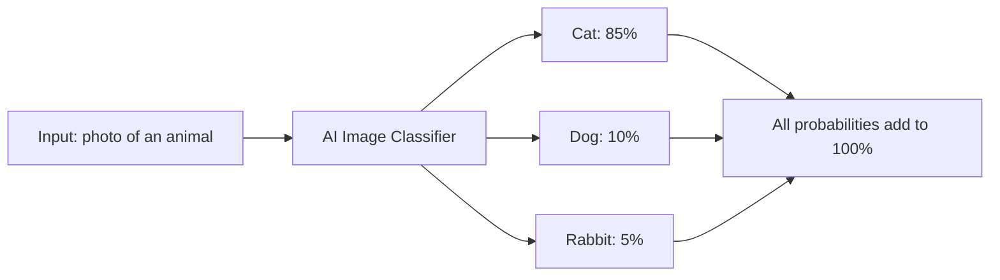
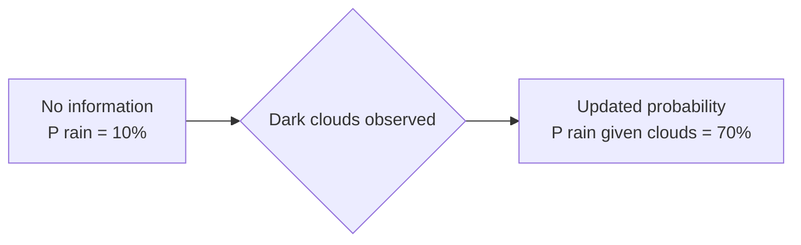
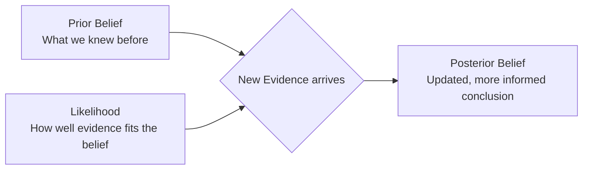

# Probability Foundations

---

## Learning Objectives

By the end of this topic, you should be able to:

- Define the basic concepts of probability including likelihood, events, and outcomes
- Calculate the probability of a simple event using the basic probability formula
- Explain conditional probability and calculate the likelihood of an event given that another event has occurred
- Understand the intuition behind Bayes' theorem and how it updates beliefs with new evidence
- Apply the Bayes' theorem formula to a simple numeric example
- Relate these foundational probability concepts to how AI systems manage uncertainty and make predictions

---

## Overview

In the real world, absolute certainty is rare. When you look outside and see grey clouds, you don't *know* it will rain, but you know it's *likely*. AI systems face the same fundamental challenge: they must make decisions based on incomplete, noisy, and uncertain information.

Probability is the mathematical language of uncertainty. It is how we quantify likelihoods and make rational decisions when we don't have all the facts. Whether an AI is predicting the next word in a sentence, diagnosing a disease from a medical image, or recommending a product, it relies on probability. This topic covers the foundational ideas of probability, moving from basic events to updating our beliefs mathematically using Bayes' theorem.

---

## 7.1 Probability Basics — Likelihood, Events, Outcomes

At its core, **probability** is simply a number between 0 and 1 that represents how likely something is to happen. A probability of 0 means the event is impossible. A probability of 1 means it is absolutely certain. Everything else falls somewhere in between.

### Key Terms

| Term | Simple Meaning | Example — Rolling a 6-sided die |
|---|---|---|
| **Experiment / Trial** | An action where the result is uncertain | Rolling the die |
| **Outcome** | A single possible result | Rolling a "4" |
| **Event** | A set of outcomes we are interested in | Rolling an even number — 2, 4, or 6 |
| **Probability** | The chance that an event will occur | 3 out of 6 = 0.5 = 50% |

**The basic formula — when all outcomes are equally likely:**

```
Probability = Number of favourable outcomes / Total number of possible outcomes
```

**Example:** What is the probability of rolling a 3 on a fair die?
```
P(rolling a 3) = 1 / 6 ≈ 0.167 = 16.7%
```

Only one face shows a 3. There are six faces total. So the probability is 1 in 6.

**Example:** What is the probability of rolling an even number?
```
P(even number) = 3 / 6 = 0.5 = 50%
```

Three faces are even (2, 4, 6). Six faces total. So the probability is 3 in 6.

## How this connects to AI:
Think about how Google Photos recognises faces. When you upload a photo, the app doesn't just say "that's definitely your friend Rahul." It calculates a confidence score for every possibility — and those scores are probabilities.

For example, an image classifier might look at a photo and output:

- Cat — 85% confident
- Dog — 10% confident
- Rabbit — 5% confident

Notice that 85 + 10 + 5 = 100%. The model always spreads its confidence across all possibilities so the total adds up to 100%. It is not saying "this is definitely a cat." It is saying "if I had to bet, I'd put 85% of my money on cat."

The higher the probability, the more confident the model is. But it always keeps its options open — which is exactly what makes AI systems honest about uncertainty rather than blindly certain.


---

## 7.2 Conditional Probability — P(A given B)

In the real world, events don't happen in isolation. The likelihood of one event often depends on whether another event has already occurred. This is called **conditional probability**.

We write this as **P(A | B)**, read as "the probability of event A, given that event B has occurred."

**Simple analogy:**
Think about your chances of being late to class. On a normal day, maybe there is a 10% chance you are late. But if you woke up 30 minutes later than usual, the probability of being late jumps to 70%. The new information (waking up late) changes the probability. That is conditional probability.

### Rain and Clouds Example

- Event A = It rains today
- Event B = There are dark clouds in the sky this morning

```
P(A) = 10%          — base probability of rain on any day
P(A | B) = 70%      — probability of rain given dark clouds this morning
```

Seeing dark clouds changes everything. The new information makes rain far more likely.



### How Conditional Probability Powers AI

- **Language models:** What is the probability the next word is "learning," given the previous word was "machine"? This is `P("learning" | "machine")`. The model calculates this for every possible next word and picks the most likely one.
- **Recommendation systems:** What is the probability a user buys a phone case, given they just bought a new phone? This is `P(buy case | buy phone)`. Amazon and Flipkart use this constantly.
- **Medical AI:** What is the probability a patient has diabetes, given their blood sugar reading is above 200? This is `P(diabetes | blood sugar > 200)`.

---

## 7.3 Bayes' Theorem — Updating Belief with New Evidence

Bayes' theorem is one of the most important concepts in all of AI and statistics. It provides a precise mathematical rule for **updating our beliefs when we receive new evidence**.

### The Intuition First

Before we see any evidence, we have an initial belief — called the **prior**. When we observe new evidence, we update that belief to form a new, more informed conclusion — called the **posterior**.



**The coughing example:**

Imagine you hear someone coughing. You want to know the probability they have a rare lung disease.

- **Prior:** The disease affects only 1 in 10,000 people — it is extremely rare
- **New evidence:** The person is coughing
- **Likelihood:** Yes, the disease causes coughing — but so does a common cold, allergies, dust, and dozens of other things
- **Posterior:** Even though coughing is a symptom of the disease, the disease is so rare that it is still overwhelmingly more likely the person just has a cold

Bayes' theorem prevents us from jumping to conclusions. It forces us to factor in the **prior probability** (how rare the disease is) alongside the new evidence (the cough). Without this, AI systems would make wildly overconfident predictions.

### The Formula

```
P(A | B) = [ P(B | A) × P(A) ] / P(B)
```

In plain English:

- `P(A | B)` — the **posterior**: probability of A being true, given that B has happened
- `P(B | A)` — the **likelihood**: probability of observing B if A is true
- `P(A)` — the **prior**: our initial belief about A before seeing any evidence
- `P(B)` — the **normaliser**: total probability of B occurring under all circumstances

### Worked Example — Spam Filter

A spam filter needs to decide: is this email spam, given that it contains the word "Lottery"?

**Known values:**
- `P(Spam)` = 0.20 — 20% of all emails are spam (prior)
- `P("Lottery" | Spam)` = 0.80 — 80% of spam emails contain the word "Lottery"
- `P("Lottery" | Not Spam)` = 0.02 — only 2% of legitimate emails contain "Lottery"

**Step 1 — Calculate P("Lottery"):** total probability that any email contains "Lottery"
```
P("Lottery") = P("Lottery" | Spam) × P(Spam) + P("Lottery" | Not Spam) × P(Not Spam)
             = (0.80 × 0.20) + (0.02 × 0.80)
             = 0.16 + 0.016
             = 0.176
```

**Step 2 — Apply Bayes' theorem:**
```
P(Spam | "Lottery") = [ P("Lottery" | Spam) × P(Spam) ] / P("Lottery")
                    = [ 0.80 × 0.20 ] / 0.176
                    = 0.16 / 0.176
                    ≈ 0.909
```

**Result:** There is approximately a **91% probability** this email is spam.

The email started with only a 20% chance of being spam (the prior). After seeing the word "Lottery," Bayes' theorem updated that belief to 91%. This is exactly how real spam filters work.

### How AI Uses Bayesian Thinking

- **Medical diagnosis:** Starting with how rare a disease is (prior), then updating based on test results and symptoms (evidence) to arrive at a diagnosis probability (posterior)
- **Self-driving cars:** Starting with a belief about where other cars are, then continuously updating that belief as new sensor data arrives
- **Language models:** Every next-word prediction is a form of conditional probability — what is the most likely next word given everything said so far?

---

## Key Takeaways

- **Probability** is the mathematical foundation for handling uncertainty — expressed as a number between 0 (impossible) and 1 (certain)
- The basic formula is: `P(event) = favourable outcomes / total outcomes`
- **Conditional probability P(A|B)** measures the likelihood of A given that B has already happened — most AI predictions are fundamentally conditional probability calculations
- **Bayes' theorem** provides the mathematical rule for updating beliefs: `P(A|B) = [P(B|A) × P(A)] / P(B)`
- The three key components are: **prior** (what we believed before), **likelihood** (how well the evidence fits), and **posterior** (updated belief after seeing evidence)
- Bayes' theorem prevents overconfident predictions by forcing the model to consider how rare or common something is before updating based on new evidence
- In AI, balancing priors with new evidence is crucial — diagnosing a rare disease just because of a cough, without considering how rare it is, would be a classic Bayesian error

> **Interview tip:** If asked to explain Bayes' theorem, don't just recite the formula. Explain the intuition using "Prior + Evidence = Updated Belief" and then give the spam filter example with numbers. Interviewers look for your ability to apply Bayesian thinking to real problems — not raw memorisation of the formula.

---

## Reference Links

- 📎 [Seeing Theory — Basic Probability](https://seeing-theory.brown.edu/basic-probability/index.html) — beautiful interactive visualisations of probability concepts
- 📎 [3Blue1Brown — Bayes theorem](https://www.youtube.com/watch?v=HZGCoVF3YvM) — excellent visual intuition of Bayes' theorem and updating probabilities
- 📎 [Khan Academy — Basic probability](https://www.khanacademy.org/math/statistics-probability/probability-library) — step-by-step beginner-friendly probability exercises
