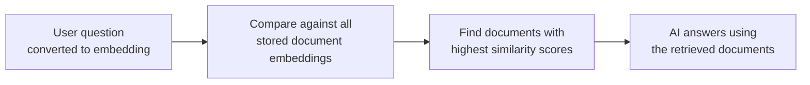

# Embeddings in Practice

---

## Learning Objectives

By the end of this topic, you should be able to:

- Explain what it means to explore embeddings by plotting words or sentences as points in space
- Identify which words or sentences will cluster together based on their embedding vectors
- Calculate cosine similarity by hand between two toy sentence embeddings using four clear steps
- Read a similarity score and explain in plain English what it means for a real AI system
- Explain why this hands-on calculation matters before using a real embedding API

---

## Overview

In the real world, AI systems compare the meaning of text thousands of times per second — matching a search query to a document, routing a customer complaint to the right FAQ, or finding the most relevant product for a user's description. The tool that makes this possible is **cosine similarity between embedding vectors**.

This topic is where you stop reading about it and start doing it yourself. No code, no AI model — just small, simplified numbers you can calculate on paper. The goal is simple: by the end of this topic, you should be able to look at any cosine similarity score an AI system produces and know exactly how it was calculated and what it means.

---

## 8.1 Embedding Explorer — Comparing Word Clusters in 2D

### What Is an Embedding?

An embedding is a list of numbers assigned to a word or sentence, such that words with **similar meanings get numbers that are close to each other**, and words that are unrelated end up far apart.

Think of it like placing cities on a map. London and Paris end up close together because they are both European capitals. London and Tokyo end up far apart. The AI does the same thing — but for words and sentences, based on meaning.

### Why Plot in 2D?

Real embeddings have hundreds of numbers — impossible to draw. But if we simplify each word down to just **2 numbers**, we can plot them on a simple X-Y graph and actually see which words cluster together.

The clustering idea is identical to what happens in real models. Only the number of dimensions changes.

### Worked Setup — Banking vs Food Delivery Words

Suppose we assign simplified 2D embeddings to six words from two very different domains:

| Word | Domain | X | Y |
|---|---|---|---|
| loan | Banking | 1.0 | 1.0 |
| interest | Banking | 1.2 | 0.9 |
| EMI | Banking | 0.9 | 1.1 |
| pizza | Food | 5.0 | 5.0 |
| burger | Food | 5.2 | 4.8 |
| fries | Food | 4.9 | 5.1 |

**The plot:**

```
Y
6 |
5 |                         burger  pizza
  |                          fries
4 |
3 |
2 |
1 |  loan
  |  EMI  interest
0 +--------------------------------  X
  0    1    2    3    4    5    6
```

**What you can see:**
- The three banking words (loan, interest, EMI) sit tightly clustered near the bottom-left — around X≈1, Y≈1
- The three food words (pizza, burger, fries) sit tightly clustered near the top-right — around X≈5, Y≈5
- The two clusters are far apart from each other

**What this means in plain English:**
- Words that are close together on the graph = similar meaning
- Words that are far apart = unrelated meaning
- Words in the same tight cluster = they belong to the same domain or topic

**How this connects to real AI:**

This is exactly how a RAG chatbot decides which stored document to retrieve. When you ask "what are current home loan interest rates?", the system converts your question into an embedding vector and finds the stored documents whose vectors are closest to yours. Banking-related documents cluster near your question. Food-related documents sit far away and get ignored.



---

## 8.2 Similarity Scoring — Computing Cosine Similarity by Hand

### Before the Maths — What Are We Actually Measuring?

Here is the core question: **how do we tell a computer that "I want to order pizza" and "I would like to order a burger" are saying basically the same thing, even though none of the words match?**

The answer: we convert both sentences into vectors (lists of numbers), and then measure the **angle** between those two vectors. If the angle is small — they point in roughly the same direction — the sentences are similar in meaning. If the angle is large — they point in very different directions — they are unrelated.

**Cosine similarity** converts that angle into a score between 0 and 1:
- **Score close to 1** — the two vectors point in nearly the same direction — very similar meaning
- **Score close to 0** — the vectors point in very different directions — unrelated
- **Negative score** — opposite directions — very rare in text embeddings, don't worry about this for now

### The Formula

```
cosine similarity(A, B) = (A · B) / (|A| × |B|)
```

This looks complicated but it is just **four steps**, always in the same order:

| Step | What you calculate | Why you do it |
|---|---|---|
| **Step 1** | Dot product `A · B` | Measures how much the two vectors overlap in direction |
| **Step 2** | Magnitude of A `\|A\|` | Measures the length of vector A |
| **Step 3** | Magnitude of B `\|B\|` | Measures the length of vector B |
| **Step 4** | Divide: `(A · B) ÷ (|A| × |B|)` | Adjusts for length so only direction matters |

**Why Step 4 — why do we divide?**
Without dividing, a longer vector always gets a bigger score even if it points in the same direction as a shorter one. Dividing by the lengths removes this unfair size advantage and keeps the score purely about direction — which is what similarity really means.

---

### 8.2.1 Worked Example — Food Delivery Support Chat

**The setup:**
A food-delivery chatbot receives three messages. We want to know: which messages are similar in meaning, and which are unrelated?

| Sentence | Vector | What it's about |
|---|---|---|
| S1: "I want to order pizza" | (0.9, 0.1, 0.2) | Ordering food |
| S2: "I would like to order a burger" | (0.8, 0.2, 0.1) | Ordering food |
| S3: "The train is delayed today" | (0.1, 0.9, 0.8) | Transport — nothing to do with food |

**Our question before we calculate:** S1 and S2 should be similar. S1 and S3 should be unrelated. Let's verify this with the maths.

---

**Calculation 1 — S1 vs S2 (both about ordering food)**

> We want to check: do "I want to order pizza" and "I would like to order a burger" mean the same thing to the AI?

**Step 1 — Dot product** *(how much do these two vectors overlap?)*

Multiply each matching pair of numbers and add them all up:
```
Position 1: 0.9 × 0.8 = 0.72
Position 2: 0.1 × 0.2 = 0.02
Position 3: 0.2 × 0.1 = 0.02

Dot product = 0.72 + 0.02 + 0.02 = 0.76
```
The numbers line up well — large in the same positions. This suggests similarity.

**Step 2 — Magnitude of S1** *(how long is S1's vector?)*

Square each number, add them, then take the square root:
```
0.9² = 0.81
0.1² = 0.01
0.2² = 0.04

Sum = 0.81 + 0.01 + 0.04 = 0.86
Magnitude of S1 = √0.86 ≈ 0.927
```

**Step 3 — Magnitude of S2** *(how long is S2's vector?)*
```
0.8² = 0.64
0.2² = 0.04
0.1² = 0.01

Sum = 0.64 + 0.04 + 0.01 = 0.69
Magnitude of S2 = √0.69 ≈ 0.831
```

**Step 4 — Cosine similarity** *(divide to get the final score)*
```
0.76 ÷ (0.927 × 0.831)
= 0.76 ÷ 0.770
≈ 0.99
```

**Result: 0.99**

> This is almost 1 — which means the AI sees these two sentences as nearly identical in meaning. A food delivery chatbot would give the exact same response to both messages. This matches our expectation perfectly.

---

**Calculation 2 — S1 vs S3 (completely unrelated sentences)**

> We want to check: does "I want to order pizza" have anything to do with "The train is delayed today"?

**Step 1 — Dot product**
```
Position 1: 0.9 × 0.1 = 0.09
Position 2: 0.1 × 0.9 = 0.09
Position 3: 0.2 × 0.8 = 0.16

Dot product = 0.09 + 0.09 + 0.16 = 0.34
```
The numbers don't line up well at all — where S1 is large (position 1), S3 is small. This already hints at low similarity.

**Step 2 — Magnitude of S1:** Already calculated above — **≈ 0.927**

**Step 3 — Magnitude of S3**
```
0.1² = 0.01
0.9² = 0.81
0.8² = 0.64

Sum = 0.01 + 0.81 + 0.64 = 1.46
Magnitude of S3 = √1.46 ≈ 1.208
```

**Step 4 — Cosine similarity**
```
0.34 ÷ (0.927 × 1.208)
= 0.34 ÷ 1.120
≈ 0.30
```

**Result: 0.30**

> This is close to 0 — which means the AI sees these two sentences as almost completely unrelated. A food delivery chatbot would never route a train delay message to the food ordering department. Again, this matches our expectation perfectly.

---

**Summary of results:**

| Pair | Score | What it means | Was it expected? |
|---|---|---|---|
| S1 vs S2 (both ordering food) | 0.99 | Nearly identical meaning | ✅ Yes |
| S1 vs S3 (food vs train delay) | 0.30 | Unrelated | ✅ Yes |

**Interpreting similarity scores:**

| Score range | What it means in plain English |
|---|---|
| 0.8 – 1.0 | Closely related — same topic or intent |
| 0.4 – 0.8 | Somewhat related — shared context |
| 0.0 – 0.4 | Unrelated — different topics entirely |

These are rough guides to build intuition — the exact thresholds vary by model and task.

---

### Common Beginner Mistakes

- **Stopping at the dot product** — the dot product alone is not a similarity score. It is affected by how big the numbers are, not just the direction. You must always divide by both magnitudes to get a true similarity score
- **Mixing up positions** — always multiply position 1 with position 1, position 2 with position 2. Never cross them — mixing positions gives a completely meaningless result
- **Worrying about negative scores** — in practice, almost all text embedding similarity scores fall between 0 and 1. Negative scores are theoretically possible but extremely rare

---

## Worked Example — College Helpdesk Chatbot

**Scenario:** A student types a question into a college helpdesk chatbot. The system has three stored FAQ answers. Which FAQ is the best match for the student's question?

**Before the numbers:** We expect FAQ 1 to be the closest match because it is about the same topic — resetting a password. FAQ 2 is about hostel mess timings — completely unrelated. FAQ 3 is about certificates — different topic but closer than FAQ 2.

| Text | Vector |
|---|---|
| Student: "How do I reset my student portal password?" | (0.85, 0.15) |
| FAQ 1: "Steps to reset your college portal login password" | (0.80, 0.20) |
| FAQ 2: "Hostel mess timings for this semester" | (0.10, 0.90) |
| FAQ 3: "How to apply for a bonafide certificate" | (0.40, 0.60) |

**Student question vs FAQ 1:**

```
Step 1 — Dot product:
(0.85 × 0.80) + (0.15 × 0.20) = 0.68 + 0.03 = 0.71

Step 2 — Magnitude of question:
√(0.85² + 0.15²) = √(0.7225 + 0.0225) = √0.745 ≈ 0.863

Step 3 — Magnitude of FAQ 1:
√(0.80² + 0.20²) = √(0.64 + 0.04) = √0.68 ≈ 0.825

Step 4 — Similarity:
0.71 ÷ (0.863 × 0.825) = 0.71 ÷ 0.712 ≈ 1.00
```

**Student question vs FAQ 2:**

```
Step 1 — Dot product:
(0.85 × 0.10) + (0.15 × 0.90) = 0.085 + 0.135 = 0.22

Step 2 — Magnitude of question (already calculated): ≈ 0.863

Step 3 — Magnitude of FAQ 2:
√(0.10² + 0.90²) = √(0.01 + 0.81) = √0.82 ≈ 0.906

Step 4 — Similarity:
0.22 ÷ (0.863 × 0.906) = 0.22 ÷ 0.782 ≈ 0.28
```

**Results:**

| Comparison | Score | Interpretation |
|---|---|---|
| Question vs FAQ 1 | ≈ 1.00 | Best match — show this answer to the student |
| Question vs FAQ 2 | ≈ 0.28 | Unrelated — do not show |
| Question vs FAQ 3 | Try it yourself | Should fall between 0.28 and 1.00 |

FAQ 1 is the clear winner. The chatbot shows the student exactly the right answer — not because it "understood" the question, but because the cosine similarity calculation identified the closest vector. Try computing Question vs FAQ 3 using the same four steps to check your understanding.

---

## Key Takeaways

- An embedding places every word or sentence at a specific point in a mathematical space — similar meaning = close together, unrelated = far apart
- Plotting 2D embeddings makes clustering visible — this is a simplified version of what real AI models do in hundreds of dimensions
- **Cosine similarity measures the angle between two vectors** — not their length. A score close to 1 means similar meaning. Close to 0 means unrelated
- The four steps always in this order: **dot product → magnitude of A → magnitude of B → divide**
- The dot product alone is not enough — always divide by both magnitudes to remove the effect of vector size
- This exact calculation runs inside every RAG system, search engine, and recommendation engine you will build in this program
- You do not need to be a maths expert to do this — you need multiplication, addition, and a square root button on any calculator

> **Interview tip:** Being able to explain and hand-calculate cosine similarity is one of the most common "prove you understand embeddings" questions in AI roles. Walk through the four steps, use a simple example, and explain what the score means in plain English. Most candidates can name the formula but cannot actually calculate it or explain what each step does. You now can.

---

## Reference Links

- 📎 [Google Machine Learning Crash Course — Embeddings](https://developers.google.com/machine-learning/crash-course/embeddings) — official beginner-friendly explanation with interactive visuals
- 📎 [TensorFlow Embedding Projector](https://projector.tensorflow.org/) — explore real high-dimensional embeddings compressed to 2D/3D
- 📎 [3Blue1Brown — Dot products and duality](https://www.youtube.com/watch?v=LyGKycYT2v0) — visual intuition for the dot product with no prior maths required
