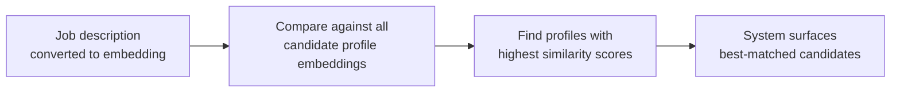

# Embeddings in Practice

---

## Learning Objectives

By the end of this topic, you should be able to:

- Explain what it means to explore embeddings by plotting words or sentences as points in space
- Identify which words or sentences will cluster together based on their embedding vectors
- Explain why 2D vectors are used for learning and what changes when real systems use hundreds of dimensions
- Calculate cosine similarity by hand between two toy sentence embeddings using four clear steps
- Read a similarity score and explain in plain English what it means for a real AI system

---

## Overview

In the real world, AI systems compare the meaning of text thousands of times per second — matching a job description to the right candidates, routing a customer complaint to the right FAQ, or finding the most relevant product for a user's description. The tool that makes this possible is **cosine similarity between embedding vectors**.

This topic is where you stop reading about it and start doing it yourself. No code, no AI model — just small, simplified numbers you can calculate on paper. The goal is simple: by the end of this topic, you should be able to look at any cosine similarity score an AI system produces and know exactly how it was calculated and what it means.

Consider a recruitment platform that uses AI to match job descriptions to candidate profiles. When a company posts a job, the system compares it against thousands of stored candidate profiles and surfaces the most relevant matches — automatically, in seconds. We will use this scenario throughout the topic to see exactly how the maths works at each step.

---

## Embedding Explorer — Comparing Job Profiles in 2D

### What Is an Embedding?

An embedding is a list of numbers assigned to a word, sentence, or document, such that items with **similar meaning get numbers that are close to each other**, and unrelated items end up far apart.

Think of it like placing candidates on a map based on their skills. Two software engineers end up close together. A software engineer and a chef end up far apart. The AI does the same thing — but for text, based on meaning.

### Why Plot in 2D?

Real embeddings have hundreds of numbers — impossible to draw. But if we simplify each profile down to just **2 numbers**, we can plot them on a simple X-Y graph and actually see which profiles cluster together.

The clustering idea is identical to what happens in real models. Only the number of dimensions changes.

### Worked Setup — Job Profile Clusters

Suppose our job matching system assigns simplified 2D embeddings to six profiles:

| Profile | Domain | X | Y |
|---|---|---|---|
| Python Developer | Tech | 1.0 | 1.0 |
| Data Scientist | Tech | 1.2 | 0.9 |
| ML Engineer | Tech | 0.9 | 1.1 |
| Chef | Hospitality | 5.0 | 5.0 |
| Baker | Hospitality | 5.2 | 4.8 |
| Waiter | Hospitality | 4.9 | 5.1 |

**The plot:**

```
Y
6 |
5 |                         Baker   Chef
  |                          Waiter
4 |
3 |
2 |
1 |  Python Dev
  |  ML Eng  Data Sci
0 +--------------------------------  X
  0    1    2    3    4    5    6
```

**What you can see:**
- The three tech profiles (Python Developer, Data Scientist, ML Engineer) sit tightly clustered near the bottom-left — around X≈1, Y≈1
- The three hospitality profiles (Chef, Baker, Waiter) sit tightly clustered near the top-right — around X≈5, Y≈5
- The two clusters are far apart from each other

**What this means for the job matching system:**
When a company posts a job for a "Machine Learning Engineer," the system converts that job description into an embedding. Because the ML Engineer profile sits near the bottom-left cluster, the system will find Python Developer and Data Scientist profiles as the closest matches — and surface them to the company. Chef, Baker, and Waiter profiles sit far away and get ignored.



---

## Beyond 2D — A Quick Heads-Up

In the examples above, each profile is described by just **2 numbers** (X and Y). This makes it easy to draw and understand. But real embedding models use far more dimensions.

Here is what that actually looks like:

```
2D vector (what we use in this topic for learning):
Python Developer = [1.0, 1.0]

Real embedding vector (what a model like OpenAI's text-embedding-3-small produces):
Python Developer = [0.82, 0.14, 0.73, 0.05, 0.91, 0.33, 0.67, 0.12, ...]
                   ← this list continues for 1,536 numbers total →
```

Each of those 1,536 numbers captures a tiny, different fragment of meaning — is this profile technical? Does it involve data? Is it leadership-focused? Is it entry-level or senior? Real models learn these dimensions automatically from billions of real job postings and profiles.

**Three things to know about higher dimensions:**

- **The maths is identical** — dot product, magnitude, cosine similarity — everything you learn here works exactly the same way whether the vector has 2 numbers or 1,536. Only the number of multiplications changes.

- **You cannot draw them** — but tools like the TensorFlow Embedding Projector compress high-dimensional vectors down to 2D or 3D for visualisation. The clusters you see there are the same clusters, just flattened for your screen.

- **Dimension mismatch is a real error** — all vectors being compared must have the same number of dimensions. You cannot compare a 768-dimension profile against a 1,536-dimension job description. Always use the same embedding model for everything in one system.

You do not need to go deeper on this now. Just know: 2D is for learning. Real systems go much further — and the same four steps still apply.

---

## Similarity Scoring — How the System Finds the Best Match

### The Simple Idea First

Imagine the job matching system receives two candidate messages:

- Candidate A: "I have experience building machine learning pipelines in Python"
- Candidate B: "I am skilled in Python for data science and model training"
- Candidate C: "I enjoy cooking Italian food at home"

Even without maths, you can tell — A and B are saying similar things. C has nothing to do with either of them.

The system needs to do the same thing — but automatically, for thousands of candidates, in milliseconds. It cannot "read" the messages the way you just did. So instead, each message gets converted into a vector — a list of numbers — and the system measures how similar those vectors are.

The measurement it uses is called **cosine similarity**. The result is always a number between 0 and 1:

- **Close to 1** — the two messages are very similar in meaning
- **Close to 0** — the two messages are unrelated

That is all cosine similarity is — a score that tells you how similar two pieces of text are. The maths behind it has four steps, but each step is just multiplication and addition.

---

### The Four Steps — Plain English First

Before any numbers, here is what each step does in plain English:

**Step 1 — Dot product:**
Multiply each matching pair of numbers from the two vectors, then add them all up. This gives you a rough sense of how much the two vectors "overlap." If both vectors have large numbers in the same positions, the result will be high.

**Step 2 — Length of vector A:**
Square each number in vector A, add them, take the square root. This tells you how "long" vector A is.

**Step 3 — Length of vector B:**
Same thing for vector B.

**Step 4 — Divide:**
Divide the result of Step 1 by the result of Steps 2 and 3 multiplied together. This adjusts the score so it does not matter how long the vectors are — only the direction they point matters.

Why divide? Because a longer vector produces a bigger dot product even if it points in exactly the same direction as a shorter one. Dividing removes that unfairness and makes the score purely about similarity of meaning.

The formula written out:
```
cosine similarity = dot product ÷ (length of A × length of B)
```

---

### Step by Step — Candidate A vs Candidate B

The system assigns each candidate message a simplified 3-number vector:

| Candidate | Message | Vector |
|---|---|---|
| A | "I build ML pipelines in Python" | (0.9, 0.1, 0.2) |
| B | "Python for data science and model training" | (0.8, 0.2, 0.1) |
| C | "I enjoy cooking Italian food at home" | (0.1, 0.9, 0.8) |

Before calculating, notice: A and B have large numbers at position 1 and small numbers elsewhere. C has a small number at position 1 but large numbers at positions 2 and 3. This already tells you A and B are similar, and C is different — the maths will confirm this.

**Calculating similarity between Candidate A and Candidate B:**

**Step 1 — Dot product** *(multiply matching positions, then add)*
```
Position 1:  0.9 × 0.8 = 0.72
Position 2:  0.1 × 0.2 = 0.02
Position 3:  0.2 × 0.1 = 0.02

Total = 0.72 + 0.02 + 0.02 = 0.76
```
The large numbers were in the same positions — so the total came out high. Good sign.

**Step 2 — Length of A** *(square each number, add, square root)*
```
0.9² = 0.81
0.1² = 0.01
0.2² = 0.04

Sum = 0.86
Length of A = √0.86 ≈ 0.927
```

**Step 3 — Length of B** *(same process)*
```
0.8² = 0.64
0.2² = 0.04
0.1² = 0.01

Sum = 0.69
Length of B = √0.69 ≈ 0.831
```

**Step 4 — Divide**
```
0.76 ÷ (0.927 × 0.831)
= 0.76 ÷ 0.770
≈ 0.99
```

**Result: 0.99** — almost 1. The system sees A and B as nearly identical in meaning and would shortlist both for the same Python/ML job posting.

---

**Now comparing Candidate A and Candidate C:**

**Step 1 — Dot product**
```
Position 1:  0.9 × 0.1 = 0.09
Position 2:  0.1 × 0.9 = 0.09
Position 3:  0.2 × 0.8 = 0.16

Total = 0.09 + 0.09 + 0.16 = 0.34
```
Notice — where A had a large number (position 1), C had a small one. The total is much lower.

**Step 2 — Length of A:** Already calculated — **≈ 0.927**

**Step 3 — Length of C**
```
0.1² = 0.01
0.9² = 0.81
0.8² = 0.64

Sum = 1.46
Length of C = √1.46 ≈ 1.208
```

**Step 4 — Divide**
```
0.34 ÷ (0.927 × 1.208)
= 0.34 ÷ 1.120
≈ 0.30
```

**Result: 0.30** — close to 0. The system sees A and C as almost completely unrelated and would not shortlist C for any tech role.

---

**Summary:**

| Pair | Score | What the system does |
|---|---|---|
| Candidate A vs B (both Python/ML) | 0.99 | Both shortlisted for the same role ✅ |
| Candidate A vs C (tech vs cooking) | 0.30 | C not shortlisted for a tech role ✅ |

The maths confirmed exactly what you predicted before calculating. That is the point — the numbers should match your intuition. When they do not, it signals something worth investigating.

**Similarity score guide:**

| Score | What it means |
|---|---|
| 0.8 – 1.0 | Very similar — same topic or intent |
| 0.4 – 0.8 | Somewhat related — shared context |
| 0.0 – 0.4 | Unrelated — different topics |

> **Real-World Note:** While the math works this way in our 3D example, real high-dimensional models (like OpenAI's) often compress their scores into a narrow range. In production, a score of 0.75 might actually mean "unrelated," while 0.85+ means "very similar." You always have to benchmark the baseline of your specific model!

---

### Common Beginner Mistakes

- **Stopping at the dot product** — the dot product on its own is not a similarity score. You must always do Step 4 (divide) to get a fair result
- **Mixing up positions** — multiply position 1 with position 1, position 2 with position 2. Never mix them
- **Worrying about negative scores** — in practice, almost all text similarity scores fall between 0 and 1. Negative scores are theoretically possible but extremely rare

---

## Worked Example — Full Job Matching Flow

**Scenario:** A company posts a job: *"Looking for a Python developer with experience in data pipelines and automation."*

The system stores four candidate profiles. Which profile should the system surface as the best match?

**Before the numbers:** We expect Profile 1 to be the closest match. Profile 2 is somewhat related (data, but not Python-specific). Profile 3 is unrelated. Profile 4 is also tech but a different area.

| Text | Vector |
|---|---|
| Job: "Python developer, data pipelines, automation" | (0.85, 0.15) |
| Profile 1: "5 years Python, built ETL pipelines and automation scripts" | (0.80, 0.20) |
| Profile 2: "Data analyst using Excel and SQL for reporting" | (0.50, 0.50) |
| Profile 3: "Head chef at a Michelin-starred restaurant" | (0.10, 0.90) |

**Job vs Profile 1:**
```
Dot product:   (0.85 × 0.80) + (0.15 × 0.20) = 0.68 + 0.03 = 0.71
|Job|:         √(0.85² + 0.15²) = √0.745 ≈ 0.863
|Profile 1|:   √(0.80² + 0.20²) = √0.68 ≈ 0.825
Similarity:    0.71 ÷ (0.863 × 0.825) ≈ 1.00
```

**Job vs Profile 2:**
```
Dot product:   (0.85 × 0.50) + (0.15 × 0.50) = 0.425 + 0.075 = 0.50
|Profile 2|:   √(0.50² + 0.50²) = √0.50 ≈ 0.707
Similarity:    0.50 ÷ (0.863 × 0.707) ≈ 0.82
```

**Job vs Profile 3:**
```
Dot product:   (0.85 × 0.10) + (0.15 × 0.90) = 0.085 + 0.135 = 0.22
|Profile 3|:   √(0.10² + 0.90²) = √0.82 ≈ 0.906
Similarity:    0.22 ÷ (0.863 × 0.906) ≈ 0.28
```

**Results:**

| Comparison | Score | What the system does |
|---|---|---|
| Job vs Profile 1 | ≈ 1.00 | **Surfaces first** — near-perfect match |
| Job vs Profile 2 | ≈ 0.82 | Surfaces second — somewhat relevant |
| Job vs Profile 3 | ≈ 0.28 | Not surfaced — unrelated |

**The conclusion:**
Profile 1 is the clear best match. Profile 2 is partially relevant — a data analyst is not a Python developer, but there is overlap. Profile 3 is correctly ignored. The system ranked them by cosine similarity score — no human judgment, no keyword matching, just maths on vectors.

This is exactly the flow that runs inside every production job matching, search, and RAG system you will build.

---

## Key Takeaways

- An embedding places every piece of text at a specific point in a mathematical space — similar meaning = close together, unrelated = far apart
- We use 2D vectors for learning and visualisation. Real systems use hundreds or thousands of dimensions — the maths is identical, only the scale changes
- **All vectors being compared must come from the same embedding model** — dimension mismatch causes errors
- **Cosine similarity** measures the angle between two vectors — not their length. Score close to 1 = similar. Close to 0 = unrelated
- The four steps always in this order: **dot product → magnitude of A → magnitude of B → divide**
- This exact calculation powers every job matching system, search engine, RAG pipeline, and recommendation system you will build

> **Interview tip:** Being able to walk through a cosine similarity calculation by hand — using a real scenario like job matching — and explain what each step does is one of the most effective ways to demonstrate you genuinely understand embeddings, not just the buzzword.

---

## Reference Links

- 📎 [Google Machine Learning Crash Course — Embeddings](https://developers.google.com/machine-learning/crash-course/embeddings) — official beginner-friendly explanation with interactive visuals
- 📎 [TensorFlow Embedding Projector](https://projector.tensorflow.org/) — explore real high-dimensional embeddings compressed to 2D/3D
- 📎 [3Blue1Brown — Dot products and duality](https://www.youtube.com/watch?v=LyGKycYT2v0) — visual intuition for the dot product with no prior maths required
