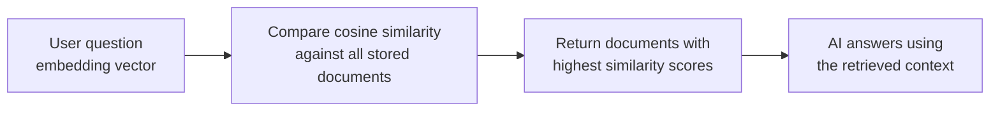

# Embeddings in Practice

---

## Learning Objectives

By the end of this topic, you should be able to:

- Explain what it means to "explore" embeddings by plotting words or sentences as points in space
- Identify which words or sentences will cluster together based on their embedding vectors
- Calculate cosine similarity by hand between two toy sentence embeddings
- Analyse a set of similarity scores to decide which sentence pairs are close in meaning and which are not
- Explain why doing this calculation by hand matters before you call a real embedding API

---

## Overview
In the real world, AI systems compare the meaning of text thousands of times per second — matching a search query to a document, routing a customer complaint to the right FAQ, or finding the most relevant product for a user's description. The tool that makes this possible is **cosine similarity between embedding vectors.**

This topic is where you stop reading about it and start doing it yourself. No code, no AI model — just small, simplified numbers you can calculate on paper. The goal is simple: by the end of this topic, you should be able to look at any cosine similarity score an AI system produces and know exactly how it was calculated and what it means.

---

## Embedding Explorer — Comparing Word Clusters in 2D

**What is an embedding (quick recap)?**
An embedding is a list of numbers assigned to a word or sentence, such that words with similar meanings get numbers that are numerically close to each other. Words that are unrelated end up far apart.

**Why plot in 2D?**
Real embeddings have hundreds of numbers — impossible to draw. But if we simplify each word down to just 2 numbers, we can plot them on a simple X-Y graph and actually see which words cluster together. The clustering idea is identical to what happens in real models — only the number of dimensions changes.

**Worked setup — banking vs food delivery words:**

| Word | Domain | X | Y |
|---|---|---|---|
| loan | Banking | 1.0 | 1.0 |
| interest | Banking | 1.2 | 0.9 |
| EMI | Banking | 0.9 | 1.1 |
| pizza | Food | 5.0 | 5.0 |
| burger | Food | 5.2 | 4.8 |
| fries | Food | 4.9 | 5.1 |

**The plot:**

```
Y
6 |
5 |                         burger  pizza
  |                          fries
4 |
3 |
2 |
1 |  loan
  |  EMI  interest
0 +--------------------------------  X
  0    1    2    3    4    5    6
```

Notice what happened:
- The three banking words sit tightly clustered near the bottom-left — around X≈1, Y≈1
- The three food words sit tightly clustered near the top-right — around X≈5, Y≈5
- The two clusters are far apart from each other

**What this tells you:**
- Tightness within a cluster = shared meaning
- Distance between clusters = difference in meaning

This is exactly how a real RAG system decides which stored documents are about the same topic as a user's question — it compares embedding vectors and finds the closest cluster. You are looking at a simplified version of the same mechanism.



---

## 8.2 Similarity Scoring — Computing Cosine Similarity by Hand

**The formula:**

```
cosine similarity(A, B) = (A · B) / (|A| × |B|)
```

- `A · B` — dot product: multiply matching positions of the two vectors and add up the results
- `|A|` and `|B|` — magnitude: the "length" of each vector, calculated as the square root of the sum of its squared values
- The result always falls between −1 and 1:
  - **1** = pointing in exactly the same direction — very similar meaning
  - **0** = unrelated
  - Negative values = opposite meaning — rare in practice for text embeddings

**The four steps — always in this order:**
1. Calculate the dot product
2. Calculate the magnitude of A
3. Calculate the magnitude of B
4. Divide the dot product by (magnitude A × magnitude B)

### 8.2.1 Worked Example — Food Delivery Support Chat

Three short sentences from a food-delivery support chatbot, each given a toy 3D embedding:

| Sentence | Vector |
|---|---|
| S1: "I want to order pizza" | (0.9, 0.1, 0.2) |
| S2: "I would like to order a burger" | (0.8, 0.2, 0.1) |
| S3: "The train is delayed today" | (0.1, 0.9, 0.8) |

**S1 vs S2 — both about ordering food:**

Step 1 — Dot product:
```
(0.9 × 0.8) + (0.1 × 0.2) + (0.2 × 0.1)
= 0.72 + 0.02 + 0.02
= 0.76
```

Step 2 — Magnitude of S1:
```
√(0.9² + 0.1² + 0.2²) = √(0.81 + 0.01 + 0.04) = √0.86 ≈ 0.927
```

Step 3 — Magnitude of S2:
```
√(0.8² + 0.2² + 0.1²) = √(0.64 + 0.04 + 0.01) = √0.69 ≈ 0.831
```

Step 4 — Cosine similarity:
```
0.76 ÷ (0.927 × 0.831) = 0.76 ÷ 0.770 ≈ 0.99
```

**Result: 0.99 — extremely high similarity.** Makes sense — both sentences are about ordering food.

---

**S1 vs S3 — completely unrelated sentences:**

Step 1 — Dot product:
```
(0.9 × 0.1) + (0.1 × 0.9) + (0.2 × 0.8)
= 0.09 + 0.09 + 0.16
= 0.34
```

Step 2 — Magnitude of S1 (already calculated above): **≈ 0.927**

Step 3 — Magnitude of S3:
```
√(0.1² + 0.9² + 0.8²) = √(0.01 + 0.81 + 0.64) = √1.46 ≈ 1.208
```

Step 4 — Cosine similarity:
```
0.34 ÷ (0.927 × 1.208) = 0.34 ÷ 1.120 ≈ 0.30
```

**Result: 0.30 — low similarity.** Makes sense — a food order and a train delay have nothing to do with each other.

**Interpreting similarity scores:**

| Score range | What it means |
|---|---|
| 0.8 – 1.0 | Closely related — same topic or meaning |
| 0.4 – 0.8 | Somewhat related — shared context |
| 0.0 – 0.4 | Unrelated — different topics entirely |
| Below 0 | Opposite meaning — rare in text embeddings |

The exact thresholds always depend on the specific embedding model and task — these are rough guides to build intuition, not fixed rules.

### Common Beginner Mistakes

- **Forgetting to divide by the magnitudes** — reporting the dot product alone as similarity. The dot product is affected by vector length, not just direction, so it will mislead you without the division step
- **Mixing up positions when multiplying** — always multiply position 1 with position 1, position 2 with position 2. Never cross them
- **Assuming negative scores are common** — most modern text embedding models produce scores between 0 and 1

---

## Worked Example — College Helpdesk Chatbot

**Scenario:** A college helpdesk chatbot has three stored FAQ answers, each represented as a toy 2D embedding. A student asks a question. Find which FAQ is the best match.

| Text | Vector |
|---|---|
| Student question: "How do I reset my student portal password?" | (0.85, 0.15) |
| FAQ 1: "Steps to reset your college portal login password" | (0.80, 0.20) |
| FAQ 2: "Hostel mess timings for this semester" | (0.10, 0.90) |
| FAQ 3: "How to apply for a bonafide certificate" | (0.40, 0.60) |

**Student question vs FAQ 1:**

```
Dot product:  (0.85 × 0.80) + (0.15 × 0.20) = 0.68 + 0.03 = 0.71
|Question|:   √(0.85² + 0.15²) = √(0.7225 + 0.0225) = √0.745 ≈ 0.863
|FAQ 1|:      √(0.80² + 0.20²) = √(0.64 + 0.04) = √0.68 ≈ 0.825
Similarity:   0.71 ÷ (0.863 × 0.825) = 0.71 ÷ 0.712 ≈ 1.00
```

**Student question vs FAQ 2:**

```
Dot product:  (0.85 × 0.10) + (0.15 × 0.90) = 0.085 + 0.135 = 0.22
|FAQ 2|:      √(0.10² + 0.90²) = √(0.01 + 0.81) = √0.82 ≈ 0.906
Similarity:   0.22 ÷ (0.863 × 0.906) = 0.22 ÷ 0.782 ≈ 0.28
```

**Results:**

| Comparison | Cosine Similarity | Interpretation |
|---|---|---|
| Question vs FAQ 1 | ≈ 1.00 | Best match — return this answer |
| Question vs FAQ 2 | ≈ 0.28 | Unrelated — do not return |
| Question vs FAQ 3 | Try it yourself | Should fall between the two |

FAQ 1 is overwhelmingly the best match. A real RAG helpdesk would retrieve FAQ 1 and show it to the student. Try computing Question vs FAQ 3 yourself using the same four steps — you should get a similarity somewhere between 0.28 and 1.00.

---

## Key Takeaways

- Plotting toy 2D embeddings makes clustering visible — words and sentences with similar meaning sit close together, unrelated ones sit far apart
- The four steps for cosine similarity — always in order: **dot product → magnitude A → magnitude B → divide**
- Similarity near 1 = very similar meaning. Near 0 = unrelated
- Real embedding models use hundreds or thousands of dimensions — tools like the TensorFlow Embedding Projector compress them to 2D or 3D just for human visualisation. The maths is identical to what you did here by hand
- This calculation is the engine behind RAG retrieval, search relevance, and recommendation systems
- Always verify your dot product and both magnitudes separately before dividing — this is where most hand-calculation errors happen

> **Interview tip:** Being able to explain and hand-calculate cosine similarity is one of the most common "prove you understand embeddings" questions in AI roles. Walk through the four steps clearly, use a simple example, and explain what the score means in plain English. Most candidates can name the formula but cannot calculate it.

---

## Reference Links

- 📎 [Google Machine Learning Crash Course — Embeddings](https://developers.google.com/machine-learning/crash-course/embeddings) — official beginner-friendly explanation with interactive visuals
- 📎 [TensorFlow Embedding Projector](https://projector.tensorflow.org/) — explore real high-dimensional embeddings compressed to 2D/3D
- 📎 [3Blue1Brown — Dot products and duality](https://www.youtube.com/watch?v=LyGKycYT2v0) — visual intuition for the dot product with no prior maths required
