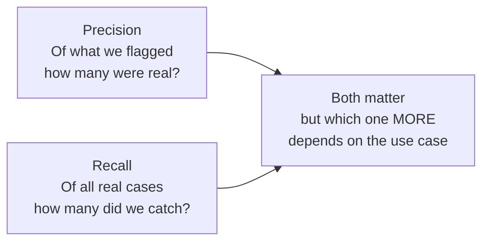

# Evaluation Metrics in Depth

---

## Learning Objectives

By the end of this topic, you should be able to:

- Explain the difference between precision and recall in plain language, without relying on formulas alone
- Identify which metric matters more for a given real-world scenario
- Calculate accuracy, precision, recall, and F1 score by hand from a confusion matrix
- Tell the difference between a model that is "accurate but useless" and one that is "genuinely reliable"
- Evaluate a classifier's performance and justify with numbers whether it is fit for a given use case

---

## Overview

A single number like "98% accuracy" can look impressive while hiding a model that is nearly useless. In real AI work, you need multiple metrics — precision, recall, and F1 — to get the full picture and make a justified judgment call.
 
This topic gives you the tools to do exactly that, with numbers, not just intuition.

---

## Precision vs Recall — The Trade-off

### What Each Metric Measures

Before any formula — here is what each metric is actually asking:
 
**Precision** asks: *"Of everything the model FLAGGED as positive, how many were actually positive?"*
 
Think of it like a doctor ordering follow-up tests. High precision means most patients sent for further testing actually have the condition — very few healthy patients are sent for unnecessary tests. Low precision means too many healthy patients are being flagged alongside the sick ones.
 
**Recall** asks: *"Of everything that was ACTUALLY positive, how many did the model catch?"*
 
Same doctor — but now asking: of all the patients who actually have the condition, how many did we catch? High recall means most real cases were identified. Low recall means many sick patients were sent home without follow-up.
 

 
### Why a Trade-off Exists
 
A model can almost always improve one at the cost of the other.
 
**Example — disease screening:**
- If the model flags **every single patient** as positive — recall = 100% (never misses a real case) but precision collapses (healthy patients flood specialist clinics unnecessarily)
- If the model only flags patients it is **extremely sure** about — precision rises but recall drops (many genuinely sick patients are missed and sent home)
There is no setting that maximises both at the same time. You have to choose which type of mistake is more costly for your specific use case.
 
### When Recall Matters More vs When Precision Matters More
 
| Scenario | Which matters more | Why |
|---|---|---|
| Medical screening — flagging possible tumours | **Recall** | Missing a real case can cost a life. A false alarm just means an extra check-up. |
| Banking fraud detection | **Recall** (with human review) | Missing real fraud costs real money. A false alarm can be verified with a quick call. |
| Spam email filtering | **Precision** | Wrongly blocking an important real email is more damaging than letting one spam through. |
| E-commerce product recommendation | **Precision** | Showing irrelevant products annoys users. Missing one relevant product is low-cost. |
| Loan default risk flagging | **Balanced (F1)** | Both false approvals and false rejections carry real cost — neither dominates. |
 
> **The key question to always ask first:** "Which mistake is more costly — a false alarm or a missed case?" The answer determines which metric to prioritise before you even look at the numbers.
 
---

## F1 Score — Balancing Precision and Recall into One Number

Sometimes you need a single number that balances both precision and recall. That number is the **F1 score**.

**Why not just average them?**

Imagine a model with precision = 100% but recall = 1%. A simple average says 50.5% — "not bad." But this model is nearly useless — it catches almost none of the real cases. The simple average hides the disaster.

The F1 score uses a **harmonic mean** instead, which punishes extreme imbalance much more heavily. The same model gets an F1 score of about 2% — which correctly reflects how broken it is.

**The formula:**

```
F1 = 2 × (Precision × Recall) / (Precision + Recall)
```

**Example — seeing it work:**

A disease screening model has Precision = 0.70 and Recall = 0.85:
 
```
F1 = 2 × (0.70 × 0.85) / (0.70 + 0.85)
   = 2 × 0.595 / 1.55
   = 1.19 / 1.55
   ≈ 0.768 = 76.8%
```
 
The F1 score of 76.8% sits between 70% and 85% — closer to the lower value, which is intentional. The harmonic mean always pulls toward the weaker of the two numbers, not the middle.
 
**When to use F1:** Use it when you need one single number to compare models, and when both false alarms and missed cases carry similar costs — neither type of mistake clearly dominates.
 
---

## Computing All Four Metrics by Hand from a Confusion Matrix

### Before the Calculation — What Are We Doing?

A hospital has deployed an AI system that screens chest X-rays for signs of pneumonia. The system was tested on 200 X-rays — some from patients who actually had pneumonia, some from healthy patients. We want to know: is this model actually reliable enough to use in a real clinical setting?
 
Accuracy alone will not tell us the full story. A model that flags every single X-ray as positive scores 100% recall but would be clinically useless. We need all four metrics.
 
**The confusion matrix:**
 
| | Predicted: Pneumonia | Predicted: Healthy |
|---|---|---|
| **Actual: Pneumonia** | TP = 72 | FN = 8 |
| **Actual: Healthy** | FP = 20 | TN = 100 |
 
**Quick reminder — what each cell means:**
 
| Term | Plain English | In this example |
|---|---|---|
| **TP (True Positive)** | Model said pneumonia — and patient really had it | 72 patients correctly identified |
| **FN (False Negative)** | Model said healthy — but patient actually had pneumonia | 8 sick patients sent home without follow-up |
| **FP (False Positive)** | Model said pneumonia — but patient was actually healthy | 20 healthy patients sent for unnecessary follow-up |
| **TN (True Negative)** | Model said healthy — and patient really was healthy | 100 healthy patients correctly cleared |
 
**How the formulas connect to the confusion matrix:**
 
```
Precision uses this column:          Recall uses this row:
┌─────────────┬──────────┐           ┌─────────────┬──────────┐
│ TP = 72     │ FN = 8   │           │ TP = 72     │ FN = 8   │
│ ← used ↑   │          │           │ ← both used →         │
├─────────────┼──────────┤           ├─────────────┼──────────┤
│ FP = 20     │ TN = 100 │           │ FP = 20     │ TN = 100 │
│ ← used ↑   │          │           │             │          │
└─────────────┴──────────┘           └─────────────┴──────────┘
Precision = TP ÷ (TP + FP)          Recall = TP ÷ (TP + FN)
```
 
---
 
**Step 1 — Sanity check** *(always do this first to catch errors)*
 
> Add up all four cells — do they equal the total?
 
```
TP + FN + FP + TN = 72 + 8 + 20 + 100 = 200 ✓
```
 
Also check the row totals:
```
Actual pneumonia patients = TP + FN = 72 + 8 = 80
Actual healthy patients   = FP + TN = 20 + 100 = 120
```
 
Everything adds up. We can trust the matrix is correctly filled in.
 
---
 
**Step 2 — Accuracy** *(what proportion of all predictions were correct?)*
 
```
Accuracy = (TP + TN) / Total
         = (72 + 100) / 200
         = 172 / 200
         = 86%
```
 
> 86% of all X-rays were classified correctly. Sounds good — but for a medical system, we need to know what the 14% of errors look like.
 
---
 
**Step 3 — Precision** *(of every X-ray flagged as pneumonia, how many actually had it?)*
 
```
Precision = TP / (TP + FP)
          = 72 / (72 + 20)
          = 72 / 92
          ≈ 78.3%
```
 
> About 22% of patients flagged as having pneumonia were actually healthy — sent for unnecessary follow-up tests. For every 10 flags, about 2 are false alarms. Manageable, but adds cost and anxiety for healthy patients.
 
---
 
**Step 4 — Recall** *(of all actual pneumonia patients, how many did the model catch?)*
 
```
Recall = TP / (TP + FN)
       = 72 / (72 + 8)
       = 72 / 80
       = 90%
```
 
> The model caught 90% of real pneumonia cases — but missed 10%, meaning 8 genuinely sick patients were cleared as healthy. In a medical context, these missed cases are the most dangerous outcome.
 
---
 
**Step 5 — F1 Score** *(the balanced single metric)*
 
```
F1 = 2 × (Precision × Recall) / (Precision + Recall)
   = 2 × (0.783 × 0.90) / (0.783 + 0.90)
   = 2 × 0.705 / 1.683
   = 1.410 / 1.683
   ≈ 0.838 = 83.8%
```
 
*Quick verification using the shortcut formula:*
```
F1 = 2TP / (2TP + FP + FN)
   = 144 / (144 + 20 + 8)
   = 144 / 172
   ≈ 0.837 ✓
```
 
---
 
**Full results summary:**
 
| Metric | Score | What it tells us |
|---|---|---|
| Accuracy | 86% | Most predictions correct — but hides which errors were made |
| Precision | 78.3% | About 1 in 5 flags are false alarms — healthy patients sent for unnecessary tests |
| Recall | 90% | Catches 9 in 10 real pneumonia cases — but misses 1 in 10 |
| F1 | 83.8% | Balanced score — reasonable overall but recall gap is the bigger concern |
 
**The judgment call:**
 
> For a medical screening system, **recall matters more than precision** — a missed pneumonia case is far more dangerous than a false alarm that leads to an extra check-up. The model's recall at 90% is reasonable but the 8 missed cases are a clinical concern. Before deployment, the hospital should ask: can recall be improved further, even if it means slightly more false alarms? This model is a useful screening assistant — but a radiologist must review every positive flag before any clinical decision is made.
 
This is exactly the kind of analysis you will write in a real AI engineering role — not just a number, but a justified recommendation.
 
---
 
### Best Practices
 
- Always calculate precision AND recall separately before jumping to F1 — F1 alone can hide which type of error is more common
- Always verify your F1 using the shortcut formula to catch arithmetic errors before presenting your numbers
- State which metric matters most for your use case **before** looking at the numbers — this prevents unconsciously favouring whichever metric looks best
### Common Beginner Mistakes
 
- **Mixing up the denominators** — Precision divides by predicted positives (TP + FP). Recall divides by actual positives (TP + FN). Use the diagram above until this becomes automatic
- **Reporting only accuracy on an imbalanced dataset** — if only 1 in 100 X-rays shows pneumonia, a model that flags nothing scores 99% accuracy while catching zero real cases. Always check precision and recall
- **Simple-averaging precision and recall** instead of using the harmonic mean for F1 — the simple average gives a misleadingly optimistic score when one metric is very low
- **Assuming a model with low precision AND low recall just needs more data** — sometimes low performance on both signals a fundamental design problem, not a data problem
---
 
## Worked Example — College Plagiarism Detector
 
**Scenario:** A college's AI-based plagiarism detector is tested on 50 submitted assignments.
 
**Before the numbers — what do we expect?**
 
For a plagiarism detector, **false accusations are very costly** — wrongly accusing a genuine student of plagiarism causes serious academic harm. This means precision matters more here. We want the model to be very sure before it flags something. Low precision is a serious problem for this use case.
 
**The confusion matrix:**
 
| | Predicted: Plagiarised | Predicted: Original |
|---|---|---|
| **Actual: Plagiarised** | TP = 8 | FN = 2 |
| **Actual: Original** | FP = 5 | TN = 35 |
 
**Step 1 — Sanity check:**
```
8 + 2 + 5 + 35 = 50 ✓
```
 
**Step 2 — Accuracy:**
```
(8 + 35) / 50 = 43/50 = 86%
```
> Looks acceptable — but 86% accuracy alone does not tell us who the errors hurt.
 
**Step 3 — Precision:**
```
8 / (8 + 5) = 8/13 ≈ 61.5%
```
> More than 1 in 3 students flagged as plagiarising actually submitted original work. This is the critical weakness for this use case.
 
**Step 4 — Recall:**
```
8 / (8 + 2) = 8/10 = 80%
```
> The model catches 4 in 5 actual plagiarism cases — reasonable. But the precision problem matters more here.
 
**Step 5 — F1:**
```
2 × (0.615 × 0.80) / (0.615 + 0.80)
= 2 × 0.492 / 1.415
≈ 69.5%
```
 
**Results:**
 
| Metric | Score | What it tells us |
|---|---|---|
| Accuracy | 86% | Hides the false accusation problem |
| Precision | 61.5% | 1 in 3 flags are innocent students — unacceptable |
| Recall | 80% | Catches most real cases — reasonable |
| F1 | 69.5% | Pulled down heavily by the low precision |
 
**The judgment call:**
 
> Precision at 61.5% is a red flag. More than a third of students flagged as plagiarising actually submitted original work. For a system whose false accusations can seriously harm a genuine student's academic record, this model is not ready for autonomous deployment. It can be used as a first-pass screening tool — but a human reviewer must always verify every positive flag before any disciplinary action is taken. The AI assists human judgment — it never replaces it in high-stakes academic decisions.
 
---
 
## Key Takeaways
 
- **Precision** = of what the model flagged, how much was correct. **Recall** = of all real positives, how many did the model catch
- Improving one usually costs the other — this is the precision-recall trade-off
- The right metric to prioritise depends on which mistake is more costly: false alarms (prioritise precision) or missed cases (prioritise recall)
- **F1 score** = harmonic mean of precision and recall — punishes extreme imbalance far more than a simple average
- Formula: `F1 = 2 × (Precision × Recall) / (Precision + Recall)`
- Always sanity-check your confusion matrix totals before calculating anything
- Accuracy alone is dangerously misleading on imbalanced datasets — always check precision and recall
- Low precision AND low recall together signals a fundamental model problem — not just a data problem
- High-stakes domains (medical, academic, legal) almost always require a human-in-the-loop check regardless of how good the numbers look
> **Interview tip:** Interviewers commonly ask you to compute precision, recall, and F1 from a raw confusion matrix on the spot. Practice the five steps in order: sanity check → accuracy → precision → recall → F1. Then practice explaining what each result means in one plain English sentence. Most candidates can write the formulas but cannot interpret what the numbers mean for the real use case.
 
---
 
## Reference Links
 
- 📎 [Google Machine Learning Crash Course — Precision and Recall](https://developers.google.com/machine-learning/crash-course/classification/precision-and-recall) — official interactive explanation
- 📎 [NIST AI Risk Management Framework — Measure Function](https://www.nist.gov/itl/ai-risk-management-framework) — why documented evaluation metrics matter for AI system oversight
- 📎 [Towards Data Science — Understanding the Confusion Matrix](https://towardsdatascience.com/understanding-confusion-matrix-a9ad42dcfd62) — visual breakdowns of all four metrics
