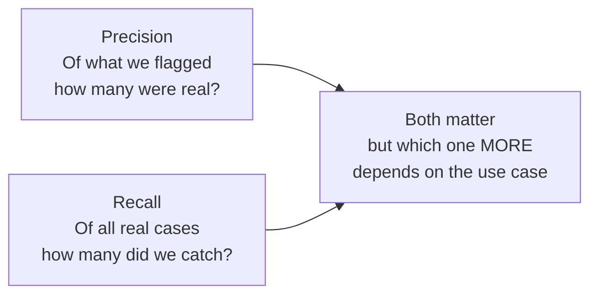

# Evaluation Metrics in Depth

---

## Learning Objectives

By the end of this topic, you should be able to:

- Explain the difference between precision and recall in plain language, without relying on formulas alone
- Identify which metric matters more for a given real-world scenario
- Calculate accuracy, precision, recall, and F1 score by hand from a confusion matrix
- Tell the difference between a model that is "accurate but useless" and one that is "genuinely reliable"
- Evaluate a classifier's performance and justify with numbers whether it is fit for a given use case

---

## Overview

Imagine you are reviewing an AI system that detects fraudulent bank transactions. Your manager asks: **"Is this model good enough to deploy?"**

You open the report and see: **"Accuracy: 98%."**

Sounds great. But then you dig deeper and discover the model is flagging almost every transaction as fraud — blocking thousands of genuine customers every day. The 98% accuracy looks impressive only because most transactions are legitimate, so "predict not fraud every time" already gives you a high score.

This is exactly the trap that evaluation metrics are designed to prevent. A single number like accuracy rarely tells the full story. In real AI work you need to look at multiple metrics together — precision, recall, and F1 — understand what each one is measuring, and make a judgment call about which one matters most for the specific system you are building or reviewing.

This topic gives you the tools to do exactly that — with numbers, not just intuition.

---

## 8.3 Precision vs Recall — The Trade-off

### What Each Metric Measures

Before any formula — here is what each metric is actually asking:

**Precision** asks: *"Of everything the model FLAGGED as positive, how many were actually positive?"*

Think of it like a police officer making arrests. High precision means most people arrested are actually guilty — very few innocent people are wrongly arrested. Low precision means too many innocent people are being arrested alongside the guilty ones.

**Recall** asks: *"Of everything that was ACTUALLY positive, how many did the model catch?"*

Think of the same officer, but now asking: of all the actual criminals in the city, how many did we arrest? High recall means most real criminals got caught. Low recall means many real criminals walked free.



### Why a Trade-off Exists

A model can almost always improve one at the cost of the other.

**Example — fraud detection:**
- If the model flags **every single transaction** as fraud — recall = 100% (never misses a real fraud) but precision collapses (genuine customers get blocked constantly)
- If the model only flags transactions it is **extremely sure** about — precision rises but recall drops (many real frauds get through undetected)

There is no setting that maximises both at the same time. You have to choose which type of mistake is more costly for your specific use case.

### When Recall Matters More vs When Precision Matters More

| Scenario | Which matters more | Why |
|---|---|---|
| Medical screening — flagging possible tumours | **Recall** | Missing a real case can cost a life. A false alarm just means an extra check-up. |
| Banking fraud detection | **Recall** (with human review) | Missing real fraud costs real money. A false alarm can be verified with a quick call. |
| Spam email filtering | **Precision** | Wrongly blocking an important real email is more damaging than letting one spam through. |
| E-commerce product recommendation | **Precision** | Showing irrelevant products annoys users. Missing one relevant product is low-cost. |
| Loan default risk flagging | **Balanced (F1)** | Both false approvals and false rejections carry real cost — neither dominates. |

> **The key question to always ask first:** "Which mistake is more costly — a false alarm or a missed case?" The answer determines which metric to prioritise before you even look at the numbers.

---

## 8.4 F1 Score — Balancing Precision and Recall into One Number

Sometimes you need a single number that balances both precision and recall. That number is the **F1 score**.

**Why not just average them?**

Imagine a model with precision = 100% but recall = 1%. A simple average says 50.5% — "not bad." But this model is nearly useless — it catches almost none of the real cases. The simple average hides the disaster.

The F1 score uses a **harmonic mean** instead, which punishes extreme imbalance much more heavily. The same model gets an F1 score of about 2% — which correctly reflects how broken it is.

**The formula:**

```
F1 = 2 × (Precision × Recall) / (Precision + Recall)
```

Breaking it down in plain English:
- Multiply precision and recall together (the numerator)
- Add precision and recall together (the denominator)
- Multiply the result by 2 (this makes the harmonic mean formula work correctly for two values)

**When to use F1:**
Use F1 when you need one single number to compare models or track progress, and when both false positives and false negatives carry similar costs — neither type of mistake clearly dominates.

---

## 8.5 Computing All Four Metrics by Hand from a Confusion Matrix

### Before the Calculation — What Are We Doing?

We have a spam-email classifier tested on 100 emails. We want to know: is this model actually good? Accuracy alone will not tell us the full story. We need to calculate all four metrics and then make a judgment.

**The confusion matrix:**

| | Predicted: Spam | Predicted: Not Spam |
|---|---|---|
| **Actual: Spam** | TP = 24 | FN = 6 |
| **Actual: Not Spam** | FP = 10 | TN = 60 |

**Quick reminder — what each cell means:**

| Term | Plain English | In this example |
|---|---|---|
| **TP (True Positive)** | Model said spam — and it really was spam | 24 emails correctly caught |
| **FN (False Negative)** | Model said not spam — but it really was spam (a miss) | 6 spam emails that slipped through |
| **FP (False Positive)** | Model said spam — but it really was not spam (false alarm) | 10 legitimate emails wrongly blocked |
| **TN (True Negative)** | Model said not spam — and it really was not spam | 60 legitimate emails correctly left alone |

---

**Step 1 — Sanity check** *(always do this first to catch errors)*

> Add up all four cells — do they equal your total?

```
TP + FN + FP + TN = 24 + 6 + 10 + 60 = 100 ✓
```

Also check the row totals:
```
Actual spam emails = TP + FN = 24 + 6 = 30
Actual not-spam emails = FP + TN = 10 + 60 = 70
```

Everything adds up. We can trust the matrix is correctly filled in.

---

**Step 2 — Accuracy** *(what proportion of all predictions were correct?)*

```
Accuracy = (TP + TN) / Total
         = (24 + 60) / 100
         = 84 / 100
         = 84%
```

> 84% of all emails were classified correctly. Sounds good — but let's dig deeper.

---

**Step 3 — Precision** *(of everything flagged as spam, how much was actually spam?)*

```
Precision = TP / (TP + FP)
          = 24 / (24 + 10)
          = 24 / 34
          ≈ 70.6%
```

> About 30% of emails flagged as spam were actually legitimate emails — false alarms. For every 10 emails the model flags, 3 are wrongly blocked. This is a real problem for spam filtering where precision matters most.

---

**Step 4 — Recall** *(of all actual spam emails, how many did the model catch?)*

```
Recall = TP / (TP + FN)
       = 24 / (24 + 6)
       = 24 / 30
       = 80%
```

> The model caught 80% of real spam emails but missed 20% — 6 spam emails got through to the inbox. For spam filtering, missing a spam email is less damaging than blocking a legitimate one.

---

**Step 5 — F1 Score** *(the balanced single metric)*

```
F1 = 2 × (Precision × Recall) / (Precision + Recall)
   = 2 × (0.706 × 0.80) / (0.706 + 0.80)
   = 2 × 0.565 / 1.506
   = 1.130 / 1.506
   ≈ 0.75 = 75%
```

*Quick verification using the shortcut formula:*
```
F1 = 2TP / (2TP + FP + FN)
   = 48 / (48 + 10 + 6)
   = 48 / 64
   = 0.75 ✓
```

---

**Full results summary:**

| Metric | Score | What it tells us |
|---|---|---|
| Accuracy | 84% | Most predictions were correct — but hides the false alarm problem |
| Precision | 70.6% | 3 in 10 spam flags are false alarms — a real weakness |
| Recall | 80% | Catches 4 in 5 real spam emails — reasonable |
| F1 | 75% | Balanced score reflecting both weaknesses |

**The judgment call:**

> This model's precision (70.6%) is noticeably lower than its recall (80%). Since precision matters most for spam filtering — a blocked legitimate email is worse than one spam email getting through — this model's current balance is a genuine weakness. Even though 84% accuracy alone sounded acceptable, the deeper analysis reveals a model that needs improvement before production deployment.

This is exactly the kind of analysis you will write in a real AI engineering role — not just a number, but a justified recommendation.

---

### Best Practices

- Always calculate precision AND recall separately before jumping to F1 — F1 alone can hide which type of error is more common
- Always verify using the shortcut formula to catch arithmetic errors before presenting your numbers
- State which metric matters most for your use case **before** looking at the numbers — this prevents unconsciously favouring whichever metric happens to look best

### Common Beginner Mistakes

- **Mixing up the denominators** — Precision divides by predicted positives (TP + FP). Recall divides by actual positives (TP + FN). Write out the labels every time until it becomes automatic
- **Reporting only accuracy on an imbalanced dataset** — if only 1 in 100 emails is spam, a model that never flags anything scores 99% accuracy while catching zero real spam. Always check precision and recall
- **Simple-averaging precision and recall** instead of using the harmonic mean for F1 — the simple average gives a misleadingly optimistic score when one metric is very low

---

## Worked Example — College Plagiarism Detector

**Scenario:** A college's AI-based plagiarism detector is tested on 50 submitted assignments.

**Before the numbers — what do we expect?**
For a plagiarism detector, false accusations are very costly — wrongly accusing a genuine student of plagiarism causes serious harm. This means **precision matters more** here. We want the model to be very sure before it flags something.

**The confusion matrix:**

| | Predicted: Plagiarised | Predicted: Original |
|---|---|---|
| **Actual: Plagiarised** | TP = 8 | FN = 2 |
| **Actual: Original** | FP = 5 | TN = 35 |

**Step 1 — Sanity check:**
```
8 + 2 + 5 + 35 = 50 ✓
```

**Step 2 — Accuracy:**
```
(8 + 35) / 50 = 43/50 = 86%
```

**Step 3 — Precision:**
```
8 / (8 + 5) = 8/13 ≈ 61.5%
```

**Step 4 — Recall:**
```
8 / (8 + 2) = 8/10 = 80%
```

**Step 5 — F1:**
```
2 × (0.615 × 0.80) / (0.615 + 0.80)
= 2 × 0.492 / 1.415
≈ 69.5%
```

**Results:**

| Metric | Score |
|---|---|
| Accuracy | 86% |
| Precision | 61.5% |
| Recall | 80% |
| F1 | 69.5% |

**The judgment call:**

> Precision at 61.5% means more than 1 in 3 students flagged as plagiarising actually submitted original work. For a system whose false accusations can seriously harm a genuine student, this is unacceptable. The model can be used as a first-pass screening tool — but a human reviewer must always verify a "plagiarised" flag before any disciplinary action is taken. The AI assists human judgment — it never replaces it.

---

## Key Takeaways

- **Precision** = of what the model flagged, how much was correct. **Recall** = of all real positives, how many did the model catch
- Improving one usually costs the other — this is the precision-recall trade-off
- The right metric to prioritise depends on which mistake is more costly: false alarms (use precision) or missed cases (use recall)
- **F1 score** = harmonic mean of precision and recall — punishes extreme imbalance far more than a simple average would
- Formula: `F1 = 2 × (Precision × Recall) / (Precision + Recall)`
- Always sanity-check your confusion matrix totals before calculating anything
- Accuracy alone is dangerously misleading on imbalanced datasets — always check precision and recall
- High-stakes domains (medical, academic, legal) almost always require a human-in-the-loop check regardless of how good the numbers look

> **Interview tip:** Interviewers commonly ask you to compute precision, recall, and F1 from a raw confusion matrix on the spot. Practice the five steps in order: sanity check → accuracy → precision → recall → F1. Then practice explaining what each result means in one plain English sentence. Most candidates can write the formulas but cannot interpret what the numbers mean for the real use case.

---

## Reference Links

- 📎 [Google Machine Learning Crash Course — Precision and Recall](https://developers.google.com/machine-learning/crash-course/classification/precision-and-recall) — official interactive explanation
- 📎 [NIST AI Risk Management Framework — Measure Function](https://www.nist.gov/itl/ai-risk-management-framework) — why documented evaluation metrics matter for AI system oversight
- 📎 [Towards Data Science — Understanding the Confusion Matrix](https://towardsdatascience.com/understanding-confusion-matrix-a9ad42dcfd62) — visual breakdowns of all four metrics
