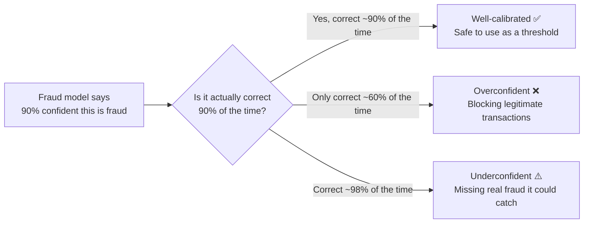

# Model Calibration

---

## Learning Objectives

By the end of this topic, you should be able to:

- Explain what it means for a model to be well-calibrated, overconfident, or underconfident
- Explain why a model's stated confidence score is not automatically trustworthy just because it sounds precise
- Perform a simple calibration check by hand using the bucket-and-compare method
- Evaluate whether a given AI system's confidence scores can be trusted for a specific decision-making use case

---

## Overview

Many AI systems do not just give you an answer — they also give you a **confidence score**. "I am 92% sure this transaction is fraudulent." "There is an 85% chance this is spam."

Here is a question every AI engineer must learn to ask: **can you actually trust that number?**

Just because a model says "95% confident" does not mean it is correct 95% of the time. A model can be highly accurate overall and still produce confidence scores that are completely misleading. This topic gives you a concrete, numerical way to check whether a model's stated confidence actually means something — or is just a number it learned to output.

---

## What Is Calibration?

A bank uses an AI fraud detection system. Every time a customer makes a transaction, the model analyses it and says something like:

- "I am 90% confident this transaction is fraudulent — block it"
- "I am 60% confident this is fraudulent — flag for review"
- "I am 40% confident this is fraudulent — let it through"

The bank's system is set to **automatically block** any transaction the model rates at 85% confidence or above.

Now here is the key question: when the model says "90% confident this is fraud" — is it actually correct 90% of the time? Or is it right only 60% of the time?

If the model is wrong 40% of the time when it says 90% confident — that means the bank is automatically blocking 40% of legitimate customer transactions that the model misidentified. Real customers cannot access their own money. That is a serious problem.

This is what **calibration** checks. It measures whether a model's stated confidence actually matches how often it is right in the real world.

- A **well-calibrated** model: when it says "90% confident," it is correct about 90% of the time
- An **overconfident** model: when it says "90% confident," it is correct only 60% of the time — the model is more sure of itself than it should be
- An **underconfident** model: when it says "40% confident," it turns out to be correct 70% of the time — the model is less sure of itself than it should be



**Important:** Calibration and accuracy are separate. A fraud model can be correct most of the time overall — but if its 90% confidence scores only reflect 60% real accuracy, the bank cannot safely auto-block at that threshold.

### Key Terms

| Term | Simple Meaning | In the fraud detection context |
|---|---|---|
| **Confidence score** | The probability the model outputs alongside its prediction | "92% sure this is fraud" |
| **Actual accuracy per bucket** | Of all predictions at roughly that confidence level, what percentage were actually correct | Of 20 transactions flagged at "90% confident," how many were actually fraud? |
| **Calibration gap** | Difference between stated confidence and actual accuracy | Model says 90%, actually correct 60% → gap of 30 points |

---

## How to Check Calibration by Hand

Imagine you have a colleague who claims to be great at predicting whether a transaction is fraudulent just by looking at it. Every time you show them a transaction, they say things like "90% sure this is fraud" or "60% sure."

After reviewing 50 transactions together, you sit down and check. Of all the times they said "90% sure" — were they actually right 90% of the time? Or only 60% of the time?

If they said "90% sure" on 20 transactions and were only right 12 times — they are overconfident. They were right 60% of the time but claiming 90% certainty. You cannot trust their confidence scores to set a blocking threshold.

You check the fraud detection AI the exact same way.

**The method — four simple steps:**

**Step 1 — Collect predictions**

Run the model on transactions it has never seen before. For each one, record: what the model predicted, how confident it said it was, and whether the transaction was actually fraudulent (verified by the fraud investigation team).

**Step 2 — Group by confidence level**

Sort all predictions into buckets. All transactions where the model said "around 90% confident" go in one pile. All "around 60% confident" go in another.

**Step 3 — Calculate actual accuracy per bucket**

For each group, ask: of all the predictions in this bucket, what percentage were genuinely fraudulent?

```
Actual accuracy = Genuinely fraudulent in this bucket ÷ Total flagged in this bucket
```

**Step 4 — Compare and judge**

Compare the stated confidence to the actual accuracy:
- Close → well-calibrated, the threshold is trustworthy
- Stated confidence much higher than actual accuracy → overconfident, do not use this score as an auto-block threshold
- Stated confidence much lower than actual accuracy → underconfident, the model is holding back more than it should

### Worked Calibration Check — Fraud Detection System

The bank's fraud AI is tested on 45 verified transactions. Here are the results by confidence bucket:

| Confidence Bucket | Transactions | Actually Fraudulent | Actual Accuracy | Calibration Gap | Verdict |
|---|---|---|---|---|---|
| ~90% confident | 20 | 12 | 12÷20 = **60%** | 90% − 60% = **+30 points** | Badly **overconfident** ❌ |
| ~60% confident | 15 | 9 | 9÷15 = **60%** | 60% − 60% = **0 points** | **Well-calibrated** ✅ |
| ~40% confident | 10 | 6 | 6÷10 = **60%** | 40% − 60% = **−20 points** | **Underconfident** ⚠️ |

**Reading the table:**

Look at the "Actual Accuracy" column — it is 60% in every row. The model is equally reliable regardless of how confident it claims to be. But its stated confidence swings wildly from 40% to 90% for transactions that are, in reality, all equally likely to be fraudulent.

This means:
- The bank's auto-block threshold of "85% confident" is completely untrustworthy — transactions flagged at 85-90% confidence are only actually fraudulent 60% of the time. The bank is blocking 40% of legitimate customer transactions
- The 60% confidence bucket is the only one giving honest scores
- The 40% bucket is actually underconfident — the model is letting through transactions that are just as likely to be fraudulent as the ones it blocks

**The practical consequence:** The bank must remove the auto-block threshold entirely until the model's calibration is fixed. Every flag should go to a human reviewer — not directly to an automatic block.

---

## Calibration and Temperature

You already know about temperature — the setting that controls how confident or creative an LLM's output is. Temperature directly affects calibration.

Going back to the fraud detection system — imagine the bank adjusts the model's temperature:

- **Low temperature** — the model becomes very decisive. It says "90% confident" for transactions it previously rated 70%. The underlying detection ability has not changed — but the model now sounds more confident than it actually is. The calibration gap for the 90% bucket gets even worse.

- **High temperature** — the model spreads its confidence more evenly. Transactions it previously rated 80% now get rated 55%. The bank's auto-block threshold gets fewer hits — not because the model is less capable, but because the temperature change flattened its confidence scores.

This means a fraud model that was well-calibrated at temperature 1.0 may become poorly calibrated if someone changes the temperature to 0.5 to "make it more decisive." The same model, the same fraud detection ability — but now outputting confidence scores that no longer match real-world accuracy.

**Practical implication:** Any time the temperature of an LLM-based system is changed, re-run the calibration check before trusting the confidence scores again.

---

## Worked Example — After Recalibration

The bank works with its data science team to fix the calibration issue. After retraining, the model is tested on a fresh set of 100 verified transactions.

**Before checking the numbers:** We want to know — is it now safe to use the confidence scores to set an auto-block threshold?

| Confidence Bucket | Transactions | Actually Fraudulent | Actual Accuracy | Calibration Gap |
|---|---|---|---|---|
| ~90% confident | 40 | 37 | 37÷40 = **92.5%** | 90% − 92.5% = **−2.5 points** |
| ~70% confident | 40 | 29 | 29÷40 = **72.5%** | 70% − 72.5% = **−2.5 points** |
| ~50% confident | 20 | 9 | 9÷20 = **45%** | 50% − 45% = **+5 points** |

**Reading the results:**

- 90% bucket: gap of −2.5 points — the model says 90% and is right 92.5% of the time. Essentially well-calibrated
- 70% bucket: gap of −2.5 points — well-calibrated
- 50% bucket: gap of +5 points — very slightly overconfident but still within an acceptable range

**The judgment call:**

The model is now well-calibrated across all three confidence bands. Every gap is under 5 percentage points. The bank can now safely use the 90% confidence threshold as an auto-block trigger — when the model says 90% confident, it is actually right about 92.5% of the time. That is a trustworthy basis for automation.

However, the 5-point gap at the 50% level means the bank should send 50%-confidence flags to human reviewers rather than auto-blocking — the model is slightly overconfident in that range and a human check provides important additional safety.

**Compare these two versions of the fraud model:**

| | Before recalibration | After recalibration |
|---|---|---|
| Model says 90% confident | Actually correct only 60% of the time | Actually correct 92.5% of the time |
| Safe to auto-block at 90%? | No — 40% of blocks hit legitimate transactions | Yes — only 7.5% false alarm rate |
| What to do with flags | Human review every flag | Auto-block at ≥90%, human review below |

---

## Best Practices

- Never trust a confidence score at face value without checking it against real verified outcomes on unseen data
- For any automated threshold — like auto-blocking transactions — require a calibration check first. Never set a threshold based on stated confidence alone
- Re-check calibration periodically — a well-calibrated model at launch can drift as fraud patterns change over time
- If you change the temperature setting on any LLM-based system, always re-run the calibration check before trusting the scores again

## Common Beginner Mistakes

- **Assuming a stated percentage is a rigorous probability** — the model's confidence score is itself a prediction, not a guaranteed mathematical truth. It must be verified against real outcomes
- **Testing calibration on training data** — this will make any model look artificially well-calibrated. Always use fresh, unseen data verified by an independent source
- **Confusing high confidence with high accuracy** — the first fraud model was equally accurate across all its confidence levels, yet its stated confidence swung from 40% to 90%. High stated confidence and high actual accuracy are not the same thing
- **Assuming calibration is permanent** — fraud patterns change. A model calibrated accurately today can become miscalibrated as new fraud methods emerge

---

## Key Takeaways

- **Calibration** checks whether a model's stated confidence matches how often it is actually correct — this is separate from overall accuracy
- **Overconfident** = stated confidence higher than actual accuracy — dangerous for auto-blocking, as shown in the first fraud model
- **Underconfident** = stated confidence lower than actual accuracy — the model is holding back, missing automation opportunities it could safely take
- The bucket-and-compare method: group predictions by confidence level, calculate actual accuracy per bucket, compare the gap
- **Temperature affects calibration** — changing temperature shifts confidence scores without changing underlying model capability, which can silently break a well-calibrated system
- A well-calibrated model's confidence scores can safely drive automated thresholds. A poorly calibrated model's scores should never drive automation alone — every flag needs a human review
- Always test calibration on fresh, unseen, independently verified data

> **Interview tip:** If asked "how would you check if a model's confidence scores are trustworthy?" — describe the bucket-and-compare method using a concrete example like fraud detection. Explain that you collect predictions with confidence scores, group by confidence level, calculate actual accuracy per bucket, and check whether the gap is small enough to trust. Most candidates cannot answer this question at all. You now can.

---

## Reference Links

- 📎 [Google Machine Learning Crash Course — Classification thresholds](https://developers.google.com/machine-learning/crash-course) — foundational framing of confidence and thresholds
- 📎 [NIST AI Risk Management Framework — Measure Function](https://www.nist.gov/itl/ai-risk-management-framework) — official guidance on measuring AI trustworthiness including confidence reliability
- 📎 [Towards Data Science — Calibration of Machine Learning Models](https://towardsdatascience.com/calibration-techniques-of-machine-learning-models-d4f1a9c7a6f) — accessible explanation of calibration with visual examples
